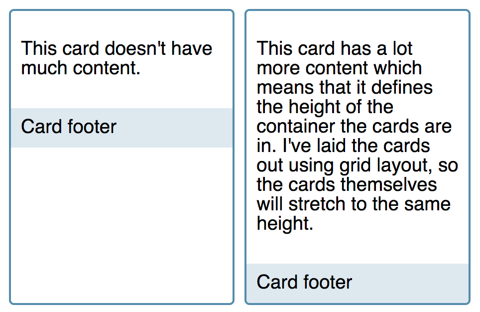

{{CSSRef}}

In this guide, we will take a look at some of the common use cases for flexbox — those places where it makes more sense than another layout method.

## Why choose flexbox?

In a perfect world of browser support, the reason you'd choose to use flexbox is because you want to lay a collection of items out in one direction or another. As you lay out your items you want to control the dimensions of the items in that one dimension, or control the spacing between items. These are the uses that flexbox was designed for. You can read more about the difference between flexbox and CSS Grid Layout in [Relationship of Flexbox to other layout methods](/en-US/docs/Web/CSS/CSS_Flexible_Box_Layout/Relationship_of_Flexbox_to_Other_Layout_Methods), where we discuss how flexbox fits into the overall picture of CSS Layout.

In reality we also often use Flexbox for jobs that might be better done by Grid Layout, as a fallback for Grid, and also in order to get alignment capabilities. This is something that may well change once Box Alignment is implemented in Block Layout. In this guide we'll look at some of the typical things you might use flexbox for today.

## Navigation

A common pattern for navigation is to have a list of items displayed as a horizontal bar. This pattern, as basic as it seems, was difficult to achieve before flexbox. It forms the most simple of flexbox examples, and could be considered the ideal flexbox use case.

When we have a set of items that we want to display horizontally, we may well end up with additional space. We need to decide what to do with that space, and have a couple of options. We either display the space outside of the items — therefore spacing them out with white space between or around them — or we absorb the extra space inside the items and therefore need a method of allowing the items to grow and take up this space.

### Space distributed outside the items

To distribute the space between or around the items we use the alignment properties in flexbox, and the {{cssxref("justify-content")}} property. You can read more about this property in [Aligning Items in a flex container](/en-US/docs/Web/CSS/CSS_Flexible_Box_Layout/Aligning_Items_in_a_Flex_Container), which deals with aligning items on the main axis.

In the below live example we display the items at their natural size and by using `justify-content: space-between` make equal amounts of space between the items. You can change how the space is distributed using the `space-around` value, or where supported, `space-evenly`. You could also use `flex-start` to place the space at the end of the items, `flex-end` to place it before them, or `center` to center the navigation items.

{{EmbedGHLiveSample("css-examples/flexbox/use-cases/navigation.html", '100%', 550)}}

### Space distributed within the items

A different pattern for navigation would be to distribute the available space within the items themselves, rather than create space between them. In this case we would use the {{cssxref("flex")}} properties to allow items to grow and shrink in proportion to one another as described in [Controlling ratios of flex items along the main axis](/en-US/docs/Web/CSS/CSS_Flexible_Box_Layout/Controlling_Ratios_of_Flex_Items_Along_the_Main_Ax).

If you wanted to respect the size property of my navigation items but have the available space shared out equally among them, then you might use `flex: auto`, which is the shorthand for `flex: 1 1 auto` — all items grow and shrink from a flex-basis of auto. This would mean that the longer item would have more space because it started from a larger size, even though the same amount of available space is assigned to it as the others.

In the live example below try changing `flex: auto` to `flex: 1`. This is the shorthand for `flex: 1 1 0` and causes all of the items to become the same width, as they are working from a flex-basis of 0 allowing all of the space to be distributed evenly.

{{EmbedGHLiveSample("css-examples/flexbox/use-cases/navigation-flex.html", '100%', 550)}}

## Split navigation

Another way to align items on the main axis is to use auto margins. This enables the design pattern of a navigation bar where one group of items are aligned left and another group aligned right.

Here we are using the auto margins technique described in [Using auto margins for main axis alignment](/en-US/docs/Web/CSS/CSS_Flexible_Box_Layout/Aligning_Items_in_a_Flex_Container#using_auto_margins_for_main_axis_alignment). The items are aligned on the main axis with `flex-start` as this is the initial behavior of flexbox, and we are aligning the item on the right by giving it a left margin of auto. You can move the class from one item to another to change where the split happens.

Also in this example we are using margins on the flex items to create a gap between items, and a negative margin on the container in order that the items still remain flush with the right and left edges. Until the `gap` properties from the Box Alignment specification are implemented in flexbox, we have to use margins in this way if we want to create a gutter between items.

{{EmbedGHLiveSample("css-examples/flexbox/use-cases/split-navigation.html", '100%', 550)}}

## Center item

Before flexbox, developers would joke that the hardest problem in web design was vertical centering. This has now been made straightforward using the alignment properties in flexbox, as the following live example shows.

You can play with the alignment, aligning the item to the start with `flex-start` or end with `flex-end`.

{{EmbedGHLiveSample("css-examples/flexbox/use-cases/center.html", '100%', 700)}}

In the future we may not need to make a container a flex container just to center a single item, as the Box Alignment properties will ultimately be implemented in Block layout. For now however, if you need to properly center one thing inside another, flexbox is the way to do it. As in the example above, make a container into a flex container, and then use either `align-items` on the parent element or target the flex item itself with `align-self`.

## Card layout pushing footer down

Whether you use flexbox or CSS Grid to lay out a list of card components, these layout methods only work on direct children of the flex or grid component. This means that if you have variable amounts of content, the card will stretch to the height of the grid area or flex container. Any content inside uses regular block layout, meaning that on a card with less content the footer will rise up to the bottom of the content rather than stick to the bottom of the card.



Flexbox can solve this. We make the card a flex container, with {{cssxref("flex-direction")}}`: column`. We then set the content area to `flex: 1`, which is the shorthand for `flex: 1 1 0` — the item can grow and shrink from a flex basis of `0`. As this is the only item that can grow, it takes up all available space in the flex container and pushes the footer to the bottom. If you remove the `flex` property from the live example you will see how the footer then moves up to sit directly under the content.

{{EmbedGHLiveSample("css-examples/flexbox/use-cases/cards.html", '100%', 800)}}

## Media objects

The media object is a common pattern in web design — this pattern has an image or other element to one side and text to the right. Ideally a media object should be able to be flipped — moving the image from left to right.

We see this pattern everywhere, used for comments, and anywhere we need to display images and descriptions. With flexbox we can allow the part of the media object containing the image to take its sizing information from the image, and then the body of the media object flexes to take up the remaining space.

In the live example below you can see our media object. I have used the alignment properties to align the items on the cross axis to `flex-start`, and then set the `.content` flex item to `flex: 1`. As with our column layout card pattern above, using `flex: 1` means this part of the card can grow.

{{EmbedGHLiveSample("css-examples/flexbox/use-cases/media.html", '100%', 600)}}

Some things that you might want to try in this live example relate to the different ways you might want to constrain the media object in your design.

To prevent the image growing too large, add a {{cssxref("max-width")}} to the image. As that side of the media object is using the initial values of flexbox it can shrink but not grow, and uses a `flex-basis` of auto. Any {{cssxref("width")}} or max-width applied to the image will become the `flex-basis`.

```css
.image img {
  max-width: 100px;
}
```

You could also allow both sides to grow and shrink in proportion. If you set both sides to `flex: 1`, they will grow and shrink from a {{cssxref("flex-basis")}} of 0, so you will end up with two equal-sized columns. You could either take the content as a guide and set both to `flex: auto`, in which case they would grow and shrink from the size of the content or any size applied directly to the flex items such as a width on the image.

```css
.media .content {
  flex: 1;
  padding: 10px;
}

.image {
  flex: 1;
}
```

You could also give each side different {{cssxref("flex-grow")}} factors, for example setting the side with the image to `flex: 1` and the content side to `flex: 3`. This will mean they use a `flex-basis` of `0` but distribute that space at different rates according to the `flex-grow` factor you have assigned. The flex properties we use to do this are described in detail in the guide [Controlling ratios of flex items along the main axis](/en-US/docs/Web/CSS/CSS_Flexible_Box_Layout/Controlling_Ratios_of_Flex_Items_Along_the_Main_Ax).

```css
.media .content {
  flex: 3;
  padding: 10px;
}

.image {
  flex: 1;
}
```

### Flipping the media object

To switch the display of the media object so that the image is on the right and the content is on the left we can use the `flex-direction` property set to `row-reverse`. The media object now displays the other way around. I have achieved this in the live example by adding a class of `flipped` alongside the existing `.media` class. This means you can see how the display changes by removing that class from the HTML.

{{EmbedGHLiveSample("css-examples/flexbox/use-cases/media-flipped.html", '100%', 650)}}

## Form controls

Flexbox is particularly useful when it comes to styling form controls. Forms have lots of markup and lots of small elements that we typically want to align with each other. A common pattern is to have an {{htmlelement("input")}} element paired with a {{htmlelement("button")}}, perhaps for a search form or where you want your visitor to enter an email address.

Flexbox makes this type of layout easy to achieve. I have contained my `<button>` and `<input>` field in a wrapper which I have given a border and set to `display: flex`. I then use the flex properties to allow the `<input>` field to grow, while the button does not grow. This means we have a pair of fields, with the text field growing and shrinking as the available space changes.

{{EmbedGHLiveSample("css-examples/flexbox/use-cases/input-button.html", '100%', 550)}}

You could add a label or icon to the left as easily as we popped the button onto the right. I have added a label, and other than some styling for background color I didn't need to change the layout. The stretchy input field now has a little less space to play with but it uses the space left after the two items are accounted for.

{{EmbedGHLiveSample("css-examples/flexbox/use-cases/label-input-button.html", '100%', 550)}}

Patterns like this can make it much easier to create a library of form elements for your design, which easily accommodate additional elements being added. You are taking advantage of the flexibility of flexbox by mixing items that do not grow with those that do.

## Conclusion

While exploring the above patterns you have hopefully started to see how you can think through the best way to use flexbox to achieve the result that you want. Quite often you have more than one choice. Mix items that cannot stretch with those that can, use the content to inform the size, or allow flexbox to share out space in proportion. It's up to you.

Think about the best way to present the content that you have and then see how flexbox or other layout methods can help you achieve it.
