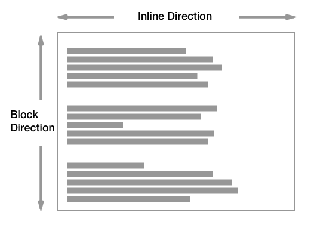
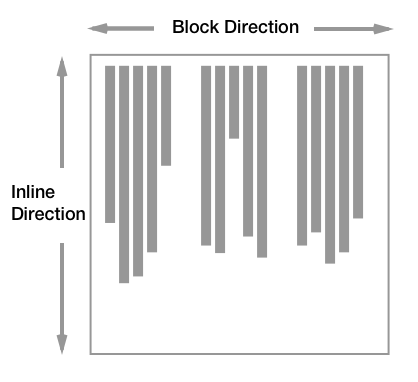
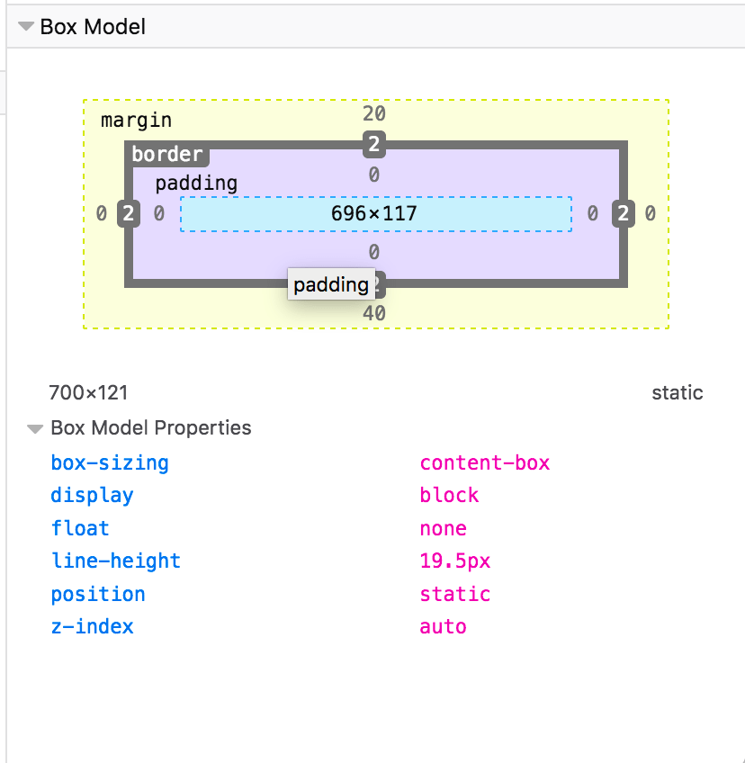

{{CSSRef}}

In this guide, we will explore the basics of how Block and Inline elements behave when they are part of the normal flow.

Normal Flow is defined in the [CSS 2.1 specification](https://www.w3.org/TR/CSS2/visuren.html#normal-flow), which explains that any boxes in normal flow will be part of a _formatting context_. They can be either block or inline, but not both at once. We describe block-level boxes as participating in a _block formatting context_, and inline-level boxes as participating in an _inline formatting context_.

The behavior of elements which have a block or inline formatting context is also defined in this specification. For elements with a block formatting context, the spec says:

> "In a block formatting context, boxes are laid out one after the other, vertically, beginning at the top of a containing block. The vertical distance between two sibling boxes is determined by the 'margin' properties. Vertical margins between adjacent block-level boxes in a block formatting context collapse.\
> In a block formatting context, each box's left outer edge touches the left edge of the containing block (for right-to-left formatting, right edges touch)." - 9.4.1

For elements with an inline formatting context:

> "In an inline formatting context, boxes are laid out horizontally, one after the other, beginning at the top of a containing block. Horizontal margins, borders, and padding are respected between these boxes. The boxes may be aligned vertically in different ways: their bottoms or tops may be aligned, or the baselines of text within them may be aligned. The rectangular area that contains the boxes that form a line is called a line box." - 9.4.2

Note that the CSS 2.1 specification describes documents as being in a horizontal, top to bottom writing mode. For example, by describing vertical distance between block boxes. The behavior on block and inline elements is the same when working in a vertical writing mode, and we will explore this in a future guide on Flow Layout and Writing Modes.

## Elements participating in a block formatting context

Block elements in a horizontal writing mode such as English, lay out vertically, one below the other.

In a vertical writing mode then would lay out horizontally.

In this guide, we will be working in English and therefore a horizontal writing mode. However, everything described should work in the same way if your document is in a vertical writing mode.

As defined in the specification, the margins between two block boxes are what creates separation between the elements. We see this with a very simple layout of two paragraphs, to which I have added a border. The default browser stylesheet adds spacing between the paragraphs by way of adding a margin to the top and bottom.

{{EmbedGHLiveSample("css-examples/flow/block-inline/normal-flow.html", '100%', 700)}}

If we set margins on the paragraph element to `0` then the borders will touch.

{{EmbedGHLiveSample("css-examples/flow/block-inline/normal-flow-margin-zero.html", '100%', 700)}}

By default block elements will consume all of the space in the inline direction, so our paragraphs spread out and get as big as they can inside their containing block. If we give them a width, they will continue to lay out one below the other - even if there would be space for them to be side by side. Each will start against the start edge of the containing block, so the place at which sentences would begin in that writing mode.

{{EmbedGHLiveSample("css-examples/flow/block-inline/normal-flow-width.html", '100%', 700)}}

### Margin collapsing

The spec explains that margins between block elements _collapse_. This means that if you have an element with a top margin immediately after an element with a bottom margin, rather than the total space being the sum of these two margins, the margin collapses, and so will essentially become as large as the larger of the two margins.

In the example below, the paragraphs have a top margin of `20px` and a bottom margin of `40px`. The size of the margin between the paragraphs is `40px` as the smaller top margin on the second paragraph has collapsed with the larger bottom margin of the first.

{{EmbedGHLiveSample("css-examples/flow/block-inline/normal-flow-collapsing.html", '100%', 500)}}

You can read more about margin collapsing in our article [Mastering Margin Collapsing](/en-US/docs/Web/CSS/CSS_box_model/Mastering_margin_collapsing).

> **Note:** If you are not sure whether margins are collapsing, check the Box Model values in your browser DevTools. This will give you the actual size of the margin which can help you to identify what is happening.
>
> 

## Elements participating in an inline formatting context

Inline elements display one after the other in the direction that sentences run in that particular writing mode. While we don't tend to think of inline elements as having a box, as with everything in CSS they do. These inline boxes are arranged one after the other. If there is not enough space in the containing block for all of the boxes a box can break onto a new line. The lines created are known as line boxes.

In the following example, we have three inline boxes created by a paragraph with a {{HTMLElement("strong")}} element inside it.

{{EmbedGHLiveSample("css-examples/flow/block-inline/inline.html", '100%', 500)}}

The boxes around the words before the `<strong>` element and after the `</strong>` element are referred to as anonymous boxes, boxes introduced to ensure that everything is wrapped in a box, but ones that we cannot target directly.

The line box size in the block direction (so the height when working in English) is defined by the tallest box inside it. In the next example, the `<strong>` element is 300%; since that content spans two lines, it now defines the height of the line boxes of those two lines.

{{EmbedGHLiveSample("css-examples/flow/block-inline/line-box.html", '100%', 500)}}

Find out more about how Block and Inline Boxes behave in our Guide to the [Visual Formatting Model](/en-US/docs/Web/CSS/Visual_formatting_model).

## The display property and flow layout

In addition to the rules existing in CSS2.1, new levels of CSS further describe the behavior of block and inline boxes. The {{cssxref("display")}} property defines how a box and any boxes inside it behave. In the CSS Display Model Level 3, we can learn more about how the `display` property changes the behavior of boxes and the boxes they generate.

The display type of an element defines the outer display type; this dictates how the box displays alongside other elements in the same formatting context. It also defines the inner display type, which dictates how boxes inside this element behave. We can see this very clearly when considering a flex layout. In the example below I have a {{HTMLElement("div")}}, which I have given `display: flex`. The flex container behaves like a block element: it displays on a new line and takes up all of the space it can in the inline direction. This is the outer display type of `block`.

The flex items however are participating in a flex formatting context, because their parent is the element with `display: flex`, which has an inner display type of `flex`, establishing the flex formatting context for the direct children.

{{EmbedGHLiveSample("css-examples/flow/block-inline/flex.html", '100%', 500)}}

Therefore you can think of every box in CSS working in this way. The box itself has an outer display type, so it knows how to behave alongside other boxes. It then has an inner display type which changes the way its children behave. Those children then have an outer and inner display type too. The flex items in the previous example become flex level boxes, so their outer display type is dictated by way of them being part of the flex formatting context. They have an inner display type of _flow_ however, meaning that their children participate in normal flow. Items nested inside our flex item lay themselves out as block and inline elements unless something changes their display type.

This concept of the outer and inner display type is important as this tells us that a container using a layout method such as flexbox (`display: flex`) and grid layout (`display: grid`) is still participating in block and inline layout, due to the outer display type of those methods being `block`.

### Changing the Formatting Context an element participates in

Browsers display items in block or inline formatting contexts based on what normally makes sense for that element. For example, a {{HTMLElement("strong")}} element is used to strongly emphasize a span of content and is displayed in bold in browsers by default. It would not generally make sense for that `<strong>` element to be displayed as a block-level element, breaking onto a new line. If you did want all `<strong>` elements to display as block boxes, you could do so by setting `strong { display: block; }`. The ability to style content with CSS means you can always use the most appropriate semantic HTML elements to mark up your content and then change how they are displayed with CSS.

{{EmbedGHLiveSample("css-examples/flow/block-inline/change-formatting.html", '100%', 500)}}

## Summary

In this guide, we have looked at how elements display in normal flow, as block and inline elements. Due to the default behavior of these elements, an HTML document with no CSS styling at all, will display in a readable way. By understanding how normal flow works you will find layout easier, as you understand the starting point for making changes to how elements are displayed.

## See also

- [CSS Basic Box Model](/en-US/docs/Web/CSS/CSS_box_model)
- _[Normal Flow](/en-US/docs/Learn/CSS/CSS_layout/Normal_Flow)_ - Learn Layout
- [Inline-level elements](/en-US/docs/Glossary/Inline-level_content)
- [Block-level elements](/en-US/docs/Glossary/Block-level_content)
