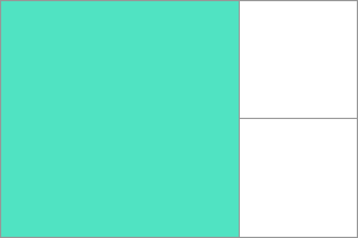
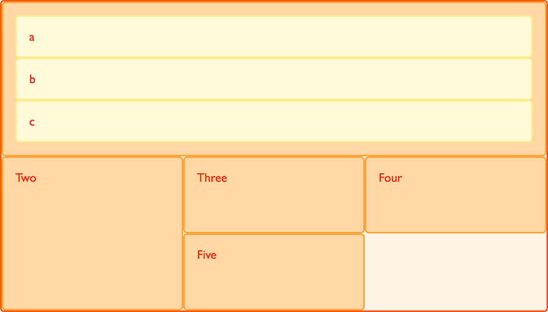

{{CSSRef}}

[CSS grid layout](/en-US/docs/Web/CSS/CSS_grid_layout) introduces a two-dimensional grid system to CSS. Grids can be used to lay out major page areas or small user interface elements. This guide introduces the CSS grid layout and the terminology that is part of the CSS grid layout specification. The features shown in this overview will then be explained in greater detail in the other guides in this series.

## What is a grid?

A grid is a set of intersecting horizontal and vertical lines defining rows and columns. Elements can be placed onto the grid within these column and row lines. CSS grid layout has the following features:

### Fixed and flexible track sizes

You can create a grid with fixed track sizes – using pixels for example. This sets the grid to the specified pixel which fits to the layout you desire. You can also create a grid using flexible sizes with percentages or with the [`fr`](#the_fr_unit) unit designed for this purpose.

### Item placement

You can place items into a precise location on the grid using line numbers, names or by targeting an area of the grid. Grid also contains an algorithm to control the placement of items not given an explicit position on the grid.

### Creation of additional tracks to hold content

You can define an explicit grid with grid layout. The features defined by the grid layout module provide the flexibility to add additional rows and columns when needed. Features such as adding "as many columns that will fit into a container" are included.

### Alignment control

CSS grid layout and [CSS box alignment](/en-US/docs/Web/CSS/CSS_box_alignment) features enable us to control how the items align once placed into a grid area, and how the entire grid is aligned.

### Control of overlapping content

More than one item can be placed into a grid cell or area and they can partially overlap each other. This layering may then be controlled with the {{cssxref("z-index")}} property.

Grid is a powerful layout method that, when combined with other parts of CSS such as [flexbox](/en-US/docs/Web/CSS/CSS_flexible_box_layout), can help you create layouts that are responsive, flexible, and accessible. It all starts by creating a grid in your **{{glossary("grid container")}}**.

## Grid container

We create a _grid container_ by declaring `display: grid` or `display: inline-grid` on an element. As soon as we do this, all _direct children_ of that element become _grid items_.

In this example, we have a containing div with a class of `wrapper`. Nested inside are five child elements.

```html
<div class="wrapper">
  <div>One</div>
  <div>Two</div>
  <div>Three</div>
  <div>Four</div>
  <div>Five</div>
</div>
```

We make the `.wrapper` a grid container using `display: grid;`.

```css
.wrapper {
  display: grid;
}
```

```css hidden
* {
  box-sizing: border-box;
}

.wrapper {
  border: 2px solid #f76707;
  border-radius: 5px;
  background-color: #fff4e6;
}

.wrapper > div {
  border: 2px solid #ffa94d;
  border-radius: 5px;
  background-color: #ffd8a8;
  padding: 1em;
  color: #d9480f;
}
```

{{ EmbedLiveSample('The_Grid_container', '200', '330') }}

All the direct children are now grid items. In a web browser, you won't see any difference to how these items are displayed before turning them into a grid, as grid has created a single column grid for the items. If you inspect the grid in your browsers developer tools, you may see a small icon next to the value `grid`. Click this and, in most browsers, the grid on this element will be overlaid in the browser window.


As you learn and then work with the CSS grid layout, your browser tools will give you a better idea of what is happening with your grids visually.

If we want to start making this more grid-like we need to add column tracks.

## Grid tracks

We define rows and columns on our grid with the {{cssxref("grid-template-rows")}} and {{cssxref("grid-template-columns")}} properties. These define {{glossary("grid tracks")}}. A _grid track_ is the space between any two adjacent lines on the grid. The image below shows a highlighted track – this is the first-row track in our grid.


Grid tracks are defined in the [explicit grid](#implicit_and_explicit_grids) by using the `grid-template-columns` and `grid-template-rows` properties or the shorthand `grid` or `grid-template` properties. Tracks are also created in the implicit grid by positioning a grid item outside of the tracks created in the explicit grid.

### Basic example

We can add to our earlier example by adding the `grid-template-columns` property, then defining the size of the column tracks.

We have now created a grid with three 200-pixel-wide column tracks. The child items will be laid out on this grid one in each grid cell.

```html
<div class="wrapper">
  <div>One</div>
  <div>Two</div>
  <div>Three</div>
  <div>Four</div>
  <div>Five</div>
</div>
```

```css
.wrapper {
  display: grid;
  grid-template-columns: 200px 200px 200px;
}
```

```css hidden
* {
  box-sizing: border-box;
}

.wrapper {
  border: 2px solid #f76707;
  border-radius: 5px;
  background-color: #fff4e6;
}

.wrapper > div {
  border: 2px solid #ffa94d;
  border-radius: 5px;
  background-color: #ffd8a8;
  padding: 1em;
  color: #d9480f;
}
```

{{ EmbedLiveSample('Basic_example', '610', '140') }}

### The fr unit

Tracks can be defined using any length unit. Grid also introduces an additional length unit to help us create flexible grid tracks. The [`fr`](/en-US/docs/Web/CSS/flex_value) unit represents a fraction of the available space in the grid container. The next grid definition would create three equal width tracks that grow and shrink according to the available space.

```html
<div class="wrapper">
  <div>One</div>
  <div>Two</div>
  <div>Three</div>
  <div>Four</div>
  <div>Five</div>
</div>
```

```css
.wrapper {
  display: grid;
  grid-template-columns: 1fr 1fr 1fr;
}
```

```css hidden
* {
  box-sizing: border-box;
}

.wrapper {
  border: 2px solid #f76707;
  border-radius: 5px;
  background-color: #fff4e6;
}

.wrapper > div {
  border: 2px solid #ffa94d;
  border-radius: 5px;
  background-color: #ffd8a8;
  padding: 1em;
  color: #d9480f;
}
```

{{ EmbedLiveSample('The_fr_unit', '220', '140') }}

### Unequal sizes

In this example, we create a definition with a `2fr` track then two `1fr` tracks. The available space is split into four. Two parts are given to the first track and one part each to the next two tracks.

```html
<div class="wrapper">
  <div>One</div>
  <div>Two</div>
  <div>Three</div>
  <div>Four</div>
  <div>Five</div>
</div>
```

```css
.wrapper {
  display: grid;
  grid-template-columns: 2fr 1fr 1fr;
}
```

```css hidden
* {
  box-sizing: border-box;
}

.wrapper {
  border: 2px solid #f76707;
  border-radius: 5px;
  background-color: #fff4e6;
}

.wrapper > div {
  border: 2px solid #ffa94d;
  border-radius: 5px;
  background-color: #ffd8a8;
  padding: 1em;
  color: #d9480f;
}
```

{{ EmbedLiveSample('Unequal_sizes', '220', '140') }}

### Mixing flexible and absolute sizes

In this final example, we mix absolute sized tracks with `fr` units. The first track is `500px`, so the fixed width is taken away from the available space. The remaining space is divided into three and assigned in proportion to the two flexible tracks.

```html
<div class="wrapper">
  <div>One</div>
  <div>Two</div>
  <div>Three</div>
  <div>Four</div>
  <div>Five</div>
</div>
```

```css
.wrapper {
  display: grid;
  grid-template-columns: 500px 1fr 2fr;
}
```

```css hidden
* {
  box-sizing: border-box;
}

.wrapper {
  border: 2px solid #f76707;
  border-radius: 5px;
  background-color: #fff4e6;
}

.wrapper > div {
  border: 2px solid #ffa94d;
  border-radius: 5px;
  background-color: #ffd8a8;
  padding: 1em;
  color: #d9480f;
}
```

{{ EmbedLiveSample('Mixing_flexible_and_absolute_sizes', '220', '140') }}

### Track listings with repeat() notation

Large grids with many tracks can use the [`repeat()`](/en-US/docs/Web/CSS/repeat) notation, to repeat all or a section of the list of grid tracks. For example the grid definition:

```css
.wrapper {
  display: grid;
  grid-template-columns: 1fr 1fr 1fr;
}
```

Can also be written as:

```css
.wrapper {
  display: grid;
  grid-template-columns: repeat(3, 1fr);
}
```

Repeat notation can be used for a part of the list of tracks. In this example, we create an 8-column grid; the initial track is `20px`, then a repeating section of 6 `1fr` tracks, and a final `20px` track.

```css
.wrapper {
  display: grid;
  grid-template-columns: 20px repeat(6, 1fr) 20px;
}
```

Repeat notation (`repeat()`) uses the track listing to create a repeating pattern of tracks. In this example, the grid will have 10 tracks; a `1fr` track is followed by a `2fr` track, with this pattern being repeated five times.

```css
.wrapper {
  display: grid;
  grid-template-columns: repeat(5, 1fr 2fr);
}
```

### Implicit and explicit grids

When creating our example grid, we specifically defined our column tracks with the {{cssxref("grid-template-columns")}} property, with the grid creating rows as needed to fit the content. The columns define the explicit grid while the rows are part of the implicit grid.

The _explicit grid_ consists of rows and columns defined with {{cssxref("grid-template-columns")}} or {{cssxref("grid-template-rows")}}. The
_implicit grid_ extends the defined explicit grid when content is placed outside of that grid, such as into the rows by drawing additional grid lines.

If you place something outside of the defined grid—or due to the amount of content, more grid tracks are needed—then the grid creates rows and columns in the _implicit grid_. These tracks will be auto-sized by default, resulting in their size being based on the content that is inside them.

You can also define a set size for tracks created in the implicit grid with the {{cssxref("grid-auto-rows")}} and {{cssxref("grid-auto-columns")}} properties.

In this example, we set `grid-auto-rows: 200px`, ensuring the tracks created in this implicit grid are `200px` tall.

```html
<div class="wrapper">
  <div>One</div>
  <div>Two</div>
  <div>Three</div>
  <div>Four</div>
  <div>Five</div>
</div>
```

```css
.wrapper {
  display: grid;
  grid-template-columns: repeat(3, 1fr);
  grid-auto-rows: 200px;
}
```

```css hidden
* {
  box-sizing: border-box;
}

.wrapper {
  border: 2px solid #f76707;
  border-radius: 5px;
  background-color: #fff4e6;
}

.wrapper > div {
  border: 2px solid #ffa94d;
  border-radius: 5px;
  background-color: #ffd8a8;
  padding: 1em;
  color: #d9480f;
}
```

{{ EmbedLiveSample('The_implicit_and_explicit_grid', '230', '450') }}

### Track sizing and minmax

When setting up an explicit grid or defining the sizing for automatically created rows or columns we may want to give tracks a minimum size, but also ensure they expand to fit any content that is added. For example, we may want our rows to never collapse smaller than 100 pixels, but if our content stretches to 300 pixels in height, then we would like the row to stretch to that height. This is solved by the {{cssxref("minmax", "minmax()")}} function.

In this example, we use `minmax()` within the `grid-auto-rows` property value. By setting `grid-auto-rows: minmax(100px, auto);`, automatically created rows will be a minimum of `100px` tall, and have a maximum of `auto`. Setting `auto` as the maximum value means the size will stretch to fit the content, sizing the row based on the cell with the tallest content.

```css
.wrapper {
  display: grid;
  grid-template-columns: repeat(3, 1fr);
  grid-auto-rows: minmax(100px, auto);
}
```

```css hidden
* {
  box-sizing: border-box;
}

.wrapper {
  border: 2px solid #f76707;
  border-radius: 5px;
  background-color: #fff4e6;
}

.wrapper > div {
  border: 2px solid #ffa94d;
  border-radius: 5px;
  background-color: #ffd8a8;
  padding: 1em;
  color: #d9480f;
}
```

```html hidden
<div class="wrapper">
  <div>One</div>
  <div>
    Two
    <p>We have some more content.</p>
    <p>This makes me taller than 100 pixels.</p>
  </div>
  <div>Three</div>
  <div>Four</div>
  <div>Five</div>
</div>
```

{{ EmbedLiveSample('Track_sizing_and_minmax', '240', '270') }}

## Grid lines

It should be noted that when we define a grid we define the grid tracks, not the lines. Grid then gives us numbered lines to use when positioning items. In our three column, two row grid we have four column lines.


Lines are numbered according to the writing mode of the document. In a left-to-right language, line 1 is on the left-hand side of the grid. In a right-to-left language, it is on the right-hand side of the grid. Lines can also be named, which is discussed in the [grid layout using named grid lines](/en-US/docs/Web/CSS/CSS_grid_layout/Grid_layout_using_named_grid_lines) guide.

### Positioning items against lines

The following example demonstrates basic line-based placement; when placing an item, we target the line rather than the track. We explore this in greater detail in the [grid layout using line-based placement](/en-US/docs/Web/CSS/CSS_grid_layout/Grid_layout_using_line-based_placement) guide.

In this example, the first two items on our three column track grid are placed using the {{cssxref("grid-column-start")}}, {{cssxref("grid-column-end")}}, {{cssxref("grid-row-start")}} and {{cssxref("grid-row-end")}} properties. Working from left to right, the first item is placed against column line 1, and spans to column line 4, which in our case is the far-right line on the grid. It begins at row line 1 and ends at row line 3, therefore spanning two row tracks.

The second item starts on grid column line 1, and spans one track. This is the default, so we do not need to specify the end line. It also spans two row tracks from row line 3 to row line 5. The other items will place themselves into empty spaces on the grid.

```html
<div class="wrapper">
  <div class="box1">One</div>
  <div class="box2">Two</div>
  <div class="box3">Three</div>
  <div class="box4">Four</div>
  <div class="box5">Five</div>
</div>
```

```css
.wrapper {
  display: grid;
  grid-template-columns: repeat(3, 1fr);
  grid-auto-rows: 100px;
}

.box1 {
  grid-column-start: 1;
  grid-column-end: 4;
  grid-row-start: 1;
  grid-row-end: 3;
}

.box2 {
  grid-column-start: 1;
  grid-row-start: 3;
  grid-row-end: 5;
}
```

```css hidden
* {
  box-sizing: border-box;
}

.wrapper {
  border: 2px solid #f76707;
  border-radius: 5px;
  background-color: #fff4e6;
}

.wrapper > div {
  border: 2px solid #ffa94d;
  border-radius: 5px;
  background-color: #ffd8a8;
  padding: 1em;
  color: #d9480f;
}
```

{{ EmbedLiveSample('Positioning_items_against_lines', '230', '450') }}

Use the grid inspector in your developer tools to see how the items are positioned against the lines of the grid.

### Line-positioning shorthands

The longhand values used above can be compressed onto one line for columns with the {{cssxref("grid-column")}} shorthand, and one line for rows with the {{cssxref("grid-row")}} shorthand. The following example would give the same positioning as in the previous code, but with far less CSS. The value before the forward slash character (`/`) is the start line, the value after the end line.

You can omit the end value if the area only spans one track.

```css
.wrapper {
  display: grid;
  grid-template-columns: repeat(3, 1fr);
  grid-auto-rows: 100px;
}

.box1 {
  grid-column: 1 / 4;
  grid-row: 1 / 3;
}

.box2 {
  grid-column: 1;
  grid-row: 3 / 5;
}
```

## Grid cells

A _grid cell_ is the smallest unit on a grid. Conceptually it is like a table cell. As we saw in our earlier examples, once a grid is defined as a parent the child items will lay themselves out in one cell each of the defined grid. In the below image, the first cell of the grid is highlighted.


## Grid areas

Items can span one or more cells both by row or by column, and this creates a _grid area_. Grid areas must be rectangular – it isn't possible to create an L-shaped area for example. The highlighted grid area spans two row and two column tracks.



## Gutters

_Gutters_ or _alleys_ between grid cells can be created using the {{cssxref("column-gap")}} and {{cssxref("row-gap")}} properties, or the shorthand {{cssxref("gap")}}. In the below example, we add a 10-pixel gap between columns and a `1em` gap between rows.

```css
.wrapper {
  display: grid;
  grid-template-columns: repeat(3, 1fr);
  column-gap: 10px;
  row-gap: 1em;
}
```

```html
<div class="wrapper">
  <div>One</div>
  <div>Two</div>
  <div>Three</div>
  <div>Four</div>
  <div>Five</div>
</div>
```

```css hidden
* {
  box-sizing: border-box;
}

.wrapper {
  column-gap: 10px;
  row-gap: 1em;
  border: 2px solid #f76707;
  border-radius: 5px;
  background-color: #fff4e6;
}

.wrapper > div {
  border: 2px solid #ffa94d;
  border-radius: 5px;
  background-color: #ffd8a8;
  padding: 1em;
  color: #d9480f;
}
```

{{ EmbedLiveSample('Gutters') }}

Any space used by gaps will be accounted for before space is assigned to the flexible length `fr` tracks, and gaps act for sizing purposes like a regular grid track, however you cannot place anything into a gap. In terms of line-based positioning, the gap acts like a thick, transparent line.

## Nesting grids

A grid item can become a grid container. In the following example, we extend the three-column grid with two positioned items seen earlier, adding sub-items to the first grid item. As these nested items are not direct children of the grid they do not participate in grid layout and so display in a normal document flow.



### Nesting without subgrid

If we set `box1` to `display: grid`, we can give it a track definition and it too will become a grid. The items then lay out on this new grid.

```css
.box1 {
  grid-column-start: 1;
  grid-column-end: 4;
  grid-row-start: 1;
  grid-row-end: 3;
  display: grid;
  grid-template-columns: repeat(3, 1fr);
}
```

```html
<div class="wrapper">
  <div class="box box1">
    <div class="nested">a</div>
    <div class="nested">b</div>
    <div class="nested">c</div>
  </div>
  <div class="box box2">Two</div>
  <div class="box box3">Three</div>
  <div class="box box4">Four</div>
  <div class="box box5">Five</div>
</div>
```

```css
* {
  box-sizing: border-box;
}

.wrapper {
  border: 2px solid #f76707;
  border-radius: 5px;
  gap: 3px;
  background-color: #fff4e6;
  display: grid;
  grid-template-columns: repeat(3, 1fr);
}

.box {
  border: 2px solid #ffa94d;
  border-radius: 5px;
  background-color: #ffd8a8;
  padding: 1em;
  color: #d9480f;
}

.box1 {
  grid-column: 1 / 4;
}

.nested {
  border: 2px solid #ffec99;
  border-radius: 5px;
  background-color: #fff9db;
  padding: 1em;
}
```

{{ EmbedLiveSample('Nesting_without_subgrid', '600', '250') }}

In this case the nested grid has no relationship to the parent. As you can see in the example it has not inherited the {{cssxref("gap")}} of the parent and the lines in the nested grid do not align to the lines in the parent grid.

### Subgrid

In addition to regular grids, we can create _subgrid_. The `subgrid` value lets us create nested grids that use the track definition of the parent grid.

To use them, we edit the above nested grid example to change the track definition of `grid-template-columns: repeat(3, 1fr)`, to `grid-template-columns: subgrid`. The nested grid then uses the parent grid tracks to lay out items.

```css
.box1 {
  grid-column-start: 1;
  grid-column-end: 4;
  grid-row-start: 1;
  grid-row-end: 3;
  display: grid;
  grid-template-columns: subgrid;
}
```

## Layering items with z-index

Grid items can occupy the same cell, and in this case we can use the {{cssxref("z-index")}} property to control the order in which overlapping items stack.

### Overlapping without z-index

If we return to our example with items positioned by line number, we can change this to make two items overlap.

```html
<div class="wrapper">
  <div class="box box1">One</div>
  <div class="box box2">Two</div>
  <div class="box box3">Three</div>
  <div class="box box4">Four</div>
  <div class="box box5">Five</div>
</div>
```

```css
.wrapper {
  display: grid;
  grid-template-columns: repeat(3, 1fr);
  grid-auto-rows: 100px;
}

.box1 {
  grid-column-start: 1;
  grid-column-end: 4;
  grid-row-start: 1;
  grid-row-end: 3;
}

.box2 {
  grid-column-start: 1;
  grid-row-start: 2;
  grid-row-end: 4;
}
```

```css hidden
* {
  box-sizing: border-box;
}

.wrapper {
  border: 2px solid #f76707;
  border-radius: 5px;
  background-color: #fff4e6;
}

.box {
  border: 2px solid #ffa94d;
  border-radius: 5px;
  background-color: #ffd8a8;
  padding: 1em;
  color: #d9480f;
}
```

{{ EmbedLiveSample('Overlapping_without_z-index', '230', '460') }}

The item `box2` is now overlapping `box1`, it displays on top as it comes later in the source order.

### Controlling the order

We can control the order in which items stack up by using the `z-index` property - just like positioned items. If we give `box2` a lower `z-index` than `box1` it will display below `box1` in the stack.

```css
.wrapper {
  display: grid;
  grid-template-columns: repeat(3, 1fr);
  grid-auto-rows: 100px;
}

.box1 {
  grid-column-start: 1;
  grid-column-end: 4;
  grid-row-start: 1;
  grid-row-end: 3;
  z-index: 2;
}

.box2 {
  grid-column-start: 1;
  grid-row-start: 2;
  grid-row-end: 4;
  z-index: 1;
}
```

```html hidden
<div class="wrapper">
  <div class="box box1">One</div>
  <div class="box box2">Two</div>
  <div class="box box3">Three</div>
  <div class="box box4">Four</div>
  <div class="box box5">Five</div>
</div>
```

```css hidden
* {
  box-sizing: border-box;
}

.wrapper {
  border: 2px solid #f76707;
  border-radius: 5px;
  background-color: #fff4e6;
}

.box {
  border: 2px solid #ffa94d;
  border-radius: 5px;
  background-color: #ffd8a8;
  padding: 1em;
  color: #d9480f;
}
```

{{ EmbedLiveSample('Controlling_the_order', '230', '420') }}

## Next steps

In this overview, we took a very quick look at the possibilities of grid layouts. Explore and play with the code examples, and then move on to the guide, [relationship of grid layout with other layout methods](/en-US/docs/Web/CSS/CSS_grid_layout/Relationship_of_grid_layout_with_other_layout_methods), where we will really start to dig into the details of CSS grid layout.
