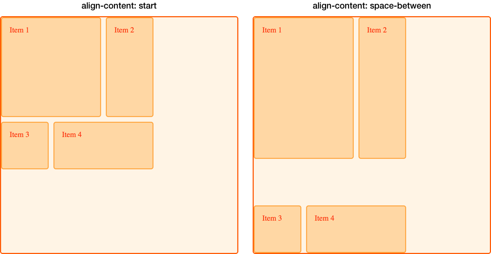

[CSS grid layout](/en-US/docs/Web/CSS/CSS_grid_layout) implements [CSS box alignment](/en-US/docs/Web/CSS/CSS_box_alignment), which is the same standard [flexbox](/en-US/docs/Web/CSS/CSS_flexible_box_layout) uses for aligning items in its flex container. The alignment module details how alignment should work in all the layout methods.

In this guide, we look at how the box alignment properties are used to align items in grid layout.

You may notice similarities to how these properties and values work in flexbox. Due to grid being two-dimensional and flexbox one-dimensional, there are some small differences that you should watch out for. For this reason, we will start by looking at the two axes that we deal with when aligning things in a grid.

## The two axes of a grid layout

When working with grid layout you have two axes available to align things against – the _block axis_ and the _inline axis_. The [block axis](/en-US/docs/Glossary/Flow_relative_values#block_direction) is the axis upon which blocks are laid out in block layout. If you have two paragraphs on your page they display one below the other, so it is this direction we describe as the block axis.


The [inline axis](/en-US/docs/Glossary/Flow_relative_values#inline_direction) runs across the block axis, it is the direction in which text in regular inline flow runs.


We are able to align the content inside grid areas, and the grid tracks themselves on these two axes.

## Aligning items on the block axis

The {{cssxref("align-self")}} and {{cssxref("align-items")}} properties control alignment on the block axis. When we use these properties, we are changing the alignment of the item within the grid area you have placed it.

### Using align-items

In the following example, we have four {{glossary("grid areas")}} within our grid. We can use the {{cssxref("align-items")}} property on the {{glossary("grid container")}}, to align the items using `normal`, `stretch`, or {{cssxref("self-position")}} or {{cssxref("baseline-position")}} values:

- `normal`
- `stretch`
- `start`
- `end`
- `center`
- `baseline`
- `first baseline`
- `last baseline`
- `auto` (`align-self` only)

The default value is `normal`, which resolves to `stretch` for grid containers.

```css hidden
* {
  box-sizing: border-box;
}

.wrapper {
  border: 2px solid #f76707;
  border-radius: 5px;
  background-color: #fff4e6;
}

.wrapper > div {
  border: 2px solid #ffa94d;
  border-radius: 5px;
  background-color: #ffd8a8;
  padding: 1em;
  color: #d9480f;
}
```

```css
.wrapper {
  display: grid;
  grid-template-columns: repeat(8, 1fr);
  gap: 10px;
  grid-auto-rows: 100px;
  grid-template-areas:
    "a a a a b b b b"
    "a a a a b b b b"
    "c c c c d d d d"
    "c c c c d d d d";
  align-items: start;
}
.item1 {
  grid-area: a;
}
.item2 {
  grid-area: b;
}
.item3 {
  grid-area: c;
}
.item4 {
  grid-area: d;
}
```

```html
<div class="wrapper">
  <div class="item1">Item 1</div>
  <div class="item2">Item 2</div>
  <div class="item3">Item 3</div>
  <div class="item4">Item 4</div>
</div>
```

{{ EmbedLiveSample('Using_align-items', '500', '500') }}

Keep in mind that once you set `align-items: start`, the height of each child `<div>` will be determined by the contents of the `<div>`. This is in contrast to omitting {{cssxref("align-items")}} completely, in which case the height of each `<div>` stretches to fill its grid area.

The `align-items` property sets the {{cssxref("align-self")}} property for all of the child grid items. This means that you can set the property individually, by using `align-self` directly on a grid item.

### Using align-self

In this next example, we are using the `align-self` property, to demonstrate the different alignment values. The first area is showing the default behavior of `align-self`, which in this case resolves to `stretch`. The second item, has an `align-self` value of `start`, the third `end` and the fourth `center`.

```css hidden
* {
  box-sizing: border-box;
}

.wrapper {
  border: 2px solid #f76707;
  border-radius: 5px;
  background-color: #fff4e6;
}

.wrapper > div {
  border: 2px solid #ffa94d;
  border-radius: 5px;
  background-color: #ffd8a8;
  padding: 1em;
  color: #d9480f;
}
```

```css
.wrapper {
  display: grid;
  grid-template-columns: repeat(8, 1fr);
  gap: 10px;
  grid-auto-rows: 100px;
  grid-template-areas:
    "a a a a b b b b"
    "a a a a b b b b"
    "c c c c d d d d"
    "c c c c d d d d";
}
.item1 {
  grid-area: a;
}
.item2 {
  grid-area: b;
  align-self: start;
}
.item3 {
  grid-area: c;
  align-self: end;
}
.item4 {
  grid-area: d;
  align-self: center;
}
```

```html
<div class="wrapper">
  <div class="item1">Item 1</div>
  <div class="item2">Item 2</div>
  <div class="item3">Item 3</div>
  <div class="item4">Item 4</div>
</div>
```

{{ EmbedLiveSample('Using_align-self', '500', '500') }}

### Items with an intrinsic aspect ratio

The default behavior for {{cssxref("align-self")}} is to inherit from the grid container's `align-items` property, for which the `normal` default is to stretch, except for items which have an intrinsic {{glossary("aspect ratio")}}, in this case they behave as `start`. The reason for this, is that if items with an aspect ratio are made to stretch, they would be distorted.

## Justifying items on the inline axis

Whereas `align-items` and `align-self` align items on the block axis, {{cssxref("justify-items")}} and {{cssxref("justify-self")}} align items on the inline axis. The values you can choose from are similar to the `normal`, `stretch`, {{cssxref("self-position")}} and {{cssxref("baseline-position")}} values of the `align-self` property, along with `left` and `right`. Values include:

- `normal`
- `start`
- `end`
- `left`
- `right`
- `center`
- `stretch`
- `baseline`
- `first baseline`
- `last baseline`
- `auto` (`justify-self` only)

You can see the same example as used for {{cssxref("align-items")}}, below. This time, we are applying the {{cssxref("justify-self")}} property.

Once again, the default is `stretch` other than for items with an intrinsic aspect ratio. This means that grid items will cover their grid area by default, unless you change the alignment. In this example, the first item demonstrates the default `stretch` alignment value:

```css hidden
* {
  box-sizing: border-box;
}

.wrapper {
  border: 2px solid #f76707;
  border-radius: 5px;
  background-color: #fff4e6;
}

.wrapper > div {
  border: 2px solid #ffa94d;
  border-radius: 5px;
  background-color: #ffd8a8;
  padding: 1em;
  color: #d9480f;
}
```

```css
.wrapper {
  display: grid;
  grid-template-columns: repeat(8, 1fr);
  gap: 10px;
  grid-auto-rows: 100px;
  grid-template-areas:
    "a a a a b b b b"
    "a a a a b b b b"
    "c c c c d d d d"
    "c c c c d d d d";
}
.item1 {
  grid-area: a;
}
.item2 {
  grid-area: b;
  justify-self: start;
}
.item3 {
  grid-area: c;
  justify-self: end;
}
.item4 {
  grid-area: d;
  justify-self: center;
}
```

```html
<div class="wrapper">
  <div class="item1">Item 1</div>
  <div class="item2">Item 2</div>
  <div class="item3">Item 3</div>
  <div class="item4">Item 4</div>
</div>
```

{{ EmbedLiveSample('Justifying_Items_on_the_Inline_Axis', '500', '500') }}

As with `align-self` and `align-items`, you can apply `justify-items` to the grid container to set a `justify-self` value for all the grid items within the container.

> [!NOTE]
> The `justify-self` and `justify-items` properties are not implemented in flexbox. This is due to the one-dimensional nature of [flexbox](/en-US/docs/Web/CSS/CSS_flexible_box_layout), and that there may be multiple items along the axis, making it impossible to justify a single item. To align items along the main, inline axis in flexbox you use the {{cssxref("justify-content")}} property.

### Shorthand properties

The {{CSSxRef("place-items")}} property is shorthand for `align-items` and `justify-items`.

The {{CSSxRef("place-self")}} property is shorthand for `align-self` and `justify-self`.

## Center an item in the area

By combining the align and justify properties we can easily center an item inside a grid area.

```css hidden
* {
  box-sizing: border-box;
}

.wrapper {
  border: 2px solid #f76707;
  border-radius: 5px;
  background-color: #fff4e6;
}

.wrapper > div {
  border: 2px solid #ffa94d;
  border-radius: 5px;
  background-color: #ffd8a8;
  padding: 1em;
  color: #d9480f;
}
```

```css
.wrapper {
  display: grid;
  grid-template-columns: repeat(4, 1fr);
  gap: 10px;
  grid-auto-rows: 200px;
  grid-template-areas:
    ". a a ."
    ". a a .";
}
.item1 {
  grid-area: a;
  align-self: center;
  justify-self: center;
}
```

```html
<div class="wrapper">
  <div class="item1">Item 1</div>
</div>
```

{{ EmbedLiveSample('Center_an_item_in_the_area', '500', '500') }}

## Aligning the grid tracks on the block axis

If you have a situation where your grid tracks use an area that is smaller than the grid container you can align the grid tracks themselves inside that container. The {{cssxref("align-content")}} aligns the tracks on the block axis and {{cssxref("justify-content")}} aligns on the inline axis. As with the `*-items` and `*-item` properties, the {{CSSxRef("place-content")}} property is shorthand for `align-content` and `justify-content`.

The values for `align-content`, `justify-content` and `place-content` all include the {{cssxref("content-distribution")}} and {{cssxref("content-position")}} values. The `align-content` property also accepts {{cssxref("baseline-position")}} values and, like the other `justify-*` properties, `justify-content` also accepts `left` and `right`.

Valid keywords for `place-content` include:

- `normal`
- `start`
- `end`
- `center`
- `stretch`
- `space-around`
- `space-between`
- `space-evenly`
- `baseline`
- `first baseline`
- `last baseline`
- `left`
- `right`

The `align-content` property is applied to the grid container as it works on the entire grid.

### Default alignment

In this example, the 500px by 500px grid container has three row and three column 100px tracks with a 10px gutter. This means there is space inside the grid container in both the block and inline directions.

By default, our grid tracks are in the top left corner of the grid, aligned against the start grid lines, as the default behavior in grid layout is `start`:

```css
* {
  box-sizing: border-box;
}

.wrapper {
  border: 2px solid #f76707;
  border-radius: 5px;
  background-color: #fff4e6;
}

.wrapper > div {
  border: 2px solid #ffa94d;
  border-radius: 5px;
  background-color: #ffd8a8;
  padding: 1em;
  color: #d9480f;
}
```

```css
.wrapper {
  display: grid;
  grid-template-columns: repeat(3, 100px);
  grid-template-rows: repeat(3, 100px);
  height: 500px;
  width: 500px;
  gap: 10px;
  grid-template-areas:
    "a a b"
    "a a b"
    "c d d";
}
.item1 {
  grid-area: a;
}
.item2 {
  grid-area: b;
}
.item3 {
  grid-area: c;
}
.item4 {
  grid-area: d;
}
```

```html
<div class="wrapper">
  <div class="item1">Item 1</div>
  <div class="item2">Item 2</div>
  <div class="item3">Item 3</div>
  <div class="item4">Item 4</div>
</div>
```

{{ EmbedLiveSample('Default_alignment', '500', '550') }}

### Setting align-content: end

Using the same CSS and HTML, in this example we add `align-content` with a value of `end` to the container, so the tracks all move to the end line of the grid container in the block dimension:

```css
.wrapper {
  align-content: end;
}
```

```css hidden
* {
  box-sizing: border-box;
}

.wrapper {
  border: 2px solid #f76707;
  border-radius: 5px;
  background-color: #fff4e6;
}

.wrapper > div {
  border: 2px solid #ffa94d;
  border-radius: 5px;
  background-color: #ffd8a8;
  padding: 1em;
  color: #d9480f;
}

.wrapper {
  display: grid;
  grid-template-columns: repeat(3, 100px);
  grid-template-rows: repeat(3, 100px);
  height: 500px;
  width: 500px;
  gap: 10px;
  grid-template-areas:
    "a a b"
    "a a b"
    "c d d";
}
.item1 {
  grid-area: a;
}
.item2 {
  grid-area: b;
}
.item3 {
  grid-area: c;
}
.item4 {
  grid-area: d;
}
```

```html hidden
<div class="wrapper">
  <div class="item1">Item 1</div>
  <div class="item2">Item 2</div>
  <div class="item3">Item 3</div>
  <div class="item4">Item 4</div>
</div>
```

{{ EmbedLiveSample('Setting_align-content_end', '500', '550') }}

### Setting align-content: space-between

We can also apply the {{cssxref("content-distribution")}} space distribution values of `space-between`, `space-around`, `space-evenly`, and `stretch`. In this example, we set {{cssxref("align-content")}}, which aligns the tracks on the block axis, to `space-between`, which spaces out the tracks:

```css
.wrapper {
  align-content: space-between;
}
```

```css hidden
* {
  box-sizing: border-box;
}

.wrapper {
  border: 2px solid #f76707;
  border-radius: 5px;
  background-color: #fff4e6;
}

.wrapper > div {
  border: 2px solid #ffa94d;
  border-radius: 5px;
  background-color: #ffd8a8;
  padding: 1em;
  color: #d9480f;
}

.wrapper {
  display: grid;
  grid-template-columns: repeat(3, 100px);
  grid-template-rows: repeat(3, 100px);
  height: 500px;
  width: 500px;
  gap: 10px;
  grid-template-areas:
    "a a b"
    "a a b"
    "c d d";
}
.item1 {
  grid-area: a;
}
.item2 {
  grid-area: b;
}
.item3 {
  grid-area: c;
}
.item4 {
  grid-area: d;
}
```

```html hidden
<div class="wrapper">
  <div class="item1">Item 1</div>
  <div class="item2">Item 2</div>
  <div class="item3">Item 3</div>
  <div class="item4">Item 4</div>
</div>
```

{{ EmbedLiveSample('Setting_align-content_space-between', '500', '600') }}

If an item spans more than one grid track, using a space distribution value will likely cause items on your grid to become larger because the space that's added between the tracks is added to the spanning item. Therefore, if you use these values, make sure the content of the tracks can cope with the extra space or that you have used alignment properties on the items, so they move to the start or end rather than stretch.

In the below image, we placed the grid with two different `align-content` values to compare `start` and `space-between`. You can see how the first two items, which span two row tracks, have taken on extra height in the `space-between` example as they gain the space that exists because of the free space that was distributed _between_ the three rows:



## Justifying the grid tracks on the inline axis

We can use `justify-content` to perform the same type of alignment on the inline axis that we used `align-content` for in the block axis.

Using the same example, we set {{cssxref("justify-content")}} to `space-around`. This once again causes tracks which span more than one column track to gain extra space:

```css
.wrapper {
  align-content: space-between;
  justify-content: space-around;
}
```

```css hidden
* {
  box-sizing: border-box;
}

.wrapper {
  border: 2px solid #f76707;
  border-radius: 5px;
  background-color: #fff4e6;
}

.wrapper > div {
  border: 2px solid #ffa94d;
  border-radius: 5px;
  background-color: #ffd8a8;
  padding: 1em;
  color: #d9480f;
}

.wrapper {
  display: grid;
  grid-template-columns: repeat(3, 100px);
  grid-template-rows: repeat(3, 100px);
  height: 500px;
  width: 500px;
  gap: 10px;
  grid-template-areas:
    "a a b"
    "a a b"
    "c d d";
}
.item1 {
  grid-area: a;
}
.item2 {
  grid-area: b;
}
.item3 {
  grid-area: c;
}
.item4 {
  grid-area: d;
}
```

```html hidden
<div class="wrapper">
  <div class="item1">Item 1</div>
  <div class="item2">Item 2</div>
  <div class="item3">Item 3</div>
  <div class="item4">Item 4</div>
</div>
```

{{ EmbedLiveSample('Justifying_the_grid_tracks_on_the_inline_axis', '500', '550') }}

## Alignment and auto margins

Another way to align items inside their area is to use auto margins. If you have ever centered a layout in the viewport, or any block level element within its parent, you may have done so by setting the right and left margin of element you wanted to center to `auto`. The auto margin absorbs all of the available space. Setting the margin to `auto` on both sides pushes the block-level element into the middle as both margins attempt to take all of the space.

In this next example, item 1 has its {{cssxref("margin-left")}} property set to `auto`. This pushes the content over to the right side of the area, as the auto margin takes up the available space that remained after space needed for the content has been assigned:

```css hidden
* {
  box-sizing: border-box;
}

.wrapper {
  border: 2px solid #f76707;
  border-radius: 5px;
  background-color: #fff4e6;
}

.wrapper > div {
  border: 2px solid #ffa94d;
  border-radius: 5px;
  background-color: #ffd8a8;
  padding: 1em;
  color: #d9480f;
}
```

```css
.wrapper {
  display: grid;
  grid-template-columns: repeat(3, 100px);
  grid-template-rows: repeat(3, 100px);
  height: 500px;
  width: 500px;
  gap: 10px;
  grid-template-areas:
    "a a b"
    "a a b"
    "c d d";
}
.item1 {
  grid-area: a;
  margin-left: auto;
}
.item2 {
  grid-area: b;
}
.item3 {
  grid-area: c;
}
.item4 {
  grid-area: d;
}
```

```html
<div class="wrapper">
  <div class="item1">Item 1</div>
  <div class="item2">Item 2</div>
  <div class="item3">Item 3</div>
  <div class="item4">Item 4</div>
</div>
```

{{ EmbedLiveSample('Alignment_and_auto_margins', '500', '550') }}

Use the grid inspector in your browser developer tools to see how the item is aligned:


## Alignment and writing modes

All these examples were in English, a left-to-right language. This means that our start lines are top and left of our grid when thinking in physical directions.

CSS grid layout and CSS box alignment work with writing modes in CSS. When displaying a right to left language, such as Arabic, the start of the grid is the top right, so the default of `justify-content: start` would be for grid tracks to start on the right-hand side of the grid.

Setting {{glossary("physical properties")}}, such as setting auto margins using {{cssxref("margin-right")}} or {{cssxref("margin-left")}}, or absolutely positioning items using the {{cssxref("top")}}, {{cssxref("right")}}, {{cssxref("bottom")}}, and {{cssxref("left")}} offsets, does not honor writing modes. In the [grids, logical values, and writing modes](/en-US/docs/Web/CSS/CSS_grid_layout/Grids_logical_values_and_writing_modes) guide, we will look further into this interaction between CSS grid layout, box alignment and writing modes. This will be important to understand, if you develop sites that are then displayed in multiple languages, or if you want to mix languages or writing modes in a design.

## See also

- [Basic concepts of grid layout](/en-US/docs/Web/CSS/CSS_grid_layout/Basic_concepts_of_grid_layout)
- [Relationship of grid layout with other layout methods](/en-US/docs/Web/CSS/CSS_grid_layout/Relationship_of_grid_layout_with_other_layout_methods)
- [Grid layout using line-based placement](/en-US/docs/Web/CSS/CSS_grid_layout/Grid_layout_using_line-based_placement)
- [Grid template areas](/en-US/docs/Web/CSS/CSS_grid_layout/Grid_template_areas)
- [Grid layout using named grid lines](/en-US/docs/Web/CSS/CSS_grid_layout/Grid_layout_using_named_grid_lines)
- [Auto-placement in grid layout](/en-US/docs/Web/CSS/CSS_grid_layout/Auto-placement_in_grid_layout)
- [Box alignment in CSS grid layout](/en-US/docs/Web/CSS/CSS_box_alignment/Box_alignment_in_grid_layout)
