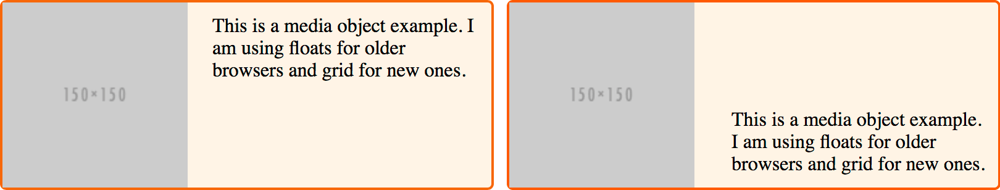
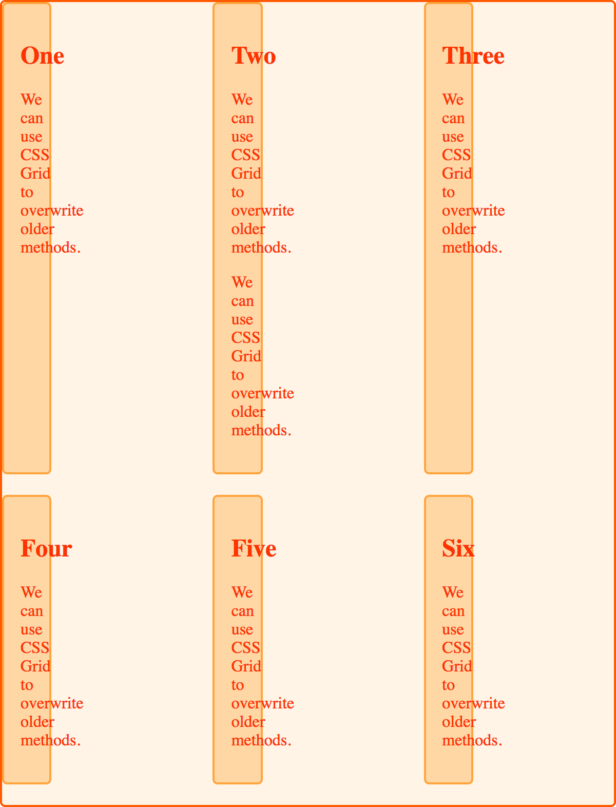

{{CSSRef}}

In Spring of 2017, we saw for the first time a major specification like grid being shipped into browsers almost simultaneously, and we now have CSS grid layout support in the public versions of Firefox, Chrome, Opera, Safari and Edge. However, while evergreen browsers mean that many of us are going to see the majority of users having grid layout support very quickly, there are also old or non-supporting browsers to contend with. In this guide we will walk through a variety of strategies for support.

## The supporting browsers

CSS grid layout is unprefixed in all modern browsers. Support for all the properties and values detailed in these guides is interoperable across browsers. This means that if you write some grid layout code in Firefox, it should work in the same way in Chrome. This is no longer an experimental specification, and you are safe to use it in production.

## Is it safe to use CSS grids for my layout?

Yes. As with any front-end technology choice, the decision to use CSS grid layout will come down to the browsers your site visitors are typically using.

## Starting to use grid in production

It is worth noting that you do not have to use grid in an _all or nothing_ way. Start by enhancing elements in your design with grid, that could otherwise display using an older method. Overwriting of legacy methods with grid layout works surprisingly well, due to the way grid interacts with these other methods.

### Floats

[Floats](/en-US/docs/Learn/CSS/CSS_layout/Floats) used to be used to create multiple column layouts. If you're supporting an old codebase with floated layouts, there will be no conflict. Grid items ignore the float property; the fact is that _a grid item takes precedence._ In the example below, I have a simple media object. If the {{cssxref("float")}} is not removed from legacy CSS, as the container is a grid container, it's OK. We can use the alignment properties that are implemented in CSS grids.

The {{cssxref("float")}} no longer applies, and I can use the CSS Box Alignment property {{cssxref("align-self")}} to align my content to the end of the container:

```css
* {
  box-sizing: border-box;
}
img {
  max-width: 100%;
  display: block;
}
.media {
  border: 2px solid #f76707;
  border-radius: 5px;
  background-color: #fff4e6;
  max-width: 400px;
  display: grid;
  grid-template-columns: 1fr 2fr;
  grid-template-areas: "img content";
  margin-bottom: 1em;
}
.media::after {
  content: "";
  display: block;
  clear: both;
}
.media .text {
  padding: 10px;
  align-self: end;
}

/* old code we can't remove */
.media .image {
  float: left;
  width: 150px;
  margin-right: 20px;
}
```

```html
<div class="media">
  <div class="image">
    
  </div>
  <div class="text">
    This is a media object example. I am using floats for older browsers and
    grid for new ones.
  </div>
</div>
```

{{ EmbedLiveSample('Floats', '500', '200') }}

The image below shows the media object in a non-supporting browser on the left, and a supporting one on the right:



### Using feature queries

The above example is very simple, and we can get away without needing to write code that would be a problem to browsers that do not support grid, and legacy code is not an issue to our grid supporting browsers. However, things are not always so simple.

#### A more complex example

In this next example, I have a set of floated cards. I have given the cards a {{cssxref("width")}}, in order to {{cssxref("float")}} them. To create gaps between the cards, I use a {{cssxref("margin")}} on the items, and then a negative margin on the container:

```css hidden
* {
  box-sizing: border-box;
}

.wrapper {
  border: 2px solid #f76707;
  border-radius: 5px;
  background-color: #fff4e6;
  max-width: 600px;
  margin: 0 auto;
}
.wrapper li {
  border: 2px solid #ffa94d;
  border-radius: 5px;
  background-color: #ffd8a8;
  padding: 1em;
  color: #d9480f;
}
```

```css
.wrapper ul {
  overflow: hidden;
  margin: 0 -10px;
  padding: 0;
  list-style: none;
}
.wrapper li {
  float: left;
  width: calc(33.333333% - 20px);
  margin: 0 10px 20px 10px;
}
```

```html
<div class="wrapper">
  <ul>
    <li class="card">
      <h2>One</h2>
      <p>We can use CSS grid to overwrite older methods.</p>
    </li>
    <li class="card">
      <h2>Two</h2>
      <p>We can use CSS grid to overwrite older methods.</p>
    </li>
    <li class="card">
      <h2>Three</h2>
      <p>We can use CSS grid to overwrite older methods.</p>
    </li>
    <li class="card">
      <h2>Four</h2>
      <p>We can use CSS grid to overwrite older methods.</p>
    </li>
    <li class="card">
      <h2>Five</h2>
      <p>We can use CSS grid to overwrite older methods.</p>
    </li>
    <li class="card">
      <h2>Six</h2>
      <p>We can use CSS grid to overwrite older methods.</p>
    </li>
  </ul>
</div>
```

{{ EmbedLiveSample('A_more_complex_example', '550', '450') }}

The example demonstrates the typical problem that we have with floated layouts: if additional content is added to any one card, the layout breaks.


As a concession for older browsers, I have set a {{cssxref("min-height")}} on the items, and hope that my content editors won't add too much content and make a mess of the layout!

I then enhance the layout using grid. I can turn my {{HTMLElement("ul")}} into a grid container with three column tracks. However, the width I have assigned to the list items themselves still applies, and it now makes those items a third of the width of the track:



If I reset the width to `auto`, then this will stop the float behavior happening for older browsers. I need to be able to define the width for older browsers, and remove the width for grid supporting browsers. Thanks to [CSS Feature Queries](/en-US/docs/Web/CSS/@supports) I can do this, right in my CSS.

#### A solution using feature queries

_Feature queries_ will look very familiar if you have ever used a [media query](/en-US/docs/Web/CSS/CSS_media_queries) to create a responsive layout. Rather than checking a {{glossary("viewport")}} width, or some feature of the browser or device, we check for support of a CSS property and value pair using an {{cssxref("@supports")}} rule. Inside the feature query, we can then write any CSS we need to apply our modern layout, and remove anything required for the older layout.

```css
@supports (display: grid) {
  .wrapper {
    /* do anything for grid supporting browsers here. */
  }
}
```

Feature queries have excellent browser support, and all of the browsers that support the updated grid specification support feature queries too. You can use them to deal with the issue we have with our enhanced: floated layout.

I use an `@supports` rule to check for support of `display: grid`. I then do my grid code on the {{HTMLElement("ul")}}, set my width and {{cssxref("min-height")}} on the {{HTMLElement("li")}} to `auto`. I also remove the margins and negative margins, and replace the spacing with the {{cssxref("gap")}} property. This means I don't get a final margin on the last row of boxes. The layout now works, even if there is more content in one of the cards, than the others:

```css hidden
* {
  box-sizing: border-box;
}

.wrapper {
  border: 2px solid #f76707;
  border-radius: 5px;
  background-color: #fff4e6;
  max-width: 600px;
  margin: 0 auto;
}
.wrapper li {
  border: 2px solid #ffa94d;
  border-radius: 5px;
  background-color: #ffd8a8;
  padding: 1em;
  color: #d9480f;
}
```

```css
.wrapper ul {
  overflow: hidden;
  margin: 0 -10px;
  padding: 0;
  list-style: none;
}
.wrapper li {
  float: left;
  width: calc(33.333333% - 20px);
  margin: 0 10px 20px 10px;
}
@supports (display: grid) {
  .wrapper ul {
    display: grid;
    grid-template-columns: repeat(3, 1fr);
    gap: 20px;
    margin: 0;
  }
  .wrapper li {
    width: auto;
    min-height: auto;
    margin: 0;
  }
}
```

```html
<div class="wrapper">
  <ul>
    <li class="card">
      <h2>One</h2>
      <p>We can use CSS grid to overwrite older methods.</p>
    </li>
    <li class="card">
      <h2>Two</h2>
      <p>We can use CSS grid to overwrite older methods.</p>
      <p>We can use CSS grid to overwrite older methods.</p>
    </li>
    <li class="card">
      <h2>Three</h2>
      <p>We can use CSS grid to overwrite older methods.</p>
    </li>
    <li class="card">
      <h2>Four</h2>
      <p>We can use CSS grid to overwrite older methods.</p>
    </li>
    <li class="card">
      <h2>Five</h2>
      <p>We can use CSS grid to overwrite older methods.</p>
    </li>
    <li class="card">
      <h2>Six</h2>
      <p>We can use CSS grid to overwrite older methods.</p>
    </li>
  </ul>
</div>
```

{{ EmbedLiveSample('A_solution_using_feature_queries', '550', '480') }}

## Overwriting other values of `display`

Due to the problems of creating grids of items using floats, many of us would use a different method to the floated method shown above to lay out a set of cards. Using `display: inline-block` is an alternate method.

Once again I can use feature queries to overwrite a layout that uses `display: inline-block`, and again I don't need to overwrite everything. An item that is set to `inline-block` becomes a grid item, and so the behavior of `inline-block` no longer applies. I have used the {{cssxref("vertical-align")}} property on my item when in the `inline-block` display mode, but this property does not apply to grid items and, therefore, is ignored once the item becomes a grid item:

```css hidden
* {
  box-sizing: border-box;
}

.wrapper {
  border: 2px solid #f76707;
  border-radius: 5px;
  background-color: #fff4e6;
  max-width: 600px;
  margin: 0 auto;
}

.wrapper li {
  border: 2px solid #ffa94d;
  border-radius: 5px;
  background-color: #ffd8a8;
  padding: 1em;
  color: #d9480f;
}
```

```css
.wrapper ul {
  margin: 0 -10px;
  padding: 0;
  list-style: none;
}

.wrapper li {
  display: inline-block;
  vertical-align: top;
  width: calc(33.333333% - 20px);
  margin: 0 10px 20px 10px;
}
@supports (display: grid) {
  .wrapper ul {
    display: grid;
    grid-template-columns: repeat(3, 1fr);
    gap: 20px;
    margin: 0;
  }
  .wrapper li {
    width: auto;
    margin: 0;
  }
}
```

```html
<div class="wrapper">
  <ul>
    <li class="card">
      <h2>One</h2>
      <p>We can use CSS grid to overwrite older methods.</p>
    </li>
    <li class="card">
      <h2>Two</h2>
      <p>We can use CSS grid to overwrite older methods.</p>
      <p>We can use CSS grid to overwrite older methods.</p>
    </li>
    <li class="card">
      <h2>Three</h2>
      <p>We can use CSS grid to overwrite older methods.</p>
    </li>
    <li class="card">
      <h2>Four</h2>
      <p>We can use CSS grid to overwrite older methods.</p>
    </li>
    <li class="card">
      <h2>Five</h2>
      <p>We can use CSS grid to overwrite older methods.</p>
    </li>
    <li class="card">
      <h2>Six</h2>
      <p>We can use CSS grid to overwrite older methods.</p>
    </li>
  </ul>
</div>
```

{{ EmbedLiveSample('Overwriting_other_values_of_display', '500', '480') }}

Once again it is the width on the item we need to address, and then any other properties we want to enhance. In this example I have again used `gap`, rather than margins and negative margins to create my gutters.

## How does the specification define these overrides?

The CSS grid layout specification details why we can overwrite the behavior of certain properties when something becomes a grid item. The key sections of the specification are:

- [Establishing grid containers](https://drafts.csswg.org/css-grid/#grid-containers)
- [Grid items](https://drafts.csswg.org/css-grid/#grid-items)
- [Grid item display](https://drafts.csswg.org/css-grid/#grid-item-display)

As this behavior is detailed in the specification, you are safe to rely on using these overrides in your support for older browsers. Nothing described here should be seen as a "hack". Rather, we are taking advantage of the fact that the grid specification details the interaction between different layout methods.

### Other values of display

When an element has a parent set to `display: grid` it is _blockified_, as defined in the [CSS display specification](https://drafts.csswg.org/css-display-3/#blockify). In the case of our item set to `inline-block`, this is why `display: inline-block` no longer applied.

If you are using `display: table` for your legacy layout, an item set to `display: table-cell` generates anonymous boxes. Therefore, if you use `display: table-cell` without any parent element set to `display-table`, an anonymous table wrapper is created around any adjacent cells, just as if you had wrapped them in a div or other element set to `display: table`. If you have an item set to `display: table-cell`, and then in a feature query change the parent to `display: grid`, this anonymous box creation will not happen. This means you can overwrite `display: table` based layouts, without having additional anonymous boxes.

### Floated elements

As we have already seen, {{cssxref("float")}} and also {{cssxref("clear")}} have no effect on a grid item. Therefore you do not need to explicitly set items to `float: none`.

### Vertical alignment

The alignment property {{cssxref("vertical-align")}} has no effect on a grid item. In layouts using `display: inline-block` or `display: table`, you might use the vertical-align property to perform basic alignment. In your grid layout you then have the far more powerful box alignment properties.

### Multiple-column layout

You can also use multiple column layout as your legacy browser plan, as the `column-*` properties do not apply when applied to a grid container.
