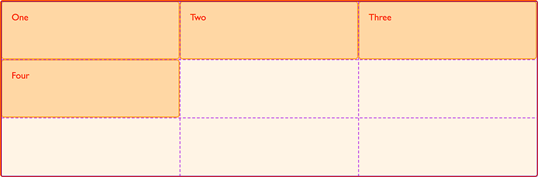

{{CSSRef}}

In the [article covering the basic concepts of grid layout](/en-US/docs/Web/CSS/CSS_grid_layout/Basic_concepts_of_grid_layout), we started to look at how to position items on a grid using line numbers. In this article, we will fully explore how this fundamental feature of the specification works.

Starting your exploration of grid with numbered lines is the most logical place to begin because when you use grid layout, you always have numbered lines. The lines are numbered for columns and rows, and are indexed from 1. Note that grid is indexed according to the writing mode of the document. In a left to right language such as English line 1 is on the left-hand side of the grid. If you are working in a right-to-left language such as Arabic then line 1 will be the far right of the grid. We will learn more about the interaction between writing modes and grids in a later guide.

## A basic example

As a very simple example we can take a grid with 3 column tracks and 3 row tracks. This gives us 4 lines in each dimension.

Inside our grid container, we have four child elements. If we do not place these on to the grid in any way they will lay out according to the auto-placement rules, one item in each of the first four cells. If you use the [Firefox grid highlighter](https://firefox-source-docs.mozilla.org/devtools-user/page_inspector/how_to/examine_grid_layouts/index.html) you can see how the grid has defined columns and rows.



```css hidden
* {
  box-sizing: border-box;
}

.wrapper {
  border: 2px solid #f76707;
  border-radius: 5px;
  background-color: #fff4e6;
}

.wrapper > div {
  border: 2px solid #ffa94d;
  border-radius: 5px;
  background-color: #ffd8a8;
  padding: 1em;
  color: #d9480f;
}
```

```css
.wrapper {
  display: grid;
  grid-template-columns: repeat(3, 1fr);
  grid-template-rows: repeat(3, 100px);
}
```

```html
<div class="wrapper">
  <div class="box1">One</div>
  <div class="box2">Two</div>
  <div class="box3">Three</div>
  <div class="box4">Four</div>
</div>
```

{{ EmbedLiveSample('A_basic_example', '300', '330') }}

## Positioning items by line number

We can use line-based placement to control where these items sit on the grid. We would like the first item to start on the far left of the grid and span a single column track. It should also start on the first row line, at the top of the grid and span to the fourth row line.

```css
.box1 {
  grid-column-start: 1;
  grid-column-end: 2;
  grid-row-start: 1;
  grid-row-end: 4;
}
```

As you position some items, other items on the grid will continue to be laid out using the auto-placement rules. We will take a proper look at how these work in a later guide but you can see as you work that grid is laying out un-placed items into empty cells of the grid.

Addressing each item individually we can place all four items spanning row and column tracks. Note that we can leave cells empty if we wish. One of the very nice things about grid layout is the ability to have white space in our designs without having to push things around using margins to prevent floats from rising up into the space we have left.

```css hidden
* {
  box-sizing: border-box;
}

.wrapper {
  border: 2px solid #f76707;
  border-radius: 5px;
  background-color: #fff4e6;
  display: grid;
  grid-template-columns: repeat(3, 1fr);
  grid-template-rows: repeat(3, 100px);
}

.wrapper > div {
  border: 2px solid #ffa94d;
  border-radius: 5px;
  background-color: #ffd8a8;
  padding: 1em;
  color: #d9480f;
}
```

```html
<div class="wrapper">
  <div class="box1">One</div>
  <div class="box2">Two</div>
  <div class="box3">Three</div>
  <div class="box4">Four</div>
</div>
```

```css
.box1 {
  grid-column-start: 1;
  grid-column-end: 2;
  grid-row-start: 1;
  grid-row-end: 4;
}
.box2 {
  grid-column-start: 3;
  grid-column-end: 4;
  grid-row-start: 1;
  grid-row-end: 3;
}
.box3 {
  grid-column-start: 2;
  grid-column-end: 3;
  grid-row-start: 1;
  grid-row-end: 2;
}
.box4 {
  grid-column-start: 2;
  grid-column-end: 4;
  grid-row-start: 3;
  grid-row-end: 4;
}
```

{{ EmbedLiveSample('Positioning_items_by_line_number', '300', '330') }}

## The `grid-column` and `grid-row` shorthands

We have quite a lot of code here to position each item. It should come as no surprise to know there is a [shorthand](/en-US/docs/Web/CSS/Shorthand_properties). The {{cssxref("grid-column-start")}} and {{cssxref("grid-column-end")}} properties can be combined into {{cssxref("grid-column")}}, {{cssxref("grid-row-start")}} and {{cssxref("grid-row-end")}} into {{cssxref("grid-row")}}.

```css hidden
* {
  box-sizing: border-box;
}

.wrapper {
  border: 2px solid #f76707;
  border-radius: 5px;
  background-color: #fff4e6;
  display: grid;
  grid-template-columns: repeat(3, 1fr);
  grid-template-rows: repeat(3, 100px);
}

.wrapper > div {
  border: 2px solid #ffa94d;
  border-radius: 5px;
  background-color: #ffd8a8;
  padding: 1em;
  color: #d9480f;
}
```

```html
<div class="wrapper">
  <div class="box1">One</div>
  <div class="box2">Two</div>
  <div class="box3">Three</div>
  <div class="box4">Four</div>
</div>
```

```css
.box1 {
  grid-column: 1 / 2;
  grid-row: 1 / 4;
}
.box2 {
  grid-column: 3 / 4;
  grid-row: 1 / 3;
}
.box3 {
  grid-column: 2 / 3;
  grid-row: 1 / 2;
}
.box4 {
  grid-column: 2 / 4;
  grid-row: 3 / 4;
}
```

{{ EmbedLiveSample('The_grid-column_and_grid-row_shorthands', '300', '330') }}

## Default spans

In the above examples, we specified every end row and column line, in order to demonstrate the properties, however in practice if an item only spans one track you can omit the `grid-column-end` or `grid-row-end` value. Grid defaults to spanning one track.

### Default spans with longhand placement

This means that our initial, long-hand, example would look like this:

```css hidden
* {
  box-sizing: border-box;
}

.wrapper {
  border: 2px solid #f76707;
  border-radius: 5px;
  background-color: #fff4e6;
  display: grid;
  grid-template-columns: repeat(3, 1fr);
  grid-template-rows: repeat(3, 100px);
}

.wrapper > div {
  border: 2px solid #ffa94d;
  border-radius: 5px;
  background-color: #ffd8a8;
  padding: 1em;
  color: #d9480f;
}
```

```html
<div class="wrapper">
  <div class="box1">One</div>
  <div class="box2">Two</div>
  <div class="box3">Three</div>
  <div class="box4">Four</div>
</div>
```

```css
.box1 {
  grid-column-start: 1;
  grid-row-start: 1;
  grid-row-end: 4;
}
.box2 {
  grid-column-start: 3;
  grid-row-start: 1;
  grid-row-end: 3;
}
.box3 {
  grid-column-start: 2;
  grid-row-start: 1;
}
.box4 {
  grid-column-start: 2;
  grid-column-end: 4;
  grid-row-start: 3;
}
```

{{ EmbedLiveSample('Default_spans_with_longhand_placement', '300', '330') }}

### Default spans with shorthand placement

Our shorthand would look like the following code, with no forward slash and second value for the items spanning one track only.

```css hidden
* {
  box-sizing: border-box;
}

.wrapper {
  border: 2px solid #f76707;
  border-radius: 5px;
  background-color: #fff4e6;
  display: grid;
  grid-template-columns: repeat(3, 1fr);
  grid-template-rows: repeat(3, 100px);
}

.wrapper > div {
  border: 2px solid #ffa94d;
  border-radius: 5px;
  background-color: #ffd8a8;
  padding: 1em;
  color: #d9480f;
}
```

```html
<div class="wrapper">
  <div class="box1">One</div>
  <div class="box2">Two</div>
  <div class="box3">Three</div>
  <div class="box4">Four</div>
</div>
```

```css
.box1 {
  grid-column: 1;
  grid-row: 1 / 4;
}
.box2 {
  grid-column: 3;
  grid-row: 1 / 3;
}
.box3 {
  grid-column: 2;
  grid-row: 1;
}
.box4 {
  grid-column: 2 / 4;
  grid-row: 3;
}
```

{{ EmbedLiveSample('Default_spans_with_shorthand_placement', '300', '330') }}

## The `grid-area` property

We can take things a step further and define each area with a single property – {{cssxref("grid-area")}}. The order of the values for grid-area are as follows.

- grid-row-start
- grid-column-start
- grid-row-end
- grid-column-end

```css hidden
* {
  box-sizing: border-box;
}

.wrapper {
  border: 2px solid #f76707;
  border-radius: 5px;
  background-color: #fff4e6;
  display: grid;
  grid-template-columns: repeat(3, 1fr);
  grid-template-rows: repeat(3, 100px);
}

.wrapper > div {
  border: 2px solid #ffa94d;
  border-radius: 5px;
  background-color: #ffd8a8;
  padding: 1em;
  color: #d9480f;
}
```

```html
<div class="wrapper">
  <div class="box1">One</div>
  <div class="box2">Two</div>
  <div class="box3">Three</div>
  <div class="box4">Four</div>
</div>
```

```css
.box1 {
  grid-area: 1 / 1 / 4 / 2;
}
.box2 {
  grid-area: 1 / 3 / 3 / 4;
}
.box3 {
  grid-area: 1 / 2 / 2 / 3;
}
.box4 {
  grid-area: 3 / 2 / 4 / 4;
}
```

{{ EmbedLiveSample('The_grid-area_property', '300', '330') }}

This order of values for `grid-area` can seem a little strange, it is the opposite of the direction in which we specify margins and padding as a shorthand for example. It may help to realize that this is due to grid using the flow-relative directions defined in the CSS Writing Modes specification. We will explore how grids work with writing modes in a later article however we have the concept of four flow-relative directions:

- block-start
- block-end
- inline-start
- inline-end

We are working in English, a left-to-right language. Our block-start is the top row line of the grid container, block-end is the final row line of the container. Our inline-start is the left-hand column line as inline-start is always the point from which text would be written in the current writing mode, inline-end is the final column line of our grid.

When we specify our grid area using the `grid-area` property we first define both start lines `block-start` and `inline-start`, then both end lines `block-end` and `inline-end`. This seems unusual at first as we are used to the physical properties of top, right, bottom and left but makes more sense if you start to think of websites as being multi-directional in writing mode.

## Counting backwards

We can also count backwards from the block and inline end of the grid, for English that would be the right-hand column line and final row line. These lines can be addressed as `-1`, and you can count back from there – so the second last line is `-2`. It is worth noting that the final line is the final line of the _explicit grid_, the grid defined by `grid-template-columns` and `grid-template-rows`, and does not take into account any rows or columns added in the _implicit grid_ outside of that.

In this next example, we have flipped the layout we were working with by working from the right and bottom of our grid when placing the items.

```css hidden
* {
  box-sizing: border-box;
}

.wrapper {
  border: 2px solid #f76707;
  border-radius: 5px;
  background-color: #fff4e6;
  display: grid;
  grid-template-columns: repeat(3, 1fr);
  grid-template-rows: repeat(3, 100px);
}

.wrapper > div {
  border: 2px solid #ffa94d;
  border-radius: 5px;
  background-color: #ffd8a8;
  padding: 1em;
  color: #d9480f;
}
```

```html
<div class="wrapper">
  <div class="box1">One</div>
  <div class="box2">Two</div>
  <div class="box3">Three</div>
  <div class="box4">Four</div>
</div>
```

```css
.box1 {
  grid-column-start: -1;
  grid-column-end: -2;
  grid-row-start: -1;
  grid-row-end: -4;
}
.box2 {
  grid-column-start: -3;
  grid-column-end: -4;
  grid-row-start: -1;
  grid-row-end: -3;
}
.box3 {
  grid-column-start: -2;
  grid-column-end: -3;
  grid-row-start: -1;
  grid-row-end: -2;
}
.box4 {
  grid-column-start: -2;
  grid-column-end: -4;
  grid-row-start: -3;
  grid-row-end: -4;
}
```

{{ EmbedLiveSample('Counting_backwards', '300', '330') }}

### Stretching an item across the grid

Being able to address the start and end lines of the grid is useful as you can then stretch an item right across the grid with:

```css
.item {
  grid-column: 1 / -1;
}
```

## Gutters or Alleys

The CSS grid specification includes the ability to add gutters between column and row tracks with the {{cssxref("column-gap")}} and {{cssxref("row-gap")}} properties. These specify a gap that acts much like the {{cssxref("column-gap")}} property in multi-column layout.

> **Note:** When grid first shipped in browsers the {{cssxref("column-gap")}}, {{cssxref("row-gap")}} and {{cssxref("gap")}} properties were prefixed with the `grid-` prefix as `grid-column-gap`, `grid-row-gap` and `grid-gap` respectively.
>
> Browsers are updating their rendering engines to remove this prefix, however the prefixed versions will be maintained as aliases, making them safe to use.

Gaps only appear between tracks of the grid, they do not add space to the top and bottom, left or right of the container. We can add gaps to our earlier example by using these properties on the grid container.

```css hidden
* {
  box-sizing: border-box;
}

.wrapper {
  border: 2px solid #f76707;
  border-radius: 5px;
  background-color: #fff4e6;
  display: grid;
  grid-template-columns: repeat(3, 1fr);
  grid-template-rows: repeat(3, 100px);
}

.wrapper > div {
  border: 2px solid #ffa94d;
  border-radius: 5px;
  background-color: #ffd8a8;
  padding: 1em;
  color: #d9480f;
}
```

```html
<div class="wrapper">
  <div class="box1">One</div>
  <div class="box2">Two</div>
  <div class="box3">Three</div>
  <div class="box4">Four</div>
</div>
```

```css
.box1 {
  grid-column: 1;
  grid-row: 1 / 4;
}
.box2 {
  grid-column: 3;
  grid-row: 1 / 3;
}
.box3 {
  grid-column: 2;
  grid-row: 1;
}
.box4 {
  grid-column: 2 / 4;
  grid-row: 3;
}
.wrapper {
  display: grid;
  grid-template-columns: repeat(3, 1fr);
  grid-template-rows: repeat(3, 100px);
  column-gap: 20px;
  row-gap: 1em;
}
```

{{ EmbedLiveSample('Gutters_or_Alleys', '300', '350') }}

### The gap shorthand

The two properties can also be expressed as a shorthand, {{cssxref("gap")}}. If you only give one value for `gap` it will apply to both column and row gaps. If you specify two values, the first is used for `row-gap` and the second for `column-gap`.

```css
.wrapper {
  display: grid;
  grid-template-columns: repeat(3, 1fr);
  grid-template-rows: repeat(3, 100px);
  gap: 1em 20px;
}
```

In terms of line-based positioning of items, the gap acts as if the line has gained extra width. Anything starting at that line starts after the gap and you cannot address the gap or place anything into it. If you want gutters that act more like regular tracks you can of course define a track for the purpose instead.

## Using the `span` keyword

In addition to specifying the start and end lines by number, you can specify a start line and then the number of tracks you would like the area to span.

```css hidden
* {
  box-sizing: border-box;
}

.wrapper {
  border: 2px solid #f76707;
  border-radius: 5px;
  background-color: #fff4e6;
  display: grid;
  grid-template-columns: repeat(3, 1fr);
  grid-template-rows: repeat(3, 100px);
}

.wrapper > div {
  border: 2px solid #ffa94d;
  border-radius: 5px;
  background-color: #ffd8a8;
  padding: 1em;
  color: #d9480f;
}
```

```html
<div class="wrapper">
  <div class="box1">One</div>
  <div class="box2">Two</div>
  <div class="box3">Three</div>
  <div class="box4">Four</div>
</div>
```

```css
.box1 {
  grid-column: 1;
  grid-row: 1 / span 3;
}
.box2 {
  grid-column: 3;
  grid-row: 1 / span 2;
}
.box3 {
  grid-column: 2;
  grid-row: 1;
}
.box4 {
  grid-column: 2 / span 2;
  grid-row: 3;
}
```

{{ EmbedLiveSample('Using_the_span_keyword', '300', '330') }}

You can also use the `span` keyword in the value of `grid-row-start`/`grid-row-end` and `grid-column-start/grid-column-end`. The following two examples will create the same grid area. In the first we set the start row line, then the end line we specify that we want the area to cover 3 tracks. The area will start at line 1 and end 3 lines from line 1; that is, the area will end at line 4.

```css
.box1 {
  grid-column-start: 1;
  grid-row-start: 1;
  grid-row-end: span 3;
}
```

In the second example, we specify the end row line we want the item to finish at and then set the start line as `span 3`. This means the item will need to span upwards from the specified row line. The area will start at line 4 and span 3 lines to line 1.

```css
.box1 {
  grid-column-start: 1;
  grid-row-start: span 3;
  grid-row-end: 4;
}
```

To become familiar with line based positioning in grid try to build a few common layouts by placing items onto grids with varying numbers of columns. Remember that if you do not place all of the items, any leftover items will be placed according to auto-placement rules. This may result in the layout you want, but if something is appearing somewhere unexpected, check that you have set a position for it.

Also, remember that items on the grid can overlap each other when you place them explicitly like this. That can create some nice effects, however you can also end up with things overlapping incorrectly if you specify the wrong start or end line. The [Firefox grid highlighter](https://firefox-source-docs.mozilla.org/devtools-user/page_inspector/how_to/examine_grid_layouts/index.html) can be very useful as you learn, especially if your grid is quite complicated.
