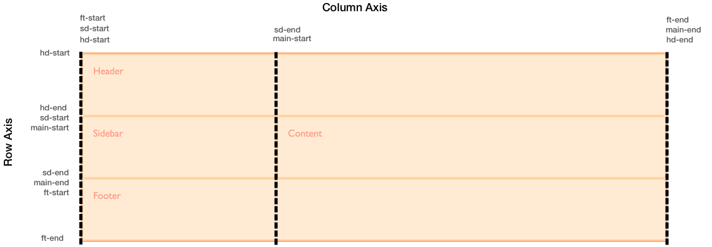
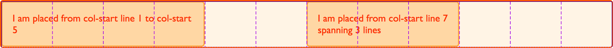
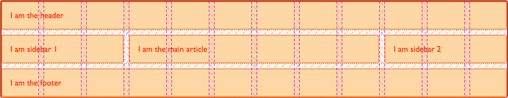

{{CSSRef}}

In previous guides, we've looked at placing items on the lines created by [defining grid tracks](/en-US/docs/Web/CSS/CSS_grid_layout/Grid_layout_using_line-based_placement) and also how to place items [using named template areas](/en-US/docs/Web/CSS/CSS_grid_layout/Grid_template_areas). In this guide, we look at how these two things work together when we use named lines.

Line naming is incredibly useful, but some of the more confusing grid syntax comes from this combination of names and track sizes. Once you work through some examples, it should become clearer and easier to work with.

## Naming lines when defining a grid

You can assign some or all of the lines in your grid a name when you define your grid with the {{cssxref("grid-template-rows")}} and {{cssxref("grid-template-columns")}} properties. To demonstrate, we'll use the basic layout created in the guide on [line-based placement](/en-US/docs/Web/CSS/CSS_grid_layout/Grid_layout_using_line-based_placement). This time, we'll create the grid using named lines.

```css hidden
* {
  box-sizing: border-box;
}

.wrapper {
  border: 2px solid #f76707;
  border-radius: 5px;
  background-color: #fff4e6;
}

.wrapper > div {
  border: 2px solid #ffa94d;
  border-radius: 5px;
  background-color: #ffd8a8;
  padding: 1em;
  color: #d9480f;
}
```

When defining the grid, we name our lines inside square brackets (`[]`). Those names can be anything you like. We define a name for the start and end of the container, both for rows and columns. In this case, the grid center block's start rows and columns are both named `content-start`, and its end rows and columns are both named `content-end`.

```css
.wrapper {
  display: grid;
  grid-template-columns: [main-start] 1fr [content-start] 1fr [content-end] 1fr [main-end];
  grid-template-rows: [main-start] 100px [content-start] 100px [content-end] 100px [main-end];
}
```

We don't need to name all of the lines in our grids; you may choose to name just the key lines of your layout.

Once the lines have names, we can use the name we defined, rather than the line number, to place the grid items.

```css
.box1 {
  grid-column-start: main-start;
  grid-row-start: main-start;
  grid-row-end: main-end;
}

.box2 {
  grid-column-start: content-end;
  grid-row-start: main-start;
  grid-row-end: content-end;
}

.box3 {
  grid-column-start: content-start;
  grid-row-start: main-start;
}

.box4 {
  grid-column-start: content-start;
  grid-column-end: main-end;
  grid-row-start: content-end;
}
```

```html
<div class="wrapper">
  <div class="box1">One</div>
  <div class="box2">Two</div>
  <div class="box3">Three</div>
  <div class="box4">Four</div>
</div>
```

{{ EmbedLiveSample('Naming_lines_when_defining_a_grid', '500', '330') }}

Everything else about line-based placement still works in the same way. In our grid layout, we provided each numeric line with an alias name. In our grid items, we reference a name rather than a number. Naming lines in this way is useful — when creating a responsive design, we can update the container's grid properties rather than updating the grid items within each [media query](/en-US/docs/Web/CSS/CSS_media_queries/Using_media_queries).

### Giving lines multiple names

You may want to give a line more than one name, perhaps it denotes the sidebar-end and the main-start for example. To do this add the names inside the square brackets with whitespace between them `[sidebar-end main-start]`. You can then refer to that line by either of the names.

## Implicit grid areas from named lines

When naming the lines, we mentioned that you can name these anything you like. The name is a {{cssxref("custom-ident")}}, an author-defined name. When choosing the name you need to avoid words that might appear in the specification and be confusing - such as `span`. Idents are not quoted.

While you can choose any name, if you append `-start` and `-end` to the lines around an area, as we have in the example above, grid will create a named area of the main name used. Taking the above example, we have `content-start` and `content-end` both for rows and for columns. This means we get a grid area named `content`, and could place something in that area should we wish to.

```css hidden
* {
  box-sizing: border-box;
}

.wrapper {
  border: 2px solid #f76707;
  border-radius: 5px;
  background-color: #fff4e6;
}

.wrapper > div {
  border: 2px solid #ffa94d;
  border-radius: 5px;
  background-color: #ffd8a8;
  padding: 1em;
  color: #d9480f;
}
```

We use the same grid definitions as above, placing a single item into the named area `content`.

```css
.wrapper {
  display: grid;
  grid-template-columns: [main-start] 1fr [content-start] 1fr [content-end] 1fr [main-end];
  grid-template-rows: [main-start] 100px [content-start] 100px [content-end] 100px [main-end];
}
.thing {
  grid-area: content;
}
```

```html
<div class="wrapper">
  <div class="thing">I am placed in an area named content.</div>
</div>
```

{{ EmbedLiveSample('Implicit_grid_areas_from_named_lines', '500', '330') }}

We don't need to define where our areas are with {{cssxref("grid-template-areas")}} as our named lines have created an area for us.

## Implicit grid lines from named areas

We have seen how named lines create a named area, and this also works in reverse. Named template areas create named lines that you can use to place your items. If we take the layout created in the guide to [grid template areas](/en-US/docs/Web/CSS/CSS_grid_layout/Grid_template_areas), we can use the lines created by our areas to see how this works.

In this example, we have added an extra `<div>` with a class of `overlay`. We have named areas created using the {{cssxref("grid-area")}} property, then a layout created in `grid-template-areas`. The area names are:

- `hd`
- `ft`
- `main`
- `sd`

This gives us column and row lines:

- `hd-start`
- `hd-end`
- `sd-start`
- `sd-end`
- `main-start`
- `main-end`
- `ft-start`
- `ft-end`

You can see the named lines in the image. Note that some lines have two names - for example, `sd-end` and `main-start` refer to the same column line.



Positioning `overlay` using these implicit named lines is the same as positioning an item using named lines.

```css hidden
* {
  box-sizing: border-box;
}

.wrapper {
  border: 2px solid #f76707;
  border-radius: 5px;
  background-color: #fff4e6;
}

.wrapper > div {
  border: 2px solid #ffa94d;
  border-radius: 5px;
  background-color: #ffd8a8;
  padding: 1em;
  color: #d9480f;
}
```

```css
.wrapper {
  display: grid;
  grid-template-columns: repeat(9, 1fr);
  grid-auto-rows: minmax(100px, auto);
  grid-template-areas:
    "hd hd hd hd   hd   hd   hd   hd   hd"
    "sd sd sd main main main main main main"
    "ft ft ft ft   ft   ft   ft   ft   ft";
}

.header {
  grid-area: hd;
}

.footer {
  grid-area: ft;
}

.content {
  grid-area: main;
}

.sidebar {
  grid-area: sd;
}

.wrapper > div.overlay {
  z-index: 10;
  grid-column: main-start / main-end;
  grid-row: hd-start / ft-end;
  border: 4px solid rgb(92 148 13);
  background-color: rgb(92 148 13 / 40%);
  color: rgb(92 148 13);
  font-size: 150%;
}
```

```html
<div class="wrapper">
  <div class="header">Header</div>
  <div class="sidebar">Sidebar</div>
  <div class="content">Content</div>
  <div class="footer">Footer</div>
  <div class="overlay">Overlay</div>
</div>
```

{{ EmbedLiveSample('Implicit_Grid_lines_from_named_areas', '500', '330') }}

Given that we have this ability to position created lines from named areas and areas from named lines, it is worth taking a little bit of time to plan your naming strategy when starting out creating your grid layout. Selecting names that make sense to you and your team will make your layouts more intuitive.

## Multiple lines with the same name with repeat()

If you want to give all your grid lines a unique name, you need to define the track definition with long-hand properties rather than using the repeat syntax, as the names need to be added in square brackets when defining tracks. If you do use the repeat syntax, you will get multiple lines that have the same name, which can be useful or confusing, depending on your layout requirements.

### Twelve-column grid using repeat()

In this example, we create a grid with 12 equal-width columns. Before defining the `1fr` size of the column track, we define a line named `[col-start]`. This means we will have a grid with 12 column lines all named `col-start` before a `1fr` width column.

```css hidden
* {
  box-sizing: border-box;
}

.wrapper {
  border: 2px solid #f76707;
  border-radius: 5px;
  background-color: #fff4e6;
}

.wrapper > div {
  border: 2px solid #ffa94d;
  border-radius: 5px;
  background-color: #ffd8a8;
  padding: 1em;
  color: #d9480f;
}
```

```css
.wrapper {
  display: grid;
  grid-template-columns: repeat(12, [col-start] 1fr);
}
```

Once you have created the grid you can place items onto it. As we have multiple lines named `col-start` if you place an item to start after line `col-start`, the first line named `col-start` will be used. In our case, this is the far left line. To address another line, use the name with the number for that line.

To place an item spanning from the first line named `col-start` to the 5th line with that name, we can use:

```css
.item1to5 {
  grid-column: col-start / col-start 5;
}
```

You can also use the `span` keyword. This item will span 3 lines starting from the 7th line named `col-start`:

```css
.item7to9 {
  grid-column: col-start 7 / span 3;
}
```

```html
<div class="wrapper">
  <div class="item1to5">I am placed from col-start line 1 to col-start 5</div>
  <div class="item7to9">I am placed from col-start line 7 spanning 3 lines</div>
</div>
```

{{ EmbedLiveSample('Twelve-column_grid_using_repeat', '500', '120') }}

If you look at this layout in your browser's developer tools, you will see how the column lines are shown, and how our items are placed against these lines.



### Defining named lines with a track list

The `repeat()` syntax can also take a track list; it is not just single track sizes that can be repeated.

This CSS creates an eight track grid, with a narrower `1fr` width column named `col1-start` followed by a wider `3fr` column named `col2-start`.

```css
.wrapper {
  grid-template-columns: repeat(4, [col1-start] 1fr [col2-start] 3fr);
}
```

If your repeating syntax puts two lines next to each other then they will be merged and create the same result as giving a line multiple names in a non-repeating track definition. The following definition creates four `1fr` tracks, each with a start and end line.

```css
.wrapper {
  grid-template-columns: repeat(4, [col-start] 1fr [col-end]);
}
```

If we write this declaration without using repeat notation, it looks like this:

```css
.wrapper {
  grid-template-columns: [col-start] 1fr [col-end col-start] 1fr [col-end col-start] 1fr [col-end col-start] 1fr [col-end];
}
```

Using a track list, we can use the `span` keyword to span a number of lines, including lines of a certain name:

```css hidden
* {
  box-sizing: border-box;
}

.wrapper {
  border: 2px solid #f76707;
  border-radius: 5px;
  background-color: #fff4e6;
}

.wrapper > div {
  border: 2px solid #ffa94d;
  border-radius: 5px;
  background-color: #ffd8a8;
  padding: 1em;
  color: #d9480f;
}
```

```css
.wrapper {
  display: grid;
  grid-template-columns: repeat(6, [col1-start] 1fr [col2-start] 3fr);
}

.item1 {
  grid-column: col1-start / col2-start 2;
}

.item2 {
  grid-row: 2;
  grid-column: col1-start 2 / span 2 col1-start;
}
```

```html
<div class="wrapper">
  <div class="item1">
    I am placed from col1-start line 1 to col2-start line 2
  </div>
  <div class="item2">
    I am placed from col1-start line 2 spanning 2 lines named col1-start
  </div>
</div>
```

{{ EmbedLiveSample('Defining_named_lines_with_a_track_list', '500', '230') }}

### Twelve-column grid framework

Having learned about numeric and named line-based placement and [grid template areas](/en-US/docs/Web/CSS/CSS_grid_layout/Grid_template_areas), we now know there are several ways to place items using CSS grid layout. This may seem overly complex, but you don't need to use all of them. In practice, using named template areas works well for straightforward layouts as this method gives a good visual representation of what your layout looks like, and makes it more intuitive to move things around on the grid. For example, when working with a strict multiple-column layout, the named lines demonstration in the last part of this guide works well.

Legacy grid systems such as Foundation or Bootstrap are based on a 12-column grid. These frameworks import code to do calculations that ensure the columns add up to 100%. Frameworks aren't needed! The only CSS we need for a 12-column grid "framework" is:

```css
.wrapper {
  display: grid;
  gap: 10px;
  grid-template-columns: repeat(12, [col-start] 1fr);
}
```

We can then use this "framework" to lay out our page.

For example, to create a three-column layout with a header and footer, we can use the following markup.

```css hidden
* {
  box-sizing: border-box;
}

.wrapper {
  border: 2px solid #f76707;
  border-radius: 5px;
  background-color: #fff4e6;
}

.wrapper > * {
  border: 2px solid #ffa94d;
  border-radius: 5px;
  background-color: #ffd8a8;
  padding: 1em;
  color: #d9480f;
}
```

```html
<div class="wrapper">
  <header class="main-header">I am the header</header>
  <aside class="side1">I am sidebar 1</aside>
  <article class="content">I am the main article</article>
  <aside class="side2">I am sidebar 2</aside>
  <footer class="main-footer">I am the footer</footer>
</div>
```

We can place this on our grid layout framework:

```css
.main-header,
.main-footer {
  grid-column: col-start / span 12;
}

.side1 {
  grid-column: col-start / span 3;
  grid-row: 2;
}

.content {
  grid-column: col-start 4 / span 6;
  grid-row: 2;
}

.side2 {
  grid-column: col-start 10 / span 3;
  grid-row: 2;
}
```

{{ EmbedLiveSample('Twelve-column_grid_framework', '500', '220') }}

Once again, the developer tool's grid highlighter is helpful to show us how the grid we have placed our items on works.



That's all we need. We don't need to do any calculations! CSS grid layout automatically removed our 10-pixel gutter track before assigning the space to the `1fr` column tracks.

Up next, we will look at how CSS grid layout can position items for us without requiring placement properties at all, in the [auto-placement in grid layout](/en-US/docs/Web/CSS/CSS_grid_layout/Auto-placement_in_grid_layout) guide.
