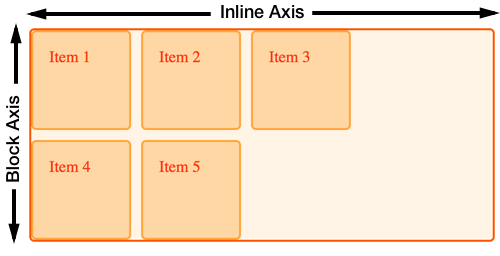

{{CSSRef}}

One of the important features of grid layout is the support for different writing modes that is built into the specification. In this guide, we look at this feature of grid and other modern layout methods, learning a little about writing modes and logical vs. physical properties as we do so.

## Logical and physical properties and values

CSS is full of **physical** positioning properties and keywords – `left` and `right`, `top` and `bottom`. In the code snippet below, we position an item using absolute positioning and use the physical {{glossary("inset properties")}} as offset values to push the item around, so the item is placed 20 pixels from the top, and 30 pixels from the left of the container:

```css
.container {
  position: relative;
}
.item {
  position: absolute;
  top: 20px;
  left: 30px;
}
```

```html
<div class="container">
  <div class="item">Item</div>
</div>
```

This example used the {{cssxref("left")}} and {{cssxref("right")}}; these are just two of the many **{{glossary("physical properties")}}** in CSS. We can also add margins, padding, and borders using these physical properties of {{cssxref("margin-left")}}, {{cssxref("padding-left")}}, and so on. You might also see physical keywords in use, such as when using `text-align: right` to align text to the right.

We call these keywords and properties _physical_ because they relate to the screen you are looking at. Left is always left, no matter what direction your text is running.

### Issues with physical properties

Physical properties can be an issue when developing a site that has to work in multiple languages, including languages that have text starting on the right rather than the left. Browsers are designed to correctly display content regardless of the language. Some CSS features can override browser defaults and cause content to be displayed less than optimally.

In this example, the {{cssxref("direction")}} has been set to {{glossary("rtl")}}, which switches the writing mode from the default for an English language document of `ltr`. We have two paragraphs. These should be going from right-to-left because of the direction set on an ancestor. The first paragraph has {{cssxref("text-align")}} set to `left`, so the first paragraph sticks to the left. The second goes from right to left.

```html hidden
<p class="left">
  I have my text set to <code>text-align: left</code> I will always align left
  even if the direction of the text in this document is rtl.
</p>

<p>I have no alignment set and use the direction set in the document.</p>
```

````css
body {
  direction: rtl;
}
.left {
  text-align: left;
}

```css hidden p {
  border: 2px solid #ffa94d;
  border-radius: 5px;
  background-color: #ffd8a8;
  padding: 1em;
  margin: 1em;
  color: #d9480f;
}
````

{{EmbedLiveSample("Issues with physical properties","",140)}}

This is a very basic demonstration of the problem that can arise when using physical values and properties in CSS. If we write CSS using physical properties and keywords, we tell the browser our assumption as to how the text is flowing, preventing the browser from handling alternative writing modes.

### Logical properties and values

\*\*{{glossary("Logical properties")}} and values do not make an assumption about text direction. This is why we use the keyword `start` in grid layout to align something to the start of the container. Working in English, `start` may be on the left, however it doesn't have to be. The word `start` infers no physical location, which enables right-to-left translations, such as Arabic, to start the content on the right.

## Block and Inline

When using logical rather than physical properties, we don't seeing the world as left to right, and top to bottom. We have a different reference point. This is where understanding the _block_ and _inline_ axes, introduced in the [grid alignment guide](/en-US/docs/Web/CSS/CSS_grid_layout/Box_alignment_in_grid_layout), becomes very useful. If you think about layout in terms of block and inline, the way things work in grid will make a lot of sense.



## CSS writing modes

The [CSS writing modes](/en-US/docs/Web/CSS/CSS_writing_modes) module details using different writing modes in CSS. These features are not just for the support of languages that have a different writing mode to English; they can also be used for creative purposes. The examples in this section make use of the {{cssxref("writing-mode")}} property to make changes to the writing mode applied to our grid to demonstrate how logical values work.

### `writing-mode`

Writing modes are more than just left to right and right to left text, and the `writing-mode` property helps us display text running in other directions. The {{cssxref("writing-mode")}} property can have values of:

- `horizontal-tb`
- `vertical-rl`
- `vertical-lr`
- `sideways-rl`
- `sideways-lr`

The value `horizontal-tb`, which stands for "horizontal, top to bottom", is the default for text on the web. It is the direction in which you are reading this guide. The other properties will change the way that text flows in our document, matching the different writing modes found around the world.

As an example, we have two paragraphs below. The first uses the default `horizontal-tb`, and the second uses `vertical-rl`. In these modes, text still runs left to right, however the direction of the text is vertical - inline text now runs down the page, from top to bottom.

```css hidden
.wrapper > p {
  border: 2px solid #ffa94d;
  border-radius: 5px;
  background-color: #ffd8a8;
  padding: 1em;
  margin: 1em;
  color: #d9480f;
  max-width: 300px;
}
```

```html
<div class="wrapper">
  <p style="writing-mode: horizontal-tb">
    I have writing mode set to the default <code>horizontal-tb</code>
  </p>
  <p style="writing-mode: vertical-rl">
    I have writing mode set to <code>vertical-rl</code>
  </p>
</div>
```

{{ EmbedLiveSample('writing-mode', '500', '420') }}

## Writing modes in grid layouts

Applying this to a grid layout example, we can see how changing the writing mode means changing our idea of where the block and inline axes are.

### Default writing mode

In this example, the grid has three columns and two row tracks. This means there are three tracks running down the block axis. In default writing mode, grid auto-places items starting at the top left, moving along to the right, filling up the three cells on the inline axis. It then moves to the next line, creating a new row track, and fills in more items:

```css hidden
* {
  box-sizing: border-box;
}

.wrapper {
  border: 2px solid #f76707;
  border-radius: 5px;
  background-color: #fff4e6;
}

.wrapper > div {
  border: 2px solid #ffa94d;
  border-radius: 5px;
  background-color: #ffd8a8;
  padding: 1em;
  color: #d9480f;
}
```

```css
.wrapper {
  display: grid;
  grid-template-columns: repeat(3, 100px);
  grid-template-rows: repeat(2, 100px);
  gap: 10px;
}
```

```html
<div class="wrapper">
  <div class="item1">Item 1</div>
  <div class="item2">Item 2</div>
  <div class="item3">Item 3</div>
  <div class="item4">Item 4</div>
  <div class="item5">Item 5</div>
</div>
```

{{ EmbedLiveSample('Default_writing_mode', '500', '230') }}

### Setting writing mode

If we add `writing-mode: vertical-lr` to the grid container in the previous example, we can see that the block and inline axes now run in a different direction. The block or _column_ axis now runs across the page from left to right, inline runs down the page, creating rows from top to bottom.

```css hidden
* {
  box-sizing: border-box;
}

.wrapper {
  border: 2px solid #f76707;
  border-radius: 5px;
  background-color: #fff4e6;
}

.wrapper > div {
  border: 2px solid #ffa94d;
  border-radius: 5px;
  background-color: #ffd8a8;
  padding: 1em;
  color: #d9480f;
}
.wrapper {
  display: grid;
  grid-template-columns: repeat(3, 100px);
  grid-template-rows: repeat(2, 100px);
  gap: 10px;
}
```

```css
.wrapper {
  writing-mode: vertical-lr;
}
```

```html hidden
<div class="wrapper">
  <div class="item1">Item 1</div>
  <div class="item2">Item 2</div>
  <div class="item3">Item 3</div>
  <div class="item4">Item 4</div>
  <div class="item5">Item 5</div>
</div>
```

{{ EmbedLiveSample('Setting_writing_mode', '500', '330') }}

## Logical values for alignment

With the block and inline axis able to change direction, the logical values for the alignment properties start to make more sense.

In this example, we use alignment (the {{cssxref("align-self")}} and {{cssxref("justify-self")}} properties) to align items inside a grid that is set to `writing-mode: vertical-lr`. The `start` and `end` properties work in exactly the same way that they do in the default writing mode, and remain logical in a way that using left and right, top and bottom to align items would not do. This occurs once we've flipped the grid onto the side, like this:

```css hidden
* {
  box-sizing: border-box;
}

.wrapper {
  border: 2px solid #f76707;
  border-radius: 5px;
  background-color: #fff4e6;
}

.wrapper > div {
  border: 2px solid #ffa94d;
  border-radius: 5px;
  background-color: #ffd8a8;
  padding: 1em;
  color: #d9480f;
}
```

```css
.wrapper {
  writing-mode: vertical-lr;
  display: grid;
  grid-template-columns: repeat(3, 1fr);
  grid-template-rows: repeat(3, 100px);
  gap: 10px;
}

.item1 {
  grid-column: 1 / 4;
  align-self: start;
}

.item2 {
  grid-column: 1 / 3;
  grid-row: 2 / 4;
  align-self: start;
}

.item3 {
  grid-column: 3;
  grid-row: 2 / 4;
  align-self: end;
  justify-self: end;
}
```

```html
<div class="wrapper">
  <div class="item1">Item 1</div>
  <div class="item2">Item 2</div>
  <div class="item3">Item 3</div>
</div>
```

{{ EmbedLiveSample('Logical_values_for_alignment', '500', '280') }}

If you want to see how these work, with a right to left as well as top to bottom writing mode, switch `vertical-lr` to `vertical-rl`, which is a vertical writing mode running from right to left.

## Auto-placement and writing modes

As we've seen in the previous examples, writing mode can change the visual direction in which items place themselves onto the grid. Items will, by default, place themselves along the inline axis, adding new rows in the block direction. We've now seen that the inline axis may not always run from left to right, and the block axis is not always top to bottom.

## Line-based placement and Writing Modes

The key thing to remember when placing items by line number, is that line 1 is the start line and line -1 is the end line, no matter which writing mode you are in.

### Line-based placement with left to right text

In this example, we have a grid which is in the default `ltr` direction with three items positioned using line-based placement.

- Item 1 starts at column line 1, spanning one track.
- Item 2 starts at column line -1, spanning to -3.
- Item 3 starts at column line 1, spanning to column line 3.

```css hidden
* {
  box-sizing: border-box;
}

.wrapper {
  border: 2px solid #f76707;
  border-radius: 5px;
  background-color: #fff4e6;
}

.wrapper > div {
  border: 2px solid #ffa94d;
  border-radius: 5px;
  background-color: #ffd8a8;
  padding: 1em;
  color: #d9480f;
}
```

```css
.wrapper {
  display: grid;
  grid-template-columns: repeat(3, 1fr);
  grid-template-rows: repeat(2, 100px);
  gap: 10px;
}
.item1 {
  grid-column: 1;
}
.item2 {
  grid-column: -1 / -3;
}
.item3 {
  grid-column: 1 / 3;
  grid-row: 2;
}
```

```html
<div class="wrapper">
  <div class="item1">Item 1</div>
  <div class="item2">Item 2</div>
  <div class="item3">Item 3</div>
</div>
```

{{ EmbedLiveSample('Line-based_placement_with_left_to_right_text', '500', '240') }}

### Line-based placement with right to left text

If we add the {{cssxref("direction")}} property with a value of `rtl` to the grid container in the previous example, line 1 becomes the right-hand side of the grid, and line -1 on the left.

```css hidden
* {
  box-sizing: border-box;
}

.wrapper {
  border: 2px solid #f76707;
  border-radius: 5px;
  background-color: #fff4e6;
}

.wrapper > div {
  border: 2px solid #ffa94d;
  border-radius: 5px;
  background-color: #ffd8a8;
  padding: 1em;
  color: #d9480f;
}

.wrapper {
  display: grid;
  grid-template-columns: repeat(3, 1fr);
  grid-template-rows: repeat(2, 100px);
  gap: 10px;
}

.item1 {
  grid-column: 1;
}

.item2 {
  grid-column: -1 / -3;
}

.item3 {
  grid-column: 1 / 3;
  grid-row: 2;
}
```

```css
.wrapper {
  direction: rtl;
}
```

```html hidden
<div class="wrapper">
  <div class="item1">Item 1</div>
  <div class="item2">Item 2</div>
  <div class="item3">Item 3</div>
</div>
```

{{ EmbedLiveSample('Line-based_placement_with_right_to_left_text', '500', '240') }}

If you are switching the direction of your text, either for entire pages or for parts of pages, and are using lines, you may want to [name your lines](/en-US/docs/Web/CSS/CSS_grid_layout/Grid_layout_using_named_grid_lines), if you do not want the layout to completely switch direction. For some things, for example, where a grid contains text content, this switching may be exactly what you want. For other usage it may not.

### The strange order of values in the `grid-area` property

You can use the {{cssxref("grid-area")}} property to specify all four lines of a grid area as one value. When people first encounter this, they are often surprised that the values do not follow the same order as the shorthand for {{cssxref("margin")}} – which runs clockwise: top, right, bottom, left.

The order of `grid-area` values is:

- `grid-row-start`
- `grid-column-start`
- `grid-row-end`
- `grid-column-end`

Which for English, in left-to-right means the order is:

- `top`
- `left`
- `bottom`
- `right`

This is counter-clockwise! It's the reverse of what we do for margins and padding. If we remember that `grid-area` sees the world as "block and inline", you'll notice we are setting the two starts, then the two ends, which is much more logical once you know!

## Mixed writing modes and grid layout

In addition to displaying documents, using the correct writing mode for the language, writing modes can be used creatively within documents that are otherwise `ltr`. In this example, we have a grid layout with a set of links down one side. We use writing modes (`writing-mode: vertical-lr`) to turn these on their side in the column track:

```css
.wrapper {
  display: grid;
  grid-gap: 20px;
  grid-template-columns: 1fr auto;
  font:
    1em Helvetica,
    Arial,
    sans-serif;
}
nav {
  writing-mode: vertical-lr;
}
nav ul {
  list-style: none;
  margin: 0;
  padding: 1em;
  display: flex;
  justify-content: space-between;
}
nav a {
  text-decoration: none;
}
```

```html
<div class="wrapper">
  <div class="content">
    <p>
      Turnip greens yarrow ricebean rutabaga endive cauliflower sea lettuce
      kohlrabi amaranth water spinach avocado daikon napa cabbage asparagus
      winter purslane kale. Celery potato scallion desert raisin horseradish
      spinach carrot soko. Lotus root water spinach fennel kombu maize bamboo
      shoot green bean swiss chard seakale pumpkin onion chickpea gram corn pea.
      Brussels sprout coriander water chestnut gourd swiss chard wakame kohlrabi
      beetroot carrot watercress. Corn amaranth salsify bunya nuts nori azuki
      bean chickweed potato bell pepper artichoke.
    </p>
    <p>
      Nori grape silver beet broccoli kombu beet greens fava bean potato
      quandong celery. Bunya nuts black-eyed pea prairie turnip leek lentil
      turnip greens parsnip. Sea lettuce water chestnut eggplant winter purslane
      fennel azuki bean earthnut pea sierra leone bologi leek soko chicory
      celtuce parsley jícama salsify.
    </p>
  </div>
  <nav>
    <ul>
      <li><a href="">Link 1</a></li>
      <li><a href="">Link 2</a></li>
      <li><a href="">Link 3</a></li>
    </ul>
  </nav>
</div>
```

{{ EmbedLiveSample('Mixed_writing_modes_and_grid_layout', '500', '280') }}

## Physical values and logical properties

If you do combine logical grid properties with the physical properties, remember that physical properties will not change according to writing mode. In the guide to [Aligning items in CSS grid layout](/en-US/docs/Web/CSS/CSS_grid_layout/Box_alignment_in_grid_layout), we used auto margins to push one item away from the others; we used physical properties for this. Just like the grid placement and alignment properties and values respect writing modes, there are logical property equivalents for most physical properties.

Similarly, when using absolute positioning within a grid area, you can use logical {{glossary("inset-area")}} properties to place items inside the grid area. The key thing if mixing logical and physical properties or values is to be aware of the tension between them. For example, be aware that you may need to make changes to your CSS to cope with a switch from `ltr` to `rtl`. Your understanding of block and inline through grid will help you to understand [CSS logical properties and values](/en-US/docs/Web/CSS/CSS_logical_properties_and_values).
