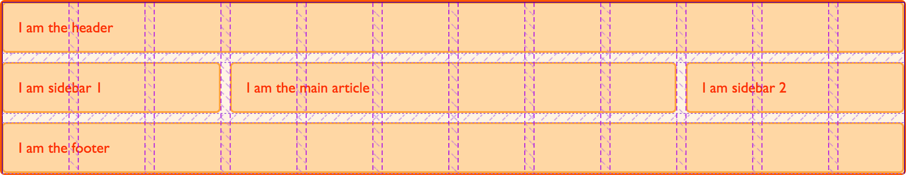

{{CSSRef}}

In previous guides we've looked at placing items by the lines created by defining grid tracks and also how to place items using named template areas. In this guide we are going to look at how these two things work together when we use named lines. Line naming is incredibly useful, but some of the more baffling looking grid syntax comes from this combination of names and track sizes. Once you work through some examples it should become clearer and easier to work with.

## Naming lines when defining a grid

You can assign some or all of the lines in your grid a name when you define your grid with the `grid-template-rows` and `grid-template-columns` properties. To demonstrate I'll use the simple layout created in the guide on line-based placement. This time I'll create the grid using named lines.

```css hidden
* {box-sizing: border-box;}

.wrapper {
  border: 2px solid #f76707;
  border-radius: 5px;
  background-color: #fff4e6;
}

.wrapper > div {
  border: 2px solid #ffa94d;
  border-radius: 5px;
  background-color: #ffd8a8;
  padding: 1em;
  color: #d9480f;
}
```

When defining the grid, I name my lines inside square brackets. Those names can be anything you like. I have defined a name for the start and end of the container, both for rows and columns. Then defined the center block of the grid as `content-start` and `content-end` again, both for columns and rows although you do not need to name all of the lines on your grid. You might choose to name just some key lines for your layout.

```css
.wrapper {
  display: grid;
  grid-template-columns: [main-start] 1fr [content-start] 1fr [content-end] 1fr [main-end];
  grid-template-rows: [main-start] 100px [content-start] 100px [content-end] 100px [main-end];
}
```

Once the lines have names, we can use the name to place the item rather than the line number.

```css
.box1 {
  grid-column-start: main-start;
  grid-row-start: main-start;
  grid-row-end: main-end;
}

.box2 {
  grid-column-start: content-end;
  grid-row-start: main-start;
  grid-row-end: content-end;
}

.box3 {
  grid-column-start: content-start;
  grid-row-start: main-start;
}

.box4 {
  grid-column-start: content-start;
  grid-column-end: main-end;
  grid-row-start: content-end;
}
```

```html
<div class="wrapper">
  <div class="box1">One</div>
  <div class="box2">Two</div>
  <div class="box3">Three</div>
  <div class="box4">Four</div>
</div>
```

{{ EmbedLiveSample('Naming_lines_when_defining_a_grid', '500', '330') }}

Everything else about line-based placement still works in the same way and you can mix named lines and line numbers. Naming lines is useful when creating a responsive design where you redefine the grid, rather than then needing to redefine the content position by changing the line number in your media queries, you can ensure that the line is always named the same in your definitions.

### Giving lines multiple names

You may want to give a line more than one name, perhaps it denotes the sidebar-end and the main-start for example. To do this add the names inside the square brackets with whitespace between them `[sidebar-end main-start]`. You can then refer to that line by either of the names.

## Implicit grid areas from named lines

When naming the lines, I mentioned that you can name these anything you like. The name is a [custom ident](https://drafts.csswg.org/css-values-4/#custom-idents), an author-defined name. When choosing the name you need to avoid words that might appear in the specification and be confusing - such as `span`. Idents are not quoted.

While you can choose any name, if you append `-start` and `-end` to the lines around an area, as I have in the example above, grid will create you a named area of the main name used. Taking the above example, I have `content-start` and `content-end` both for rows and for columns. This means I get a grid area named `content`, and could place something in that area should I wish to.

```css hidden
* {box-sizing: border-box;}

.wrapper {
  border: 2px solid #f76707;
  border-radius: 5px;
  background-color: #fff4e6;
}

.wrapper > div {
  border: 2px solid #ffa94d;
  border-radius: 5px;
  background-color: #ffd8a8;
  padding: 1em;
  color: #d9480f;
}
```

I'm using the same grid definitions as above, however this time I am going to place a single item into the named area `content`.

```css
.wrapper {
  display: grid;
  grid-template-columns: [main-start] 1fr [content-start] 1fr [content-end] 1fr [main-end];
  grid-template-rows: [main-start] 100px [content-start] 100px [content-end] 100px [main-end];
}
.thing {
  grid-area: content;
}
```

```html
<div class="wrapper">
  <div class="thing">I am placed in an area named content.</div>
</div>
```

{{ EmbedLiveSample('Implicit_grid_areas_from_named_lines', '500', '330') }}

We don't need to define where our areas are with `grid-template-areas` as our named lines have created an area for us.

## Implicit Grid lines from named areas

We have seen how named lines create a named area, and this also works in reverse. Named template areas create named lines that you can use to place your items. If we take the layout created in the guide to Grid Template Areas, we can use the lines created by our areas to see how this works.

In this example I have added an extra div with a class of `overlay`. We have named areas created using the `grid-area` property, then a layout created in `grid-template-areas`. The area names are:

- `hd`
- `ft`
- `main`
- `sd`

This gives us column and row lines:

- `hd-start`
- `hd-end`
- `sd-start`
- `sd-end`
- `main-start`
- `main-end`
- `ft-start`
- `ft-end`

You can see the named lines in the image, note that some lines have two names - for example `sd-end` and `main-start` refer to the same column line.


To position `overlay` using these implicit named lines is the same as positioning an item using lines that we have named.

```css hidden
* {box-sizing: border-box;}

.wrapper {
  border: 2px solid #f76707;
  border-radius: 5px;
  background-color: #fff4e6;
}

.wrapper > div {
  border: 2px solid #ffa94d;
  border-radius: 5px;
  background-color: #ffd8a8;
  padding: 1em;
  color: #d9480f;
}
```

```css
.wrapper {
  display: grid;
  grid-template-columns: repeat(9, 1fr);
  grid-auto-rows: minmax(100px, auto);
  grid-template-areas:
    "hd hd hd hd   hd   hd   hd   hd   hd"
    "sd sd sd main main main main main main"
    "ft ft ft ft   ft   ft   ft   ft   ft";
}

.header {
  grid-area: hd;
}

.footer {
  grid-area: ft;
}

.content {
  grid-area: main;
}

.sidebar {
  grid-area: sd;
}

.wrapper > div.overlay {
  z-index: 10;
  grid-column: main-start / main-end;
  grid-row: hd-start / ft-end;
  border: 4px solid rgb(92,148,13);
  background-color: rgba(92,148,13,.4);
  color: rgb(92,148,13);
  font-size: 150%;
}
```

```html
<div class="wrapper">
  <div class="header">Header</div>
  <div class="sidebar">Sidebar</div>
  <div class="content">Content</div>
  <div class="footer">Footer</div>
  <div class="overlay">Overlay</div>
</div>
```

{{ EmbedLiveSample('Implicit_Grid_lines_from_named_areas', '500', '330') }}

Given that we have this ability to position created lines from named areas and areas from named lines, it is worth taking a little bit of time to plan your naming strategy when starting out creating your grid layout. By selecting names that will make sense to you and your team you will help everyone to use the layouts you create more easily.

## Multiple lines with the same name with repeat()

If you want to give all of the lines in your grid a unique name then you will need to write out the track definition long-hand rather than using the repeat syntax, as you need to add the name in square brackets while defining the tracks. If you do use the repeat syntax you will end up with multiple lines that have the same name, however this can be very useful too.

### Twelve-column grid using repeat()

In this next example I am creating a grid with twelve equal width columns. Before defining the 1fr size of the column track I am also defining a line name of `[col-start]`. This means that we will end up with a grid that has 12 column lines all named `col-start` before a `1fr` width column.

```css hidden
* {box-sizing: border-box;}

.wrapper {
  border: 2px solid #f76707;
  border-radius: 5px;
  background-color: #fff4e6;
}

.wrapper > div {
  border: 2px solid #ffa94d;
  border-radius: 5px;
  background-color: #ffd8a8;
  padding: 1em;
  color: #d9480f;
}
```

```css
.wrapper {
  display: grid;
  grid-template-columns: repeat(12, [col-start] 1fr);
}
```

Once you have created the grid you can place items onto it. As we have multiple lines named `col-start` if you place an item to start after line `col-start` grid uses the first line named `col-start`, in our case that will be the far left line. To address another line use the name, plus the number for that line. To place our item from the first line named col-start to the 5th, we can use:

```css
.item1 {
  grid-column: col-start / col-start 5
}
```

You can also use the `span` keyword here. My next item will be placed from the 7th line named `col-start` and span 3 lines.

```css
.item2 {
  grid-column: col-start 7 / span 3;
}
```

```html
<div class="wrapper">
  <div class="item1">I am placed from col-start line 1 to col-start 5</div>
  <div class="item2">I am placed from col-start line 7 spanning 3 lines</div>
</div>
```

{{ EmbedLiveSample('Twelve-column_grid_using_repeat', '500', '330') }}

If you take a look at this layout in the Firefox Grid Highlighter you can see how the column lines are shown, and how our items are placed against these lines.


### Defining named lines with a track list

The repeat syntax can also take a track list, it doesn't just need to be a single track size that is being repeated. The code below would create an eight track grid, with a narrower `1fr` width column named `col1-start` followed by a wider `3fr` column named `col2-start`.

```css
.wrapper {
  grid-template-columns: repeat(4, [col1-start] 1fr [col2-start] 3fr);
}
```

If your repeating syntax puts two lines next to each other then they will be merged, and create the same result as giving a line multiple names in a non-repeating track definition. The following definition, creates four `1fr` tracks, which each have a start and end line.

```css
.wrapper {
  grid-template-columns: repeat(4, [col-start] 1fr [col-end] );
}
```

If we write this definition out without using repeat notation it would look like this.

```css
.wrapper {
  grid-template-columns: [col-start] 1fr [col-end col-start] 1fr [col-end col-start] 1fr [col-end col-start] 1fr [col-end];
}
```

If you have used a track list then you can use the `span` keyword not just to span a number of lines but also to span a number of lines of a certain name.

```css hidden
* {box-sizing: border-box;}

.wrapper {
  border: 2px solid #f76707;
  border-radius: 5px;
  background-color: #fff4e6;
}

.wrapper > div {
  border: 2px solid #ffa94d;
  border-radius: 5px;
  background-color: #ffd8a8;
  padding: 1em;
  color: #d9480f;
}
```

```css
.wrapper {
  display: grid;
  grid-template-columns: repeat(6, [col1-start] 1fr [col2-start] 3fr);
}

.item1 {
  grid-column: col1-start / col2-start 2
}

.item2 {
  grid-row: 2;
  grid-column: col1-start 2 / span 2 col1-start;
}
```

```html
<div class="wrapper">
  <div class="item1">I am placed from col1-start line 1 to col2-start line 2</div>
  <div class="item2">I am placed from col1-start line 2 spanning 2 lines named col1-start</div>
</div>
```

{{ EmbedLiveSample('Defining_named_lines_with_a_track_list', '500', '330') }}

### Twelve-column grid framework

Over the last three guides you have discovered that there are a lot of different ways to place items using grid. This can seem a little bit overcomplicated at first, but remember you don't need to use all of them. In practice I find that for straightforward layouts, using named template areas works well, it gives that nice visual representation of what your layout looks like, and it is then easy to move things around on the grid.

If working with a strict multiple column layout for example the named lines demonstration in the last part of this guide works very well. If you consider grid systems such as those found in frameworks like Foundation or Bootstrap, these are based on a 12 column grid. The framework then imports the code to do all of the calculations to make sure that the columns add up to 100%. With grid layout the only code we need for our grid "framework" is:

```css
.wrapper {
  display: grid;
  gap: 10px;
  grid-template-columns: repeat(12, [col-start] 1fr);
}
```

We can then use that framework to layout our page. For example, to create a three column layout with a header and footer, I might have the following markup.

```css hidden
* {box-sizing: border-box;}

.wrapper {
  border: 2px solid #f76707;
  border-radius: 5px;
  background-color: #fff4e6;
}

.wrapper > * {
  border: 2px solid #ffa94d;
  border-radius: 5px;
  background-color: #ffd8a8;
  padding: 1em;
  color: #d9480f;
}
```

```html
<div class="wrapper">
  <header class="main-header">I am the header</header>
  <aside class="side1">I am sidebar 1</aside>
  <article class="content">I am the main article</article>
  <aside class="side2">I am sidebar 2</aside>
  <footer class="main-footer">I am the footer</footer>
</div>
```

I could then place this on my grid layout framework like this.

```css
.main-header,
.main-footer {
  grid-column: col-start / span 12;
}

.side1 {
  grid-column: col-start / span 3;
  grid-row: 2;
}

.content {
  grid-column: col-start 4 / span 6;
  grid-row: 2;
}

.side2 {
  grid-column: col-start 10 / span 3;
  grid-row: 2;
}
```

{{ EmbedLiveSample('Twelve-column_grid_framework', '500', '330') }}

Once again, the grid highlighter is helpful to show us how the grid we have placed our items on works.



That's all I need. I don't need to do any calculations, grid automatically removed my 10 pixel gutter track before assigning the space to the `1fr` column tracks. As you start to build out your own layouts, you will find that the syntax becomes more familiar and you choose the ways that work best for you and the type of projects you like to build. Try building some common patterns with these various methods, and you will soon find your most productive way to work. Then, in the next guide we will look at how grid can position items for us - without us needing to use placement properties at all!
