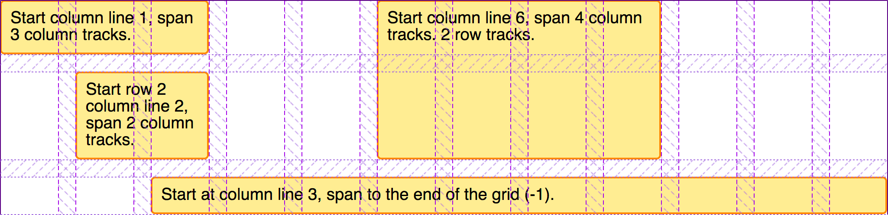
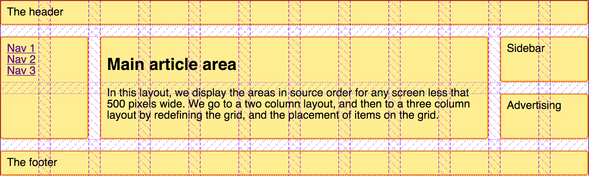

{{CSSRef}}

To round off this set of guides to CSS Grid Layout, we're going to walk through a few different layouts, which demonstrate some of the different techniques you can use when designing with grid layout. We will look at an example using [grid-template-areas](/en-US/docs/Web/CSS/CSS_Grid_Layout/Grid_Template_Areas), a typical 12-column flexible grid system, and also a product listing using auto-placement. As you can see from this set of examples, there is often more than one way to achieve the result you want with grid layout. Choose the method you find most helpful for the problems that you are solving and the designs that you need to implement.

## A responsive layout with 1 to 3 fluid columns using `grid-template-areas`

Many websites are a variation of this type of layout, with content, sidebars, a header and a footer. In a responsive design, you may want to display the layout as a single column, adding a sidebar at a certain breakpoint and then bring in a three-column layout for wider screens.


We're going to create this layout using the _named template areas_ that we learned about in the guide _[Grid template areas](/en-US/docs/Web/CSS/CSS_Grid_Layout/Grid_Template_Areas)_.

The mark-up is a container with elements inside for a header, footer, main content, navigation, sidebar, and a block to place advertising.

```css hidden
* {box-sizing: border-box;}
  .wrapper {
    max-width: 1024px;
    margin: 0 auto;
    font: 1.2em Helvetica, arial, sans-serif;
  }

  .wrapper > * {
    border: 2px solid #f08c00;
    background-color: #ffec99;
    border-radius: 5px;
    padding: 10px;
  }

  nav ul {
    list-style: none;
    margin: 0;
    padding: 0;
  }
```

```html
<div class="wrapper">
  <header class="main-head">The header</header>
  <nav class="main-nav">
    <ul>
      <li><a href="">Nav 1</a></li>
      <li><a href="">Nav 2</a></li>
      <li><a href="">Nav 3</a></li>
    </ul>
  </nav>
  <article class="content">
    <h1>Main article area</h1>
    <p>In this layout, we display the areas in source order for any screen less that 500 pixels wide. We go to a two column layout, and then to a three column layout by redefining the grid, and the placement of items on the grid.</p>
  </article>
  <aside class="side">Sidebar</aside>
  <div class="ad">Advertising</div>
  <footer class="main-footer">The footer</footer>
</div>
```

As we are using {{cssxref("grid-template-areas")}} to create the layout. Outside of any media queries we need to name the areas. We name areas using the {{cssxref("grid-area")}} property.

```css
.main-head {
  grid-area: header;
}
.content {
  grid-area: content;
}
.main-nav {
  grid-area: nav;
}
.side {
  grid-area: sidebar;
}
.ad {
  grid-area: ad;
}
.main-footer {
  grid-area: footer;
}
```

This will not create any layout, however the items now have names we can use to do so. Staying outside of any media queries we're now going to set up the layout for the mobile width. Here we're keeping everything in source order, trying to avoid any disconnect between the source and display as described in the guide _[Grid layout and accessibility](/en-US/docs/Web/CSS/CSS_Grid_Layout/CSS_Grid_Layout_and_Accessibility)_. We've not defined any column or row tracks but this layout dictates a single column, and rows will be created as needed for each of the items in the implicit grid.

```css
.wrapper {
  display: grid;
  gap: 20px;
  grid-template-areas:
    "header"
    "nav"
    "content"
    "sidebar"
    "ad"
    "footer";
}
```

With our mobile layout in place, we can now proceed to add a [media query](/en-US/docs/Web/CSS/Media_Queries) to adapt this layout for bigger screens with enough real estate to display two columns.

```css
@media (min-width: 500px) {
  .wrapper {
    grid-template-columns: 1fr 3fr;
    grid-template-areas:
      "header  header"
      "nav     nav"
      "sidebar content"
      "ad      footer";
  }
  nav ul {
    display: flex;
    justify-content: space-between;
  }
}
```

You can see the layout taking shape in the value of {{cssxref("grid-template-areas")}}. The `header` spans over two column tracks, as does the `nav`. In the third row track we have the `sidebar` alongside the `content`. In the fourth row track I have chosen to place my `ad` content – so it appears under the sidebar, then the `footer` next to it under the content. We're using a flexbox on the navigation to display it in a row spaced out.

We can now add a final breakpoint to move to a three-column layout.

```css
@media (min-width: 700px) {
  .wrapper {
    grid-template-columns: 1fr 4fr 1fr;
    grid-template-areas:
      "header header  header"
      "nav    content sidebar"
      "nav    content ad"
      "footer footer  footer"
   }
   nav ul {
     flex-direction: column;
   }
}
```

The three-column layout has two `1fr` unit side columns and a middle column that has `4fr` as the track size. This means that the available space in the container is split into 6 and assigned in proportion to our three tracks – one part each to the side columns and 4 parts to the center.

In this layout we're displaying the `nav` in the left column, alongside the `content`. In the right column we have the `sidebar` and underneath it the advertisements (`ad`). The `footer` now spans right across the bottom of the layout. I then use a flexbox to display the navigation as a column.

{{ EmbedLiveSample('A_responsive_layout_with_1_to_3_fluid_columns_using_grid-template-areas', '800', '500') }}

This is a simple example but demonstrates how we can use a grid layout to rearrange our layout for different breakpoints. In particular we're changing the location of that `ad` block, as appropriate in my different column setups. I find this named areas method very helpful at a prototyping stage, it is easy to play around with the location of elements. You could always begin to use grid in this way for prototyping, even if you can't rely on it fully in production due to the browsers that visit your site.

## A flexible 12-column layout

If you have been working with one of the many frameworks or grid systems you may be accustomed to laying out your site on a 12- or 16-column flexible grid. We can create this type of system using CSS Grid Layout. As a simple example, let's create a 12-column flexible grid that has 12 `1fr`-unit column tracks, they all have a start line named `col-start`. This means that we will have twelve grid lines named `col-start`.

```css hidden
.wrapper {
  max-width: 1024px;
  margin: 0 auto;
  font: 1.2em Helvetica, arial, sans-serif;
}
.wrapper > * {
  border: 2px solid #f08c00;
  background-color: #ffec99;
  border-radius: 5px;
  padding: 10px;
}
```

```css
.wrapper {
  display: grid;
  grid-template-columns: repeat(12, [col-start] 1fr);
  gap: 20px;
}
```

To demonstrate how this grid system works I have four child elements inside my wrapper.

```html
<div class="wrapper">
  <div class="item1">Start column line 1, span 3 column tracks.</div>
  <div class="item2">Start column line 6, span 4 column tracks. 2 row tracks.</div>
  <div class="item3">Start row 2 column line 2, span 2 column tracks.</div>
  <div class="item4">Start at column line 3, span to the end of the grid (-1).</div>
</div>
```

We can then place these on the grid using the named lines, and also the span keyword.

```css
.item1 {
  grid-column: col-start / span 3;
}
.item2 {
  grid-column: col-start 6 / span 4 ;
  grid-row: 1 / 3;
}
.item3 {
  grid-column: col-start 2 / span 2;
  grid-row: 2;
}
.item4 {
  grid-column: col-start 3 / -1;
  grid-row: 3;
}
```

{{ EmbedLiveSample('A_flexible_12-column_layout', '800', '400') }}

As described in the [guide to named lines](/en-US/docs/Web/CSS/CSS_Grid_Layout/Layout_using_Named_Grid_Lines), we are using the named line to place our item. As we have 12 lines all with the same name we use the name, and then the index of the line. You could also use the line index itself if you prefer and avoid using named lines at all.

Rather than setting the end line number, I have chosen to say how many tracks this element should span, using the `span` keyword. I like this approach as when working with a multiple-column layout system we usually think of blocks in terms of the number of tracks of the grid they span, and adjust that for different breakpoints. To see how the blocks align themselves to the tracks, use the [Firefox Grid Inspector](https://firefox-source-docs.mozilla.org/devtools-user/page_inspector/how_to/examine_grid_layouts/index.html). It clearly demonstrates how our items are placed.



There are some key differences with how a grid layout works over the grid systems you may have used previously. As you can see, we do not need to add any markup to create a row, grid systems need to do this to stop elements popping up into the row above. With CSS Grid Layout, we can place things into rows, with no danger of them rising up into the row above if it is left empty. Due to this _strict_ column and row placement we can also easily leave white space in our layout. We also don't need special classes to pull or push things, to indent them into the grid. All we need to do is specify the start and end line for the item.

## Building a layout using the 12-column system

To see how this layout method works in practice, we can create the same layout that we created with {{cssxref("grid-template-areas")}}, this time using the 12-column grid system. Let's start with the same markup as used for the grid template areas example.

```css hidden
* {box-sizing: border-box;}
  .wrapper {
    max-width: 1024px;
    margin: 0 auto;
    font: 1.2em Helvetica, arial, sans-serif;
  }

  .wrapper > * {
    border: 2px solid #f08c00;
    background-color: #ffec99;
    border-radius: 5px;
    padding: 10px;
  }

  nav ul {
    list-style: none;
    margin: 0;
    padding: 0;
  }
```

```html
<div class="wrapper">
  <header class="main-head">The header</header>
  <nav class="main-nav">
    <ul>
      <li><a href="">Nav 1</a></li>
      <li><a href="">Nav 2</a></li>
      <li><a href="">Nav 3</a></li>
    </ul>
  </nav>
  <article class="content">
    <h1>Main article area</h1>
    <p>In this layout, we display the areas in source order for any screen less that 500 pixels wide. We go to a two column layout, and then to a three column layout by redefining the grid, and the placement of items on the grid.</p>
  </article>
  <aside class="side">Sidebar</aside>
  <div class="ad">Advertising</div>
  <footer class="main-footer">The footer</footer>
</div>
```

We can then set up our grid, as for the example 12-column layout above.

```css
.wrapper {
  display: grid;
  grid-template-columns: repeat(12, [col-start] 1fr);
  gap: 20px;
}
```

We are once again going to make this a responsive layout, this time however using named lines. Every breakpoint will use a 12-column grid, however the number of tracks that items will span changes depending on the size of the screen.

We start mobile first, and all we want for the narrowest screens is for the items to remain in source order, and all span right across the grid.

```css
.wrapper > * {
  grid-column: col-start / span 12;
}
```

At the next breakpoint we want to move to a two-column layout. Our header and navigation still span the full grid, so we do not need to specify any positioning for them. The sidebar is starting on the first column line named col-start, spanning 3 lines. It goes after row line 3, as the header and navigation are in the first two row tracks.

The ad panel is below the sidebar, so starts at grid row line 4. Then we have the content and footer starting at col-start 4 and spanning 9 tracks taking them to the end of the grid.

```css
@media (min-width: 500px) {
  .side {
    grid-column: col-start / span 3;
    grid-row: 3;
  }
  .ad {
    grid-column: col-start / span 3;
    grid-row: 4;
  }
  .content, .main-footer {
    grid-column: col-start 4 / span 9;
  }
  nav ul {
    display: flex;
    justify-content: space-between;
  }
}
```

Finally we go to the three-column version of this layout. The header continues to span right across the grid, but now the navigation moves down to become the first sidebar, with the content and then the sidebar next to it. The footer now also spans across the full layout.

```css
@media (min-width: 700px) {
  .main-nav {
    grid-column: col-start / span 2;
    grid-row: 2 / 4;
  }
  .content {
    grid-column: col-start 3 / span 8;
    grid-row: 2 / 4;
  }
  .side {
    grid-column: col-start 11 / span 2;
    grid-row: 2;
  }
  .ad {
    grid-column: col-start 11 / span 2;
    grid-row: 3;
  }
  .main-footer {
    grid-column: col-start / span 12;
  }
  nav ul {
    flex-direction: column;
  }
}
```

{{ EmbedLiveSample('Building_a_layout_using_the_12-column_system', '800', '450') }}

Once again the [Grid Inspector](https://firefox-source-docs.mozilla.org/devtools-user/page_inspector/how_to/examine_grid_layouts/index.html) is useful to help us see how our layout has taken shape.



Something to note as we create this layout is that we haven't needed to explicitly position every element on the grid at each breakpoint. We have been able to inherit the placement set up for earlier breakpoints – an advantage of working "mobile first". We are also able to take advantage of grid auto-placement. By keeping elements in a logical order, auto-placement does quite a lot of work for us in placing items onto the grid. In the final example in this guide we will create a layout that entirely relies on auto-placement.

## A product listing with auto-placement

Many layouts are essentially sets of "cards" – product listings, image galleries, and so on. A grid can make it very easy to create these listings in a way that is responsive without needing to add [media queries](/en-US/docs/Web/CSS/Media_Queries) to make it so. In this next example I'm combining CSS Grid and Flexbox Layouts to make a simple product listing layout.

The markup for my listing is an unordered list of items. Each item contains a heading, some text of varying height, and a call to action link.

```html
<ul class="listing">
  <li>
    <h2>Item One</h2>
    <div class="body">
      <p>The content of this listing item goes here.</p>
    </div>
    <div class="cta">
      <a href="">Call to action!</a>
    </div>
  </li>
  <li>
    <h2>Item Two</h2>
    <div class="body">
      <p>The content of this listing item goes here.</p>
    </div>
    <div class="cta">
      <a href="">Call to action!</a>
    </div>
  </li>
  <li class="wide">
    <h2>Item Three</h2>
    <div class="body">
      <p>The content of this listing item goes here.</p>
      <p>This one has more text than the other items.</p>
      <p>Quite a lot more</p>
      <p>Perhaps we could do something different with it?</p>
    </div>
    <div class="cta">
      <a href="">Call to action!</a>
    </div>
  </li>
  <li>
    <h2>Item Four</h2>
    <div class="body">
      <p>The content of this listing item goes here.</p>
    </div>
    <div class="cta">
      <a href="">Call to action!</a>
    </div>
  </li>
  <li>
    <h2>Item Five</h2>
    <div class="body">
      <p>The content of this listing item goes here.</p>
    </div>
    <div class="cta">
      <a href="">Call to action!</a>
    </div>
  </li>
</ul>
```

```css hidden
* {box-sizing: border-box;}
    img {max-width: 100%; display: block;}
    body {
        font: 1.2em Helvetica, arial, sans-serif;
    }
    a:link, a:visited {
      text-decoration: none;
      color: #f08c00;
    }

    h2 {
      background-color: #f08c00;
      color: #fff;
      text-align: center;
      margin: 0;
      padding: 20px;
    }
```

We are going to create a grid with a flexible number of flexible columns. I want them never to become smaller than 200 pixels, and then to share any available remaining space equally – so we always get equal width column tracks. We achieve this with the `minmax()` function in our repeat notation for track sizing.

```css
.listing {
  list-style: none;
  margin: 2em;
  display: grid;
  gap: 20px;
  grid-template-columns: repeat(auto-fill, minmax(200px, 1fr));
}
```

As soon as we add this CSS, the items start to lay out as a grid. If we make the window smaller or wider the number of column tracks changes – without us needing to add breakpoints using media queries and redefine the grid.

We can then tidy up the internals of the boxes using a little touch of flexbox. I set the list item to `display: flex` and the `flex-direction` to `column`. We can then use an auto margin on the `.cta` to push this bar down to the bottom of the box.

```css
.listing li {
  border: 1px solid #ffe066;
  border-radius: 5px;
  display: flex;
  flex-direction: column;
}
.listing .cta {
  margin-top: auto;
  border-top: 1px solid #ffe066;
  padding: 10px;
  text-align: center;
}
.listing .body {
  padding: 10px;
}
```

This is really one of the key reasons someone would use flexbox rather than grid, if he/she's just aligning or distributing something in a single dimension, that's a flexbox use case.

{{ EmbedLiveSample('A_product_listing_with_auto-placement', '800', '900') }}

## Preventing gaps with the dense keyword

This is all looking fairly complete now, however we sometimes have these cards which contain far more content than the others. It might be nice to cause those to span two tracks, and then they won't be so tall. We have a class of `wide` on my larger item, and we add a rule {{cssxref("grid-column-end")}} with a value of `span 2`. Now when grid encounters this item, it will assign it two tracks. At some breakpoints, this means that we'll get a gap in the grid – where there isn't space to lay out a two-track item.


We can cause a grid to backfill those gaps by setting {{cssxref("grid-auto-flow")}}`: dense` on the grid container. Take care when doing this however as it does take items away from their logical source order. You should only do this if your items do not have a set order – and be aware of the [issues](/en-US/docs/Web/CSS/CSS_Grid_Layout/CSS_Grid_Layout_and_Accessibility#visual_not_logical_re-ordering) of the tab order following the source and not your reordered display.

```html hidden
<ul class="listing">
  <li>
    <h2>Item One</h2>
    <div class="body"><p>The content of this listing item goes here.</p></div>
    <div class="cta"><a href="">Call to action!</a></div>
  </li>
   <li>
     <h2>Item Two</h2>
     <div class="body"><p>The content of this listing item goes here.</p></div>
     <div class="cta"><a href="">Call to action!</a></div>
   </li>
   <li class="wide">
     <h2>Item Three</h2>
     <div class="body"><p>The content of this listing item goes here.</p>
     <p>This one has more text than the other items.</p>
     <p>Quite a lot more</p>
     <p>Perhaps we could do something different with it?</p></div>
     <div class="cta"><a href="">Call to action!</a></div>
    </li>
    <li>
     <h2>Item Four</h2>
     <div class="body"><p>The content of this listing item goes here.</p></div>
     <div class="cta"><a href="">Call to action!</a></div>
    </li>
     <li>
     <h2>Item Five</h2>
     <div class="body"><p>The content of this listing item goes here.</p></div>
      <div class="cta"><a href="">Call to action!</a></div>
    </li>
</ul>
```

```css hidden
* {box-sizing: border-box;}
    img {max-width: 100%; display: block;}
    body {
        font: 1.2em Helvetica, arial, sans-serif;
    }
    a:link, a:visited {
      text-decoration: none;
      color: #f08c00;
    }

    h2 {
      background-color: #f08c00;
      color: #fff;
      text-align: center;
      margin: 0;
      padding: 20px;
    }

.listing li {
  border: 1px solid #ffe066;
  border-radius: 5px;
  display: flex;
  flex-direction: column;
}
.listing .cta {
  margin-top: auto;
  border-top: 1px solid #ffe066;
  padding: 10px;
  text-align: center;
}
.listing .body {
  padding: 10px;
}
```

```css
.listing {
  list-style: none;
  margin: 2em;
  display: grid;
  gap: 20px;
  grid-auto-flow: dense;
  grid-template-columns: repeat(auto-fill,minmax(200px, 1fr));
}
.listing .wide {
  grid-column-end: span 2;
}
```

{{ EmbedLiveSample('Preventing_gaps_with_the_dense_keyword', '800', '900') }}

This technique of using auto-placement with some rules applied to certain items is very useful, and can help you to deal with content that is being output by a CMS for example, where you have repeated items and can perhaps add a class to certain ones as they are rendered into the HTML.

## Further exploration

The best way to learn to use grid layout is to continue to build examples like the ones we have covered here. Pick something that you normally build using your framework of choice, or using floats, and see if you can build it using grid. Don't forget to find examples that are impossible to build with current methods. That might mean taking inspiration from magazines or other non-web sources. Grid Layout opens up possibilities that we have not had before, we don't need to be tied to the same old layouts to use it.

- For inspiration see the [_Layout Labs_ from Jen Simmons](https://labs.jensimmons.com/), she has been creating layouts based on a range of sources.
- For additional common layout patterns see [_Grid by Example_ from Rachel Andrew](https://gridbyexample.com), where she provides many smaller examples of grid layout and also some larger UI patterns and full page layouts.
