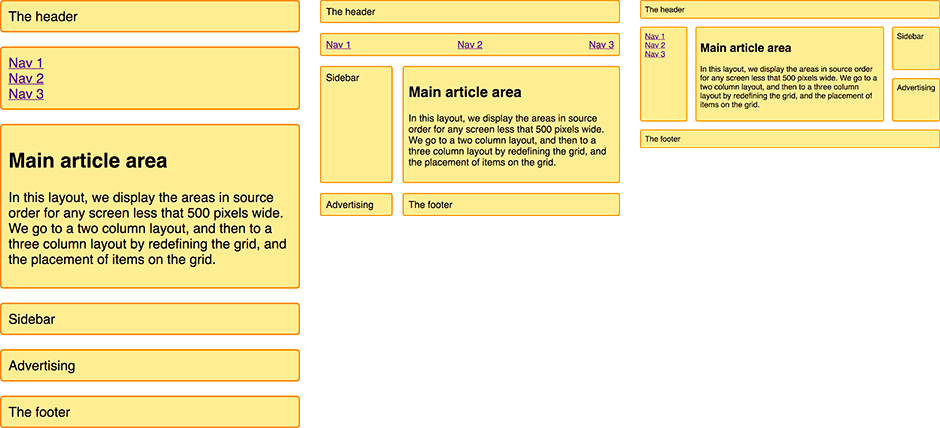
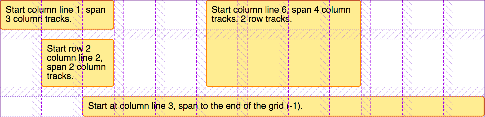
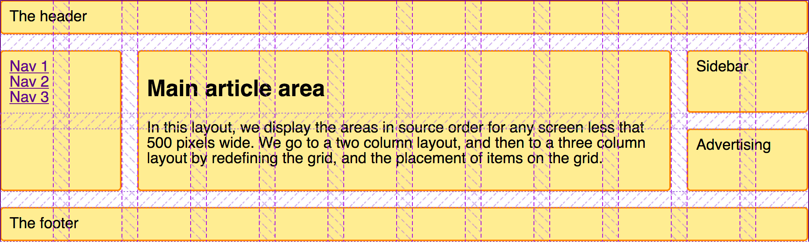
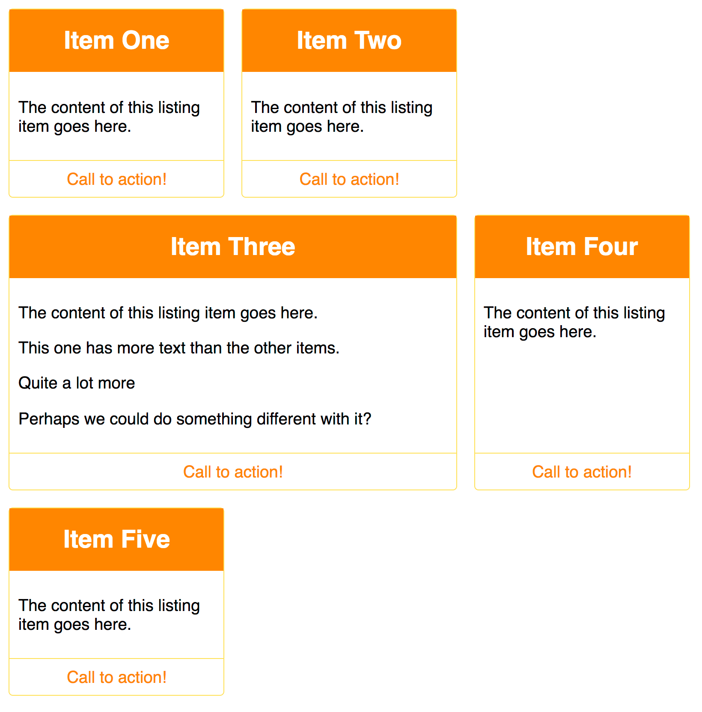

{{CSSRef}}

To round off this [set of CSS grid layout guides](/en-US/docs/Web/CSS/CSS_grid_layout#guides), we're going to walk through a few different layouts, which demonstrate some of the techniques you can use when designing with grid layout. We will look at an example using {{cssxref("grid-template-areas")}}, a 12-column flexible grid system, and also a product listing using auto-placement. As you can see from this set of examples, there is often more than one way to get the results you want with CSS grid layout. Choose the method you find most helpful for the problems that you are solving and the designs that you need to implement.

## A responsive layout with 1 to 3 fluid columns using `grid-template-areas`

Many websites are a variation of this type of layout, with content, sidebars, a header and a footer. In a responsive design, you may want to display the layout as a single column, adding a sidebar at a certain breakpoint and then bring in a three-column layout for wider screens.



We're going to create this layout using the _named template areas_ that we learned about in the [Grid template areas](/en-US/docs/Web/CSS/CSS_grid_layout/Grid_template_areas) guide.

The markup is a container with elements inside for a header, footer, main content, navigation, sidebar, and a block to place advertising.

```css hidden
* {
  box-sizing: border-box;
}
.wrapper {
  max-inline-size: 1024px;
  margin: 0 auto;
  font:
    1.2em Helvetica,
    arial,
    sans-serif;
}

.wrapper > * {
  border: 2px solid #f08c00;
  background-color: #ffec99;
  border-radius: 5px;
  padding: 10px;
}

nav ul {
  list-style: none;
  margin: 0;
  padding: 0;
}
```

```html
<div class="wrapper">
  <header class="main-head">The header</header>
  <nav class="main-nav">
    <ul>
      <li><a href="">Nav 1</a></li>
      <li><a href="">Nav 2</a></li>
      <li><a href="">Nav 3</a></li>
    </ul>
  </nav>
  <article class="content">
    <h1>Main article area</h1>
    <p>
      In this layout, we display the areas in source order for any screen less
      that 500 pixels wide. We go to a two column layout, and then to a three
      column layout by redefining the grid, and the placement of items on the
      grid.
    </p>
  </article>
  <aside class="side">Sidebar</aside>
  <div class="ad">Advertising</div>
  <footer class="main-footer">The footer</footer>
</div>
```

As we are using {{cssxref("grid-template-areas")}} to create the layout, we need to name the areas outside of any [media queries](/en-US/docs/Web/CSS/CSS_media_queries/Using_media_queries). We name areas using the {{cssxref("grid-area")}} property.

```css
.main-head {
  grid-area: header;
}
.content {
  grid-area: content;
}
.main-nav {
  grid-area: nav;
}
.side {
  grid-area: sidebar;
}
.ad {
  grid-area: ad;
}
.main-footer {
  grid-area: footer;
}
```

This does not create a layout. Rather, the items now have names we can use to do so. Staying outside of any media queries we're now going to set up the layout for the mobile width. Here we're keeping everything in source order to avoid any disconnect between the source and display as described in the [Grid layout and accessibility](/en-US/docs/Web/CSS/CSS_grid_layout/Grid_layout_and_accessibility) guide. We've not explicitly defined any column or row tracks; this layout dictates a single column and creates rows as needed for each item in the implicit grid.

```css
.wrapper {
  display: grid;
  gap: 20px;
  grid-template-areas:
    "header"
    "nav"
    "content"
    "sidebar"
    "ad"
    "footer";
}
```

With our mobile layout in place, we can now proceed to add a {{cssxref("@media")}} query to adapt this layout for bigger screens with enough real estate to display two columns.

```css
@media (min-inline-size: 500px) {
  .wrapper {
    grid-template-columns: 1fr 3fr;
    grid-template-areas:
      "header  header"
      "nav     nav"
      "sidebar content"
      "ad      footer";
  }
  nav ul {
    display: flex;
    justify-content: space-between;
  }
}
```

You can see the layout taking shape in the value of {{cssxref("grid-template-areas")}}. The `header` spans over two column tracks, as does the `nav`. In the third row track, we place the `sidebar` alongside the `content`. We place the `ad` content in the fourth row track so it appears under the sidebar. The `footer` is next to it under the content. We use [CSS flexible box layout](/en-US/docs/Web/CSS/CSS_flexible_box_layout) on the navigation to evenly space the navigation items in a row.

We can now add a final breakpoint for wider screens able to display a three-column layout.

```css
@media (min-inline-size: 700px) {
  .wrapper {
    grid-template-columns: 1fr 4fr 1fr;
    grid-template-areas:
      "header header  header"
      "nav    content sidebar"
      "nav    content ad"
      "footer footer  footer";
  }
  nav ul {
    flex-direction: column;
  }
}
```

The three-column layout has two `1fr` unit side columns and a middle column that has `4fr` as the track size. This means the available space in the container is split into six parts and assigned in proportion to our three tracks – one part each to the side columns and four parts to the center.

In this layout, we're displaying the `nav` in the left column, alongside the `content`. In the right column we have the `sidebar` and underneath it the advertisements (`ad`). The `footer` now spans across the entire bottom of the layout. Again, we use flexbox to display the navigation, but this time we display it as a column instead of a row.

{{ EmbedLiveSample('A_responsive_layout_with_1_to_3_fluid_columns_using_grid-template-areas', '800', '570') }}

This basic example demonstrates how to rearrange a grid layout across different breakpoints. In particular, we're changing the location of the `ad` block as appropriate in our different column setups. This named areas method can be very helpful, especially at the prototyping stage. You may find it easier to use names rather than numbers when playing with the location of elements on the grid.

## A flexible 12-column layout

CSS frameworks and grid systems commonly use 12- or 16-column flexible grids. We can create this type of system using CSS grid layout. As an example, let's create a 12-column flexible grid with 12 `1fr`-unit column tracks, each with a start line named `col-start`. This means that we will have twelve grid lines named `col-start`.

```css hidden
.wrapper {
  max-inline-size: 1024px;
  margin: 0 auto;
  font:
    1.2em Helvetica,
    arial,
    sans-serif;
}
.wrapper > * {
  border: 2px solid #f08c00;
  background-color: #ffec99;
  border-radius: 5px;
  padding: 10px;
}
```

```css
.wrapper {
  display: grid;
  grid-template-columns: repeat(12, [col-start] 1fr);
  gap: 20px;
}
```

To demonstrate how this grid system works, we have four child elements inside a wrapper.

```html
<div class="wrapper">
  <div class="item1">Start column line 1, span 3 column tracks.</div>
  <div class="item2">
    Start column line 6, span 4 column tracks. 2 row tracks.
  </div>
  <div class="item3">Start row 2 column line 2, span 2 column tracks.</div>
  <div class="item4">
    Start at column line 3, span to the end of the grid (-1).
  </div>
</div>
```

We can then place these on the grid using the named lines, and also the `span` keyword.

```css
.item1 {
  grid-column: col-start / span 3;
}
.item2 {
  grid-column: col-start 6 / span 4;
  grid-row: 1 / 3;
}
.item3 {
  grid-column: col-start 2 / span 2;
  grid-row: 2;
}
.item4 {
  grid-column: col-start 3 / -1;
  grid-row: 3;
}
```

{{ EmbedLiveSample('A_flexible_12-column_layout', '800', '400') }}

As described in the [using named grid lines guide](/en-US/docs/Web/CSS/CSS_grid_layout/Grid_layout_using_named_grid_lines), we are using the named lines to place our items. As we have 12 lines all with the same name, we use the name and the index of the line. If you prefer, you can use the line index itself and avoid using named lines.

Rather than setting the end line number, we define how many tracks this element should span using the `span` keyword. When working with a multiple-column layout system, this method may be more intuitive for those who think of blocks in terms of the number of tracks of the grid they span, then adjusting for different breakpoints. To see how the blocks align themselves to the tracks, use the grid inspector in your browser developer tools; it likely clearly demonstrates how the items are placed.



We don't need to add any markup to create a row. CSS framework grid systems often did this to stop elements popping up into the row above for browsers that don't support CSS grid layout. However, this point is now moot — all modern browsers have supported CSS grid layout for a long time. CSS grids allow us to place items into rows, with no danger of them rising up into the row above if it is left empty. Due to this _strict_ column and row placement, we can also easily leave white space in our layout. We also don't need special classes to indent items into the grid. All we need to do is specify the start and end line for the item.

## Building a layout using the 12-column system

To see how this layout method works in practice, we can create the same layout we created with {{cssxref("grid-template-areas")}}, this time using the 12-column grid system. Let's start with the same markup as used for the grid template areas example.

```css hidden
* {
  box-sizing: border-box;
}
.wrapper {
  max-inline-size: 1024px;
  margin: 0 auto;
  font:
    1.2em Helvetica,
    arial,
    sans-serif;
}

.wrapper > * {
  border: 2px solid #f08c00;
  background-color: #ffec99;
  border-radius: 5px;
  padding: 10px;
}

nav ul {
  list-style: none;
  margin: 0;
  padding: 0;
}
```

```html
<div class="wrapper">
  <header class="main-head">The header</header>
  <nav class="main-nav">
    <ul>
      <li><a href="">Nav 1</a></li>
      <li><a href="">Nav 2</a></li>
      <li><a href="">Nav 3</a></li>
    </ul>
  </nav>
  <article class="content">
    <h1>Main article area</h1>
    <p>
      In this layout, we display the areas in source order for any screen less
      that 500 pixels wide. We go to a two column layout, and then to a three
      column layout by redefining the grid, and the placement of items on the
      grid.
    </p>
  </article>
  <aside class="side">Sidebar</aside>
  <div class="ad">Advertising</div>
  <footer class="main-footer">The footer</footer>
</div>
```

We set up our grid as we did for the 12-column layout example above.

```css
.wrapper {
  display: grid;
  grid-template-columns: repeat(12, [col-start] 1fr);
  gap: 20px;
}
```

We are again going to make this a responsive layout, this time using named lines. Every breakpoint will use a 12-column grid. However, the number of tracks items will span will change depending on the size of the screen.

We start {{glossary("mobile first")}}. For the narrowest screens, we want the items to remain in source order and all span across the entire grid.

```css
.wrapper > * {
  grid-column: col-start / span 12;
}
```

At the next breakpoint, we want a two-column layout. Our header and navigation still span the full grid, so we do not need to specify any positioning for them. The sidebar is starting on the first column line named `col-start`, spanning 3 lines. It goes after row line 3, as the header and navigation are in the first two row tracks.

The `ad` panel is below the sidebar, starting at grid row line 4. Then we have the content and footer starting at col-start 4 and spanning nine tracks, taking both to the end of the grid.

```css
@media (min-inline-size: 500px) {
  .side {
    grid-column: col-start / span 3;
    grid-row: 3;
  }
  .ad {
    grid-column: col-start / span 3;
    grid-row: 4;
  }
  .content,
  .main-footer {
    grid-column: col-start 4 / span 9;
  }
  nav ul {
    display: flex;
    justify-content: space-between;
  }
}
```

Finally, for screens larger than our largest breakpoint, we define a three-column version of this layout. The header continues to span right across the grid, but now the navigation moves down to become the first sidebar, with the content and then the sidebar next to it. The footer now also spans across the full layout.

```css
@media (min-inline-size: 700px) {
  .main-nav {
    grid-column: col-start / span 2;
    grid-row: 2 / 4;
  }
  .content {
    grid-column: col-start 3 / span 8;
    grid-row: 2 / 4;
  }
  .side {
    grid-column: col-start 11 / span 2;
    grid-row: 2;
  }
  .ad {
    grid-column: col-start 11 / span 2;
    grid-row: 3;
  }
  .main-footer {
    grid-column: col-start / span 12;
  }
  nav ul {
    flex-direction: column;
  }
}
```

{{ EmbedLiveSample('Building_a_layout_using_the_12-column_system', '800', '570') }}

Once again, check the grid inspector in your browser developer tools to see how the layout has taken shape.



Something to note as we created this layout is that we didn't need to explicitly position every element on the grid at each breakpoint. We inherited the placement set up for earlier breakpoints – an advantage of working "mobile first". We also took advantage of grid auto-placement. By keeping elements in a logical order, auto-placement does quite a lot of work for us in placing items onto the grid.

## A product listing with auto-placement

In this last example in this guide, we create a layout that entirely relies on auto-placement.

Many layouts are essentially sets of "cards" – product listings, image galleries, and so on. A grid enables creating these listings in a way that is responsive without needing to add [media queries](/en-US/docs/Web/CSS/CSS_media_queries). In this example, we combine CSS grid and flexbox layouts to make a basic product listing layout.

The markup for the listing is an unordered list of items. Each item contains a heading, some text of varying height, and a call to action link.

```html
<ul class="listing">
  <li>
    <h2>Item One</h2>
    <div class="body">
      <p>The content of this listing item goes here.</p>
    </div>
    <div class="cta">
      <a href="">Call to action!</a>
    </div>
  </li>
  <li>
    <h2>Item Two</h2>
    <div class="body">
      <p>The content of this listing item goes here.</p>
    </div>
    <div class="cta">
      <a href="">Call to action!</a>
    </div>
  </li>
  <li class="wide">
    <h2>Item Three</h2>
    <div class="body">
      <p>The content of this listing item goes here.</p>
      <p>This one has more text than the other items.</p>
      <p>Quite a lot more</p>
      <p>Perhaps we could do something different with it?</p>
    </div>
    <div class="cta">
      <a href="">Call to action!</a>
    </div>
  </li>
  <li>
    <h2>Item Four</h2>
    <div class="body">
      <p>The content of this listing item goes here.</p>
    </div>
    <div class="cta">
      <a href="">Call to action!</a>
    </div>
  </li>
  <li>
    <h2>Item Five</h2>
    <div class="body">
      <p>The content of this listing item goes here.</p>
    </div>
    <div class="cta">
      <a href="">Call to action!</a>
    </div>
  </li>
</ul>
```

```css hidden
* {
  box-sizing: border-box;
}
img {
  max-inline-size: 100%;
  display: block;
}
body {
  font:
    1.2em Helvetica,
    arial,
    sans-serif;
}
a:link,
a:visited {
  text-decoration: none;
  color: #f08c00;
}

h2 {
  background-color: #f08c00;
  color: #fff;
  text-align: center;
  margin: 0;
  padding: 20px;
}
```

We create a grid with a flexible number of flexible columns. We want them to be at least 200 pixels wide and share any available remaining space equally – so we always get equal-width column tracks. We achieve this with the {{cssxref("minmax()")}} function in our {{cssxref("repeat")}} notation for track sizing.

```css
.listing {
  list-style: none;
  margin: 2em;
  display: grid;
  gap: 20px;
  grid-template-columns: repeat(auto-fill, minmax(200px, 1fr));
}
```

When we add this CSS, the items will be laid out as a grid. If we make the window smaller or wider, the number of column tracks changes – without media queries adding breakpoints and without needing to redefine the grid.

We can tidy up the internals of the boxes using a touch of flexbox. We set the list item to `display: flex` and the {{cssxref("flex-direction")}} to `column`. We can then use an auto margin on the `.cta` to push this bar down to the bottom of the box.

```css
.listing li {
  border: 1px solid #ffe066;
  border-radius: 5px;
  display: flex;
  flex-direction: column;
}
.listing .cta {
  margin-block-start: auto;
  border-block-start: 1px solid #ffe066;
  padding: 10px;
  text-align: center;
}
.listing .body {
  padding: 10px;
}
```

This is one of the key reasons to use flexbox rather than CSS grid layout. If you're aligning or distributing content in a single dimension, that's a flexbox use case.

{{ EmbedLiveSample('A_product_listing_with_auto-placement', '800', '900') }}

## Preventing gaps with the dense keyword

This is all looking fairly complete now. However, we sometimes have cards that contain far more content than the others. It might be nice to make those span two tracks, then they won't be so tall. We add a `wide` class on the larger item, and add a rule giving it a {{cssxref("grid-column-end")}} with a value of `span 2`. When this item is encountered, it will be assigned to two tracks. This means that, at some breakpoints, we'll get a gap in the grid – where there isn't enough space to lay out a two-track item.



We can make the grid backfill those gaps by setting {{cssxref("grid-auto-flow", "grid-auto-flow: dense")}} on the grid container. Take care when doing this as it can cause items to be taken out of their logical source order. You should only do this if your items do not have a set order. Additionally, be aware of the [accessibility and re-ordering issues](/en-US/docs/Web/CSS/CSS_grid_layout/Grid_layout_and_accessibility#visual_not_logical_re-ordering) resulting from the tab order following the source and not your reordered display.

```html hidden
<ul class="listing">
  <li>
    <h2>Item One</h2>
    <div class="body"><p>The content of this listing item goes here.</p></div>
    <div class="cta"><a href="">Call to action!</a></div>
  </li>
  <li>
    <h2>Item Two</h2>
    <div class="body"><p>The content of this listing item goes here.</p></div>
    <div class="cta"><a href="">Call to action!</a></div>
  </li>
  <li class="wide">
    <h2>Item Three</h2>
    <div class="body">
      <p>The content of this listing item goes here.</p>
      <p>This one has more text than the other items.</p>
      <p>Quite a lot more</p>
      <p>Perhaps we could do something different with it?</p>
    </div>
    <div class="cta"><a href="">Call to action!</a></div>
  </li>
  <li>
    <h2>Item Four</h2>
    <div class="body"><p>The content of this listing item goes here.</p></div>
    <div class="cta"><a href="">Call to action!</a></div>
  </li>
  <li>
    <h2>Item Five</h2>
    <div class="body"><p>The content of this listing item goes here.</p></div>
    <div class="cta"><a href="">Call to action!</a></div>
  </li>
</ul>
```

```css hidden
* {
  box-sizing: border-box;
}
img {
  max-width: 100%;
  display: block;
}
body {
  font:
    1.2em Helvetica,
    arial,
    sans-serif;
}
a:link,
a:visited {
  text-decoration: none;
  color: #f08c00;
}

h2 {
  background-color: #f08c00;
  color: #fff;
  text-align: center;
  margin: 0;
  padding: 20px;
}

.listing li {
  border: 1px solid #ffe066;
  border-radius: 5px;
  display: flex;
  flex-direction: column;
}
.listing .cta {
  margin-block-start: auto;
  border-block-start: 1px solid #ffe066;
  padding: 10px;
  text-align: center;
}
.listing .body {
  padding: 10px;
}
```

```css
.listing {
  list-style: none;
  margin: 2em;
  display: grid;
  gap: 20px;
  grid-auto-flow: dense;
  grid-template-columns: repeat(auto-fill, minmax(200px, 1fr));
}
.listing .wide {
  grid-column-end: span 2;
}
```

{{ EmbedLiveSample('Preventing_gaps_with_the_dense_keyword', '800', '900') }}

Using auto-placement with some rules applied to certain items is very useful and can help with content you can't control, such as CMS output, where you have repeated items and can use [structural pseudo-classes](/en-US/docs/Web/CSS/Pseudo-classes#tree-structural_pseudo-classes) to target them.

## Further exploration

CSS grid layout provides so many possibilities. The best way to learn to use grid layout is to continue to build examples like the ones we have covered here. Pick a layout from a responsive site you like and see if you can build it using grid. You can even take inspiration from magazines or other non-web sources.

- [CSS grid layout](/en-US/docs/Web/CSS/CSS_grid_layout)
- [CSS Layout: Grids](/en-US/docs/Learn_web_development/Core/CSS_layout/Grids)
- [A complete guide to CSS grid](https://css-tricks.com/snippets/css/complete-guide-grid/) on CSS-Tricks (2023)
- [Grid by example](https://gridbyexample.com/)
- [CSS grid website layout examples](https://www.quackit.com/css/grid/examples/css_grid_website_layout_examples.cfm) on quackit.com
