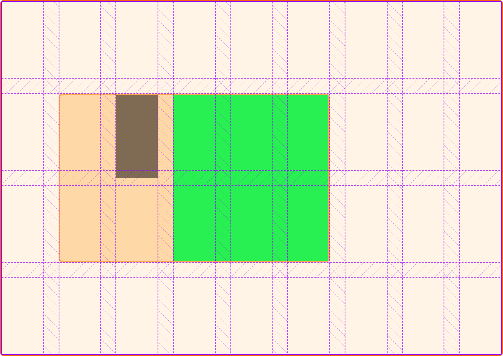

{{CSSRef}}

Level 2 of the CSS Grid Layout specification includes a `subgrid` value for {{cssxref("grid-template-columns")}} and {{cssxref("grid-template-rows")}}. This guide details what subgrid does, and gives some use cases and design patterns that are solved by the feature.

## Introduction to subgrid

When you add `display: grid` to a grid container, only the direct children become grid items and can then be placed on the grid that you have created. The children of these items display in normal flow.

You can "nest" grids by making a grid item a grid container. These grids however are independent of the parent grid and of each other, meaning that they do not take their track sizing from the parent grid. This makes it difficult to line nested grid items up with the main grid.

If you set the value `subgrid` on `grid-template-columns`, `grid-template-rows` or both, instead of creating a new track listing the nested grid uses the tracks defined on the parent.

For example, if you use `grid-template-columns: subgrid` and the nested grid spans three column tracks of the parent, the nested grid will have three column tracks of the same size as the parent grid. Gaps are inherited but can also be overridden with a different {{cssxref("gap")}} value. Line names can be passed from the parent into the subgrid, and the subgrid can also declare its own line names.

## Subgrid for columns

In the example below I have a grid layout with nine `1fr` column tracks and four rows that are a minimum of 100px tall.

I place `.item` from column line 2 to 7, and row 2 to 4. I then make this grid item into a grid, giving it column tracks that are a subgrid and defining rows as normal. As the item spans five column tracks, this means that the subgrid has five column tracks. I can then place `.subitem` on this grid.

The rows in this example are not a subgrid and so behave as a nested grid does normally. The grid area on the parent expands to be large enough for this nested grid.

{{EmbedGHLiveSample("css-examples/grid/subgrid/columns.html", '100%', 1200)}}

Note that line numbering restarts inside the subgrid — column line 1, when inside the subgrid, is the first line of the subgrid. The subgridded element doesn't inherit the line numbers of the parent grid. This means that you can safely lay out a component that may be placed in different positions on the main grid, knowing that the line numbers on the component will always be the same.

## Subgrid for rows

The next example is the same setup, however we are using `subgrid` as the value of `grid-template-rows` and defining explicit column tracks. So the column tracks behave as a regular nested grid, but the rows are tied to the two tracks that the child spans.

{{EmbedGHLiveSample("css-examples/grid/subgrid/rows.html", '100%', 1200)}}

## A subgrid in both dimensions

You can of course define both rows and columns as a subgrid, as in the example below. This means that your subgrid is tied in both dimensions to the number of tracks on the parent.

{{EmbedGHLiveSample("css-examples/grid/subgrid/both.html", '100%', 1200)}}

### No implicit grid in a subgridded dimension

If you need to autoplace items, and do not know how many items you will have, take care when creating a subgrid, as it will prevent additional rows being created to hold those items.

Take a look at the next example — it uses the same parent and child grid as in the example above, however inside the subgrid I have twelve items trying to autoplace into ten grid cells. As the subgrid is on both dimensions there is nowhere for the extra two items to go and so they go into the last track of the grid, as defined in the specification.

{{EmbedGHLiveSample("css-examples/grid/subgrid/no-implicit.html", '100%', 1200)}}

If we remove the `grid-template-rows` value we enable regular creation of implicit tracks and, although these won't line up with the tracks of the parent, as many as are required will be created.

{{EmbedGHLiveSample("css-examples/grid/subgrid/implicit.html", '100%', 1200)}}

## The gap properties and subgrid

If you have a {{cssxref("gap")}}, {{cssxref("column-gap")}}, or {{cssxref("row-gap")}} specified on the parent, this will be passed into the subgrid, so it will have the same spacing between tracks as the parent. In some situations however you may wish the subgrid tracks to have a different gap or no gap. This can be achieved by using the `gap-*` properties on the grid container of the subgrid.

You can see this in the example below. The parent grid has a gap of 20px for rows and columns. The subgrid has `row-gap` set to `0`.

{{EmbedGHLiveSample("css-examples/grid/subgrid/gap.html", '100%', 1200)}}

If you inspect this in the Firefox Grid Inspector you can see how the line of the grid is in the correct place down the center of the gap, so when we set the gap to 0, it acts in a similar way to applying a negative margin to an element, giving the space from the gap back to the item.

## Named grid lines

When using CSS Grid you can name lines on your grid and then position items based on those names rather than the line number. The line names on the parent grid are passed into the subgrid, and you can place items using them. In the below example I have named lines on the parent `col-start` and `col-end` and then used those to place the subitem.

{{EmbedGHLiveSample("css-examples/grid/subgrid/line-names.html", '100%', 1200)}}

You can also specify line names on the subgrid. This is achieved by adding a list of line names enclosed in square brackets after the `subgrid` keyword. If you have four lines in your subgrid, to name them all you could use the syntax `grid-template-columns: subgrid [line1] [line2] [line3] [line4]`

Lines specified on the subgrid are added to any lines specified on the parent so you can use either or both. To demonstrate this, I have positioned one item in the example below using the parent lines, and one using the subgrid lines.

{{EmbedGHLiveSample("css-examples/grid/subgrid/adding-line-names.html", '100%', 1200)}}

## Using subgrids

Other than needing to take care of items that do not fit in your subgrid, a subgrid acts very similarly to any nested grid; the only difference is that the track sizing of the subgrid is set on the parent grid. As with any nested grid however, the size of content in the subgrid can change the track sizing, assuming a track sizing method is used that allows content to affect the size. In such a case, auto-sized row tracks for example will grow to fit content in the main grid and content in the subgrid.

As the subgrid value acts in much the same way as a regular nested grid, it is easy to switch between the two. For example, if you realize that you need an implicit grid for rows, all you would need to do is remove the `subgrid` value of `grid-template-rows` and perhaps give a value for `grid-auto-rows` to control the implicit track sizing.

## Specifications

{{Specifications}}

## Browser compatibility

{{Compat}}

## See also

- On the Mozilla Developer YouTube Channel, see the videos [Laying out forms using subgrid](https://www.youtube.com/watch?v=gmQlK3kRft4) and [Don't Wait To Use Subgrid For Better Card Layouts](https://www.youtube.com/watch?v=lLnFtK1LNu4)
- [Hello Subgrid!](https://noti.st/rachelandrew/i6gUcF/hello-subgrid) A presentation from CSSConf.eu
