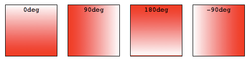

{{CSSRef}}

**CSS gradients** are represented by the {{cssxref("&lt;gradient&gt;")}} data type, a special type of {{cssxref("&lt;image&gt;")}} made of a progressive transition between two or more colors. You can choose between three types of gradients: _linear_ (created with the {{cssxref("gradient/linear-gradient", "linear-gradient()")}} function), _radial_ (created with the {{cssxref("gradient/radial-gradient", "radial-gradient()")}} function), and _conic_ (created with the {{cssxref("gradient/conic-gradient", "conic-gradient()")}} function). You can also create repeating gradients with the {{cssxref("gradient/repeating-linear-gradient", "repeating-linear-gradient()")}}, {{cssxref("gradient/repeating-radial-gradient", "repeating-radial-gradient()")}}, and {{cssxref("gradient/repeating-conic-gradient", "repeating-conic-gradient()")}} functions.

Gradients can be used anywhere you would use an `<image>`, such as in backgrounds. Because gradients are dynamically generated, they can negate the need for the raster image files that traditionally were used to achieve similar effects. In addition, because gradients are generated by the browser, they look better than raster images when zoomed in, and can be resized on the fly.

We'll start by introducing linear gradients, then introduce features that are supported in all gradient types using linear gradients as the example, then move on to radial, conic and repeating gradients

## Using linear gradients

A linear gradient creates a band of colors that progress in a straight line.

### A basic linear gradient

To create the most basic type of gradient, all you need is to specify two colors. These are called _color stops_. You must have at least two, but you can have as many as you want.

```html hidden
<div class="simple-linear"></div>
```

```css hidden
div {
  width: 120px;
  height: 120px;
}
```

```css
.simple-linear {
  background: linear-gradient(blue, pink);
}
```

{{ EmbedLiveSample('A_basic_linear_gradient', 120, 120) }}

### Changing the direction

By default, linear gradients run from top to bottom. You can change their rotation by specifying a direction.

```html hidden
<div class="horizontal-gradient"></div>
```

```css hidden
div {
  width: 120px;
  height: 120px;
}
```

```css
.horizontal-gradient {
  background: linear-gradient(to right, blue, pink);
}
```

{{ EmbedLiveSample('Changing_the_direction', 120, 120) }}

### Diagonal gradients

You can even make the gradient run diagonally, from corner to corner.

```html hidden
<div class="diagonal-gradient"></div>
```

```css hidden
div {
  width: 200px;
  height: 100px;
}
```

```css
.diagonal-gradient {
  background: linear-gradient(to bottom right, blue, pink);
}
```

{{ EmbedLiveSample('Diagonal_gradients', 200, 100) }}

### Using angles

If you want more control over its direction, you can give the gradient a specific angle.

```html hidden
<div class="angled-gradient"></div>
```

```css hidden
div {
  width: 120px;
  height: 120px;
}
```

```css
.angled-gradient {
  background: linear-gradient(70deg, blue, pink);
}
```

{{ EmbedLiveSample('Using_angles', 120, 120) }}

When using an angle, `0deg` creates a vertical gradient running bottom to top, `90deg` creates a horizontal gradient running left to right, and so on in a clockwise direction. Negative angles run in the counterclockwise direction.



## Declaring colors & creating effects

All CSS gradient types are a range of position-dependent colors. The colors produced by CSS gradients can vary continuously with position, producing smooth color transitions. It is also possible to create bands of solid colors, and hard transitions between two colors. The following are valid for all gradient functions:

### Using more than two colors

You don't have to limit yourself to two colors—you may use as many as you like! By default, colors are evenly spaced along the gradient.

```html hidden
<div class="auto-spaced-linear-gradient"></div>
```

```css hidden
div {
  width: 120px;
  height: 120px;
}
```

```css
.auto-spaced-linear-gradient {
  background: linear-gradient(red, yellow, blue, orange);
}
```

{{ EmbedLiveSample('Using_more_than_two_colors', 120, 120) }}

### Positioning color stops

You don't have to leave your color stops at their default positions. To fine-tune their locations, you can give each one zero, one, or two percentage or, for radial and linear gradients, absolute length values. If you specify the location as a percentage, `0%` represents the starting point, while `100%` represents the ending point; however, you can use values outside that range if necessary to get the effect you want. If you leave a location unspecified, the position of that particular color stop will be automatically calculated for you, with the first color stop being at `0%` and the last color stop being at `100%`, and any other color stops being half way between their adjacent color stops.

```html hidden
<div class="multicolor-linear"></div>
```

```css hidden
div {
  width: 120px;
  height: 120px;
}
```

```css
.multicolor-linear {
   background: linear-gradient(to left, lime 28px, red 77%, cyan);
}
```

{{ EmbedLiveSample('Positioning_color_stops', 120, 120) }}

### Creating hard lines

To create a hard line between two colors, creating a stripe instead of a gradual transition, adjacent color stops can be set to the same location. In this example, the colors share a color stop at the `50%` mark, halfway through the gradient:

```html hidden
<div class="striped"></div>
```

```css hidden
div {
  width: 120px;
  height: 120px;
}
```

```css
.striped {
   background: linear-gradient(to bottom left, cyan 50%, palegoldenrod 50%);
}
```

{{ EmbedLiveSample('Creating_hard_lines', 120, 120) }}

### Gradient hints

By default, the gradient transitions evenly from one color to the next. You can include a color-hint to move the midpoint of the transition value to a certain point along the gradient. In this example, we've moved the midpoint of the transition from the 50% mark to the 10% mark.

```html hidden
<div class="color-hint"></div>
<div class="simple-linear"></div>
```

```css hidden
div {
  width: 120px;
  height: 120px; float: left; margin-right: 10px;
}
```

```css
.color-hint {
  background: linear-gradient(blue, 10%, pink);
}
.simple-linear {
  background: linear-gradient(blue, pink);
}
```

{{ EmbedLiveSample('Gradient_hints', 120, 120) }}

### Creating color bands & stripes

To include a solid, non-transitioning color area within a gradient, include two positions for the color stop. Color stops can have two positions, which is equivalent to two consecutive color stops with the same color at different positions. The color will reach full saturation at the first color stop, maintain that saturation through to the second color stop, and transition to the adjacent color stop's color through the adjacent color stop's first position.

```html hidden
<div class="multiposition-stops"></div>
<div class="multiposition-stop2"></div>
```

```css hidden
div {
  width: 120px;
  height: 120px;
  float: left; margin-right: 10px; box-sizing: border-box;
}
```

```css
.multiposition-stops {
   background: linear-gradient(to left,
       lime 20%, red 30%, red 45%, cyan 55%, cyan 70%, yellow 80% );
   background: linear-gradient(to left,
       lime 20%, red 30% 45%, cyan 55% 70%, yellow 80% );
}
.multiposition-stop2 {
   background: linear-gradient(to left,
      lime 25%, red 25%, red 50%, cyan 50%, cyan 75%, yellow 75% );
   background: linear-gradient(to left,
      lime 25%, red 25% 50%, cyan 50% 75%, yellow 75% );
}
```

{{ EmbedLiveSample('Creating_color_bands_stripes', 120, 120) }}

In the first example above, the lime goes from the 0% mark, which is implied, to the 20% mark, transitions from lime to red over the next 10% of the width of the gradient, reach solid red at the 30% mark, and staying solid red up until 45% through the gradient, where it fades to cyan, being fully cyan for 15% of the gradient, and so on.

In the second example, the second color stop for each color is at the same location as the first color stop for the adjacent color, creating a striped effect.

In both examples, the gradient is written twice: the first is the CSS Images Level 3 method of repeating the color for each stop and the second example is the CSS Images Level 4 multiple color stop method of including two color-stop-lengths in a linear-color-stop declaration.

### Controlling the progression of a gradient

By default, a gradient evenly progresses between the colors of two adjacent color stops, with the midpoint between those two color stops being the midpoint color value. You can control the {{Glossary("interpolation")}}, or progression, between two color stops by including a color hint location. In this example, the color reaches the midpoint between lime and cyan 20% of the way through the gradient rather than 50% of the way through. The second example does not contain the hint to highlight the difference the color hint can make:

```html hidden
<div class="colorhint-gradient"></div> <div class="regular-progression"></div>
```

```css hidden
div {
  width: 120px;
  height: 120px;
  float: left; margin-right: 10px; box-sizing: border-box;
}
```

```css
.colorhint-gradient {
  background: linear-gradient(to top, lime, 20%, cyan);
}
.regular-progression {
  background: linear-gradient(to top, lime, cyan);
}
```

{{ EmbedLiveSample('Controlling_the_progression_of_a_gradient', 120, 120) }}

### Overlaying gradients

Gradients support transparency, so you can stack multiple backgrounds to achieve some pretty fancy effects. The backgrounds are stacked from top to bottom, with the first specified being on top.

```html hidden
<div class="layered-image"></div>
```

```css hidden
div {
  width: 300px;
  height: 150px;
}
```

```css
.layered-image {
  background: linear-gradient(to right, transparent, mistyrose),
      url("critters.png");
}
```

{{ EmbedLiveSample('Overlaying_gradients', 300, 150) }}

### Stacked gradients

You can even stack gradients with other gradients. As long as the top gradients aren't entirely opaque, the gradients below will still be visible.

```html hidden
<div class="stacked-linear"></div>
```

```css hidden
div {
  width: 200px;
  height: 200px;
}
```

```css
.stacked-linear {
  background:
      linear-gradient(217deg, rgba(255,0,0,.8), rgba(255,0,0,0) 70.71%),
      linear-gradient(127deg, rgba(0,255,0,.8), rgba(0,255,0,0) 70.71%),
      linear-gradient(336deg, rgba(0,0,255,.8), rgba(0,0,255,0) 70.71%);
}
```

{{ EmbedLiveSample('Stacked_gradients', 200, 200) }}

## Using radial gradients

Radial gradients are similar to linear gradients, except that they radiate out from a central point. You can dictate where that central point is. You can also make them circular or elliptical.

### A basic radial gradient

As with linear gradients, all you need to create a radial gradient are two colors. By default, the center of the gradient is at the 50% 50% mark, and the gradient is elliptical matching the aspect ratio of it's box:

```html hidden
<div class="simple-radial"></div>
```

```css hidden
div {
  width: 240px;
  height: 120px;
}
```

```css
.simple-radial {
  background: radial-gradient(red, blue);
}
```

{{ EmbedLiveSample('A_basic_radial_gradient', 120, 120) }}

### Positioning radial color stops

Again like linear gradients, you can position each radial color stop with a percentage or absolute length.

```html hidden
<div class="radial-gradient"></div>
```

```css hidden
div {
  width: 120px;
  height: 120px;
}
```

```css
.radial-gradient {
  background: radial-gradient(red 10px, yellow 30%, #1e90ff 50%);
}
```

{{ EmbedLiveSample('Positioning_radial_color_stops', 120, 120) }}

### Positioning the center of the gradient

You can position the center of the gradient with keyterms, percentage, or absolute lengths, length and percentage values repeating if only one is present, otherwise in the order of position from the left and position from the top.

```html hidden
<div class="radial-gradient"></div>
```

```css hidden
div {
  width: 120px;
  height: 240px;
}
```

```css
.radial-gradient {
  background: radial-gradient(at 0% 30%, red 10px, yellow 30%, #1e90ff 50%);
}
```

{{ EmbedLiveSample('Positioning_the_center_of_the_gradient', 120, 120) }}

### Sizing radial gradients

Unlike linear gradients, you can specify the size of radial gradients. Possible values include `closest-corner`, `closest-side`, `farthest-corner`, and `farthest-side`, with `farthest-corner` being the default. Circles can also be sized with a length, and ellipses a length or percentage.

#### Example: closest-side for ellipses

This example uses the `closest-side` size value, which means the size is set by the distance from the starting point (the center) to the closest side of the enclosing box.

```html hidden
<div class="radial-ellipse-side"></div>
```

```css hidden
div {
  width: 240px;
  height: 100px;
}
```

```css
.radial-ellipse-side {
  background: radial-gradient(ellipse closest-side,
      red, yellow 10%, #1e90ff 50%, beige);
}
```

{{ EmbedLiveSample('Example_closest-side_for_ellipses', 240, 100) }}

#### Example: farthest-corner for ellipses

This example is similar to the previous one, except that its size is specified as `farthest-corner`, which sets the size of the gradient by the distance from the starting point to the farthest corner of the enclosing box from the starting point.

```html hidden
<div class="radial-ellipse-far"></div>
```

```css hidden
div {
  width: 240px;
  height: 100px;
}
```

```css
.radial-ellipse-far {
  background: radial-gradient(ellipse farthest-corner at 90% 90%,
      red, yellow 10%, #1e90ff 50%, beige);
}
```

{{ EmbedLiveSample('Example_farthest-corner_for_ellipses', 240, 100) }}

#### Example: closest-side for circles

This example uses `closest-side`, which makes the circle's radius to be the distance between the center of the gradient and the closest side. In this case the radius is the distance between the center and the bottom edge, because the gradient is placed 25% from the left and 25% from the bottom, and the div element's height is smaller than the width.

```html hidden
<div class="radial-circle-close"></div>
```

```css hidden
div {
  width: 240px;
  height: 120px;
}
```

```css
.radial-circle-close {
  background: radial-gradient(circle closest-side at 25% 75%,
      red, yellow 10%, #1e90ff 50%, beige);
}
```

{{ EmbedLiveSample('Example_closest-side_for_circles', 240, 120) }}

#### Example: length or percentage for ellipses

For ellipses only, you can size the ellipse using a length or percentage. The first value represents the horizontal radius, the second the vertical radius, where you use a percentage this corresponds to the size of the box in that dimension. In the below example I have used a percentage for the horizontal radius.

```html hidden
<div class="radial-ellipse-size"></div>
```

```css hidden
div {
  width: 240px;
  height: 120px;
}
```

```css
.radial-ellipse-size {
   background: radial-gradient(ellipse 50% 50px,
      red, yellow 10%, #1e90ff 50%, beige);
}
```

{{ EmbedLiveSample('Example_length_or_percentage_for_ellipses', 240, 120) }}

#### Example: length for circles

For circles the size may be given as a [\<length>](/en-US/docs/Web/CSS/length), which is the size of the circle.

```html hidden
<div class="radial-circle-size"></div>
```

```css hidden
div {
  width: 240px;
  height: 120px;
}
```

```css
.radial-circle-size {
  background: radial-gradient(circle 50px,
      red, yellow 10%, #1e90ff 50%, beige);
}
```

{{ EmbedLiveSample('Example_length_for_circles', 240, 120) }}

### Stacked radial gradients

Just like linear gradients, you can also stack radial gradients. The first specified is on top, the last on the bottom.

```html hidden
<div class="stacked-radial"></div>
```

```css hidden
div {
  width: 200px;
  height: 200px;
}
```

```css
.stacked-radial {
  background:
      radial-gradient(circle at 50% 0,
        rgba(255,0,0,.5),
        rgba(255,0,0,0) 70.71%),
      radial-gradient(circle at 6.7% 75%,
        rgba(0,0,255,.5),
        rgba(0,0,255,0) 70.71%),
      radial-gradient(circle at 93.3% 75%,
        rgba(0,255,0,.5),
        rgba(0,255,0,0) 70.71%) beige;
  border-radius: 50%;
}
```

{{ EmbedLiveSample('Stacked_radial_gradients', 200, 200) }}

## Using conic gradients

The **`conic-gradient()`** [CSS](/en-US/docs/Web/CSS) function creates an image consisting of a gradient with color transitions rotated around a center point (rather than radiating from the center). Example conic gradients include pie charts and {{glossary("color wheel", "color wheels")}}, but they can also be used for creating checker boards and other interesting effects.

The conic-gradient syntax is similar to the radial-gradient syntax, but the color-stops are placed around a gradient arc, the circumference of a circle, rather than on the gradient line emerging from the center of the gradient, and the color-stops are percentages or degrees: absolute lengths are not valid.

In a radial gradient, the colors transition from the center of an ellipse, outward, in all directions. With conic gradients, the colors transition as if spun around the center of a circle, starting at the top and going clockwise. Similar to radial gradients, you can position the center of the gradient. Similar to linear gradients, you can change the gradient angle.

### A basic conic gradient

As with linear and radial gradients, all you need to create a conic gradient are two colors. By default, the center of the gradient is at the 50% 50% mark, with the start of the gradient facing up:

```html hidden
<div class="simple-conic"></div>
```

```css hidden
div {
  width: 120px;
  height: 120px;
}
```

```css
.simple-conic {
  background: conic-gradient(red, blue);
}
```

{{ EmbedLiveSample('A_basic_conic_gradient', 120, 120) }}

### Positioning the conic center

Like radial gradients, you can position the center of the conic gradient with keyterms, percentage, or absolute lengths, with the keyword "at"

```html hidden
<div class="conic-gradient"></div>
```

```css hidden
div {
  width: 120px;
  height: 120px;
}
```

```css
.conic-gradient {
  background: conic-gradient(at 0% 30%, red 10%, yellow 30%, #1e90ff 50%);
}
```

{{ EmbedLiveSample('Positioning_the_conic_center', 120, 120) }}

### Changing the angle

By default, the different color stops you specify are spaced equidistantly around the circle. You can position the starting angle of the conic gradient using the "from" keyword at the beginning followed by an angle or a length, and you can specify different positions for the colors stops by including an angle or length after them.

```html hidden
<div class="conic-gradient"></div>
```

```css hidden
div {
  width: 120px;
  height: 120px;
}
```

```css
.conic-gradient {
  background: conic-gradient(from 45deg, red, orange 50%, yellow 85%, green);
}
```

{{ EmbedLiveSample('Changing_the_angle', 120, 120) }}

## Using repeating gradients

The {{cssxref("gradient/linear-gradient", "linear-gradient()")}}, {{cssxref("gradient/radial-gradient", "radial-gradient()")}}, and {{cssxref("gradient/conic-gradient", "conic-gradient()")}} functions don't support automatically repeated color stops. However, the {{cssxref("gradient/repeating-linear-gradient", "repeating-linear-gradient()")}}, {{cssxref("gradient/repeating-radial-gradient", "repeating-radial-gradient()")}}, and {{cssxref("gradient/repeating-conic-gradient", "repeating-conic-gradient()")}} functions are available to offer this functionality.

The size of the gradient line or arc that repeats is the length between the first color stop value and the last color stop length value. If the first color stop just has a color and no color stop length, the value defaults to 0. If the last color stop has just a color and no color stop length, the value defaults to 100%. If neither is declared, the gradient line is 100% meaning the linear and conic gradients will not repeat and the radial gradient will only repeat if the radius of the gradient is smaller than the length between the center of the gradient and the farthest corner. If the first color stop is declared, and the value is greater than 0, the gradient will repeat, as the size of the line or arc is the difference between the first color stop and last color stop is less than 100% or 360 degrees.

### Repeating linear gradients

This example uses {{cssxref("gradient/repeating-linear-gradient", "repeating-linear-gradient()")}} to create a gradient that progresses repeatedly in a straight line. The colors get cycled over again as the gradient repeats. In this case the gradient line is 10px long.

```html hidden
<div class="repeating-linear"></div>
```

```css hidden
div {
  width: 120px;
  height: 120px;
}
```

```css
.repeating-linear {
  background: repeating-linear-gradient(-45deg, red, red 5px, blue 5px, blue 10px);
}
```

{{ EmbedLiveSample('Repeating_linear_gradients', 120, 120) }}

### Multiple repeating linear gradients

Similar to regular linear and radial gradients, you can include multiple gradients, one on top of the other. This only makes sense if the gradients are partially transparent allowing subsequent gradients to show through the transparent areas, or if you include different [background-sizes](/en-US/docs/Web/CSS/background-size), optionally with different [background-position](/en-US/docs/Web/CSS/background-position) property values, for each gradient image. We are using transparency.

In this case the gradient lines are 300px, 230px, and 300px long.

```html hidden
<div class="multi-repeating-linear"></div>
```

```css hidden
div {
  width: 600px;
  height: 400px;
}
```

```css
.multi-repeating-linear {
  background:
      repeating-linear-gradient(190deg, rgba(255, 0, 0, 0.5) 40px,
        rgba(255, 153, 0, 0.5) 80px, rgba(255, 255, 0, 0.5) 120px,
        rgba(0, 255, 0, 0.5) 160px, rgba(0, 0, 255, 0.5) 200px,
        rgba(75, 0, 130, 0.5) 240px, rgba(238, 130, 238, 0.5) 280px,
        rgba(255, 0, 0, 0.5) 300px),
      repeating-linear-gradient(-190deg, rgba(255, 0, 0, 0.5) 30px,
        rgba(255, 153, 0, 0.5) 60px, rgba(255, 255, 0, 0.5) 90px,
        rgba(0, 255, 0, 0.5) 120px, rgba(0, 0, 255, 0.5) 150px,
        rgba(75, 0, 130, 0.5) 180px, rgba(238, 130, 238, 0.5) 210px,
        rgba(255, 0, 0, 0.5) 230px),
      repeating-linear-gradient(23deg, red 50px, orange 100px,
        yellow 150px, green 200px, blue 250px,
        indigo 300px, violet 350px, red 370px);
}
```

{{ EmbedLiveSample('Multiple_repeating_linear_gradients', 600, 400) }}

### Plaid gradient

To create plaid we include several overlapping gradients with transparency. In the first background declaration we listed every color stop separately. The second background property declaration using the multiple position color stop syntax:

```html hidden
<div class="plaid-gradient"></div>
```

```css hidden
div {
  width: 200px;
  height: 200px;
}
```

```css
.plaid-gradient {
  background:
      repeating-linear-gradient(90deg, transparent, transparent 50px,
        rgba(255, 127, 0, 0.25) 50px, rgba(255, 127, 0, 0.25) 56px,
        transparent 56px, transparent 63px,
        rgba(255, 127, 0, 0.25) 63px, rgba(255, 127, 0, 0.25) 69px,
        transparent 69px, transparent 116px,
        rgba(255, 206, 0, 0.25) 116px, rgba(255, 206, 0, 0.25) 166px),
      repeating-linear-gradient(0deg, transparent, transparent 50px,
        rgba(255, 127, 0, 0.25) 50px, rgba(255, 127, 0, 0.25) 56px,
        transparent 56px, transparent 63px,
        rgba(255, 127, 0, 0.25) 63px, rgba(255, 127, 0, 0.25) 69px,
        transparent 69px, transparent 116px,
        rgba(255, 206, 0, 0.25) 116px, rgba(255, 206, 0, 0.25) 166px),
      repeating-linear-gradient(-45deg, transparent, transparent 5px,
        rgba(143, 77, 63, 0.25) 5px, rgba(143, 77, 63, 0.25) 10px),
      repeating-linear-gradient(45deg, transparent, transparent 5px,
        rgba(143, 77, 63, 0.25) 5px, rgba(143, 77, 63, 0.25) 10px);

  background:
      repeating-linear-gradient(90deg, transparent 0 50px,
        rgba(255, 127, 0, 0.25) 50px 56px,
        transparent 56px 63px,
        rgba(255, 127, 0, 0.25) 63px 69px,
        transparent 69px 116px,
        rgba(255, 206, 0, 0.25) 116px 166px),
      repeating-linear-gradient(0deg, transparent 0 50px,
        rgba(255, 127, 0, 0.25) 50px 56px,
        transparent 56px 63px,
        rgba(255, 127, 0, 0.25) 63px 69px,
        transparent 69px 116px,
        rgba(255, 206, 0, 0.25) 116px 166px),
      repeating-linear-gradient(-45deg, transparent 0 5px,
        rgba(143, 77, 63, 0.25) 5px 10px),
      repeating-linear-gradient(45deg, transparent 0 5px,
        rgba(143, 77, 63, 0.25) 5px 10px);
}
```

{{ EmbedLiveSample('Plaid_gradient', 200, 200) }}

### Repeating radial gradients

This example uses {{cssxref("gradient/repeating-radial-gradient", "repeating-radial-gradient()")}} to create a gradient that radiates repeatedly from a central point. The colors get cycled over and over as the gradient repeats.

```html hidden
<div class="repeating-radial"></div>
```

```css hidden
div {
  width: 120px;
  height: 120px;
}
```

```css
.repeating-radial {
  background: repeating-radial-gradient(black, black 5px, white 5px, white 10px);
}
```

{{ EmbedLiveSample('Repeating_radial_gradients', 120, 120) }}

### Multiple repeating radial gradients

```html hidden
<div class="multi-target"></div>
```

```css hidden
div {
  width: 250px;
  height: 150px;
}
```

```css
.multi-target {
  background:
      repeating-radial-gradient(ellipse at 80% 50%,rgba(0,0,0,0.5),
        rgba(0,0,0,0.5) 15px, rgba(255,255,255,0.5) 15px,
        rgba(255,255,255,0.5) 30px) top left no-repeat,
      repeating-radial-gradient(ellipse at 20% 50%,rgba(0,0,0,0.5),
        rgba(0,0,0,0.5) 10px, rgba(255,255,255,0.5) 10px,
        rgba(255,255,255,0.5) 20px) top left no-repeat yellow;
  background-size: 200px 200px, 150px 150px;
}
```

{{ EmbedLiveSample('Multiple_repeating_radial_gradients', 250, 150) }}

## See also

- Gradient functions: {{cssxref("gradient/linear-gradient", "linear-gradient()")}}, {{cssxref("gradient/radial-gradient", "radial-gradient()")}}, {{cssxref("gradient/conic-gradient", "conic-gradient()")}}, {{cssxref("gradient/repeating-linear-gradient", "repeating-linear-gradient()")}}, {{cssxref("gradient/repeating-radial-gradient", "repeating-radial-gradient()")}}, {{cssxref("gradient/repeating-conic-gradient", "repeating-conic-gradient()")}}
- Gradient-related CSS data types: {{cssxref("&lt;gradient&gt;")}}, {{cssxref("&lt;image&gt;")}}
- Gradient-related CSS properties: {{cssxref("background")}}, {{cssxref("background-image")}}
- [CSS Gradients Patterns Gallery, by Lea Verou](https://projects.verou.me/css3patterns/)
- [CSS Gradients Library, by Estelle Weyl](http://standardista.com/cssgradients/)
- [Gradient CSS Generator](https://cssgenerator.org/gradient-css-generator.html)
