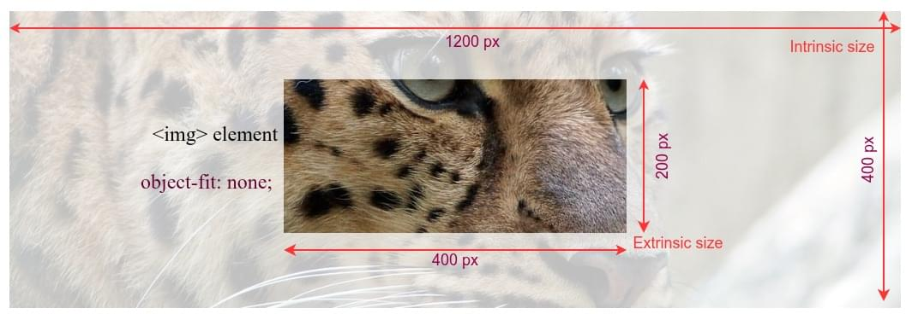

The {{cssxref("object-view-box")}} property can be used to define a viewbox within {{glossary("replaced elements")}}, enabling the display of just a section of the replaced content. The subsection of the element displayed can be presented as zoomed-in, zoomed-out, or at original size, while maintaining the content's intrinsic {{glossary("aspect ratio")}}. In this guide, we examine this property, comparing it to the similar {{cssxref("object-fit")}} property, and explore its functionality through zooming in and out, as well as panning across an element.

## Intrinsic size, extrinsic size, and `object-fit`

Every replaced elements has two sizes; an {{glossary("extrinsic size")}} and an {{glossary("intrinsic size")}}.

The extrinsic size is the dimension of the HTML element in which the content is rendered based on the box and visual formatting models. The [box model](/en-US/docs/Web/CSS/CSS_box_model/Introduction_to_the_CSS_box_model) and [visual formatting model](/en-US/docs/Web/CSS/CSS_display/Visual_formatting_model) determine the size of rendered elements based on content, HTML attributes, CSS applied to the elements and their ancestors, and the viewport size.

The intrinsic size is the actual size of the content itself; the size the element is when no styles are applied and without any layout constraints. While the intrinsic and extrinsic sizes don't have to be the same, it is generally important to maintain a replaced element's intrinsic {{glossary("aspect ratio")}}.

## `object-view-box` versus `object-fit`

CSS has many sizing properties. When it comes to sizing replaced elements, the [`object-fit`](/en-US/docs/Web/CSS/object-fit) property enables us to control, to some extent, how replaced elements are rendered within a defined box. For example, in the following screenshot, a 1200 x 400 image is displayed using an {{htmlelement("img")}} element. The `` element is sized to 400 x 200. The image content is positioned using `object-fit: none;` declaration.


The `object-view-box` property is more flexible than the `object-fit` property, and it is capable of doing more things. For example, it can be used to crop, zoom, and pan images. The property sets the viewable area (viewbox), which defines what part of the content to show and how to fit it inside the extrinsic size. The viewbox value contains a rectangle and its position relative to the intrinsic area of the content, but the _physical size of the view box remains equal to the extrinsic size_. The viewbox marks the area in the content to be displayed, and then the content area is transformed to match the extrinsic dimensions fitting into the HTML element.

In the following image, we have the same leopard picture in a 400 x 150 image element. However, this time we have used `object-view-box` property to crop the portion of the picture showing the leopard's eyes.


In this case, as the dimensions of the `` element and the viewbox defined by the `object-view-box` property are the same, i.e., 400 x 150 pixels, the aspect ratios of both are the same, and the replaced element is neither scaled nor distorted.

Maintaining the same {{glossary("aspect ratio")}} prevents image distortion. With `object-view-box`, we can accomplish various image operations while having different extrinsic and view box sizes, without distorting the replaced element as it scales up and down.

## Zooming in and out

Reducing the viewbox size, the area of the replaced element that is displayed, increases the zoom-in effect, because smaller content is stretched to fit the HTML element's dimensions. Decreasing it gives it a zoom-out effect.

This example demonstrates using the `object-view-box` property to zoom a section of a replaced element in and out, within a statically sized HTML element. In this case, the eye of the leopard, within a very large image, serves as the focal point of the zoom effect.

### HTML

We include an {{htmlelement("img")}} element and a [`range`](Web/HTML/Reference/Elements/input/range) {{htmlelement("input")}} element, with an associated {{htmlelement("label")}}. The natural dimensions, or intrinsic size, of the original leopard image are `1244px` wide by `416px` tall, with an {{glossary("aspect ratio")}} of `3:1`.

```html

<p>
  <label for="box-size">Zoom-in: </label>
  <input type="range" id="box-size" min="115" max="380" value="150" />
</p>
<output></output>
```

### CSS

We define a `--box-size` custom property, which is used as the height and width in the {{cssxref("basic-shape/xywh", "xywh()")}} function, creating a square viewbox with an aspect ratio of `1:1`. The view box's offset point, the focal point in our zoom effect, is set at `500px` for the `x` coordinate and `30px` for the `y` coordinate, which corresponds to the top-left corner of the leopard's right eye.

```css hidden
input {
  width: 350px;
}

output {
  text-align: center;
  background-color: #dedede;
  font-family: monospace;
  padding: 5px;
  display: block;
}

@supports not (object-view-box: none) {
  body::before {
    content: "Your browser does not support the 'object-view-box' property.";
    color: black;
    background-color: #ffcd33;
    display: block;
    width: 100%;
    text-align: center;
  }
}
```

```css
img {
  width: 350px;
  height: 350px;
  border: 2px solid red;

  --box-size: 150px;
  object-view-box: xywh(500px 30px var(--box-size) var(--box-size));
}
```

### JavaScript

We add an event listener to the slider that updates the value of the `--boxSize` custom property when the user interacts with it. To increase the zoom-in effect when the slider is moved to the right, the slider's value is inverted by subtracting it from `500px`, as reducing the view box size increases the zoom-in effect.

```js
const img = document.querySelector("img");
const zoom = document.getElementById("box-size");
const output = document.querySelector("output");

function update() {
  const size = 500 - zoom.value;
  img.style.setProperty("--box-size", `${size}px`);
  output.innerText = `object-view-box: xywh(500px 30px ${size}px ${size}px);`;
}

zoom.addEventListener("input", update);
update();
```

### Result

{{ EmbedLiveSample("Zooming in and out", "", 480) }}

Move the slider to the right to increase the zoom-in effect and left to reduce it. The slider only affects the dimensions of the view box, while the x and y values, the origin point of the viewbox, remain constant. The size of the `` element also remains constant.

## Panning an image

We can create a panning effect by changing the coordinates of the view box window, the `x` and `y` components of the `xywh()` function, while keeping the size of the visible section constant. For example, by keeping the view box dimensions constant and changing only the horizontal position - the `x` parameter - we can create a horizontal panning effect.

```html hidden

<p>
  <label for="position">Left offset: </label>
  <input type="range" id="position" min="0" max="900" value="450" />
  <output>
</p>
```

```css hidden
input {
  width: 350px;
}

@supports not (object-view-box: none) {
  body::before {
    content: "Your browser does not support the 'object-view-box' property.";
    color: black;
    background-color: #ffcd33;
    display: block;
    width: 100%;
    text-align: center;
  }
}
output {
  text-align: center;
  background-color: #dedede;
  font-family: monospace;
  padding: 5px;
  display: block;
}

img {
  width: 350px;
  height: 350px;

  --x-position: 0;
  object-view-box: xywh(var(--x-position) 30px 350px 350px);
}
```

```js hidden
const img = document.querySelector("img");
const position = document.getElementById("position");
const output = document.querySelector("output");

function update() {
  img.style.setProperty("--x-position", `${position.value}px`);
  output.innerText = `xywh(${position.value}px 30px 350px 350px);`;
}

position.addEventListener("input", update);
update();
```

{{ EmbedLiveSample("Panning effect", "", 450) }}

Move the slider. Note how increasing and decreasing the `x` value of the `xywh()` function creates a panning effect.

## See also

- {{cssxref("object-view-box")}}
- {{cssxref("object-fit")}}
- {{cssxref("object-position")}}
- {{cssxref("background-size")}}
- [Understanding aspect ratio](/en-US/docs/Web/CSS/CSS_box_sizing/Understanding_aspect-ratio)
