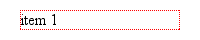
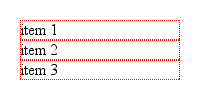
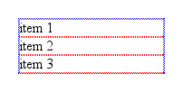
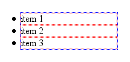
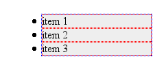
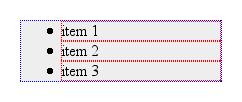

{{CSSRef}}

One of the most common style changes made to lists is a change in the indentation distance—that is, how far the list items are pushed over to the right. This often leads to frustration, because what works in one browser often doesn't have the same effect in another. For example, if you declare that lists have no left margin, they sit stubbornly in place in Gecko-based browsers. This article will help you understand the problems that can occur and how to avoid them.

To understand why this is the case, and more importantly how to avoid the problem altogether, it's necessary to examine the details of list construction.

## Making a List

First, we consider a single, pure list item. This list item has no marker (otherwise known as a "bullet") and is not yet part of a list itself. It hangs alone in the void, simple and unadorned, as shown in Figure 1.



That dotted red border represents the outer edges of the content area of the list item. Remember that, at this point, the list item has no padding or borders. If we add two more list items, we get a result like that shown in Figure 2.



Now we wrap these in a parent element; in this case, we'll wrap them in an unordered list (i.e., `<ul>`). According to the CSS box model, the list items' boxes must be displayed within the parent element's content area. Since that parent has no padding or margins yet, we get the situation shown in Figure 3.



Here, the dotted blue border shows us the edges of the `<ul>` element's content area. Since we have no padding for the `<ul>` element, its content wraps snugly around the three list items.

Now we add the list item markers. Since this is an unordered list, we'll add traditional filled-circle "bullets," as shown in Figure 4.



Visually, the markers are _outside_ the content area of the `<ul>`, but that's not the important part here. What's key is that the markers are placed outside the "principal box" of the `<li>` elements, not the `<ul>`. They're sort of like appendages to the list items, hanging outside the content-area of the `<li>` but still attached to the `<li>`.

This is why, in every modern browser, markers are placed outside any border set for an `<li>` element, assuming the value of `list-style-position` is `outside`. If it's changed to `inside`, then the markers are brought inside the `<li>`'s content, as though they're an inline box placed at the very beginning of the `<li>`.

## Indenting It Twice

So how will all this appear in a document? At the moment, we have a situation analogous to these styles:

```css
ul,
li {
  margin-left: 0;
  padding-left: 0;
}
```

If we dropped this list into a document as-is, there would be no apparent indentation and the markers would be in danger of falling off the left edge of the browser window.

To avoid this and get some indentation, there are only three options available to browser implementors.

1. Give each `<li>` element a left margin.
2. Give the `<ul>` element a left margin.
3. Give the `<ul>` element some left padding.

As it turns out, nobody seems to have used the first option. The second option was taken by Opera. The third was adopted by Firefox.

Let's look at the two approaches for a moment. In Opera, the lists are indented by setting a left margin of 40 pixels on the `<ul>` element. If we apply a background color to the `<ul>` element and leave the list item and `<ul>` borders in place, we get the result shown in Figure 5.



Gecko, on the other hand, sets a left _padding_ of 40 pixels for the `<ul>` element, so given the exact same styles as were used to produce Figure 5, loading the example into a Gecko-based browser gives us Figure 6.



As we can see, the markers remain attached to the `<li>` elements, no matter where they are. The difference is entirely in how the `<ul>` is styled. We can only see the difference if we try to set a background or border on the `<ul>` element.

## Finding Consistency

Boil it all down, and what we're left with is this: if you want consistent rendering of lists between Gecko and Opera, you need to set **both** the left margin and left padding of the `<ul>` element. We can ignore `<li>` altogether for these purposes. If you want to reproduce the default display in Netscape 6.x, you write:

```css
ul {
  margin-left: 0;
  padding-left: 40px;
}
```

If you're more interested in following the Opera model, then:

```css
ul {
  margin-left: 40px;
  padding-left: 0;
}
```

Of course, you can fill in your preferred values. Set both to `1.25em`, if you like — there's no reason why you have to stick with pixel-based indentation. If you want to reset lists to have no indentation, then you still have to zero out both padding and margin:

```css
ul {
  margin-left: 0;
  padding-left: 0;
}
```

Remember, though, that in so doing, you'll have the bullets hanging outside the list and its parent element. If the parent is the `body`, there's a strong chance your bullets will be completely outside the browser window, and thus will not be visible.

## Conclusion

In the end, we can see that none of the browsers mentioned in this article is right or wrong about how they lay out lists. They use different default styles, and that's where the problems creep in. By making sure you style both the left padding and left margin of lists, you can find much greater cross-browser consistency in your list indentation.

## Recommendations

- When altering the indentation of lists, make sure to set both the padding and margin.

## Original Document Information

- Author(s): Eric A. Meyer, Netscape Communications
- Last Updated Date: Published 30 Aug 2002
- Copyright Information: Copyright © 2001-2003 Netscape. All rights reserved.
- Note: This reprinted article was originally part of the DevEdge site.
