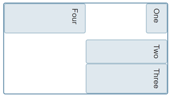
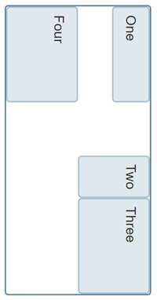
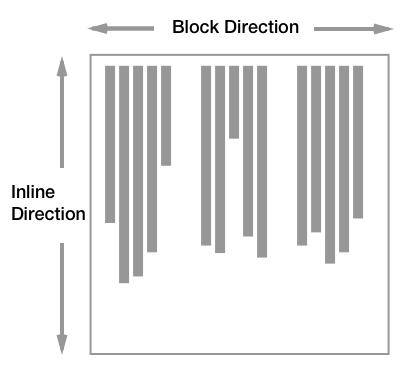

{{CSSRef}}

The Logical Properties and Values Specification introduces flow-relative mappings for many of the properties and values in CSS. This article introduces the specification, and explains flow relative properties and values.

## Why do we need logical properties?

CSS traditionally has sized things according to the physical dimensions of the screen. Therefore we describe boxes as having a {{CSSxRef("width")}} and {{CSSxRef("height")}}, position items from the `top` and `left`, float things left, assign borders, margin, and padding to the `top`, `right`, `bottom`, `left`, etc. The [Logical Properties and Values specification](https://drafts.csswg.org/css-logical/) defines mappings for these physical values to their logical, or flow relative, counterparts — e.g. `start` and `end` as opposed to `left` and `right`/`top` and `bottom`.

An example of why these mappings might be needed is as follows. I have a Layout using CSS Grid, the grid container has a width applied and I am using the {{CSSxRef("align-self")}} and {{CSSxRef("justify-self")}} properties to align the items. These properties are flow relative — `justify-self: start` aligns the item to the start on the inline dimension, `align-self: start` does the same on the block dimension.

If I now change the writing mode of this component to `vertical-rl` using the {{CSSxRef("writing-mode")}} property, the alignment continues to work in the same way. The inline dimension is now running vertically and the block dimension horizontally. The grid doesn't look the same, however, as the width assigned to the container is a horizontal measure, a measure tied to the physical and not the logical or flow relative running of the text.

If instead of the `width` property we use the logical property {{CSSxRef("inline-size")}}, the component now works the same way no matter which writing mode it is displayed using.

You can try this out in the live example below. Change `writing-mode` from `vertical-rl` to `horizontal-tb` on `.grid` to see how the different properties change the layout.

{{EmbedGHLiveSample("css-examples/logical/intro-grid-example.html", '100%', 700)}}

When working with a site in a writing mode other than a horizontal, top to bottom one, or when using writing modes for creative reasons, being able to relate to the flow of the content makes a lot of sense.

## Block and inline dimensions

A key concept of working with flow relative properties and values is the two dimensions of block and inline. As we saw above, newer CSS layout methods such as Flexbox and Grid Layout use the concepts of `block` and `inline` rather than `right` and `left`/`top` and `bottom` when aligning items.

The `inline` dimension is the dimension along which a line of text runs in the writing mode in use. Therefore, in an English document with the text running horizontally left to right, or an Arabic document with the text running horizontally right to left, the inline dimension is _horizontal_. Switch to a vertical writing mode (e.g. a Japanese document) and the inline dimension is now _vertical_, as lines in that writing mode run vertically.

The block dimension is the other dimension, and the direction in which blocks — such as paragraphs — display one after the other. In English and Arabic, these run vertically, whereas in any vertical writing mode these run horizontally.

The below diagram shows the inline and block directions in a horizontal writing mode:

This diagram shows block and inline in a vertical writing mode:

## See also

- [Box Alignment in Grid Layout](/en-US/docs/Web/CSS/CSS_Grid_Layout/Box_Alignment_in_CSS_Grid_Layout)
- [Box Alignment in Flex Layout](/en-US/docs/Web/CSS/CSS_Box_Alignment/Box_Alignment_in_Flexbox)
- [Understanding Logical Properties and Values](https://www.smashingmagazine.com/2018/03/understanding-logical-properties-values/)
- [Writing Modes](/en-US/docs/Web/CSS/CSS_Flow_Layout/Flow_Layout_and_Writing_Modes)
