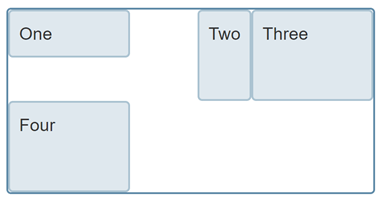
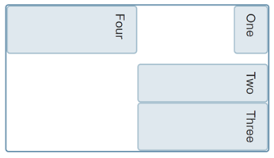
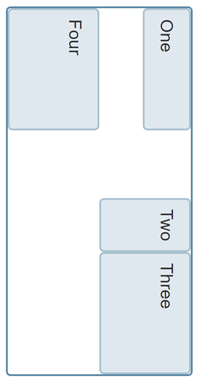
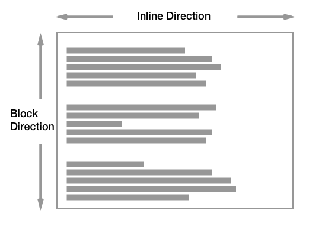
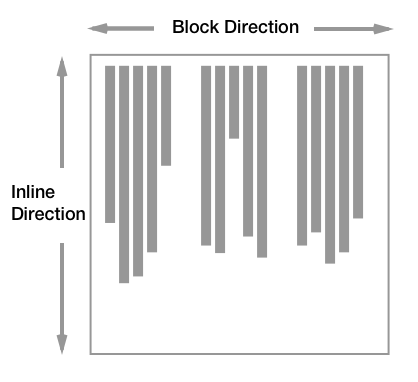

{{CSSRef}}

The [CSS logical properties and values module](/en-US/docs/Web/CSS/CSS_logical_properties_and_values#properties) defines flow-relative mappings for many of the {{glossary("physical properties")}} and values in CSS. This article discusses this module, and explains {{glossary("flow relative values")}} and properties.

## Why are logical properties useful

CSS 2.1 and earlier had sized things according to the physical dimensions of the screen. Therefore we describe boxes as having a {{CSSxRef("width")}} and {{CSSxRef("height")}}, position items from the `top` and `left`, assign borders, margin, and padding to the `top`, `right`, `bottom`, `left`, etc. The Logical properties and values module defines mappings for these {{glossary("physical properties")}} and values to their logical, or flow relative, counterparts — e.g. `start` and `end` as opposed to `left` and `right`/`top` and `bottom`.

These mappings are very useful for sites that get translated into languages with a different writing mode than the original layout. For example, with a CSS grid layout, if the grid container has a width applied with the {{CSSxRef("align-self")}} and {{CSSxRef("justify-self")}} properties used to align the grid items, as these properties are flow relative, the `justify-self: start` aligns the item to the start on the inline dimension, and `align-self: start` does the same on the block dimension.



If the writing mode of this component is changed to `vertical-rl` using the {{CSSxRef("writing-mode")}} property, the alignment continues to work in the same way. The inline dimension will run vertically and the block dimension horizontally. The grid doesn't look the same, however, as the width assigned to the container is a horizontal measure, a measure tied to the physical and not the logical or flow relative running of the text.



If instead of the `width` property, the logical property {{CSSxRef("inline-size")}} is used, the component will work the same way no matter which writing mode it is displayed using.



You can try this out in the live example below. Change `writing-mode` from `vertical-rl` to `horizontal-tb` on `.grid` to see how the different properties change the layout.

```html live-sample___intro-grid-example
<div class="grid">
  <div>One</div>
  <div>Two</div>
  <div>Three</div>
  <div>Four</div>
</div>
```

```css hidden live-sample___intro-grid-example
body {
  font: 1.2em / 1.5 sans-serif;
}

.grid {
  display: grid;
  grid-template-columns: repeat(3, 1fr);
  grid-auto-rows: minmax(100px, auto);
  border: 2px solid rgb(96 139 168);
  border-radius: 5px;
}

.grid > * {
  border-radius: 5px;
  border: 2px solid rgb(96 139 168 / 0.4);
  background-color: rgb(96 139 168 / 0.2);
  padding: 10px;
}

.grid :nth-child(1) {
  align-self: start;
}

.grid :nth-child(2) {
  justify-self: end;
}
```

```css live-sample___intro-grid-example
.grid {
  writing-mode: vertical-rl;
  inline-size: 400px;
}
```

{{EmbedLiveSample("intro-grid-example", "", "450px")}}

When working with a site in a writing mode other than a horizontal, top-to-bottom one, or when using writing modes for creative reasons, being able to relate to the flow of the content makes a lot of sense.

## Block and inline dimensions

A key concept of working with flow relative properties and values is the two dimensions of block and inline. CSS layout methods such as flexbox and grid layout use the concepts of `block` and `inline` rather than `right` and `left`/`top` and `bottom` when aligning items.

The `inline` dimension is the dimension along which a line of text runs in the writing mode in use. Therefore, in an English document with the text running horizontally left-to-right, or an Arabic document with the text running horizontally right-to-left, the inline dimension is _horizontal_. Switch to a vertical writing mode (e.g. a Japanese document) and the inline dimension is now _vertical_, as lines in that writing mode run vertically.

The block dimension is the other dimension, and the direction in which blocks — such as paragraphs — display one after the other. In English and Arabic, these run vertically, whereas in any vertical writing mode these run horizontally.

The below diagram shows the inline and block directions in a horizontal writing mode:



This diagram shows block and inline in a vertical writing mode:



## See also

- [Box alignment in grid layout](/en-US/docs/Web/CSS/CSS_box_alignment/Box_alignment_in_grid_layout)
- [Box alignment in flex layout](/en-US/docs/Web/CSS/CSS_box_alignment/Box_alignment_in_flexbox)
- [Flow layout and writing modes](/en-US/docs/Web/CSS/CSS_display/Flow_layout_and_writing_modes)
- [Understanding logical properties and values](https://www.smashingmagazine.com/2018/03/understanding-logical-properties-values/) on Smashing Magazine (2018)
