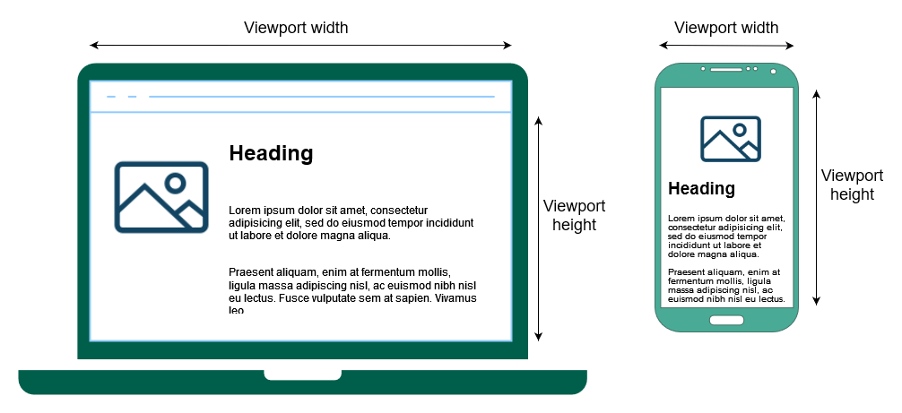

{{CSSRef}}

**CSS media queries** are a key component of [responsive design](/en-US/docs/Learn/CSS/CSS_layout/Responsive_Design) that allow you to apply CSS styles depending on the presence or value of device characteristics.

It's common to apply a media query based on the {{Glossary("viewport")}} size so that layout choices can be made for devices with different screen sizes.
For example, you may have a smaller font size for devices with small screens, increase the padding between paragraphs when a page is viewed in portrait mode, or increase the size of buttons on touchscreens.

In [CSS](/en-US/docs/Web/CSS), use the {{cssxref("@media")}} [at-rule](/en-US/docs/Web/CSS/At-rule) to conditionally apply part of a style sheet based on the result of a media query.
To conditionally apply an entire style sheet, use {{cssxref("@import")}}.

When designing reusable HTML components, you may also use [container queries](/en-US/docs/Web/CSS/CSS_container_queries), which allow you to apply styles based on the size of a containing element rather than the viewport or other device characteristics.

### Media queries in HTML

In [HTML](/en-US/docs/Web/HTML), media queries can be applied to various elements:

- In the {{HTMLElement("link")}} element's [`media`](/en-US/docs/Web/HTML/Element/link#media) attribute, they define the media to which a linked resource (typically CSS) should be applied.
- In the {{HTMLElement("source")}} element's [`media`](/en-US/docs/Web/HTML/Element/source#media) attribute, they define the media to which that source should be applied. (This is only valid inside {{HTMLElement("picture")}} elements.)
- In the {{HTMLElement("style")}} element's [`media`](/en-US/docs/Web/HTML/Element/style#media) attribute, they define the media to which the style should be applied.

### Media queries in JavaScript

In [JavaScript](/en-US/docs/Web/JavaScript), you can use the {{domxref("Window.matchMedia()")}} method to test the window against a media query.
You can also use {{domxref("MediaQueryList.addListener()")}} to be notified whenever the state of a query changes.
With this functionality, your site or app can respond to changes in the device configuration, orientation, or state.

You can learn more about programmatically using media queries in [Testing media queries](/en-US/docs/Web/CSS/CSS_media_queries/Testing_media_queries).

## Reference

### At-rules

- {{cssxref("@import")}}
- {{cssxref("@media")}}

## Guides

- [Using media queries](/en-US/docs/Web/CSS/CSS_media_queries/Using_media_queries)
  - : Introduces media queries, their syntax, and the operators and media features which are used to construct media query expressions.
- [Testing media queries programmatically](/en-US/docs/Web/CSS/CSS_media_queries/Testing_media_queries)
  - : Describes how to use media queries in your JavaScript code to determine the state of a device, and to set up listeners that notify your code when the results of media queries change (such as when the user rotates the screen or resizes the browser).
- [Using media queries for accessibility](/en-US/docs/Web/CSS/CSS_media_queries/Using_media_queries_for_accessibility)
  - : Learn how Media Queries can help users understand your website better.

## Specifications

{{Specifications}}

## See also

- [Container queries](/en-US/docs/Web/CSS/CSS_container_queries)
- Use {{cssxref("@supports")}} to apply styles that depend on browser support for various CSS technologies.
