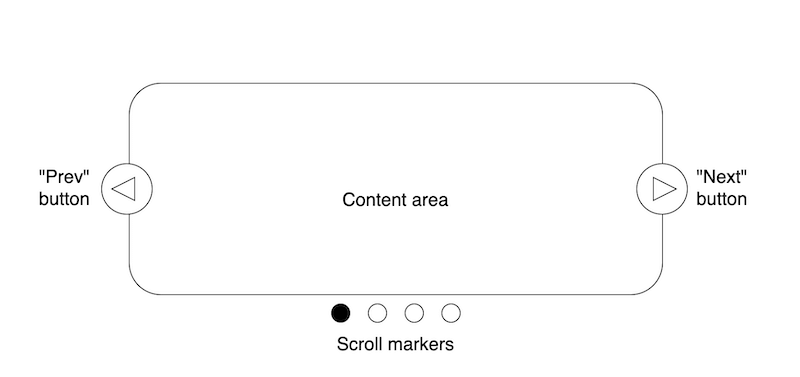

{{CSSRef}}

The [CSS overflow](/en-US/docs/Web/CSS/CSS_overflow) module defines features enabling the creation of pure-CSS carousel UI features that are flexible and accessible; this includes scroll buttons, scroll markers, and generated columns. This guide explains how to use these features.

## Carousel concepts

**Carousels** are a common feature on the web — they typically take the form of a scrolling content area at the start of a web page containing several articles such as ads, headline news stories, or key product features. Users can move through the articles by swiping, pressing **scroll buttons** (for example, "prev" and "next"), or activating a series of links representing each article (known as **scroll markers**).



A key feature of carousels is **pagination** — the articles feel like separate items that are moved between rather than forming one continuous section of content. You might show one article at a time, or several articles on each "page".

Historically, carousels were challenging to implement — they would involve JavaScript to wire up the scroll buttons and associate the scroll markers with the articles they represent, keeping them in sync with each other. They were also often not very accessible, and quite brittle in design.

## CSS carousel features

The CSS carousel features enable creating carousels using only CSS and HTML, with the browser handling most of the scrolling and link references in an accessible, flexible, consistent manner. These features are as follows:

- {{cssxref("::scroll-button()")}} pseudo-elements exist inside a {{glossary("scroll container")}} and represent scroll buttons, which will be wired up to scroll the container in the specified direction.
- The {{cssxref("::scroll-marker-group")}} pseudo-element exists inside a scroll container, and is used to collect together and lay out scroll markers.
- {{cssxref("::scroll-marker")}} pseudo-elements exist inside the children of a scroll container ancestor, and represent their scroll markers. These can be selected to scroll the container to their associated child elements, and are collected inside the ancestor's {{cssxref("::scroll-marker-group")}} for layout purposes.
- The {{cssxref(":target-current")}} pseudo-class can be used to select the currently-active scroll marker, to give it a highlight style.
- The {{cssxref("::column")}} pseudo-element represents the different column fragments of a container set to display in multiple columns via [CSS multi-column layout](/en-US/docs/Web/CSS/CSS_multicol_layout). This can be used to, for example, generate scroll markers for each column, regardless of what content has been placed inside them.

The examples below also use other features, including:

- [CSS scroll snap](/en-US/docs/Web/CSS/CSS_scroll_snap) to snap to each article or "page".
- The {{cssxref("columns")}} property, as a mechanism to split content up into arbitrary columns.
- The {{cssxref("interactivity")}} property, to render elements {{glossary("inert")}} when they are not being shown inside the carousel.
- [CSS anchor positioning](/en-US/docs/Web/CSS/CSS_anchor_positioning) to position the scroll buttons and scroll marker group relative to the carousel.
- [Flexbox](/en-US/docs/Web/CSS/CSS_flexible_box_layout) for additional layout/spacing.

Two demos are presented below:

- In the first one, each article of content takes up a full page of the carousel, and you can scroll between articles using the scroll buttons, etc. Flexbox is used in this case to force each article to take up the full width of the carousel.
- The second demo uses the `columns` property and the `::columns` pseudo-element to create arbitary columns that span the full width of the carousel, and contain multiple articles that can vary in number depending on the viewport width. In this case, the scroll markers are created per-column rather than per-article.

## Example markup

The HTML for the first demo consists of a [heading element](/en-US/docs/Web/HTML/Element/Heading_Elements) and an [unordered list](/en-US/docs/Web/HTML/Element/ul), with each [list item](/en-US/docs/Web/HTML/Element/li) containing some sample content that includes interactive elements ([links](/en-US/docs/Web/HTML/Element/a) and [buttons](/en-US/docs/Web/HTML/Element/button)):

```html live-sample___first-example
<h1>CSS carousel demo 1</h1>
<ul>
  <li>
    <h2>Page 1</h2>
    <p>This is the first page of content.</p>
    <p><a href="#">A demo link</a>.</p>
    <p><button>Press me</button></p>
  </li>
  <li>
    <h2>Page 2</h2>
    <p>This is the second page of content.</p>
    <p><a href="#">A demo link</a>.</p>
    <p><button>Press me</button></p>
  </li>
  <li>
    <h2>Page 3</h2>
    <p>This is the third page of content.</p>
    <p><a href="#">A demo link</a>.</p>
    <p><button>Press me</button></p>
  </li>
  <li>
    <h2>Page 4</h2>
    <p>This is the fourth page of content.</p>
    <p><a href="#">A demo link</a>.</p>
    <p><button>Press me</button></p>
  </li>
</ul>
```

The HTML for the second demo is very similar, except that there are significantly more list items, and each one contains less content:

```html-nolint
...
  <li>
    <h2>Item 1</h2>
      <p><a href="#">A demo link</a>.</p>
  </li>
...
```

## First example layout with flexbox

In the first example, the unordered list is given a {{cssxref("width")}} of `100vw` to force it to the full width of the viewport, a {{cssxref("height")}} of `300px`, and `20px` of {{cssxref("padding")}}. We then give it a {{cssxref("display")}} value of `flex` to force the child list items to display horizontally, and a {{cssxref("gap")}} of `4vw` between each one.

Finally, an {{cssxref("overflow-x")}} value of `scroll` is set so that the content will scroll horizontally, and a {{cssxref("scroll-snap-type")}} value of `x mandatory` to make it into a [scroll snap container](/en-US/docs/Glossary/Scroll_snap#scroll_snap_container). The `x` keyword causes the container's [snap targets](/en-US/docs/Glossary/Scroll_snap#snap_target) to be snapped to horizontally, whereas the `mandatory` keyword means that the container will always snap to a snap target at the end of a scrolling action.

```css hidden live-sample___first-example
* {
  box-sizing: border-box;
}

body {
  margin: 0;
  font-family: Arial, Helvetica, sans-serif;
}

h1 {
  text-align: center;
}

button {
  background-color: white;
}
```

```css live-sample___first-example
ul {
  width: 100vw;
  height: 300px;
  padding: 20px;
  display: flex;
  gap: 4vw;
  overflow-x: scroll;
  scroll-snap-type: x mandatory;
}
```

Now onto the list items — they are first given some rudimentary styling, followed by a {{cssxref("flex")}} value of `0 0 calc(100vw - 40px)` to force each one to be as wide as their container (the `<ul>`), minus the padding set on its inline ends. This causes the list items to be horizontally centered inside their container when visible. Next, a {{cssxref("scroll-snap-align")}} value of `center` is set so that, when the list is scrolled, it snaps to the center of each list item.

```css live-sample___first-example
li {
  list-style-type: none;
  background-color: #eee;
  border: 1px solid #ddd;
  padding: 20px;

  flex: 0 0 calc(100vw - 40px);

  scroll-snap-align: center;
}
```

## Setting inertness on non-visible articles

A series of property values are set on the list items to render them and their children {{glossary("inert")}} when they are not visible onscreen, via a [scroll-driven animation](/en-US/docs/Web/CSS/CSS_scroll-driven_animations):

- A {{cssxref("view-timeline")}} value of `--inertChange inline`, to declare the element as the subject of a _named view progress timeline_, progressed through in the inline direction. This is the element that will progress the view timeline as it moves through its ancestor scroll container.
- An {{cssxref("animation-timeline")}} value equal to the same name defined in the `view-timeline` value, which means that the named view progress timeline will be used to control the progress of animations applied to this element.
- An {{cssxref("animation-name")}} and {{cssxref("animation-fill-mode")}} defining the animation applied to this element and its fill mode. The `animation-fill-mode: both` value is required because you want the starting animation state to apply to the element before the animation starts, and the end animation state to apply to the element after the animation finishes. Otherwise, the `interactivity: inert` value (see below) won't apply to list items when they are outside the scroll container.

```css live-sample___first-example
li {
  view-timeline: --inertChange inline;
  animation-timeline: --inertChange;
  animation-name: inert-change;
  animation-fill-mode: both;
}
```

Next, the animation {{cssxref("@keyframes")}} are defined. An {{cssxref("interactivity")}} value of `inert` is set at positions `entry 0%` and `exit 100%` of the view timeline. Combined with the `animation-fill-mode: both` value, this means that the list items will be inert before the start and after the end of the view timeline, that is, when they are outside the scroll container. Between positions `entry 1%` and `exit 99%`, `interactivity: auto` is set on the list items, meaning they can be interacted with normally when they are inside the scroll container.

```css live-sample___first-example
@keyframes inert-change {
  entry 0%,
  exit 100% {
    interactivity: inert;
  }

  entry 1%,
  exit 99% {
    interactivity: auto;
  }
}
```

## Creating the scroll buttons

The {{cssxref("::scroll-button()")}} pseudo-elements are generated inside a scroll container only when their {{cssxref("content")}} properties are set to a value other than `none`. Each {{cssxref("::scroll-button()")}} represents a scroll button, the scrolling direction of which is specified by the selector's argument. You can generate up to four scroll buttons per scroll container, which will scroll the content towards the start and end of the block and inline axes.

You can also specify a value of `*` to target all of the {{cssxref("::scroll-button()")}} pseudo-elements with styles.

First, all scroll buttons are targeted with some rudimentary styles for different states. Note that scroll buttons are automatically set to [`disabled`](/en-US/docs/Web/HTML/Attributes/disabled) when no more scrolling can occur in that direction.

```css live-sample___first-example
ul::scroll-button(*) {
  border: 0;
  font-size: 2rem;
  background: none;
  color: rgb(0 0 0 / 0.7);
  cursor: pointer;
}

ul::scroll-button(*):hover,
ul::scroll-button(*):focus {
  color: rgb(0 0 0 / 1);
}

ul::scroll-button(*):active {
  translate: 1px 1px;
}

ul::scroll-button(*):disabled {
  color: rgb(0 0 0 / 0.2);
}
```

Next, an appropriate icon is set on the left and right scroll buttons via the `content` property, which is also what causes the scroll buttons to be generated:

```css live-sample___first-example
ul::scroll-button(left) {
  content: "◄";
}

ul::scroll-button(right) {
  content: "►";
}
```

### Positioning the scroll buttons

The scroll buttons are positioned relative to the carousel using [CSS anchor positioning](/en-US/docs/Web/CSS/CSS_anchor_positioning). First of all, a reference {{cssxref("anchor-name")}} is set on the list. Next, each scroll button has its {{cssxref("position")}} set to `absolute`, and its {{cssxref("position-anchor")}} property set to the same reference name defined on the list, to associate the two together.

```css live-sample___first-example
ul {
  anchor-name: --myCarousel;
}

ul::scroll-button(*) {
  position: absolute;
  position-anchor: --myCarousel;
}
```

To actually position each scroll button, we set values on their {{glossary("inset properties")}} that use {{cssxref("anchor()")}} functions to position the specified sides of the buttons relative to the sides of the carousel. In each case, the {{cssxref("calc()")}} function is used to add some space between the button edge and the carousel edge. So for example, the right-hand edge of the left scroll button is positioned 70 pixels to the right of the carousel's left-hand edge.

```css live-sample___first-example
ul::scroll-button(left) {
  right: calc(anchor(left) - 70px);
  bottom: calc(anchor(top) + 21px);
}

ul::scroll-button(right) {
  left: calc(anchor(right) - 70px);
  bottom: calc(anchor(top) + 21px);
}
```

## Creating the scroll markers

Creating the scroll markers involves three main features:

- The {{cssxref("scroll-marker-group")}} property needs to be set to a non-`none` value for the {{cssxref("::scroll-marker-group")}} pseudo-element to be generated.
- The {{cssxref("::scroll-marker-group")}} pseudo-element exists inside a scroll container, and is used to collect together and lay out scroll markers.
- {{cssxref("::scroll-marker")}} pseudo-elements exist inside children of a scroll container ancestor, and represent their scroll markers. These are collected inside the ancestor's {{cssxref("::scroll-marker-group")}} for layout purposes.

To begin with, the list's `scroll-marker-group` property is set to `after`, so the `::scroll-marker-group` pseudo-element is generated after the list's DOM content:

```css live-sample___first-example
ul {
  scroll-marker-group: after;
}
```

> [!NOTE]
> The `scroll-marker-group` property value also affects where the scroll marker group appears in the carousel's tab order — `before` puts it at the start, while `after` puts it at the end.

Next, the list's `::scroll-marker-group` pseudo-element is positioned relative to the carousel using CSS anchor positioning, similar to the scroll buttons except that it is horizontally centered on the carousel using a {{cssxref("justify-self")}} value of `anchor-center`. The group is laid out using flexbox, with a {{cssxref("justify-content")}} value of of `center` and a {{cssxref("gap")}} of `20px` so that its children (the `::scroll-marker` pseudo-elements) are centered inside the `::scroll-marker-group` with a gap between each one.

```css live-sample___first-example
ul::scroll-marker-group {
  position: absolute;
  position-anchor: --myCarousel;
  top: calc(anchor(bottom) - 70px);
  justify-self: anchor-center;
  display: flex;
  justify-content: center;
  gap: 20px;
}
```

Next, the scroll markers themselves are styled. The look of each one is handled by setting {{cssxref("width")}}, {{cssxref("height")}}, {{cssxref("background-color")}}, {{cssxref("border")}}, and {{cssxref("border-radius")}}, but we also need to set a non-`none` value for the `content` property so they are actually generated. We also set an {{cssxref("interactive")}} value of `auto` so that all the markers will be interactive (by default, they are set to {{glossary("inert")}}, and only the one corresponding to the currently visible "page" is interactive).

```css live-sample___first-example
li::scroll-marker {
  width: 16px;
  height: 16px;
  background-color: transparent;
  border: 2px solid black;
  border-radius: 50%;
  content: "";
  interactivity: auto;
}
```

Finally for this section, the {{cssxref(":target-current")}} pseudo-class is used to select whichever scroll marker corresponds to the currently visible "page", highlighting how far the user has scrolled through the content. In this case, we set the `background-color` to `black` so it is styled as a filled-in circle.

```css live-sample___first-example
li::scroll-marker:target-current {
  background-color: black;
}
```

> [!NOTE]
> Accessibility-wise, the scroll marker group and contained scroll markers are rendered with [`tablist`](/en-US/docs/Web/Accessibility/ARIA/Reference/Roles/tablist_role)/[`tab`](/en-US/docs/Web/Accessibility/ARIA/Reference/Roles/tab_role) semantics. When you <kbd>Tab</kbd> to the group, it behaves like a single item (that is, another press of the <kbd>Tab</kbd> key will move past the group to the next item), and you can move between the different scroll markers using the left and right (or up and down) cursor keys.

## First example result

All of the above code combines together to create the following result:

{{EmbedLiveSample("first-example", "100%", "400px")}}

Try navigating between the different pages by swiping left and right or using the scroll bar, pressing the scroll buttons, and pressing the scroll markers.

## Second example layout with columns

The second example has very similar HTML and CSS, with the exception of the rules explained in this section and the next.

```html hidden live-sample___second-example
<h1>CSS carousel demo 2</h1>
<ul>
  <li>
    <h2>Item 1</h2>
    <p><a href="#">A demo link</a>.</p>
  </li>
  <li>
    <h2>Item 2</h2>
    <p><a href="#">A demo link</a>.</p>
  </li>
  <li>
    <h2>Item 3</h2>
    <p><a href="#">A demo link</a>.</p>
  </li>
  <li>
    <h2>Item 4</h2>
    <p><a href="#">A demo link</a>.</p>
  </li>
  <li>
    <h2>Item 5</h2>
    <p><a href="#">A demo link</a>.</p>
  </li>
  <li>
    <h2>Item 6</h2>
    <p><a href="#">A demo link</a>.</p>
  </li>
  <li>
    <h2>Item 7</h2>
    <p><a href="#">A demo link</a>.</p>
  </li>
  <li>
    <h2>Item 8</h2>
    <p><a href="#">A demo link</a>.</p>
  </li>
  <li>
    <h2>Item 9</h2>
    <p><a href="#">A demo link</a>.</p>
  </li>
  <li>
    <h2>Item 10</h2>
    <p><a href="#">A demo link</a>.</p>
  </li>
  <li>
    <h2>Item 11</h2>
    <p><a href="#">A demo link</a>.</p>
  </li>
  <li>
    <h2>Item 12</h2>
    <p><a href="#">A demo link</a>.</p>
  </li>
  <li>
    <h2>Item 13</h2>
    <p><a href="#">A demo link</a>.</p>
  </li>
  <li>
    <h2>Item 14</h2>
    <p><a href="#">A demo link</a>.</p>
  </li>
  <li>
    <h2>Item 15</h2>
    <p><a href="#">A demo link</a>.</p>
  </li>
</ul>
```

The list's layout doesn't use flexbox, instead using a {{cssxref("columns")}} value of `1` to force its contents to display as a single column. A {{cssxref("text-align")}} value of `center` is also applied, to force the contents to align with the center of the list.

```css hidden live-sample___second-example
* {
  box-sizing: border-box;
}

body {
  margin: 0;
  font-family: Arial, Helvetica, sans-serif;
}

h1 {
  text-align: center;
}

button {
  background-color: white;
}
```

```css live-sample___second-example
ul {
  width: 100vw;
  height: 300px;
  padding: 10px;

  overflow-x: scroll;
  scroll-snap-type: x mandatory;

  columns: 1;
  text-align: center;
}
```

The list item layout rule is similar to the one for the first demo — it uses the same rudimentary box styling for the list items, and the same animation properties to control the inertness changes when the items are visible inside the container versus when they are outside. However, each list item no longer stretches the full width of the list — multiple items now fit into the single content column (as defined using the `columns` property above), and the number will dynamically change as the list gets wider or narrower.

```css live-sample___second-example
li {
  list-style-type: none;

  display: inline-block;
  height: 100%;
  aspect-ratio: 3/4;

  background-color: #eee;
  border: 1px solid #ddd;
  padding: 20px;
  margin: 0 10px;

  text-align: left;

  view-timeline: --inertChange inline;
  animation-timeline: --inertChange;
  animation-name: inert-change;
  animation-fill-mode: both;
}
```

The differences are as follows:

- A {{cssxref("display")}} value of `inline-block` has been set to force the item items to sit alongside one another and make the list scroll horizontally.
- A fixed {{cssxref("aspect-ratio")}} of `3/4` has been set on them, to control their sizing as the list size changes, but keep their width constant while the height of the list stays constant.
- A `text-align` value of `left` is set on them to override the `text-align: center` set on the parent container, so the item content will be left-aligned.

Finally for the layout changes, the {{cssxref("scroll-snap-align")}} property is now set on the {{cssxref("::column")}} pseudo-elements — which represent the content columns generated by the `columns` property — rather than the list items. This makes sense, as in this case we want to snap to each complete column rather than every individual list item.

```css live-sample___second-example
ul::column {
  scroll-snap-align: center;
}
```

```css hidden live-sample___second-example
@keyframes inert-change {
  entry 0%,
  exit 100% {
    interactivity: inert;
  }

  entry 1%,
  exit 99% {
    interactivity: auto;
  }
}

ul::scroll-button(*) {
  border: 0;
  font-size: 2rem;
  background: none;
  color: rgb(0 0 0 / 0.7);
  cursor: pointer;
}

ul::scroll-button(*):hover,
ul::scroll-button(*):focus {
  color: rgb(0 0 0 / 1);
}

ul::scroll-button(*):active {
  translate: 1px 1px;
}

ul::scroll-button(*):disabled {
  color: rgb(0 0 0 / 0.2);
}

ul::scroll-button(left) {
  content: "◄";
}

ul::scroll-button(right) {
  content: "►";
}

ul {
  anchor-name: --myCarousel;
}

ul::scroll-button(*) {
  position: absolute;
  position-anchor: --myCarousel;
}

ul::scroll-button(left) {
  right: calc(anchor(left) - 70px);
  bottom: calc(anchor(top) + 21px);
}

ul::scroll-button(right) {
  left: calc(anchor(right) - 70px);
  bottom: calc(anchor(top) + 21px);
}

ul {
  scroll-marker-group: after;
}

ul::scroll-marker-group {
  position: absolute;
  position-anchor: --myCarousel;
  top: calc(anchor(bottom) - 70px);
  justify-self: anchor-center;
  display: flex;
  justify-content: center;
  gap: 20px;
}
```

## Creating scroll markers on the columns

The CSS for creating the scroll markers in the second example is nearly identical to the first example, except that the selectors are different — the scroll markers are created on the generated `::column` scroll markers rather than the list items.

```css live-sample___second-example
ul::column::scroll-marker {
  content: "";
  width: 16px;
  height: 16px;
  background-color: transparent;
  border: 2px solid black;
  border-radius: 10px;
  interactivity: auto;
}

ul::column::scroll-marker:target-current {
  background-color: black;
}
```

## Second example result

The second example is rendered as follows:

{{EmbedLiveSample("second-example", "100%", "400px")}}

Again, try navigating between the different pages by swiping left and right or using the scroll bar, pressing the scroll buttons, and pressing the scroll markers. This works much the same as in the first example, except that now there are multiple list items in each navigated position.

Also, try resizing the screen width and you'll see that the number of list items that can fit inside the list changes — and therefore the number of generated columns changes too. As the number of columns changes, the number of scroll markers dynamically updates so that each column is represented in the scroll marker group.

## See also

- [CSS overflow](/en-US/docs/Web/CSS/CSS_overflow) module
- [CSS Carousel Gallery](https://chrome.dev/carousel/) on chrome.dev (2025)
