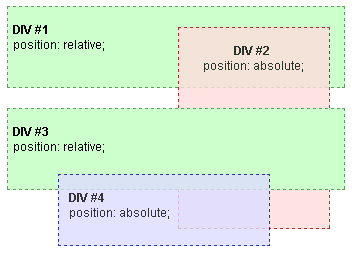
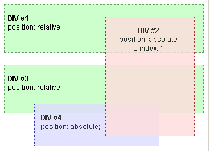
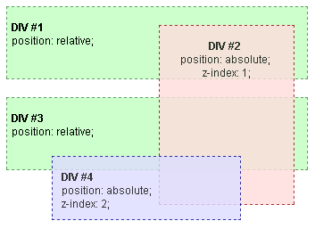

## Description

Let's start with a basic example. In the root stacking context, there are two relatively positioned `<div>` elements (DIV #1 and DIV #3) without `z-index` properties. Inside DIV #1, there is an absolutely positioned DIV #2, while in DIV #3, there is an absolutely positioned DIV #4, both without `z-index` properties.

The only stacking context is the root context. Without `z-index` values, elements are stacked in order of occurrence.



If DIV #2 is assigned a positive (non-zero and non-auto) z-index value, it is rendered above all the other DIVs.



Then if DIV #4 is also assigned a positive z-index greater than DIV #2's z-index, it is rendered above all the other DIVs including DIV #2.



In this last example you can see that DIV #2 and DIV #4 are not siblings, because they belong to different parents in the HTML elements' hierarchy. Even so, stacking of DIV #4 with respect of DIV #2 can be controlled through `z-index`. It happens that, since DIV #1 and DIV #3 are not assigned any z-index value, they do not create a stacking context. This means that all their content, including DIV #2 and DIV #4, belongs to the same root stacking context.

In terms of stacking contexts, DIV #1 and DIV #3 are assimilated into the root element, and the resulting hierarchy is the following:

- Root stacking context
  - DIV #2 (`z-index`: 1)
  - DIV #4 (`z-index`: 2)

> [!NOTE]
> DIV #1 and DIV #3 are not translucent. It is important to remember that assigning an opacity less than 1 to a positioned element implicitly creates a stacking context, just like adding a `z-index` value. And this example shows what happens when a parent element does not create a stacking context.

## Example

### HTML

```html
<div id="div1">
  <br /><span class="bold">DIV #1</span> <br />position: relative;
  <div id="div2">
    <br /><span class="bold">DIV #2</span> <br />position: absolute;
    <br />z-index: 1;
  </div>
</div>

<br />

<div id="div3">
  <br /><span class="bold">DIV #3</span> <br />position: relative;
  <div id="div4">
    <br /><span class="bold">DIV #4</span> <br />position: absolute;
    <br />z-index: 2;
  </div>
</div>
```

### CSS

```css
.bold {
  font-family: Arial;
  font-size: 12px;
  font-weight: bold;
}

#div1,
#div3 {
  height: 80px;
  position: relative;
  border: 1px dashed #669966;
  background-color: #ccffcc;
  padding-left: 5px;
}

#div2 {
  opacity: 0.8;
  z-index: 1;
  position: absolute;
  width: 150px;
  height: 200px;
  top: 20px;
  left: 170px;
  border: 1px dashed #990000;
  background-color: #ffdddd;
  text-align: center;
}

#div4 {
  opacity: 0.8;
  z-index: 2;
  position: absolute;
  width: 200px;
  height: 80px;
  top: 65px;
  left: 50px;
  border: 1px dashed #000099;
  background-color: #ddddff;
  text-align: left;
  padding-left: 10px;
}
```

## Result

{{ EmbedLiveSample('Example', '', '300') }}

## See also

- [Example: 2-level HTML hierarchy, `z-index` on all levels](/en-US/docs/Web/CSS/CSS_positioned_layout/Stacking_context/Stacking_context_example_2)
- [Example: 3-level HTML hierarchy, `z-index` on the second level](/en-US/docs/Web/CSS/CSS_positioned_layout/Stacking_context/Stacking_context_example_3)
- [Stacking context](/en-US/docs/Web/CSS/CSS_positioned_layout/Stacking_context)
- [CSS positioned layout](/en-US/docs/Web/CSS/CSS_positioned_layout) module
