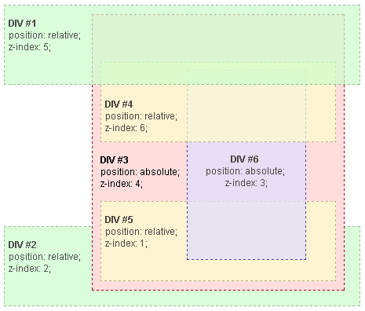

{{CSSRef}}

**Stacking context** is a three-dimensional conceptualization of HTML elements along an imaginary z-axis relative to the user, who is assumed to be facing the viewport or the webpage. HTML elements occupy this space in priority order based on element attributes.

## Description

In the previous article of this guide, [Using z-index](/en-US/docs/Web/CSS/CSS_positioned_layout/Understanding_z-index/Using_z-index), we showed that the rendering order of certain elements is influenced by their `z-index` value. This occurs because these elements have special properties which cause them to form a _stacking context_.

A stacking context is formed, anywhere in the document, by any element in the following scenarios:

- Root element of the document (`<html>`).
- Element with a {{cssxref("position")}} value `absolute` or `relative` and {{cssxref("z-index")}} value other than `auto`.
- Element with a {{cssxref("position")}} value `fixed` or `sticky` (sticky for all mobile browsers, but not older desktop browsers).
- Element with a {{cssxref("container-type")}} value `size` or `inline-size` set, intended for [container queries](/en-US/docs/Web/CSS/CSS_containment/Container_queries).
- Element that is a child of a [flex](/en-US/docs/Web/CSS/CSS_flexible_box_layout/Basic_concepts_of_flexbox) container, with {{cssxref("z-index")}} value other than `auto`.
- Element that is a child of a {{cssxref("grid")}} container, with {{cssxref("z-index")}} value other than `auto`.
- Element with an {{cssxref("opacity")}} value less than `1`.
- Element with a {{cssxref("mix-blend-mode")}} value other than `normal`.
- Element with any of the following properties with value other than `none`:

  - {{cssxref("transform")}}
  - {{cssxref("scale")}}
  - {{cssxref("rotate")}}
  - {{cssxref("translate")}}
  - {{cssxref("filter")}}
  - {{cssxref("backdrop-filter")}}
  - {{cssxref("perspective")}}
  - {{cssxref("clip-path")}}
  - {{cssxref("mask")}} / {{cssxref("mask-image")}} / {{cssxref("mask-border")}}

- Element with an {{cssxref("isolation")}} value `isolate`.
- Element with a {{cssxref("will-change")}} value specifying any property that would create a stacking context on non-initial value.
- Element with a {{cssxref("contain")}} value of `layout`, or `paint`, or a composite value that includes either of them (i.e. `contain: strict`, `contain: content`).
- Element placed into the [top layer](/en-US/docs/Glossary/Top_layer) and its corresponding {{cssxref("::backdrop")}}. Examples include [fullscreen](/en-US/docs/Web/API/Fullscreen_API) and [popover](/en-US/docs/Web/API/Popover_API) elements.
- Element that has had stacking context-creating properties (such as `opacity`) animated using {{cssxref("@keyframes")}}, with [`animation-fill-mode`](/en-US/docs/Web/CSS/animation-fill-mode) set to [`forwards`](/en-US/docs/Web/CSS/animation-fill-mode#forwards).

Within a stacking context, child elements are stacked according to the same rules explained just above. Importantly, the `z-index` values of its child stacking contexts only have meaning in this parent. Stacking contexts are treated atomically as a single unit in the parent stacking context.

In summary:

- Stacking contexts can be contained in other stacking contexts, and together create a hierarchy of stacking contexts.
- Each stacking context is completely independent of its siblings: only descendant elements are considered when stacking is processed.
- Each stacking context is self-contained: after the element's contents are stacked, the whole element is considered in the stacking order of the parent stacking context.

> [!NOTE]
> The hierarchy of stacking contexts is a subset of the hierarchy of HTML elements because only certain elements create stacking contexts. We can say that elements that do not create their own stacking contexts are _assimilated_ by the parent stacking context.

## Example



In this example, every positioned element creates its own stacking context, because of their positioning and `z-index` values. The hierarchy of stacking contexts is organized as follows:

- Root

  - DIV #1
  - DIV #2
  - DIV #3

    - DIV #4
    - DIV #5
    - DIV #6

It is important to note that DIV #4, DIV #5 and DIV #6 are children of DIV #3, so stacking of those elements is completely resolved within DIV #3. Once stacking and rendering within DIV #3 is completed, the whole DIV #3 element is passed for stacking in the root element with respect to its sibling's DIV.

DIV #4 is rendered under DIV #1 because DIV #1's z-index (5) is valid within the stacking context of the root element, while DIV #4's z-index (6) is valid within the stacking context of DIV #3. So, DIV #4 is under DIV #1, because DIV #4 belongs to DIV #3, which has a lower z-index value.

For the same reason DIV #2 (`z-index`: 2) is rendered under DIV#5 (`z-index`: 1) because DIV #5 belongs to DIV #3, which has a higher z-index value.

DIV #3's z-index is 4, but this value is independent from z-index of DIV #4, DIV #5 and DIV #6, because it belongs to a different stacking context.

An easy way to figure out the _rendering order_ of stacked elements along the z-axis is to think of it as a "version number" of sorts, where child elements are minor version numbers underneath their parent's major version numbers. This way we can easily see how an element with a z-index of 1 (DIV #5) is stacked above an element with a z-index of 2 (DIV #2), and how an element with a z-index of 6 (DIV #4) is stacked below an element with a z-index of 5 (DIV #1).

In our example (sorted according to the final rendering order):

- Root

  - DIV #2: (`z-index`: 2)
  - DIV #3: (`z-index`: 4)

    - DIV #5: (`z-index`: 1), stacked under an element (`z-index`: 4), which results in a rendering order of 4.1
    - DIV #6: (`z-index`: 3), stacked under an element (`z-index`: 4), which results in a rendering order of 4.3
    - DIV #4: (`z-index`: 6), stacked under an element (`z-index`: 4), which results in a rendering order of 4.6

  - DIV #1: (`z-index`: 5)

### HTML

```html
<div id="div1">
  <h1>Division Element #1</h1>
  <code>
    position: relative;<br />
    z-index: 5;
  </code>
</div>

<div id="div2">
  <h1>Division Element #2</h1>
  <code>
    position: relative;<br />
    z-index: 2;
  </code>
</div>

<div id="div3">
  <div id="div4">
    <h1>Division Element #4</h1>
    <code>
      position: relative;<br />
      z-index: 6;
    </code>
  </div>

  <h1>Division Element #3</h1>
  <code>
    position: absolute;<br />
    z-index: 4;
  </code>

  <div id="div5">
    <h1>Division Element #5</h1>
    <code>
      position: relative;<br />
      z-index: 1;
    </code>
  </div>

  <div id="div6">
    <h1>Division Element #6</h1>
    <code>
      position: absolute;<br />
      z-index: 3;
    </code>
  </div>
</div>
```

### CSS

```css
* {
  margin: 0;
}
html {
  padding: 20px;
  font:
    12px/20px Arial,
    sans-serif;
}
div {
  opacity: 0.7;
  position: relative;
}
h1 {
  font: inherit;
  font-weight: bold;
}
#div1,
#div2 {
  border: 1px dashed #696;
  padding: 10px;
  background-color: #cfc;
}
#div1 {
  z-index: 5;
  margin-bottom: 190px;
}
#div2 {
  z-index: 2;
}
#div3 {
  z-index: 4;
  opacity: 1;
  position: absolute;
  top: 40px;
  left: 180px;
  width: 330px;
  border: 1px dashed #900;
  background-color: #fdd;
  padding: 40px 20px 20px;
}
#div4,
#div5 {
  border: 1px dashed #996;
  background-color: #ffc;
}
#div4 {
  z-index: 6;
  margin-bottom: 15px;
  padding: 25px 10px 5px;
}
#div5 {
  z-index: 1;
  margin-top: 15px;
  padding: 5px 10px;
}
#div6 {
  z-index: 3;
  position: absolute;
  top: 20px;
  left: 180px;
  width: 150px;
  height: 125px;
  border: 1px dashed #009;
  padding-top: 125px;
  background-color: #ddf;
  text-align: center;
}
```

## Result

{{ EmbedLiveSample('Example', '100%', '396') }}

## See also

- [Stacking without the `z-index` property](/en-US/docs/Web/CSS/CSS_positioned_layout/Understanding_z-index/Stacking_without_z-index): The stacking rules that apply when `z-index` is not used.
- [Stacking floating elements](/en-US/docs/Web/CSS/CSS_positioned_layout/Understanding_z-index/Stacking_floating_elements): How floating elements are handled with stacking.
- [Using z-index](/en-US/docs/Web/CSS/CSS_positioned_layout/Understanding_z-index/Using_z-index): How to use `z-index` to change default stacking.
- [Stacking context example 1](/en-US/docs/Web/CSS/CSS_positioned_layout/Understanding_z-index/Stacking_context_example_1): 2-level HTML hierarchy, `z-index` on the last level
- [Stacking context example 2](/en-US/docs/Web/CSS/CSS_positioned_layout/Understanding_z-index/Stacking_context_example_2): 2-level HTML hierarchy, `z-index` on all levels
- [Stacking context example 3](/en-US/docs/Web/CSS/CSS_positioned_layout/Understanding_z-index/Stacking_context_example_3): 3-level HTML hierarchy, `z-index` on the second level
- [Top layer](/en-US/docs/Glossary/Top_layer)
