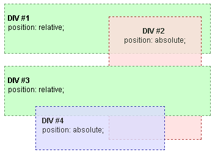
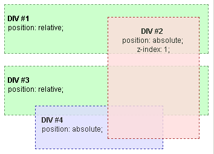
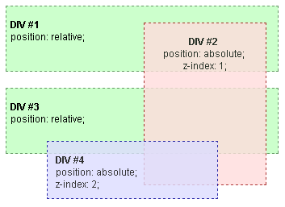

{{CSSRef}}

« [CSS](/en-US/docs/Web/CSS) « [Understanding CSS z-index](/en-US/docs/Web/CSS/CSS_Positioning/Understanding_z_index)

## Stacking context example 1

Let's start with a basic example. In the root stacking context we have two DIVs (DIV #1 and DIV #3), both relatively positioned, but without z-index properties. Inside DIV #1 there is an absolutely positioned DIV #2, while in DIV #3 there is an absolutely positioned DIV #4, both without z-index properties.

The only stacking context is the root context. Without z-indexes, elements are stacked in order of occurrence.



If DIV #2 is assigned a positive (non-zero and non-auto) z-index value, it is rendered above all the other DIVs.



Then if DIV #4 is also assigned a positive z-index greater than DIV #2's z-index, it is rendered above all the other DIVs including DIV #2.



In this last example you can see that DIV #2 and DIV #4 are not siblings, because they belong to different parents in the HTML elements' hierarchy. Even so, stacking of DIV #4 with respect of DIV #2 can be controlled through z-index. It happens that, since DIV #1 and DIV #3 are not assigned any z-index value, they do not create a stacking context. This means that all their content, including DIV #2 and DIV #4, belongs to the same root stacking context.

In terms of stacking contexts, DIV #1 and DIV #3 are assimilated into the root element, and the resulting hierarchy is the following:

- root stacking context

  - DIV #2 (z-index 1)
  - DIV #4 (z-index 2)

> **Note:** DIV #1 and DIV #3 are not translucent. It is important to remember that assigning an opacity less than 1 to a positioned element implicitly creates a stacking context, just like adding a z-index value. And this example shows what happens when a parent element does not create a stacking context.

## Example

### HTML

```html
<div id="div1">
<br /><span class="bold">DIV #1</span>
<br />position: relative;
   <div id="div2">
   <br /><span class="bold">DIV #2</span>
   <br />position: absolute;
   <br />z-index: 1;
   </div>
</div>

<br />

<div id="div3">
<br /><span class="bold">DIV #3</span>
<br />position: relative;
   <div id="div4">
   <br /><span class="bold">DIV #4</span>
   <br />position: absolute;
   <br />z-index: 2;
   </div>
</div>

</body></html>
```

### CSS

```css
.bold {
    font-family: Arial;
    font-size: 12px;
    font-weight: bold;
}
#div1,
#div3 {
    height: 80px;
    position: relative;
    border: 1px dashed #669966;
    background-color: #ccffcc;
    padding-left: 5px;
}
#div2 {
    opacity: 0.8;
    z-index: 1;
    position: absolute;
    width: 150px;
    height: 200px;
    top: 20px;
    left: 170px;
    border: 1px dashed #990000;
    background-color: #ffdddd;
    text-align: center;
}
#div4 {
    opacity: 0.8;
    z-index: 2;
    position: absolute;
    width: 200px;
    height: 80px;
    top: 65px;
    left: 50px;
    border: 1px dashed #000099;
    background-color: #ddddff;
    text-align: left;
    padding-left: 10px;
}
```

### Result

{{ EmbedLiveSample('Example', '', '300') }}

## See also

- [Stacking without the z-index property](/en-US/docs/Web/CSS/CSS_Positioning/Understanding_z_index/Stacking_without_z-index): The stacking rules that apply when `z-index` is not used.
- [Stacking with floated blocks](/en-US/docs/Web/CSS/CSS_Positioning/Understanding_z_index/Stacking_and_float): How floating elements are handled with stacking.
- [Using z-index](/en-US/docs/Web/CSS/CSS_Positioning/Understanding_z_index/Adding_z-index): How to use `z-index` to change default stacking.
- [The stacking context](/en-US/docs/Web/CSS/CSS_Positioning/Understanding_z_index/The_stacking_context): Notes on the stacking context.
- [Stacking context example 2](/en-US/docs/Web/CSS/CSS_Positioning/Understanding_z_index/Stacking_context_example_2): 2-level HTML hierarchy, `z-index` on all levels
- [Stacking context example 3](/en-US/docs/Web/CSS/CSS_Positioning/Understanding_z_index/Stacking_context_example_3): 3-level HTML hierarchy, `z-index` on the second level
