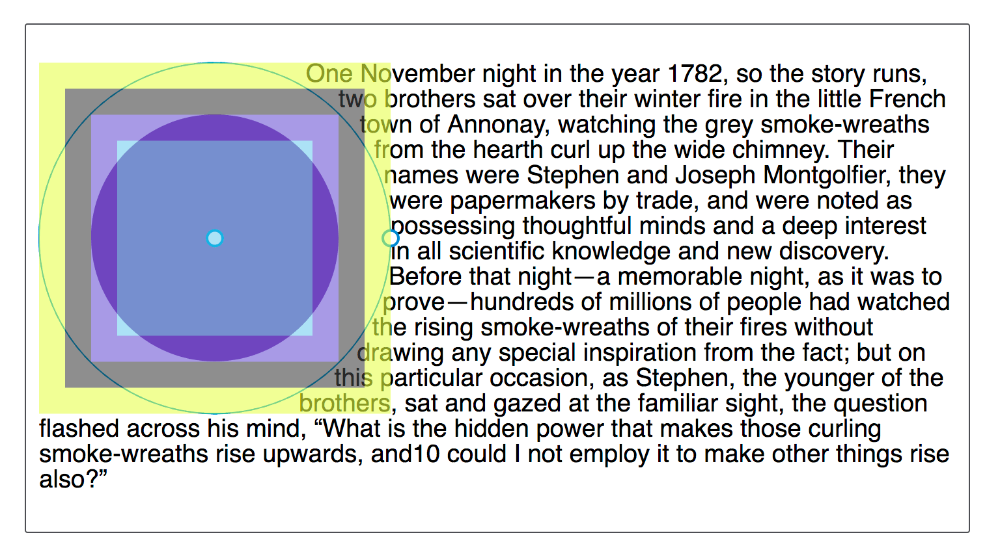
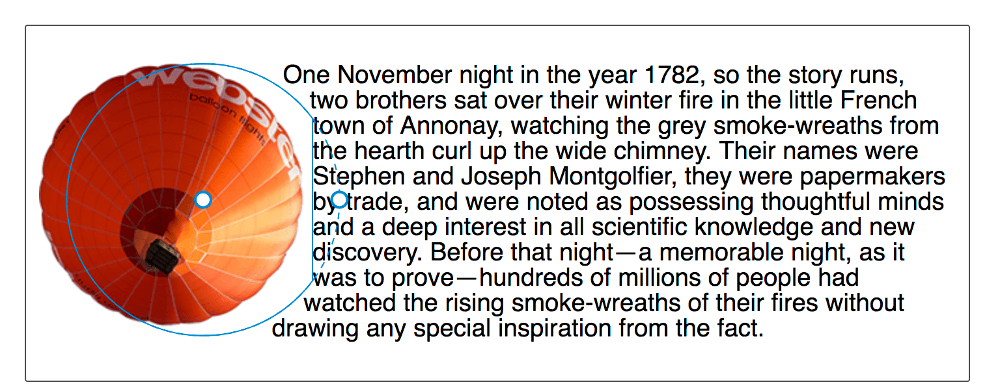
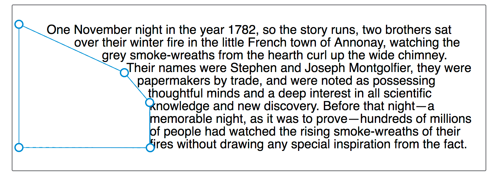

{{CSSRef}}

CSS Shapes can be defined using the {{cssxref("&lt;basic-shape&gt;")}} type, and in this guide I'll explain how each of the different values accepted by this type work. They range from simple circles to complex polygons.

Before looking at shapes, it is worth understanding two pieces of information that go together to make these shapes possible:

- The `<basic-shape>` type
- The reference box

## The \<basic-shape> type

The `<basic-shape>` type is used as the value for all of our basic shapes. This type uses Functional Notation: the type of shape is followed by brackets, inside of which are additional values used to describe the shape.

The arguments which are accepted vary depending on the shape that you are creating. We will cover these in the examples below.

## The reference box

Understanding the reference box used by CSS Shapes is important when using basic shapes, as it defines each shape's coordinate system. You have already met the reference box in [the guide on creating shapes from Box Values](/en-US/docs/Web/CSS/CSS_shapes/From_box_values), which directly uses the reference box to create the shape.

The Firefox Shapes Inspector helpfully shows the reference box in use when you inspect a shape. In the screenshot below I have created a circle, using `shape-outside: circle(50%)`. The floated element has 20 pixels of padding, border and margin applied, and the Shapes Inspector highlights these reference boxes. When using a basic shape, the reference box used by default is the margin-box. You can see in the screenshot that the shape is being defined with reference to that part of the Box Model.



You can add the various box values after your basic shape definition. Therefore the default behavior is as if you have defined.

```css
.shape {
  shape-outside: circle(50%) margin-box;
}
```

You can therefore change this in order that your shape uses the different parts of the box model, for example to use the border.

```css
.shape {
  shape-outside: circle(50%) border-box;
}
```

What is worth noting is that the `margin-box` will clip the shape, therefore shapes created in reference to other shapes which extend past the margin box will have the shape clipped to the margin box. We will see this in the following examples of basic shapes.

For an excellent description of references boxes as they apply to CSS Shapes, see [Understanding Reference Boxes for CSS Shapes](http://razvancaliman.com/writing/css-shapes-reference-boxes/).

## inset()

The `inset()` type defines a rectangle, which may not seem very useful as floating an item will give you a rectangular shape around it. However the `inset()` types enables the definition of offsets, thus pulling the content in over the shape.

Therefore `inset()` takes four values for the top, right, bottom and left values plus a final value for `border-radius`. The below CSS creates a rectangular shape inset from the reference box of the floated element 20 pixels from the top and bottom and 10 pixels from the left and right, with a border-radius value of 10 pixels.

```css
.shape {
  float: left;
  shape-outside: inset(20px 10px 20px 10px round 10px);
}
```

Using the same rules as we use for the margin shorthand, you can set more than one offset at once. If there is only one value, it applies to all sides. If there are two values, the top and bottom offsets are set to the first value and the right and left offsets are set to the second. If there are three values, the top is set to the first value, the left and right are set to the second, and the bottom is set to the third. If there are four values, they apply to the top, right, bottom, and left, respectively. So, the above rules could also be described as:

```css
.shape {
  float: left;
  shape-outside: inset(20px 10px round 10px);
}
```

In the example below we have an `inset()` shape used to pull content over the floated element. Change the offset values to see how the shape changes.

{{EmbedGHLiveSample("css-examples/shapes/basic-shape/inset.html", '100%', 800)}}

You can also add the Box Value that you wish to use as a reference box. In the example below change the reference box from `margin-box` to `border-box`, `padding-box` or `content-box` to see how the reference box used as the starting point before offsets are calculated changes.

{{EmbedGHLiveSample("css-examples/shapes/basic-shape/inset-box.html", '100%', 800)}}

## circle()

The `circle()` value for `shape-outside` can accept two possible arguments. The first is the `shape-radius`.

Both `circle()` and `ellipse()` values for `shape-outside` are specified as accepting this argument of `<shape-radius>`. This argument can be a length or percentage but can also be one of the keywords `closest-side` or `farthest-side`.

The keyword **`closest-side`** uses the length from the center of the shape to the closest side of the reference box. For circles, this is the closest side in any dimension. For ellipses, this is the closest side in the radius dimension.

The keyword **`farthest-side`** uses the length from the center of the shape to the farthest side of the reference box. For circles, this is the farthest side in any dimension. For ellipses, this is the farthest side in the radius dimension.

The second argument is a `position`. If omitted this will be set to `center`. However you can use any valid position here to indicate the position of the center of the circle.

Our circle therefore accepts one radius value, which may be a length, a percentage or the closest-side or farthest side keyword then optionally the keyword **at** followed by a position value.

In the below example I have created a circle on an item with a width of 100 pixels, plus a margin of 20 pixels. This gives a total width for the reference box of 140 pixels. I have given a value of 50% for the shape-radius value which means that our radius is 70px. I have then set the position value to 30%.

{{EmbedGHLiveSample("css-examples/shapes/basic-shape/circle.html", '100%', 800)}}

In the live example you can play with increasing or decreasing the size of the circle by changing the size of the radius, moving the circle around with the position value, or setting a reference box as we did for `inset()`.

As an additional example, if you use the keywords `top left` for position, you can make a quarter circle shape in the top left corner of the page. The example below uses generated content to create a quarter circle shape for text to flow around.

{{EmbedGHLiveSample("css-examples/shapes/basic-shape/circle-generated.html", '100%', 700)}}

### The shape will be clipped by the margin box

When describing Reference Boxes I explained that the margin-box will clip the shape. You can see this by moving the center of our circle towards the content by setting the position to 60%. The center of the circle is now nearer the content and the circle extends past the margin-box. This means that the extension becomes clipped and squared off.

```css
img {
  float: left;
  shape-outside: circle(50% at 60%);
}
```



## ellipse()

An ellipse is essentially a squashed circle and so `ellipse()` acts in a very similar way to `circle()` except that we have to specify two radii x and y in that order.

These may then be followed by position values as with `circle()` to move the center of the ellipse around. In the example below we have an ellipse with an x radius of 40%, a y radius of 50% and the position being left. This means that the center of the ellipse is on the left edge of the box giving us a half ellipse shape to wrap our text around. You can change these values to see how the ellipse changes.

{{EmbedGHLiveSample("css-examples/shapes/basic-shape/ellipse.html", '100%', 800)}}

The keyword values of `closest-side` and `farthest-side` are useful to create a quick ellipse based on the size of the floated element reference box.

{{EmbedGHLiveSample("css-examples/shapes/basic-shape/ellipse-keywords.html", '100%', 800)}}

## polygon()

The final Basic Shape is the most complex and enables the creation of many side shapes by way of creating a `polygon()`. This shape accepts three or more pairs of values (a polygon must at least draw a triangle). These values are co-ordinates drawn with reference to the reference box.

In the example below I have created a shape for text to follow using the `polygon()`, you can change any of the values to see how the shape is changed.

{{EmbedGHLiveSample("css-examples/shapes/basic-shape/polygon.html", '100%', 800)}}

You may well find the Firefox Shape Inspector very useful here to create your polygon shape. The screenshot below shows the shape highlighted in the tool.



Another useful resource is [Clippy](https://bennettfeely.com/clippy/) - a tool for creating shapes for `clip-path`, as the values for Basic Shapes are the same as those used for `clip-path`.
