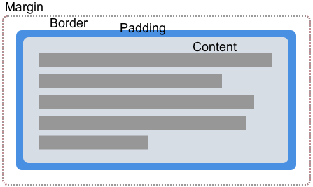

{{CSSRef}}

A straightforward way to create a shape is to use a value from the [CSS Box Model](/en-US/docs/Web/CSS/CSS_box_model) module. This article explains how to do this.

The {{cssxref("box-edge")}} box values allowable as a shape value are:

- `content-box`
- `padding-box`
- `border-box`
- `margin-box`

The {{cssxref("border-radius")}} values are also supported. This means you can give an element a curved border, and flow your content around the created shape.

## CSS box model

The values listed above correspond to the various parts of the CSS Box Model. A box in CSS has content, padding, border, and margin.

By using box values for shapes, we can wrap our content around the edges defined by these values. In each of the examples below, I am using an element that has padding, a border, and a margin defined so that you can see the different ways in which content will flow.

### margin-box

The `margin-box` is the shape defined by the outside margin edge and includes the corner radius of the shape, should {{cssxref("border-radius")}} have been used in defining the element.

In the example below, we have a circular purple item which is a {{htmlelement("div")}} with a height, width, and background color. The `border-radius` property has been used to create a circle by setting `border-radius: 50%`. As the element has a margin, you can see that the content is flowing around the circular shape and the margin applied to it.

{{EmbedGHLiveSample("css-examples/shapes/box/margin-box.html", '100%', 800)}}

### border-box

The `border-box` value is the shape defined by the outside border edge. This shape follows all of the normal border radius shaping rules for the outside of the border. You still have a border, even if you have not used the CSS {{cssxref("border")}} property. In this case, it will be the same as `padding-box`, the shape defined by the outside padding edge.

In the example below, you can see how the text now follows the line created by the border. Change the border size, and the content will follow it.

{{EmbedGHLiveSample("css-examples/shapes/box/border-box.html", '100%', 800)}}

### padding-box

The `padding-box` value defines the shape enclosed by the outside padding edge. This shape follows all of the normal border radius shaping rules for the inside of the border. If you have no padding then `padding-box` is the same as `content-box`.

{{EmbedGHLiveSample("css-examples/shapes/box/padding-box.html", '100%', 800)}}

### content-box

The `content-box` value defines the shape enclosed by the outside content edge. Each corner radius of this box is the `border-radius` less the `border-width` and `padding`, or `0`, whichever is larger. This means that it is impossible to have a negative value here.

{{EmbedGHLiveSample("css-examples/shapes/box/content-box.html", '100%', 800)}}

## When to use box values

Using box values is a simple way to create shapes; however, this is by nature only going to work with very simple shapes that can be defined using the well-supported `border-radius` property. The examples shown above show one such use case. You can create a circular shape using `border-radius` and then curve text around it.

With just this basic technique, you can create some interesting effects. In my final example of this section, I have floated two elements left and right, giving each a border radius of 100% in the direction closest to the text.

{{EmbedGHLiveSample("css-examples/shapes/box/bottom-margin-box.html", '100%', 800)}}

For more complex shapes, you will need to use one of the [basic shapes](/en-US/docs/Web/CSS/CSS_shapes/Basic_shapes) as a value, or define your shape from an image as covered in other guides in this section.
