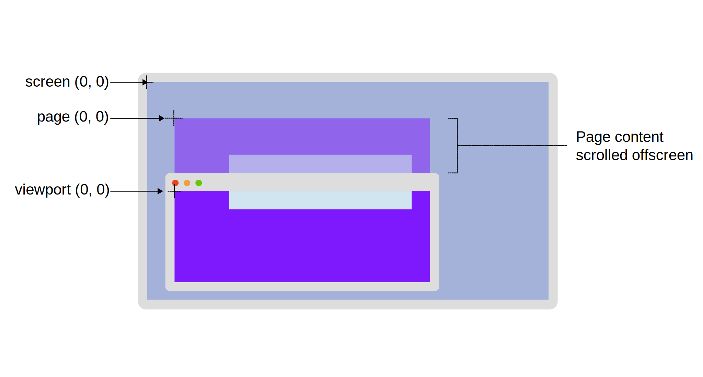

{{CSSRef}}

When specifying the location of a pixel in a graphics context (just like when specifying coordinate systems in [algebra](https://en.wikipedia.org/wiki/Algebra)), its position is defined relative to a fixed point in the context. This fixed point is called the [origin](<https://en.wikipedia.org/wiki/Origin_(mathematics)>). The position is specified as the number of pixels offset from the origin along each dimension of the context.

This guide describes the standard coordinate systems used by the CSS object model. These are generally only different in terms of where their origin is located.

## Dimensions

In the coordinate systems used by web technologies, convention dictates that the horizontal offset is called the _x-coordinate_, where a negative value indicates a position to the left of the origin and a positive value is to the right of the origin. The _y-coordinate_ specifies the vertical offset, with a negative value being above the origin and a positive value being below the origin.

On the web, the default origin is the _top_-left corner of a given context (with positive y-coordinate values being below the origin). Note that this is unlike most mathematical models, where the origin is at the _bottom_-left corner, with positive y-coordinate values being above the origin.

When using the third dimension to layer objects from front to back, we use the z-axis. The z-axis runs from the viewer to the screen's surface. The CSS z-index attribute affects where positioned elements sit on this axis, giving the effect of moving away from or toward the viewer.

> [!NOTE]
> It's actually possible to change the definitions and orientations of these coordinate systems using CSS properties such as {{cssxref("transform")}}. However, we'll only talk about the standard coordinate system for now.

## Standard CSSOM coordinate systems

There are four standard coordinate systems used by the CSS object model.
To help visualize the main systems, the following diagram shows a monitor with a browser window that contains content scrolled outside of the viewport.
Page content that is scrolled outside of the viewport is shown as semi-transparent above the browser window to indicate where the origin for "page" coordinates would be.
The origin of the "client", "page", and "viewport" coordinates systems are highlighted.



### Offset

Coordinates specified using the "offset" model use the top-left corner of the element being examined, or on which an event has occurred.

For example, when a {{domxref("MouseEvent", "mouse event", "", 1)}} occurs, the position of the mouse as specified in the event's {{domxref("MouseEvent.offsetX", "offsetX")}} and {{domxref("MouseEvent.offsetY", "offsetY")}} properties are given relative to the top-left corner of the node to which the event has been delivered. The origin is inset by `padding-edge` which is the edge between the padding area and the border area.

### Viewport

The "viewport" (or "client") coordinate system uses as its origin the top-left corner of the viewport or browsing context in which the event occurred. This is the entire viewing area in which the document is presented.

On a desktop computer, for example, the {{domxref("MouseEvent.clientX")}} and {{domxref("MouseEvent.clientY")}} properties indicate the position of the mouse cursor at the moment the event occurred, relative to the top-left corner of the {{domxref("window")}}.
When using a stylus or a pointer, the {{domxref("Touch.clientX")}} and {{domxref("Touch.clientY")}} coordinates in a [touch event](/en-US/docs/Web/API/TouchEvent) are relative to the same origin.

The top-left corner of the window is always (0, 0), regardless of the content of the document or any scrolling that may have been done. In other words, scrolling the document will change the viewport coordinates of a given position within the document.

### Page

The "page" coordinate system gives the position of a pixel relative to the top-left corner of the entire rendered {{domxref("Document")}}.
That means that a point in an element within the document will have the same coordinates after the user scrolls horizontally or vertically in the document unless the element moves via layout changes.

Mouse events' {{domxref("MouseEvent.pageX", "pageX")}} and {{domxref("MouseEvent.pageY", "pageY")}} properties provide the position of the mouse at the time the event was generated, given relative to the top-left corner of the document.
{{domxref("Touch.pageX")}} and {{domxref("Touch.pageY")}} coordinates in a [touch event](/en-US/docs/Web/API/TouchEvent) are relative to the same origin.

### Screen

Finally, we come to the "screen" model where the origin is the top-left corner of the user's screen space.
Each point in this coordinate system represents a single logical pixel, and so values increment and decrement by integer values along each axis.
The position of a given point within a document will change if the containing window is moved, for example, or if the user's screen geometry changes (by changing display resolution or by adding or removing monitors to their system).

The {{domxref("MouseEvent.screenX")}} and {{domxref("MouseEvent.screenY")}} properties give the coordinates of a mouse event's position relative to the screen's origin.
{{domxref("Touch.screenX")}} and {{domxref("Touch.screenY")}} coordinates in a [touch event](/en-US/docs/Web/API/TouchEvent) are relative to the same origin.

## Example

Let's take a look at an example that logs mouse coordinates in an element.
Whenever the mouse enters, moves around inside, or exits the inner box, the events are handled by logging the current mouse coordinates in each of the four available systems.

### JavaScript

For the JavaScript, the code sets up the event handlers on the inner box by calling {{domxref("EventTarget.addEventListener", "addEventListener()")}} for each of the types {{domxref("Element/mouseenter_event", "mouseenter")}}, {{domxref("Element/mousemove_event", "mousemove")}}, and {{domxref("Element/mouseleave_event", "mouseleave")}}.
For each of the events, we're calling the `setCoords()` function which sets the inner text of the `<p>` element with the coordinates for each system.

```js
const log = document.querySelector(".log");
const inner = document.querySelector(".inner");

function setCoords(e) {
  log.innerText = `
    Offset X/Y: ${e.offsetX}, ${e.offsetY}
    Viewport X/Y: ${e.clientX}, ${e.clientY}
    Page X/Y: ${e.pageX}, ${e.pageY}
    Screen X/Y: ${e.screenX}, ${e.screenY}`;
}

inner.addEventListener("mousemove", setCoords);
inner.addEventListener("mouseenter", setCoords);
inner.addEventListener("mouseleave", setCoords);
```

### HTML

The HTML contains a `<p>` with the `"log"` class, which displays the data from the mouse events.

```html
<div class="outer">
  <div class="inner">
    <p class="log">Mouse over this section to view coordinates</p>
  </div>
</div>
```

### CSS

The class `"outer"` for the containing box is intentionally too wide to view the effects of mouse coordinates when the content is scrolled.
The `"inner"` paragraph is where mouse events are tracked and logged.

```css
.outer {
  width: 1000px;
}

.inner {
  font-family: monospace;
  position: relative;
  width: 500px;
  height: 150px;
  top: 25px;
  left: 100px;
  background-color: darkblue;
  color: white;
  cursor: crosshair;
  user-select: none;
}

.log {
  position: relative;
  width: 100%;
  text-align: center;
}
```

### Result

Here you can see the results in action. As you mouse in and around the blue box, watch the values of the mouse's X and Y coordinates change in the various coordinate systems.

{{EmbedLiveSample("Example", 600, 250)}}

## See also

- [Using CSS transforms](/en-US/docs/Web/CSS/CSS_transforms/Using_CSS_transforms): how to alter a coordinate system
- Coordinates of a {{domxref("MouseEvent")}}:

  - {{domxref("MouseEvent.offsetX")}} and {{domxref("MouseEvent.offsetY")}}
  - {{domxref("MouseEvent.clientX")}} and {{domxref("MouseEvent.clientY")}}
  - {{domxref("MouseEvent.pageX")}} and {{domxref("MouseEvent.pageY")}}
  - {{domxref("MouseEvent.screenX")}} and {{domxref("MouseEvent.screenY")}}

- Coordinates of a {{domxref("Touch")}}:

  - {{domxref("Touch.clientX")}} and {{domxref("Touch.clientY")}}
  - {{domxref("Touch.pageX")}} and {{domxref("Touch.pageY")}}
  - {{domxref("Touch.screenX")}} and {{domxref("Touch.screenY")}}
