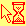
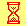
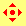
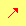
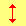

{{CSSRef}}

The **`cursor`** [CSS](/en-US/docs/Web/CSS) property sets the type of mouse cursor, if any, to show when the mouse pointer is over an element.

{{EmbedInteractiveExample("pages/css/cursor.html")}}

## Syntax

```css
/* Keyword value */
cursor: pointer;
cursor: auto;

/* URL, with a keyword fallback */
cursor: url(hand.cur), pointer;

/* URL and coordinates, with a keyword fallback */
cursor: url(cursor1.png) 4 12, auto;
cursor: url(cursor2.png) 2 2, pointer;

/* Global values */
cursor: inherit;
cursor: initial;
cursor: revert;
cursor: unset;
```

The `cursor` property is specified as zero or more `<url>` values, separated by commas, followed by a single mandatory keyword value. Each `<url>` should point to an image file. The browser will try to load the first image specified, falling back to the next if it can't, and falling back to the keyword value if no images could be loaded (or if none were specified).

Each `<url>` may be optionally followed by a pair of space-separated numbers, which represent `<x><y>` coordinates. These will set the cursor's hotspot, relative to the top-left corner of the image.

For example, this specifies two images using `<url>` values, providing `<x><y>` coordinates for the second one, and falling back to the `progress` keyword value if neither image can be loaded:

```css
cursor: url(one.svg), url(two.svg) 5 5, progress;
```

### Values

- `<url>`
  - : A `url(…)` or a comma separated list `url(…), url(…), …`, pointing to an image file. More than one {{cssxref("url()")}} may be provided as fallbacks, in case some cursor image types are not supported. A non-URL fallback (one or more of the keyword values) _must_ be at the end of the fallback list. See [Using URL values for the cursor property](/en-US/docs/Web/CSS/CSS_Basic_User_Interface/Using_URL_values_for_the_cursor_property) for more details.
- `<x>` `<y>` {{experimental_inline}}
  - : Optional x- and y-coordinates. Two unitless nonnegative numbers less than 32.
- Keyword values

  - : _Move your mouse over values to see their live appearance in your browser:_

    <table class="standard-table">
      <thead>
        <tr>
          <th scope="col">Category</th>
          <th scope="col">CSS value</th>
          <th scope="col">Example</th>
          <th scope="col">Description</th>
        </tr>
      </thead>
      <tbody>
        <tr style="cursor: auto">
          <th rowspan="3" scope="row">General</th>
          <td><code>auto</code></td>
          <td></td>
          <td>
            The UA will determine the cursor to display based on the current
            context. E.g., equivalent to <code>text</code> when hovering text.
          </td>
        </tr>
        <tr style="cursor: default">
          <td><code>default</code></td>
          <td></td>
          <td>The platform-dependent default cursor. Typically an arrow.</td>
        </tr>
        <tr style="cursor: none">
          <td><code>none</code></td>
          <td></td>
          <td>No cursor is rendered.</td>
        </tr>
        <tr style="cursor: context-menu">
          <th rowspan="5" scope="row" style="cursor: auto">Links &#x26; status</th>
          <td><code>context-menu</code></td>
          <td></td>
          <td>A context menu is available.</td>
        </tr>
        <tr style="cursor: help">
          <td><code>help</code></td>
          <td></td>
          <td>Help information is available.</td>
        </tr>
        <tr style="cursor: pointer">
          <td><code>pointer</code></td>
          <td></td>
          <td>
            The cursor is a pointer that indicates a link. Typically an image of a
            pointing hand.
          </td>
        </tr>
        <tr style="cursor: progress">
          <td><code>progress</code></td>
          <td></td>
          <td>
            The program is busy in the background, but the user can still interact
            with the interface (in contrast to <code>wait</code>).
          </td>
        </tr>
        <tr style="cursor: wait">
          <td><code>wait</code></td>
          <td></td>
          <td>
            The program is busy, and the user can't interact with the interface (in
            contrast to <code>progress</code>). Sometimes an image of an hourglass
            or a watch.
          </td>
        </tr>
        <tr style="cursor: cell">
          <th rowspan="4" scope="row" style="cursor: auto">Selection</th>
          <td><code>cell</code></td>
          <td></td>
          <td>The table cell or set of cells can be selected.</td>
        </tr>
        <tr style="cursor: crosshair">
          <td><code>crosshair</code></td>
          <td></td>
          <td>Cross cursor, often used to indicate selection in a bitmap.</td>
        </tr>
        <tr style="cursor: text">
          <td><code>text</code></td>
          <td></td>
          <td>The text can be selected. Typically the shape of an I-beam.</td>
        </tr>
        <tr style="cursor: vertical-text">
          <td><code>vertical-text</code></td>
          <td></td>
          <td>
            The vertical text can be selected. Typically the shape of a sideways
            I-beam.
          </td>
        </tr>
        <tr style="cursor: alias">
          <th rowspan="7" scope="row" style="cursor: auto">Drag &#x26; drop</th>
          <td><code>alias</code></td>
          <td></td>
          <td>An alias or shortcut is to be created.</td>
        </tr>
        <tr style="cursor: copy">
          <td><code>copy</code></td>
          <td></td>
          <td>Something is to be copied.</td>
        </tr>
        <tr style="cursor: move">
          <td><code>move</code></td>
          <td></td>
          <td>Something is to be moved.</td>
        </tr>
        <tr style="cursor: no-drop">
          <td><code>no-drop</code></td>
          <td>
            
          </td>
          <td>
            An item may not be dropped at the current location.<br />{{bug("275173")}}:
            On Windows and Mac OS X, <code>no-drop</code> is the same as
            <code>not-allowed</code>.
          </td>
        </tr>
        <tr style="cursor: not-allowed">
          <td><code>not-allowed</code></td>
          <td></td>
          <td>The requested action will not be carried out.</td>
        </tr>
        <tr style="cursor: grab">
          <td><code>grab</code></td>
          <td></td>
          <td>Something can be grabbed (dragged to be moved).</td>
        </tr>
        <tr style="cursor: grabbing">
          <td><code>grabbing</code></td>
          <td></td>
          <td>Something is being grabbed (dragged to be moved).</td>
        </tr>
        <tr style="cursor: all-scroll">
          <th rowspan="15" scope="row" style="cursor: auto">
            Resizing &#x26; scrolling
          </th>
          <td><code>all-scroll</code></td>
          <td></td>
          <td>
            Something can be scrolled in any direction (panned).<br />{{bug("275174")}}:
            On Windows, <code>all-scroll</code> is the same as <code>move</code>.
          </td>
        </tr>
        <tr style="cursor: col-resize">
          <td><code>col-resize</code></td>
          <td></td>
          <td>
            The item/column can be resized horizontally. Often rendered as arrows
            pointing left and right with a vertical bar separating them.
          </td>
        </tr>
        <tr style="cursor: row-resize">
          <td><code>row-resize</code></td>
          <td></td>
          <td>
            The item/row can be resized vertically. Often rendered as arrows
            pointing up and down with a horizontal bar separating them.
          </td>
        </tr>
        <tr style="cursor: n-resize">
          <td><code>n-resize</code></td>
          <td>
            
          </td>
          <td rowspan="8" style="cursor: auto">
            Some edge is to be moved. For example, the <code>se-resize</code> cursor
            is used when the movement starts from the <em>south-east</em> corner of
            the box.<br />In some environments, an equivalent bidirectional resize
            cursor is shown. For example, <code>n-resize</code> and
            <code>s-resize</code> are the same as <code>ns-resize</code>.
          </td>
        </tr>
        <tr style="cursor: e-resize">
          <td><code>e-resize</code></td>
          <td>
            
          </td>
        </tr>
        <tr style="cursor: s-resize">
          <td><code>s-resize</code></td>
          <td>
            
          </td>
        </tr>
        <tr style="cursor: w-resize">
          <td><code>w-resize</code></td>
          <td>
            
          </td>
        </tr>
        <tr style="cursor: ne-resize">
          <td><code>ne-resize</code></td>
          <td>
            
          </td>
        </tr>
        <tr style="cursor: nw-resize">
          <td><code>nw-resize</code></td>
          <td>
            
          </td>
        </tr>
        <tr style="cursor: se-resize">
          <td><code>se-resize</code></td>
          <td>
            
          </td>
        </tr>
        <tr style="cursor: sw-resize">
          <td><code>sw-resize</code></td>
          <td>
            
          </td>
        </tr>
        <tr style="cursor: ew-resize">
          <td><code>ew-resize</code></td>
          <td></td>
          <td rowspan="4" style="cursor: auto">Bidirectional resize cursor.</td>
        </tr>
        <tr style="cursor: ns-resize">
          <td><code>ns-resize</code></td>
          <td></td>
        </tr>
        <tr style="cursor: nesw-resize">
          <td><code>nesw-resize</code></td>
          <td></td>
        </tr>
        <tr style="cursor: nwse-resize">
          <td><code>nwse-resize</code></td>
          <td></td>
        </tr>
        <tr style="cursor: zoom-in">
          <th rowspan="2" scope="row" style="cursor: auto">Zooming</th>
          <td><code>zoom-in</code></td>
          <td></td>
          <td rowspan="2" style="cursor: auto">
            <p>Something can be zoomed (magnified) in or out.</p>
          </td>
        </tr>
        <tr style="cursor: zoom-out">
          <td><code>zoom-out</code></td>
          <td></td>
        </tr>
      </tbody>
    </table>

## Usage notes

Although the specification does not define any size limitations for `cursor`, individual {{Glossary("user agent", "user agents")}} may choose to do so. Cursor changes using images which are outside the size range supported by the browser will generally just be ignored.

Check the {{anch("Browser compatibility")}} table for any notes on cursor size limits.

## Formal definition

{{cssinfo}}

## Formal syntax

{{csssyntax}}

## Examples

### Setting cursor types

```css
.foo {
  cursor: crosshair;
}

.bar {
  cursor: zoom-in;
}

/* A fallback keyword value is required when using a URL */
.baz {
  cursor: url("hyper.cur"), auto;
}
```

## Specifications

{{Specifications}}

## Browser compatibility

{{Compat}}

## See also

- [Using URL values for the cursor property](/en-US/docs/Web/CSS/CSS_Basic_User_Interface/Using_URL_values_for_the_cursor_property)
- {{cssxref("pointer-events")}}
- {{cssxref("url()", "url()")}} function
