{{CSSRef}}

The **`cursor`** [CSS](/en-US/docs/Web/CSS) property sets the mouse cursor, if any, to show when the mouse pointer is over an element.

The cursor setting should inform users of the mouse operations that can be performed at the current location, including: text selection, activating help or context menus, copying content, resizing tables, and so on.
You can specify either the _type_ of cursor using a keyword, or load a specific icon to use (with optional fallback images and mandatory keyword as a final fallback).

{{EmbedInteractiveExample("pages/css/cursor.html")}}

## Syntax

```css
/* Keyword value */
cursor: auto;
cursor: pointer;
/* … */
cursor: zoom-out;

/* URL with mandatory keyword fallback */
cursor: url(hand.cur), pointer;

/* URL and coordinates, with mandatory keyword fallback */
cursor:
  url(cursor_1.png) 4 12,
  auto;
cursor:
  url(cursor_2.png) 2 2,
  pointer;

/* URLs and fallback URLs (some with coordinates), with mandatory keyword fallback */
cursor:
  url(cursor_1.svg) 4 5,
  url(cursor_2.svg),
  /* …, */ url(cursor_n.cur) 5 5,
  progress;

/* Global values */
cursor: inherit;
cursor: initial;
cursor: revert;
cursor: revert-layer;
cursor: unset;
```

The `cursor` property is specified as zero or more `<url>` values, separated by commas, followed by a single mandatory keyword value.
Each `<url>` should point to an image file.
The browser will try to load the first image specified, falling back to the next if it can't, and falling back to the keyword value if no images could be loaded (or if none were specified).

Each `<url>` may be optionally followed by a pair of space-separated numbers, which set the `<x>` and `<y>` coordinates of the cursor's hotspot relative to the top-left corner of the image.

### Values

- `<url>` {{optional_inline}}
  - : A `url()` or a comma separated list `url(), url(), …`, pointing to an image file.
    More than one {{cssxref("url_value", "&lt;url&gt;")}} may be provided as fallbacks, in case some cursor image types are not supported.
    A non-URL fallback (one or more of the keyword values) _must_ be at the end of the fallback list.
- `<x>`, `<y>` {{optional_inline}}

  - : Optional x- and y-coordinates indicating the cursor hotspot; the precise position within the cursor that is being pointed to.

    The numbers are in units of image pixels.
    They are relative to the top left corner of the image, which corresponds to `0 0`, and are clamped within the boundaries of the cursor image.
    If these values are not specified, they may be read from the file itself, and will otherwise default to the top-left corner of the image.

- `keyword`

  - : A keyword value _must_ be specified, indicating either the type of cursor to use, or the fallback cursor to use if all specified icons fail to load.

    The available keywords are listed in the table below. Other than `none`, which means no cursor, there is an image showing how the cursors used to be rendered. You can hover your mouse over the table rows to see the effect of the different cursor keyword values on your browser today.

    <table class="standard-table">
      <thead>
        <tr>
          <th scope="col">Category</th>
          <th scope="col">Keyword</th>
          <th scope="col">Example</th>
          <th scope="col">Description</th>
        </tr>
      </thead>
      <tbody>
        <tr style="cursor: auto">
          <th rowspan="3" scope="row">General</th>
          <td><code>auto</code></td>
          <td></td>
          <td>
            The UA will determine the cursor to display based on the current context. E.g., equivalent to <code>text</code> when hovering text.
          </td>
        </tr>
        <tr style="cursor: default">
          <td><code>default</code></td>
          <td></td>
          <td>The platform-dependent default cursor. Typically an arrow.</td>
        </tr>
        <tr style="cursor: none">
          <td><code>none</code></td>
          <td></td>
          <td>No cursor is rendered.</td>
        </tr>
        <tr style="cursor: context-menu">
          <th rowspan="5" scope="row" style="cursor: auto">Links &#x26; status</th>
          <td><code>context-menu</code></td>
          <td></td>
          <td>A context menu is available.</td>
        </tr>
        <tr style="cursor: help">
          <td><code>help</code></td>
          <td></td>
          <td>Help information is available.</td>
        </tr>
        <tr style="cursor: pointer">
          <td><code>pointer</code></td>
          <td></td>
          <td>
            The cursor is a pointer that indicates a link. Typically an image of a pointing hand.
          </td>
        </tr>
        <tr style="cursor: progress">
          <td><code>progress</code></td>
          <td></td>
          <td>
            The program is busy in the background, but the user can still interact
            with the interface (in contrast to <code>wait</code>).
          </td>
        </tr>
        <tr style="cursor: wait">
          <td><code>wait</code></td>
          <td></td>
          <td>
            The program is busy, and the user can't interact with the interface (in contrast to <code>progress</code>).
            Sometimes an image of an hourglass or a watch.
          </td>
        </tr>
        <tr style="cursor: cell">
          <th rowspan="4" scope="row" style="cursor: auto">Selection</th>
          <td><code>cell</code></td>
          <td></td>
          <td>The table cell or set of cells can be selected.</td>
        </tr>
        <tr style="cursor: crosshair">
          <td><code>crosshair</code></td>
          <td>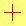</td>
          <td>Cross cursor, often used to indicate selection in a bitmap.</td>
        </tr>
        <tr style="cursor: text">
          <td><code>text</code></td>
          <td>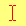</td>
          <td>The text can be selected. Typically the shape of an I-beam.</td>
        </tr>
        <tr style="cursor: vertical-text">
          <td><code>vertical-text</code></td>
          <td>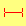</td>
          <td>
            The vertical text can be selected. Typically the shape of a sideways I-beam.
          </td>
        </tr>
        <tr style="cursor: alias">
          <th rowspan="7" scope="row" style="cursor: auto">Drag &#x26; drop</th>
          <td><code>alias</code></td>
          <td></td>
          <td>An alias or shortcut is to be created.</td>
        </tr>
        <tr style="cursor: copy">
          <td><code>copy</code></td>
          <td>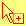</td>
          <td>Something is to be copied.</td>
        </tr>
        <tr style="cursor: move">
          <td><code>move</code></td>
          <td></td>
          <td>Something is to be moved.</td>
        </tr>
        <tr style="cursor: no-drop">
          <td><code>no-drop</code></td>
          <td>
            
          </td>
          <td>
            An item may not be dropped at the current location.<br /><a href="https://bugzil.la/275173">Firefox bug 275173</a>:
            On Windows and macOS, <code>no-drop</code> is the same as <code>not-allowed</code>.
          </td>
        </tr>
        <tr style="cursor: not-allowed">
          <td><code>not-allowed</code></td>
          <td></td>
          <td>The requested action will not be carried out.</td>
        </tr>
        <tr style="cursor: grab">
          <td><code>grab</code></td>
          <td></td>
          <td>Something can be grabbed (dragged to be moved).</td>
        </tr>
        <tr style="cursor: grabbing">
          <td><code>grabbing</code></td>
          <td>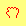</td>
          <td>Something is being grabbed (dragged to be moved).</td>
        </tr>
        <tr style="cursor: all-scroll">
          <th rowspan="15" scope="row" style="cursor: auto">
            Resizing &#x26; scrolling
          </th>
          <td><code>all-scroll</code></td>
          <td>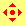</td>
          <td>
            Something can be scrolled in any direction (panned).<br /><a href="https://bugzil.la/275174">Firefox bug 275174</a>:
            On Windows, <code>all-scroll</code> is the same as <code>move</code>.
          </td>
        </tr>
        <tr style="cursor: col-resize">
          <td><code>col-resize</code></td>
          <td></td>
          <td>
            The item/column can be resized horizontally.
            Often rendered as arrows pointing left and right with a vertical bar separating them.
          </td>
        </tr>
        <tr style="cursor: row-resize">
          <td><code>row-resize</code></td>
          <td></td>
          <td>
            The item/row can be resized vertically.
            Often rendered as arrows pointing up and down with a horizontal bar separating them.
          </td>
        </tr>
        <tr style="cursor: n-resize">
          <td><code>n-resize</code></td>
          <td>
            
          </td>
          <td rowspan="8" style="cursor: auto">
            Some edge is to be moved. For example, the <code>se-resize</code> cursor is used when the movement starts from the <em>south-east</em> corner of the box.<br />
            In some environments, an equivalent bidirectional resize cursor is shown.
            For example, <code>n-resize</code> and <code>s-resize</code> are the same as <code>ns-resize</code>.
          </td>
        </tr>
        <tr style="cursor: e-resize">
          <td><code>e-resize</code></td>
          <td>
            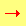
          </td>
        </tr>
        <tr style="cursor: s-resize">
          <td><code>s-resize</code></td>
          <td>
            
          </td>
        </tr>
        <tr style="cursor: w-resize">
          <td><code>w-resize</code></td>
          <td>
            
          </td>
        </tr>
        <tr style="cursor: ne-resize">
          <td><code>ne-resize</code></td>
          <td>
            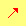
          </td>
        </tr>
        <tr style="cursor: nw-resize">
          <td><code>nw-resize</code></td>
          <td>
            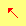
          </td>
        </tr>
        <tr style="cursor: se-resize">
          <td><code>se-resize</code></td>
          <td>
            
          </td>
        </tr>
        <tr style="cursor: sw-resize">
          <td><code>sw-resize</code></td>
          <td>
            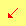
          </td>
        </tr>
        <tr style="cursor: ew-resize">
          <td><code>ew-resize</code></td>
          <td>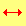</td>
          <td rowspan="4" style="cursor: auto">Bidirectional resize cursor.</td>
        </tr>
        <tr style="cursor: ns-resize">
          <td><code>ns-resize</code></td>
          <td>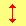</td>
        </tr>
        <tr style="cursor: nesw-resize">
          <td><code>nesw-resize</code></td>
          <td>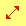</td>
        </tr>
        <tr style="cursor: nwse-resize">
          <td><code>nwse-resize</code></td>
          <td></td>
        </tr>
        <tr style="cursor: zoom-in">
          <th rowspan="2" scope="row" style="cursor: auto">Zooming</th>
          <td><code>zoom-in</code></td>
          <td></td>
          <td rowspan="2" style="cursor: auto">
            <p>Something can be zoomed (magnified) in or out.</p>
          </td>
        </tr>
        <tr style="cursor: zoom-out">
          <td><code>zoom-out</code></td>
          <td></td>
        </tr>
      </tbody>
    </table>

## Formal definition

{{cssinfo}}

## Formal syntax

{{csssyntax}}

## Usage notes

### Icon size limits

While the specification does not limit the `cursor` image size, {{Glossary("user agent", "user agents")}} commonly restrict them to avoid potential misuse.
For example, on Firefox and Chromium cursor images are restricted to 128x128 pixels by default, but it is recommended to limit the cursor image size to 32x32 pixels. Cursor changes using images that are larger than the user-agent maximum supported size will generally just be ignored.

### Supported image file formats

User agents are required by the specification to support PNG files, SVG v1.1 files in secure static mode that contain a natural size, and any other non-animated image file formats that they support for images in other properties.
Desktop browsers also broadly support the `.cur` file format.

The specification further indicates that user agents _should_ also support SVG v1.1 files in secure animated mode that contain a natural size, along with any other animated images file formats they support for images in other properties.
User agents _may_ support both static and animated SVG images that do not contain a natural size.

### iPadOS

iPadOS supports pointer devices like trackpads and mouses. By default, the iPad cursor is displayed as a circle, and the only supported value that will change an appearance of the pointer is `text`.

### Other notes

Cursor changes that intersect toolbar areas are commonly blocked to avoid spoofing.

## Examples

### Setting cursor types

```css
.foo {
  cursor: crosshair;
}

.bar {
  cursor: zoom-in;
}

/* A fallback keyword value is required when using a URL */
.baz {
  cursor: url("hyper.cur"), auto;
}
```

## Specifications

{{Specifications}}

## Browser compatibility

{{Compat}}

## See also

- {{cssxref("pointer-events")}}
- {{cssxref("url_value", "&lt;url&gt;")}} type
- SVG {{SVGAttr("cursor")}} attribute
