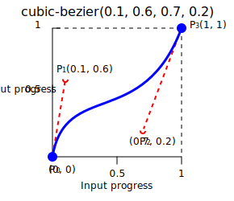
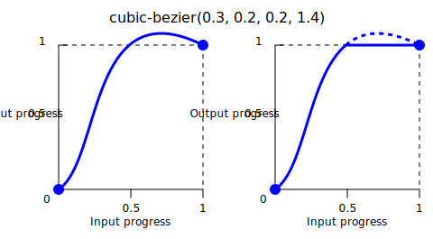

{{CSSRef}}

The **`cubic-bezier()`** [CSS](/en-US/docs/Web/CSS) [function](/en-US/docs/Web/CSS/CSS_Functions) creates a smooth transition using a cubic [Bézier curve](/en-US/docs/Glossary/Bezier_curve).
As an [`<easing-function>`](/en-US/docs/Web/CSS/easing-function), it can be used to smooth out the start and end of the {{Glossary("interpolation")}}.

## Syntax

```css
cubic-bezier(0.25, 0.1, 0.25, 1)
cubic-bezier(0.1, -0.6, 0.2, 0)
cubic-bezier(0, 0, 1, 1)
```

### Parameters

The function accepts the following four parameters, which represent the coordinates of two control points:

- `<x1>`
  - : A {{cssxref("&lt;number&gt;")}} representing the x-axis coordinate of the first control point.
    It must be in the `[0, 1]` range.
- `<y1>`
  - : A {{cssxref("&lt;number&gt;")}} representing the y-axis coordinate of the first control point.
- `<x2>`
  - : A {{cssxref("&lt;number&gt;")}} representing the x-axis coordinate of the second control point.
    It must be in the `[0, 1]` range.
- `<y2>`
  - : A {{cssxref("&lt;number&gt;")}} representing the y-axis coordinate of the second control point.

## Description

The cubic Bézier functions, often called "smooth" easing functions, correlate an input progress to an output progress, both expressed as {{cssxref("&lt;number&gt;")}}s, where `0.0` represents the initial state and `1.0` represents the final state.
If the cubic Bézier curve is invalid, CSS ignores the whole property.

A cubic Bézier curve is defined by four points: P0, P1, P2, and P3. The points P0 and P3 represent the start and the end of the curve. In CSS, the start point P0 is fixed at `(0, 0)` and the end point P3 is fixed at `(1, 1)`, while intermediate points P1 and P2 are defined by the function parameters `(<x1>, <y1>)` and `(<x2>, <y2>)` respectively. The x-axis represents input progress and the y-axis represents output progress.



Not all cubic Bézier curves are suitable as easing functions because not all are [mathematical functions](https://en.wikipedia.org/wiki/Function_%28mathematics%29); i.e., curves that for a given x-axis coordinate have zero or one value. With P0 and P3 fixed as defined by CSS, a cubic Bézier curve is a function, and is therefore valid, if and only if the x-axis coordinates of P1 and P2 are both in the `[0, 1]` range.

Cubic Bézier curves with the P1 or P2 ordinate outside the `[0, 1]` range can cause the value to go farther than the final state and then return. In animations, this creates a kind of "bouncing" effect.



However, certain properties will restrict the output if it goes outside an allowable range. For example, a color component greater than `255` or smaller than `0` in {{CSSXref("color_value/rgb", "rgb()")}} will be clipped to the closest allowed value (`255` and `0`, respectively). Some `cubic-bezier()` values exhibit this property.

## Formal syntax

{{csssyntax}}

## Examples

### Bouncing effect

In this example, the red ball bounces out of the box when transitioned from its original position. This is because one of the P2 values, `2.3`, goes beyond the `[0, 1]` range.

```html hidden
<div tabindex="0">
  <span></span>
</div>
```

```css hidden
div {
  margin: 8px auto;
  padding: 8px;
  width: 256px;
  border-radius: 40px;
  background-color: wheat;
}

span {
  display: block;
  width: 64px;
  height: 64px;
  border-radius: 50%;
  background: tomato;
}

div:hover span,
div:focus span {
  translate: 192px 0;
}
```

```css
span {
  transition: translate 0.3s cubic-bezier(0.3, 0.8, 0.3, 2.3);
}
```

{{EmbedLiveSample("Bouncing effect")}}

### Using the cubic-bezier() function

These cubic Bézier curves are valid for use in CSS:

```css example-good
/* The canonical Bézier curve with four <number> in the [0,1] range */
cubic-bezier(0.1, 0.7, 1.0, 0.1)

/* Using <integer> is valid because any <integer> is also a <number> */
cubic-bezier(0, 0, 1, 1)

/* Negative values for ordinates are valid, leading to bouncing effects */
cubic-bezier(0.1, -0.6, 0.2, 0)

/* Values greater than 1.0 for ordinates are also valid */
cubic-bezier(0, 1.1, 0.8, 4)
```

These cubic Bézier curve definitions are invalid:

```css example-bad
/* Parameters must be numbers */
cubic-bezier(0.1, red, 1.0, green)

/* X coordinates must be in the [0, 1] range */
cubic-bezier(2.45, 0.6, 4, 0.1)

/* There must be exactly four parameters */
cubic-bezier(0.3, 2.1)

/* X coordinates must be in the [0, 1] range */
cubic-bezier(-1.9, 0.3, -0.2, 2.1)
```

## Specifications

{{Specifications}}

## Browser compatibility

{{Compat}}

## See also

- Other easing functions: {{cssxref("easing-function/linear", "linear()")}} and {{cssxref("easing-function/steps", "steps()")}}
- [cubic-bezier.com](https://cubic-bezier.com/) by Lea Verou (2011)
