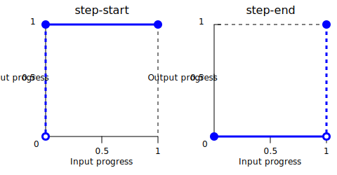
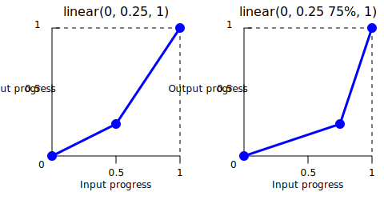
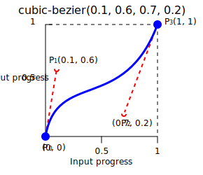
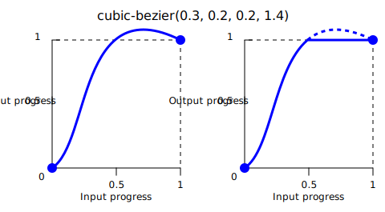

{{CSSRef}}

The **`<easing-function>`** [CSS](/en-US/docs/Web/CSS) [data type](/en-US/docs/Web/CSS/CSS_Types) denotes a mathematical function that describes the rate at which a numerical value changes.

This transition between two values may be applied in different situations. It may be used to describe how fast values change during animations. This lets you vary the animation's speed over the course of its duration. You can specify an easing function for CSS [transition](/en-US/docs/Web/CSS/transition-timing-function) and [animation](/en-US/docs/Web/CSS/animation-timing-function) properties.

## Syntax

```css
/* linear function and keyword */
/* linear(<point-list>) */
linear(1, -0.5, 0)
linear

/* cubic-bezier function and keywords */
/* cubic-bezier(<x1>, <y1>, <x2>, <y2>) */
cubic-bezier(0.42, 0.0, 1.0, 1.0)
ease
ease-in
ease-out
ease-in-out

/* steps function and keywords */
/* steps(<number-of-steps>, <direction>) */
steps(4, end)
step-start
step-end
```

### Values

- `<point-list>`

  - : List of linear stops.

- `linear`

  - : Indicates that the interpolation goes linearly. This keyword represents the easing function `linear(0, 1)`.


- `<x1>`, `<y1>`, `<x2>`, `<y2>`

  - : {{cssxref("&lt;number&gt;")}} values representing the abscissas and ordinates of the [P1 and P2 points](#cubic_bézier_functions) defining the cubic Bézier curve. `x1` and `x2` must be in the range `[0, 1]`, otherwise the value is invalid.

- `ease`

  - : Indicates that the interpolation starts slowly, accelerates sharply, and then slows gradually towards the end. This keyword represents the easing function `cubic-bezier(0.25, 0.1, 0.25, 1.0)`. It is similar to [`ease-in-out`](#ease-in-out), though it accelerates more sharply at the beginning.

- `ease-in`

  - : Indicates that the interpolation starts slowly, then progressively speeds up until the end, at which point it stops abruptly. This keyword represents the easing function `cubic-bezier(0.42, 0.0, 1.0, 1.0)`.

- `ease-out`

  - : Indicates that the interpolation starts abruptly and then progressively slows down towards the end. This keyword represents the easing function `cubic-bezier(0.0, 0.0, 0.58, 1.0)`.

- `ease-in-out`

  - : Indicates that the interpolation starts slowly, speeds up, and then slows down towards the end. This keyword represents the easing function `cubic-bezier(0.42, 0.0, 0.58, 1.0)`. At the beginning, it behaves like the [`ease-in`](#ease-in) keyword; at the end, it is like the [`ease-out`](#ease-out) keyword.


- `<number-of-steps>`

  - : A strictly positive {{cssxref("&lt;integer&gt;")}}, representing the amount of equidistant treads composing the stepping function.

- `<direction>`

  - : One of the following keywords that indicate when the jumps occur:
    - `jump-start` denotes that the first step or jump happens when the interpolation begins.
    - `jump-end` denotes that the last step or jump happens when the interpolation ends.
    - `jump-both` denotes that jumps occur at both the 0% and 100% marks, effectively adding a step during the interpolation iteration.
    - `jump-none` denotes no jump on either end. Instead, holding at both the 0% mark and the 100% mark, each for 1/n of the duration.
    - `start` is the equivalent of `jump-start`.
    - `end` is the equivalent of `jump-end`. This is the default.

- `step-start`

  - : Indicates that the interpolation jumps immediately to its final state, where it stays until the end. This keyword represents the easing function `steps(1, jump-start)` or `steps(1, start)`.

- `step-end`

  - : Indicates that the interpolation stays in its initial state until the end, at which point it jumps directly to its final state. This keyword represents the easing function `steps(1, jump-end)` or `steps(1, end)`.



## Description

There are three types of easing functions:

- [Linear](#linear_easing_function)
- [Cubic Bézier](#cubic_bézier_easing_function)
- [Step](#step_easing_function)

### Linear easing function

The `linear()` function defines a piecewise linear function that interpolates linearly between its points, allowing you to approximate more complex animations like bounce and elastic effects. The interpolation is done at a constant rate from beginning to end. A typical use of the `linear()` function is to provide many points to approximate any curve.

When you define the `linear()` function, you specify the _linear easing points_ as a list, as in, `linear(0, 0.25, 1)`. This `linear()` function produces an easing function that moves linearly from `0`, to `0.25`, then to `1`.



Consider another example of the function: `linear(0, 0.25 75%, 1)`. This produces a linear easing function that spends 75% of the time transitioning from `0` to `0.25` and the last 25% transitioning from `0.25` to `1`.

The [`linear`](#linear) keyword is equivalent to the easing function `linear(0, 1)`.

### Cubic Bézier easing function

The `cubic-bezier()` functional notation defines a cubic [Bézier curve](/en-US/docs/Glossary/Bezier_curve). The easing functions in the cubic-bezier subset of easing functions are often called "smooth" easing functions because they can be used to smooth down the start and end of the {{Glossary("interpolation")}}. They correlate an input progress to an output progress, both expressed as {{cssxref("&lt;number&gt;")}}s. For these values, `0.0` represents the initial state, and `1.0` represents the final state.



A cubic Bézier curve is defined by four points: P0, P1, P2, and P3. The points P0 and P3 represent the start and the end of the curve. In CSS, these points are fixed as the coordinates progress (the abscissa the input progress, the ordinate the output progress). P0 is `(0, 0)` and represents the initial progress and the initial state. P3 is `(1, 1)` and represents the final progress and the final state.

Not all cubic Bézier curves are suitable as easing functions because not all are [mathematical functions](https://en.wikipedia.org/wiki/Function_%28mathematics%29); i.e., curves that for a given abscissa have zero or one value. With P0 and P3 fixed as defined by CSS, a cubic Bézier curve is a function, and is therefore valid, if and only if the abscissas of P1 and P2 are both in the `[0, 1]` range.

Cubic Bézier curves with the P1 or P2 ordinate outside the `[0, 1]` range can cause the value to go farther than the final state and then return. In animations, for some properties, such as {{cssxref("left")}} or {{cssxref("right")}}, this creates a kind of "bouncing" effect.



However, certain properties will restrict the output if it goes outside an allowable range. For example, a color component greater than `255` or smaller than `0` in {{CSSXref("color_value/rgb", "rgb()")}} will be clipped to the closest allowed value (`255` and `0`, respectively). Some `cubic-bezier()` values exhibit this property.

When you specify an invalid cubic Bézier curve, CSS ignores the whole property.

Each of the keywords [`ease`](#ease), [`ease-in`](#ease-in), [`ease-out`](#ease-out), and [`ease-in-out`](#ease-in-out) is equivalent to a specific `cubic-bezier()` value.

### Step easing function

The `steps()` functional notation defines a [step function](https://en.wikipedia.org/wiki/Step_function) that divides the domain of output values in equidistant steps. This subclass of step functions are sometimes also called _staircase functions_.

These are a few examples illustrating the `steps()` function:

```css
steps(2, jump-start) /* Or steps(2, start) */
steps(4, jump-end) /* Or steps(4, end) */
steps(5, jump-none)
steps(3, jump-both)
```

![Graphs of "Input progress" to "Output progress", of which "steps(2, jump-start)" shows horizontal lines extending 0.5 unit from (0, 0.5) and (0.5, 1), respectively, with hollow points at the origin and (0.5, 0.5); "steps(4, jump-end)" shows horizontal lines extending 0.25 unit from (0, 0), (0.25, 0.25), (0.5, 0.5), and (0.75, 0.75), respectively, with hollow points at (0.25, 0), (0.5, 0.25), and (0.75, 0.5), and a point at (1, 1); "steps(5, jump-none)" shows horizontal lines extending 0.2 unit from (0, 0), (0.2, 0.25), (0.4, 0.5), (0.6, 0.75), and (0.8, 1), respectively, with hollow points at (0.2, 0), (0.4, 0.25), (0.6, 0.5), and (0.8, 0.75); "steps(3, jump-both)" shows horizontal lines extending 1/3 unit from (0, 0.25), (1/3, 0.5), and (2/3, 0.75),respectively , with a point at (1, 1) and hollow points at the origin, (1/3, 0.25), (2/3, 0.5), and (1, 0.75).](jump.svg)

Each of the keywords [`step-start`](#step-start) and [`step-end`](#step-end) is equivalent to a specific `steps()` value.

## Formal syntax

{{csssyntax}}

## Examples

### Comparing the easing functions

This example provides an easy comparison between the different easing functions using an animation. From the drop-down menu, you can select an easing function – there are a couple of keywords and some `cubic-bezier()` and `steps()` options. After selecting an option, you can start and stop the animation using the provided button.

#### HTML

```html
<div>
  <div></div>
</div>
<ul>
  <li>
    <button class="animation-button">Start animation</button>
  </li>
  <li>
    <label for="easing-select">Choose an easing function:</label>
    <select id="easing-select">
      <option selected>linear</option>
      <option>linear(0, 0.5 50%, 1)</option>
      <option>ease</option>
      <option>ease-in</option>
      <option>ease-in-out</option>
      <option>ease-out</option>
      <option>cubic-bezier(0.1, -0.6, 0.2, 0)</option>
      <option>cubic-bezier(0, 1.1, 0.8, 4)</option>
      <option>steps(5, end)</option>
      <option>steps(3, start)</option>
      <option>steps(4)</option>
    </select>
  </li>
</ul>
```

#### CSS

```css
body > div {
  position: relative;
  height: 100px;
}

div > div {
  position: absolute;
  width: 50px;
  height: 50px;
  background-color: blue;
  background-image: radial-gradient(
    circle at 10px 10px,
    rgba(25, 255, 255, 0.8),
    rgba(25, 255, 255, 0.4)
  );
  border-radius: 50%;
  top: 25px;
  animation: 1.5s infinite alternate;
}

@keyframes move-right {
  from {
    left: 10%;
  }

  to {
    left: 90%;
  }
}

li {
  display: flex;
  align-items: center;
  justify-content: center;
  margin-bottom: 20px;
}
```

#### JavaScript

```js
const selectElem = document.querySelector("select");
const startBtn = document.querySelector("button");
const divElem = document.querySelector("div > div");

startBtn.addEventListener("click", () => {
  if (startBtn.textContent === "Start animation") {
    divElem.style.animationName = "move-right";
    startBtn.textContent = "Stop animation";
    divElem.style.animationTimingFunction = selectElem.value;
  } else {
    divElem.style.animationName = "unset";
    startBtn.textContent = "Start animation";
  }
});

selectElem.addEventListener("change", () => {
  divElem.style.animationTimingFunction = selectElem.value;
});
```

#### Result

{{EmbedLiveSample("comparing_the_easing_functions", "100%", 200)}}

### Using the cubic-bezier() function

These cubic Bézier curves are valid for use in CSS:

```css example-good
/* The canonical Bézier curve with four <number> in the [0,1] range */
cubic-bezier(0.1, 0.7, 1.0, 0.1)

/* Using <integer> is valid because any <integer> is also a <number>. */
cubic-bezier(0, 0, 1, 1)

/* Negative values for ordinates are valid, leading to bouncing effects. */
cubic-bezier(0.1, -0.6, 0.2, 0)

/* Values greater than 1.0 for ordinates are also valid. */
cubic-bezier(0, 1.1, 0.8, 4)
```

These cubic Bézier curves definitions are invalid:

```css example-bad
/* Though the animated output type may be a color,
   Bézier curves work with numerical ratios. */
cubic-bezier(0.1, red, 1.0, green)

/* Abscissas must be in the [0, 1] range or
   the curve is not a function of time. */
cubic-bezier(2.45, 0.6, 4, 0.1)

/* The two points must be defined, there is no default value. */
cubic-bezier(0.3, 2.1)

/* Abscissas must be in the [0, 1] range or
   the curve is not a function of time. */
cubic-bezier(-1.9, 0.3, -0.2, 2.1)
```

### Using the steps() function

These easing functions are valid:

```css example-good
/* There are 5 treads, the last one happens
   right before the end of the animation. */
steps(5, end)

/* A two-step staircase, the first one happening
   at the start of the animation. */
steps(2, start)

/* The second parameter is optional. */
steps(2)
```

> **Note:** If the animation contains multiple stops, then the steps specified in the `steps()` function will apply to each section. Therefore, an animation with three segments and `steps(2)` will contain 6 steps in total, 2 per segment.

These easing functions are invalid:

```css example-bad
/* The first parameter must be an <integer> and
   cannot be a real value, even if it is equal to one. */
steps(2.0, jump-end)

/* The amount of steps must be non-negative. */
steps(-3, start)

/* There must be at least one step. */
steps(0, jump-none)
```

## Specifications

{{Specifications}}

## Browser compatibility

{{Compat}}

## See also

- [CSS animations](/en-US/docs/Web/CSS/CSS_animations)
- [CSS transitions](/en-US/docs/Web/CSS/CSS_transitions)
- [cubic-bezier](https://cubic-bezier.com/)
