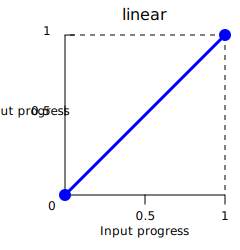

{{CSSRef}}

The **`<easing-function>`** [CSS](/en-US/docs/Web/CSS) [data type](/en-US/docs/Web/CSS/CSS_Values_and_Units/CSS_data_types) represents a mathematical function that describes the rate at which a value changes.

This transition between two values may be applied in different situations. It may be used to describe how fast values change during animations. This lets you vary the animation's speed over the course of its duration. You can specify an easing function for CSS [transition](/en-US/docs/Web/CSS/transition-timing-function) and [animation](/en-US/docs/Web/CSS/animation-timing-function) properties.

## Syntax

```css
/* Keyword linear easing function */
linear                /* linear(0, 1) */

/* Custom linear easing functions */
linear(0, 0.25, 1)
linear(0, 0.25 75%, 1)

/* Keyword cubic Bézier easing functions */
ease                  /* cubic-bezier(0.25, 0.1, 0.25, 1) */
ease-in               /* cubic-bezier(0.42, 0, 1, 1) */
ease-out              /* cubic-bezier(0, 0, 0.58, 1) */
ease-in-out           /* cubic-bezier(0.42, 0, 0.58, 1) */

/* Custom cubic Bézier easing function */
cubic-bezier(0.25, 0.1, 0.25, 1)

/* Keyword step easing functions */
step-start            /* steps(1, jump-start) */
step-end              /* steps(1, jump-end) */

/* Custom step easing functions */
steps(4, end)
steps(10, jump-both)
```

### Values

An `<easing-function>` can be one of the following types:

- `<linear-easing-function>`

  - : Creates transitions that progress at a constant rate. This function can be specified using one of the following:

    - `linear`

      - : Specifies a constant rate of interpolation, with no change in the rate of progress throughout the duration (that is, no acceleration or deceleration).
        This keyword value is equivalent to `linear(0, 1)`.
        It can also be represented as `cubic-bezier(0, 0, 1, 1)`.

        

        > [!NOTE]
        > The `linear` keyword is always interpreted as `linear(0, 1)`, whereas the function `linear(0, 1)` is interpreted as `linear(0 0%, 1 100%)`.

    - {{cssxref("easing-function/linear", "linear()")}}
      - : Defines multiple points of progress using {{cssxref("&lt;number&gt;")}} values, with optional {{cssxref("&lt;percentage&gt;")}} values to control their timing.

- `<cubic-bezier-easing-function>`

  - : Creates smooth transitions with variable rates of change. This function can be specified using one of the following:

    - `ease`

      - : Represents the easing function `cubic-bezier(0.25, 0.1, 0.25, 1)`.
        It indicates that the interpolation starts slowly, accelerates sharply, and then slows gradually towards the end.
        It is similar to the `ease-in-out` keyword, though it accelerates more sharply at the beginning.

    - `ease-in`

      - : Represents the easing function `cubic-bezier(0.42, 0, 1, 1)`.
        It indicates that the interpolation starts slowly, then progressively speeds up until the end, at which point it stops abruptly.

    - `ease-out`

      - : Represents the easing function `cubic-bezier(0, 0, 0.58, 1)`.
        It indicates that the interpolation starts abruptly and then progressively slows down towards the end.

    - `ease-in-out`

      - : Represents the easing function `cubic-bezier(0.42, 0, 0.58, 1)`.
        It indicates that the interpolation starts slowly, speeds up, and then slows down towards the end.
        At the beginning, it behaves like the `ease-in` keyword; at the end, it is like the `ease-out` keyword.

        

    - {{cssxref("easing-function/cubic-bezier", "cubic-bezier()")}}

      - : Defines a custom curve using four {{cssxref("&lt;number&gt;")}} values that specify the coordinates of two control points.
        The x-coordinates must be in the range `[0, 1]`.

- `<step-easing-function>`

  - : Creates stepped transitions that divides the animation into a set number of equal-length intervals, causing the animation to jump from one step to the next rather than transitioning smoothly.
    This function can be specified using one of the following:

    - `step-start`

      - : Represents the easing function `steps(1, jump-start)` or `steps(1, start)`.
        It indicates that the interpolation jumps immediately to its final state, where it stays until the end.

    - `step-end`

      - : Represents the easing function `steps(1, jump-end)` or `steps(1, end)`.
        It indicates that the interpolation stays in its initial state until the end, at which point it jumps directly to its final state.

        

    - {{cssxref("easing-function/steps", "steps()")}}
      - : Creates a stair-shaped curve using an {{cssxref("&lt;integer&gt;")}} to specify the number of intervals and an optional keyword to control the timing of jumps.

## Formal syntax

{{csssyntax}}

## Examples

### Comparing the easing functions

This example provides an easy comparison between the different easing functions using an animation. From the drop-down menu, you can select an easing function – there are a couple of keywords and some `cubic-bezier()` and `steps()` options. After selecting an option, you can start and stop the animation using the provided button.

#### HTML

```html
<div>
  <div></div>
</div>
<ul>
  <li>
    <button class="animation-button">Start animation</button>
  </li>
  <li>
    <label for="easing-select">Choose an easing function:</label>
    <select id="easing-select">
      <option selected>linear</option>
      <option>linear(0, 0.5 50%, 1)</option>
      <option>ease</option>
      <option>ease-in</option>
      <option>ease-in-out</option>
      <option>ease-out</option>
      <option>cubic-bezier(0.1, -0.6, 0.2, 0)</option>
      <option>cubic-bezier(0, 1.1, 0.8, 4)</option>
      <option>steps(5, end)</option>
      <option>steps(3, start)</option>
      <option>steps(4)</option>
    </select>
  </li>
</ul>
```

#### CSS

```css
body > div {
  position: relative;
  height: 100px;
}

div > div {
  position: absolute;
  width: 50px;
  height: 50px;
  background-color: blue;
  background-image: radial-gradient(
    circle at 10px 10px,
    rgb(25 255 255 / 80%),
    rgb(25 255 255 / 40%)
  );
  border-radius: 50%;
  top: 25px;
  animation: 1.5s infinite alternate;
}

@keyframes move-right {
  from {
    left: 10%;
  }

  to {
    left: 90%;
  }
}

li {
  display: flex;
  align-items: center;
  justify-content: center;
  margin-bottom: 20px;
}
```

#### JavaScript

```js
const selectElem = document.querySelector("select");
const startBtn = document.querySelector("button");
const divElem = document.querySelector("div > div");

startBtn.addEventListener("click", () => {
  if (startBtn.textContent === "Start animation") {
    divElem.style.animationName = "move-right";
    startBtn.textContent = "Stop animation";
    divElem.style.animationTimingFunction = selectElem.value;
  } else {
    divElem.style.animationName = "unset";
    startBtn.textContent = "Start animation";
  }
});

selectElem.addEventListener("change", () => {
  divElem.style.animationTimingFunction = selectElem.value;
});
```

#### Result

{{EmbedLiveSample("comparing_the_easing_functions", "100%", 200)}}

## Specifications

{{Specifications}}

## Browser compatibility

{{Compat}}

## See also

- [CSS animations](/en-US/docs/Web/CSS/CSS_animations)
- [CSS transitions](/en-US/docs/Web/CSS/CSS_transitions)
- [cubic-bezier.com](https://cubic-bezier.com/) by Lea Verou (2011)
- [`linear()` easing generator](https://linear-easing-generator.netlify.app/) by Jake Archibald
