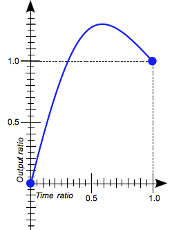
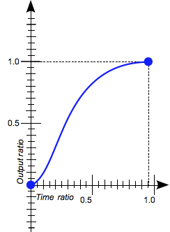
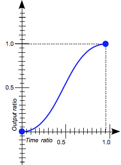
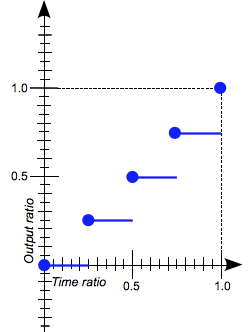
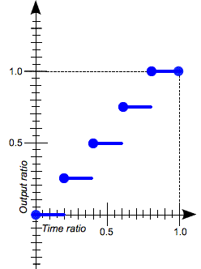

{{CSSRef}}

The **`<easing-function>`** [CSS](/en-US/docs/Web/CSS) [data type](/en-US/docs/Web/CSS/CSS_Types) denotes a mathematical function that describes the rate at which a numerical value changes.

This transition between two values may be applied in different situations. It may be used to describe how fast values change during animations. This lets you vary the animation's speed over the course of its duration. It may also be used to interpolate between two colors in a color gradient.

The easing functions in the cubic-bezier subset of easing functions are often called "smooth" easing functions, because they can be used to smooth down the start and end of the {{Glossary("interpolation")}}. They correlate an input ratio to an output ratio, both expressed as {{cssxref("&lt;number&gt;")}}s. For these values, `0.0` represents the initial state, and `1.0` represents the final state.

Depending on the specific function used, the calculated output can sometimes grow to be greater than `1.0` or smaller than `0.0` during the course of an animation. This causes the value to go farther than the final state, and then return. In animations, for some properties, such as {{cssxref("left")}} or {{cssxref("right")}}, this creates a kind of "bouncing" effect.



However, certain properties will restrict the output if it goes outside an allowable range. For example, a color component greater than `255` or smaller than `0` will be clipped to the closest allowed value (`255` and `0`, respectively). Some `cubic-bezier()` curves exhibit this property.


## Syntax

```css
/* linear function */
linear;

/* cubic-bezier functions */
cubic-bezier(x1, y1, x2, y2);
ease;
ease-in;
ease-out;
ease-in-out;

/* step functions */
steps(4, end);
step-start;
step-end;
```

The value of an `<easing-function>` type describes the easing function using one of the following three methods:

- linear functions
- cubic Bézier curves
- step functions.

### Linear functions

The interpolation is done at a constant rate from beginning to end. Use the `linear` keyword for this function. This represents the easing function `cubic-bezier(0.0, 0.0, 1.0, 1.0)`.


### Cubic Bézier functions

The `cubic-bezier()` functional notation defines a [cubic Bézier curve](/en-US/docs/Glossary/Bezier_curve). As these curves are continuous, they are often used to smooth down the start and end of the interpolation and are therefore sometimes called _easing functions_.


A cubic Bézier curve is defined by four points P0, P1, P2, and P3. P0 and P3 are the start and the end of the curve and, in CSS these points are fixed as the coordinates are ratios (the abscissa the ratio of time, the ordinate the ratio of the output range). P0 is `(0, 0)` and represents the initial time or position and the initial state, P3 is `(1, 1)` and represents the final time or position and the final state.

Not all cubic Bézier curves are suitable as easing functions as not all are [mathematical functions](https://en.wikipedia.org/wiki/Function_%28mathematics%29); i.e., curves that for a given abscissa have zero or one value. With P0 and P3 fixed as defined by CSS, a cubic Bézier curve is a function, and is therefore valid, if and only if the abscissas of P1 and P2 are both in the `[0, 1]` range.

Cubic Bézier curves with the P1 or P2 ordinate outside the `[0, 1]` range may generate _bouncing_ effects.

When you specify an invalid `cubic-bezier` curve, CSS ignores the whole property.

The syntax of a cubic-bezier function is:

```css
cubic-bezier(x1, y1, x2, y2)
```

where:

- **x1, y1, x2, y2**
  - : Are {{cssxref("&lt;number&gt;")}} values representing the abscissas, and ordinates of the P1 and P2 points defining the cubic Bézier curve. x1 and x2 must be in the range \[0, 1] or the value is invalid.

#### Keywords for common cubic-bezier easing functions

- `ease`
  - : The interpolation starts slowly, accelerates sharply, and then slows gradually towards the end. This keyword represents the easing function `cubic-bezier(0.25, 0.1, 0.25, 1.0)`. It is similar to [`ease-in-out`](#ease-in-out), though it accelerates more sharply at the beginning.



- `ease-in`
  - : The interpolation starts slowly, and then progressively speeds up until the end, at which point it stops abruptly. This keyword represents the easing function `cubic-bezier(0.42, 0.0, 1.0, 1.0)`.


- `ease-in-out`
  - : The interpolation starts slowly, speeds up, and then slows down towards the end. This keyword represents the easing function `cubic-bezier(0.42, 0.0, 0.58, 1.0)`. At the beginning, it behaves like the [`ease-in`](#ease-in) function; at the end, it is like the [`ease-out`](#ease-out) function.



- `ease-out`
  - : The interpolation starts abruptly, and then progressively slows down towards the end. This keyword represents the easing function `cubic-bezier(0.0, 0.0, 0.58, 1.0)`.


### Step functions

The `steps()` functional notation defines a [step function](https://en.wikipedia.org/wiki/Step_function) dividing the domain of output values in equidistant steps. This subclass of step functions are sometimes also called _staircase functions_.

Step functions are given using the syntax:

```css
steps(number_of_steps, direction)
```

where:

- _number_of_steps_
  - : Is a strictly positive {{cssxref("&lt;integer&gt;")}}, representing the amount of equidistant treads composing the stepping function.
- _direction_

  - : Is a keyword indicating when the jumps occur:

    - `jump-start` denotes that the first step or jump happens when the interpolation begins;
    - `jump-end` denotes that the last step or jump happens when the interpolation ends;
    - `jump-both` denotes that jumps occur at both the 0% and 100% marks, effectively adding a step during the interpolation iteration;
    - `jump-none` There is no jump on either end. Instead, holding at both the 0% mark and the 100% mark, each for 1/n of the duration
    - `start` is the equivalent of `jump-start`
    - `end` is the equivalent of `jump-end`

    `end` is the default.

#### Examples

- `steps(2, jump-start)`
  `steps(2, start)`

  

- `steps(4, jump-end) steps(4, end)`

  

- `steps(5, jump-none)`

  

- `steps(3, jump-both)`

  

#### Step function keywords

- `step-start`
  - :  The interpolation jumps immediately to its final state, where it stays until the end. This keyword represents the easing function `steps(1, jump-start)` or `steps(1, start)`.


- `step-end`
  - : The interpolation stays in its initial state until the end, at which point it jumps directly to its final state. This keyword represents the easing function `steps(1, jump-end)` or `steps(1, end)`.


## Formal syntax

{{csssyntax}}

## Examples

### Easing function comparison

This example creates an animation that can be started and stopped again using the provided button, and a select menu that can be used to switch its easing function between the available keywords, plus a couple of `cubic-bezier()` and `steps()` options. The idea is to provide an easy comparison between different easing functions.

#### HTML

```html
<div>
  <div></div>
</div>
<ul>
  <li>
    <button class="animation-button">Start animation</button>
  </li>
  <li>
    <label for="easing-select">Choose an easing function:</label>
    <select id="easing-select">
      <option selected>linear</option>
      <option>ease</option>
      <option>ease-in</option>
      <option>ease-in-out</option>
      <option>ease-out</option>
      <option>cubic-bezier(0.1, -0.6, 0.2, 0)</option>
      <option>cubic-bezier(0, 1.1, 0.8, 4)</option>
      <option>steps(5, end)</option>
      <option>steps(3, start)</option>
      <option>steps(4)</option>
    </select>
  </li>
</ul>
```

#### CSS

```css
body > div {
  position: relative;
  height: 100px;
}

div > div {
  position: absolute;
  width: 50px;
  height: 50px;
  background-color: blue;
  background-image: radial-gradient(circle at 10px 10px, rgba(25,255,255,0.8),rgba(25,255,255,0.4));
  border-radius: 50%;
  top: 25px;
  animation: 1.5s infinite alternate;
}

@keyframes move-right {
  from {
    left: 10%;
  }

  to {
    left: 90%;
  }
}

li {
  display: flex;
  align-items: center;
  justify-content: center;
  margin-bottom: 20px;
}
```

#### JavaScript

```js
const selectElem = document.querySelector('select');
const startBtn = document.querySelector('button');
const divElem = document.querySelector('div > div');

startBtn.addEventListener('click', () => {
  if (startBtn.textContent === 'Start animation') {
    divElem.style.animationName = 'move-right';
    startBtn.textContent = 'Stop animation';
    divElem.style.animationTimingFunction = selectElem.value;
  } else {
    divElem.style.animationName = 'unset';
    startBtn.textContent = 'Start animation';
  }
});

selectElem.addEventListener('change', () => {
  divElem.style.animationTimingFunction = selectElem.value;
});
```

#### Result

{{EmbedLiveSample('Easing_function_comparison', '100%', 200)}}

### cubic-bezier() function examples

These cubic Bézier curves are valid for use in CSS:

```css
/* The canonical Bézier curve with four <number> in the [0,1] range. */
cubic-bezier(0.1, 0.7, 1.0, 0.1)

/* Using <integer> is valid as any <integer> is also a <number>. */
cubic-bezier(0, 0, 1, 1)

/* Negative values for ordinates are valid, leading to bouncing effects.*/
cubic-bezier(0.1, -0.6, 0.2, 0)

/* Values > 1.0 for ordinates are also valid. */
cubic-bezier(0, 1.1, 0.8, 4)
```

These cubic Bézier curves definitions are invalid:

```css example-bad
/* Though the animated output type may be a color,
   Bézier curves work w/ numerical ratios.*/
cubic-bezier(0.1, red, 1.0, green)

/* Abscissas must be in the [0, 1] range or
   the curve is not a function of time. */
cubic-bezier(2.45, 0.6, 4, 0.1)

/* The two points must be defined, there is no default value. */
cubic-bezier(0.3, 2.1)

/* Abscissas must be in the [0, 1] range or
   the curve is not a function of time. */
cubic-bezier(-1.9, 0.3, -0.2, 2.1)
```

### steps() function examples

These easing functions are valid:

```css
/* There is 5 treads, the last one happens
   right before the end of the animation. */
steps(5, end)

/* A two-step staircase, the first one happening
   at the start of the animation. */
steps(2, start)

/* The second parameter is optional. */
steps(2)
```

> **Note:** If the animation contains multiple stops, then the steps specified in the `steps()` function will apply to each section. Therefore an animation with three segments and `steps(2)` will contain 6 steps in total, 2 per segment.

These easing function are invalid:

```css example-bad
/* The first parameter must be an <integer> and
   cannot be a real value, even if it is equal to one. */
steps(2.0, jump-end)

/* The amount of steps must be non-negative. */
steps(-3, start)

/* There must be at least one step.*/
steps(0, jump-none)
```

## Specifications

{{Specifications}}

## Browser compatibility

{{Compat}}

## See also

- [CSS Animations](/en-US/docs/Web/CSS/CSS_Animations)
- [CSS Transitions](/en-US/docs/Web/CSS/CSS_Transitions)
- [cubic-bezier](https://cubic-bezier.com/)
