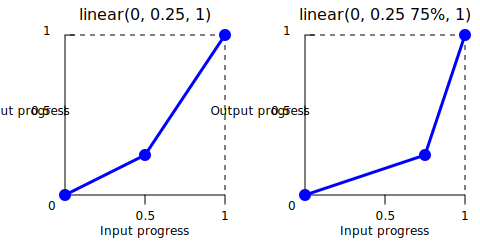

{{CSSRef}}

The **`linear()`** [CSS](/en-US/docs/Web/CSS) [function](/en-US/docs/Web/CSS/CSS_Functions) creates a transition curve that progresses uniformly between points.
As an [`<easing-function>`](/en-US/docs/Web/CSS/easing-function), it creates transitions where the {{Glossary("interpolation")}} occurs at a constant rate from beginning to end.

## Syntax

```css
linear(0, 1)
linear(0, 0.25, 1)
linear(0, 0.25 75%, 1)
linear(0, 0.5 25% 75%, 1)
```

### Parameters

The function accepts two or more of the following values, which represent progress points in the animation timeline:

- {{cssxref("&lt;number&gt;")}}

  - : Represents a point in time along the duration of the animation or transition.
    At least two values must be specified.
    The value `0` represents the start of the transition, and `1` represents the end.
    Values outside the `0` to `1` range are also allowed.

- {{cssxref("&lt;percentage&gt;")}} {{optional_inline}}

  - : Indicates when the progress `<number>` is reached during the animation timeline.
    It can be specified after any `<number>` value except the first and last and can take up to two values.
    If two percentage values are specified, they define the length of the stop: the first percentage indicates the starting point and the second percentage indicates the ending point for that segment in the animation or transition. If no `<percentage>` value is specified, the progress values are distributed evenly along the timeline.

## Description

The `linear()` function allows the approximation of complex animations and transitions by interpolating linearly between the specified points.
A typical use of the `linear()` function is to provide many points to approximate any curve.

The `linear()` function creates transitions where progress occurs at a constant rate between specified points.
For example, `linear(0, 0.25, 1)` has linear stops of `0`, `0.25`, and `1`.
The animation starts at point `0`, moves linearly to `0.25`, and then continues linearly to point `1`.
Since no percentage is specified, the same duration (`50%`) is used for each segment, that is, from `0` to `0.25` and from `0.25` to `1`.



By default, the stops are equidistant. For example, if there are five stops, they will occur at 0%, 25%, 50%, 75%, and 100% of the duration. You can use optional percentage values to provide finer control, defining when each progress value should occur and allowing for a more controlled progression of the transition.

Consider an animation with a duration time of 100 seconds and a change of 100 pixels. Let's look at a scenario where the easing of the animation is specified as `linear(0, 0.25 75%, 1)`. In this case, the animation progresses to 25 pixels (25% of its total change) in the first 75 seconds (75% of the duration). The last 75 pixels are applied in the remaining 25 seconds of the animation.

For the same animation, suppose the easing function is specified as `linear(0, 0.5 25% 75%, 1)`. Here, the animation reaches 50 pixels (50% of its total change) in 25 seconds (25% of the duration) and remains there for 50 seconds (75% - 25% of the duration). Then the last 50 pixels are applied in the remaining 25 seconds of the duration. Note that `linear(0, 0.5 25% 75%, 1)` is equivalent to `linear(0, 0.5 25%, 0.5 75%, 1)`.

## Formal syntax

{{csssyntax}}

## Examples

### Using the linear() function

The following `linear()` functions are valid for use in CSS:

```css example-good
/* Three evenly distributed progress points */
linear(0, 0.25, 1)

/* Custom timing with percentage values */
linear(0, 0.5 25% 75%, 1)
```

The following `linear()` definitions are invalid:

```css example-bad
/* At least two parameters are required */
linear(0.5)

/* Percentages must be in ascending order */
linear(0, 0.25 80%, 0.5 60%, 1)

/* Values must be numbers */
linear(start, middle, end)
```

## Specifications

{{Specifications}}

## Browser compatibility

{{Compat}}

## See also

- Other easing functions: {{cssxref("easing-function/cubic-bezier", "cubic-bezier()")}} and {{cssxref("easing-function/steps", "steps()")}}
- [`linear()` easing generator](https://linear-easing-generator.netlify.app/) by Jake Archibald
