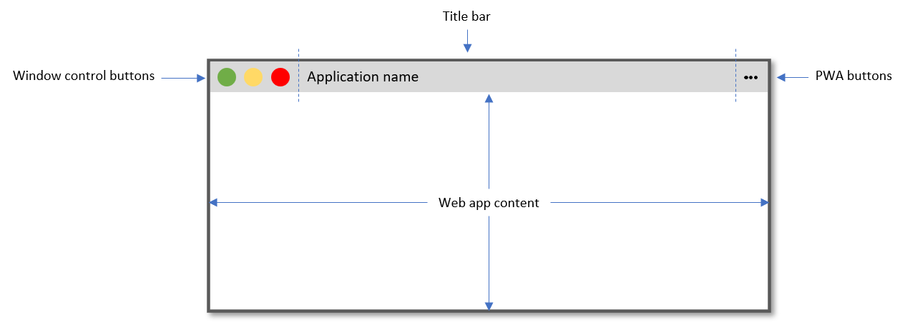
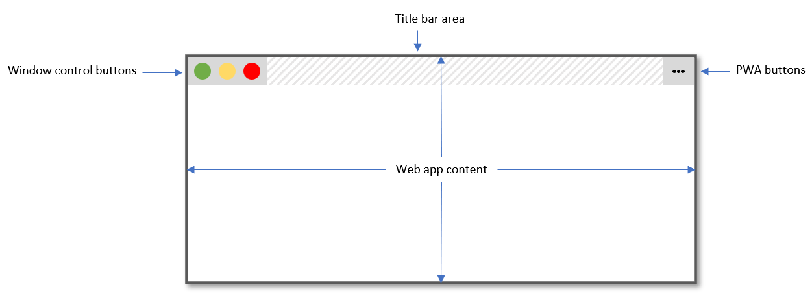

{{CSSRef}}

The **`env()`** [CSS](/en-US/docs/Web/CSS) [function](/en-US/docs/Web/CSS/CSS_Functions) can be used to insert the value of a user-agent defined environment variable into your CSS, in a similar fashion to the {{cssxref("var", "var()")}} function and [custom properties](/en-US/docs/Web/CSS/--*). The difference is that, as well as being user-agent defined rather than author-defined, environment variables are globally scoped to a document, whereas custom properties are scoped to the element(s) on which they are declared.

In addition, unlike custom properties, which cannot be used outside of declarations, the `env()` function can be used in place of any part of a property value, or any part of a descriptor (e.g. in [Media query rules](/en-US/docs/Web/CSS/@media)). As the spec evolves, it may also be usable in other places such as selectors.

Originally provided by the iOS browser to allow developers to place their content in a safe area of the viewport, the `safe-area-inset-*` values defined in the specification can be used to help ensure content is visible even to viewers using non‑rectangular displays.

For example, a common issue solved by `env()` is that of device notifications covering up some of the app user interface. By positioning fixed elements using `env()` you can ensure that they display in a safe area of the viewport.

Another use case for `env()` variables is for desktop [Progressive web apps](/en-US/docs/Web/Progressive_web_apps) (PWAs) that use the Window Controls Overlay feature to take advantage of the full application window surface area. Using the `titlebar-area-*` values, they can position elements where the title bar would have been and ensure that content stays clear of the window control buttons.

## Syntax

```css
/* Using the four safe area inset values with no fallback values */
env(safe-area-inset-top);
env(safe-area-inset-right);
env(safe-area-inset-bottom);
env(safe-area-inset-left);

/* Using them with fallback values */
env(safe-area-inset-top, 20px);
env(safe-area-inset-right, 1em);
env(safe-area-inset-bottom, 0.5vh);
env(safe-area-inset-left, 1.4rem);
```

### Values

- `safe-area-inset-top`, `safe-area-inset-right`, `safe-area-inset-bottom`, `safe-area-inset-left`
  - : The `safe-area-inset-*` variables are four environment variables that define a rectangle by its top, right, bottom, and left insets from the edge of the viewport, which is safe to put content into without risking it being cut off by the shape of a non‑rectangular display. For rectangular viewports, like your average laptop monitor, their value is equal to zero. For non-rectangular displays — like a round watch face — the four values set by the user agent form a rectangle such that all content inside the rectangle is visible.
- `titlebar-area-x`, `titlebar-area-y`, `titlebar-area-width`, `titlebar-area-height`
  - : The `titlebar-area-*` variables are useful for PWA installed on Desktop devices. When a desktop PWA uses the `window-controls-overlay` [display_override](/en-US/docs/Web/Manifest/Reference/display_override) value, then it can use the `titlebar-area-*` variables to make sure content doesn't overlap with the window control buttons (i.e. minimize, maximize, and close).
- `keyboard-inset-top`, `keyboard-inset-right`, `keyboard-inset-bottom`, `keyboard-inset-left`, `keyboard-inset-width`, `keyboard-inset-height`
  - : The `keyboard-inset-*` variables provide information about the on-screen virtual keyboard's appearance. They define a rectangle by its top, right, bottom, and left insets from the edge of the viewport (the width and height insets are calculated from the other insets). To learn more, see the {{domxref("VirtualKeyboard API", "VirtualKeyboard API", "", "nocode")}}.

> [!NOTE]
> Unlike other CSS properties, user agent-defined property names are case-sensitive.

## Formal syntax

{{CSSSyntax}}

## Usage

To tell the browser to use the whole available space on the screen, and so enabling us to use the `env()` variables, we need to add a new viewport meta value:

```html
<meta name="viewport" content="viewport-fit=cover" />
```

You can then use `env()` in your CSS:

```css
body {
  padding: env(safe-area-inset-top, 20px) env(safe-area-inset-right, 20px)
    env(safe-area-inset-bottom, 20px) env(safe-area-inset-left, 20px);
}
```

## Examples

### Using env() to ensure buttons are not obscured by device UI

In the following example `env()` is used to ensure that fixed app toolbar buttons are not obscured by device notifications appearing at the bottom of the screen. On the desktop `safe-area-inset-bottom` is `0`. However, in devices that display notifications at the bottom of the screen, such as iOS, it contains a value that leaves space for the notification to display. This can then be used in the value for {{cssxref("padding-bottom")}} to create a gap that appears natural on that device.

```html
<main>Main content of app here</main>
<footer>
  <button>Go here</button>
  <button>Or here</button>
</footer>
```

```css
body {
  display: flex;
  flex-direction: column;
  min-height: 100vh;
  font: 1em system-ui;
}

main {
  flex: 1;
  background-color: #eee;
  padding: 1em;
}

footer {
  flex: none;
  display: flex;
  gap: 1em;
  justify-content: space-evenly;
  background: black;
  padding: 1em 1em calc(1em + env(safe-area-inset-bottom));
  /* adds the safe-area-inset-bottom value to the initial 1em of padding.
  a larger black area will display for a device that has a positive value for this variable. */
  position: sticky;
  bottom: 0;
}

button {
  padding: 1em;
  background: white;
  color: black;
  margin: 0;
  width: 100%;
  border: none;
  font: 1em system-ui;
}
```

{{EmbedLiveSample("Using_env_to_ensure_buttons_are_not_obscured_by_device_UI", "200px", "500px")}}

### Using the fallback value

The below example makes use of the optional second parameter of `env()`, which allows you to provide a fallback value in case the environment variable is not available.

```html
<p>
  If the <code>env()</code> function is supported in your browser, this
  paragraph's text will have 50px of padding between it and the left border —
  but not the top, right and bottom. This is because the accompanying CSS is the
  equivalent of <code>padding: 0 0 0 50px</code>, because, unlike other CSS
  properties, user agent property names are case-sensitive.
</p>
```

```css
p {
  width: 300px;
  border: 2px solid red;
  padding: env(safe-area-inset-top, 50px) env(safe-area-inset-right, 50px)
    env(safe-area-inset-bottom, 50px) env(SAFE-AREA-INSET-LEFT, 50px);
}
```

{{EmbedLiveSample("Using_the_fallback_value", "350px", "250px")}}

### Example values

```css
/* zero for all rectangular user agents */
padding: env(safe-area-inset-bottom, 50px);

/* 50px because UA properties are case sensitive */
padding: env(Safe-area-inset-bottom, 50px);

/* as if padding: '50px 20px' were set because x is not a valid environment variable */
padding: env(x, 50px 20px);

/* ignored because '50px, 20px' is not a valid padding value and x is not a valid environment variable */
padding: env(x, 50px, 20px);
```

The syntax of the fallback, like that of custom properties, allows commas. But, if the property value doesn't support commas, the value is not valid.

> [!NOTE]
> User agent properties are not reset by the [all](/en-US/docs/Web/CSS/all) property.

### Using env() to ensure content is not obscured by window control buttons in desktop PWAs

In the following example `env()` ensures that content displayed in a desktop Progressive Web App that uses the [Window Controls Overlay API](/en-US/docs/Web/API/Window_Controls_Overlay_API) is not obscured by the operating system's window control buttons. The `titlebar-area-*` values define a rectangle where the title bar would normally have been displayed. On devices that do not support the Window Controls Overlay feature, such as mobile devices, the fallback values are used.

Here is what a PWA installed on a desktop device normally looks like:



With the Window Controls Overlay feature, the web content covers the whole app window surface area, with the window controls and PWA buttons displayed as overlays:



```html
<header>Title of the app here</header>
<main>Main content of app here</main>
```

```css
header {
  position: fixed;
  left: env(titlebar-area-x);
  top: env(titlebar-area-y);
  width: env(titlebar-area-width);
  height: env(titlebar-area-height);
}

main {
  margin-top: env(titlebar-area-height);
}
```

> [!NOTE]
> Using `position:fixed` makes sure the header does not scroll with the rest of the content, and instead stays aligned with the window control buttons, even on device/browsers that support elastic overscroll (also known as rubber banding).

## Specifications

{{Specifications}}

## Browser compatibility

{{Compat}}

## See also

- {{CSSxRef("var", "var(…)")}}
- [CSS custom properties for cascading variables](/en-US/docs/Web/CSS/CSS_cascading_variables) module
- [Custom properties (`--*`): CSS variables](/en-US/docs/Web/CSS/--*)
- [Using CSS custom properties (variables)](/en-US/docs/Web/CSS/CSS_cascading_variables/Using_CSS_custom_properties)
- [Customize the window controls overlay of your PWA's title bar](https://web.dev/articles/window-controls-overlay)
- [Display content in the title bar](https://learn.microsoft.com/en-us/microsoft-edge/progressive-web-apps-chromium/how-to/window-controls-overlay)
- [Breaking Out of the Box](https://alistapart.com/article/breaking-out-of-the-box/)
