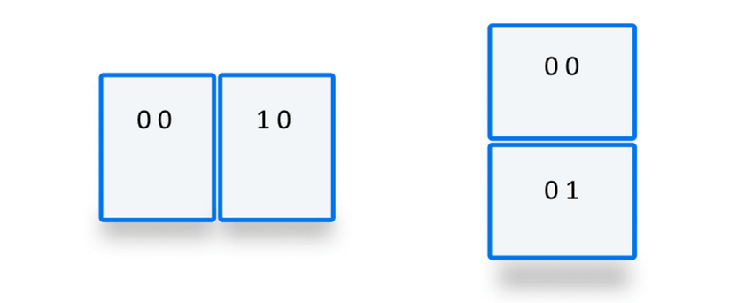

The **`env()`** [CSS](/en-US/docs/Web/CSS) [function](/en-US/docs/Web/CSS/CSS_Values_and_Units/CSS_Value_Functions) can be used to insert the value of a user-agent defined [environment variable](/en-US/docs/Web/CSS/CSS_environment_variables/Using_environment_variables) into your CSS.

## Syntax

```css
/* Without a fallback value */
env(safe-area-inset-top);
env(titlebar-area-width);
env(viewport-segment-right 0 0);

/* With a fallback value */
env(safe-area-inset-right, 1em);
env(titlebar-area-y, 40px);
env(viewport-segment-width 0 0, 40%);
```

### Parameters

The `env( <environment-variable>, <fallback> )` function accepts the following parameters:

- [`<environment-variable>`](/en-US/docs/Web/CSS/CSS_environment_variables/Using_environment_variables#browser-defined_environment_variables)
  - : A {{cssxref("&lt;custom-ident>")}} specifying the name of the environment variable to be inserted. If the name provided represents an array-like environment variable, the name is followed by {{cssxref("&lt;integer>")}} values identifying the specific instance the name is referencing. The case-sensitive environment variable name can be one of the following:
    - `safe-area-inset-top`, `safe-area-inset-right`, `safe-area-inset-bottom`, `safe-area-inset-left`
      - : The safe distance from the top, right, bottom, or left inset edge of the viewport, defining where it is safe to place content into without risking it being cut off by the shape of a non‑rectangular display. The four values form a rectangle, inside which all content is visible. The values are `0` if the viewport is a rectangle and no features — such as toolbars or dynamic keyboards — are occupying viewport space; otherwise, it is a `px` value greater than `0`.
    - `safe-area-max-inset-top`, `safe-area-max-inset-right`, `safe-area-max-inset-bottom`, `safe-area-max-inset-left`
      - : The static maximum values of their dynamic `safe-area-inset-*` variable counterparts when all dynamic user interface features are retracted. While the `safe-area-inset-*` values change as the currently-visible content area changes, the `safe-area-max-inset-*` values are constants.
    - `titlebar-area-x`, `titlebar-area-y`, `titlebar-area-width`, `titlebar-area-height`
      - : The dimensions of a visible `titlebar-area-*` area. These variables are available when using the `window-controls-overlay` [`display_override`](/en-US/docs/Web/Progressive_web_apps/Manifest/Reference/display_override) manifest field. The variables' values can be used to ensure content doesn't overlap window control buttons (that is, minimize, maximize, and close) with progressive web apps (PWA) installed on desktop devices.
    - `keyboard-inset-top`, `keyboard-inset-right`, `keyboard-inset-bottom`, `keyboard-inset-left`, `keyboard-inset-width`, `keyboard-inset-height`
      - : The insets from the edge of the viewport and dimensions of the device's on-screen virtual keyboard. Defined in the {{domxref("VirtualKeyboard API", "VirtualKeyboard API", "", "nocode")}}.
    - `viewport-segment-width`, `viewport-segment-height`, `viewport-segment-top`, `viewport-segment-right`, `viewport-segment-bottom`, `viewport-segment-left`
      - : The dimensions and offset positions of specific viewport segments. The `viewport-segment-*` keyword is followed by two space-separated {{cssxref("&lt;integer>")}} values that indicate the segment's horizontal and vertical position, or indices. The viewport-segment keywords are only defined when the viewport is made up of two or more segments, as with foldable or hinged devices.

- `<fallback>` {{optional_inline}}
  - : A fallback value to be inserted if the environment variable referenced in the first argument does not exist. Everything after the first comma is deemed to be the fallback value. This can be a single value, another `env()` function, or a comma-separated list of values.

## Description

The `env()` function is used to insert the value of a globally-scoped, [user-agent-defined environment variable](/en-US/docs/Web/CSS/CSS_environment_variables/Using_environment_variables#browser-defined_environment_variables) into your CSS. The `env()` function can be used as a property value or in place of any part of a property value or descriptor (for example, in [Media query rules](/en-US/docs/Web/CSS/@media)).

The function accepts an `<environment-variable>` as its first argument. This is a case-sensitive {{cssxref("&lt;custom-ident>")}} equal to the [name of the environment variable](/en-US/docs/Web/CSS/CSS_environment_variables/Using_environment_variables#browser-defined_environment_variables) to be substituted, but it can also include additional space-separated values if required. For example, `env(viewport-segment-width 0 0)` would return the width of the top or left segment in the case of a device with multiple viewport segments.

The second argument, if provided, is the fallback value, which is used if the environment variable referenced in the first argument is not supported or doesn't exist. The fallback can be another environment variable, even with its own fallback.

The syntax of the fallback is similar to the fallback syntax of the {{cssxref("var()")}} function used to insert [CSS custom properties](/en-US/docs/Web/CSS/--*) in that it allows for multiple commas. Anything between the first comma and the end of the function is considered the fallback value. However, if the `env()` function is used within a property value or descriptor that doesn't include commas, a fallback value that includes commas will not be valid.

A property or descriptor containing a syntactically valid `env()` function is assumed to be valid at parse time, when the browser first reads and interprets the downloaded CSS text. It is only syntax-checked at compute time, after each `env()` function has been substituted with its browser-provided value (or the fallback value if the environment variable passed as the first parameter is not a recognized environment variable name). If the value is invalid and no fallback is provided, the property or descriptor containing the `env()` function is [invalid at computed-value time](/en-US/docs/Web/CSS/CSS_syntax/Error_handling#invalid_custom_properties).

When a `env()` substitution is invalid, and an invalid fallback is included, or the fallback is omitted, the declaration is not ignored. Instead, the [initial](/en-US/docs/Web/CSS/CSS_cascade/Value_processing#initial_value) or [inherited](/en-US/docs/Web/CSS/CSS_cascade/Inheritance) value of the property is used instead. The property is set to a new value, but it may not be the expected one.

### Use cases

Originally provided by the iOS browser to allow developers to place their content in a safe area of the viewport, and not be obscured by device notches or rounded corners, the `safe-area-inset-*` values can be used to help ensure content is visible to viewers. This feature was later expanded beyond its initial purpose to enable use cases such as [stopping device notifications from covering up some of the app user interface](#using_env_to_ensure_buttons_are_not_obscured_by_device_ui).

Another use case for `env()` variables is for desktop [Progressive web apps](/en-US/docs/Web/Progressive_web_apps) (PWAs) that use the [Window Controls Overlay](/en-US/docs/Web/API/Window_Controls_Overlay_API) feature to take advantage of the full application window surface area. Using the [`titlebar-area-*` values](#titlebar-area-x) values, developers can position elements where the title bar would have been and [ensure content is not obscured by window control buttons](#using_env_to_ensure_content_is_not_obscured_by_window_control_buttons_in_desktop_pwas).

The `viewport-segment-*` variable names can be used to set your containers to fit neatly into the available segments of a multi-viewport-segment device such as a hinged or foldable device. The integers following the `viewport-segment-*` name indicate which segment of the multiple segments the environment variable is referencing.

### Names followed by integers

When the environment variable is array-like, meaning the name may reference more than once value, such as is the case with devices with multiple viewport segments, the `<environment-variable>` parameter includes both the name of the variable and the indices of the specific instance of the variable the function is referencing. For example, in the case of the `viewport-segment-*` variables, the variable names are passed to the `env()` function along with two integers indicating the indices of the segment to return the value for. These values are both integers of `0` or greater. The first integer represents the horizontal index of the segment, with `0` being the left-most segment, and the second value represents the vertical index of the segment, with `0` representing the bottom-most segment:



- In a horizontal side-by-side layout, the left segment is represented by `0 0`, and the right segment is represented by `1 0`.
- In a vertical top-to-bottom layout, the top segment is represented by `0 0`, and the bottom segment is represented by `0 1`.
- In devices with more than two segments, the numbers may be greater. For example, a device with three horizontal segments may have the center segment represented by `1 0`, and the right-hand segment represented by `2 0`.

For example, the following returns the width of the right-hand segment on a two-segment foldable device where the segments are oriented horizontally:

```css
env(viewport-segment-width 1 0)
```

See the [Viewport segment API demo](https://mdn.github.io/dom-examples/viewport-segment-api/) for a full working demo ([source code](https://github.com/mdn/dom-examples/tree/main/viewport-segment-api)). Also check out [Using the Viewport Segments API](/en-US/docs/Web/API/Viewport_segments_API/Using) for a full demo explanation.

## Formal syntax

{{CSSSyntax}}

## Examples

### Using env() to ensure buttons are not obscured by device UI

In the following example, `env()` is used to ensure that fixed app toolbar buttons are not obscured by device notifications appearing at the bottom of the screen. On the desktop `safe-area-inset-bottom` is `0`. However, in devices that display notifications at the bottom of the screen, such as iOS, it contains a value that leaves space for the notification to display. This can then be used in the value for {{cssxref("padding-bottom")}} to create a gap that appears natural on that device.

#### HTML

We have a {{htmlelement("main")}} section containing a fake application and a {{htmlelement("footer")}} containing two {{htmlelement("button")}} elements:

```html
<main>Main content of app here</main>
<footer>
  <button>Go here</button>
  <button>Or here</button>
</footer>
```

#### CSS

By using [CSS flexible box layout](), we create a footer that is only as tall as it needs to be, while the main section containing the application fills up the rest of the viewport:

```css
body {
  display: flex;
  flex-direction: column;
  min-height: 100vh;
  font: 1em system-ui;
}

main {
  flex: 1;
  background-color: #eeeeee;
  padding: 1em;
}

footer {
  flex: none;
  display: flex;
  gap: 1em;
  justify-content: space-evenly;
  background: black;
}

button {
  padding: 1em;
  background: white;
  color: black;
  margin: 0;
  width: 100%;
  border: none;
  font: 1em system-ui;
}
```

We set [`position: sticky`]() to stick the footer to the bottom of the viewport. We then use the {{cssxref("padding")}} shorthand to add padding to the footer. We include the value of the `safe-area-inset-bottom` environment value to an initial `1em` of bottom padding. A larger black area will display on devices that have a positive value for this variable, ensuring the buttons in the footer are never obscured.

```css
footer {
  position: sticky;
  bottom: 0;

  padding: 1em 1em calc(1em + env(safe-area-inset-bottom));
}
```

#### Results

{{EmbedLiveSample("Using_env_to_ensure_buttons_are_not_obscured_by_device_UI", "200px", "500px")}}

### Using a fallback value

This example makes use of the optional second parameter of `env()`, which provides a fallback value in case the environment variable is not available.

#### HTML

We include a paragraph of text:

```html
<p>
  If the <code>env()</code> function is supported in your browser, this
  paragraph's text will have 50px of padding between it and the left border —
  but not the top, right and bottom. This is because the accompanying CSS is the
  equivalent of <code>padding: 0 0 0 50px</code>, because, unlike other CSS
  properties, user agent property names are case-sensitive.
</p>
```

#### CSS

We set a {{cssxref("width")}} of `300px` and a {{cssxref("border")}}. We then add {{cssxref("padding")}}, using the `env()` function with a fallback for the size of the padding on each side. We intentionally set an invalid value for the left padding (remember, environment variable names are case-sensitive), to demonstrate the use of the fallback value.

```css
p {
  width: 300px;
  border: 2px solid red;
  padding: env(safe-area-inset-top, 50px) env(safe-area-inset-right, 50px)
    env(safe-area-inset-bottom, 50px) env(SAFE-AREA-INSET-LEFT, 50px);
}
```

#### Results

{{EmbedLiveSample("Using_the_fallback_value", "350px", "250px")}}

### Using env() to ensure content is not obscured by window control buttons in desktop PWAs

In the following example, `env()` ensures that content displayed in a desktop Progressive Web App that uses the [Window Controls Overlay API](/en-US/docs/Web/API/Window_Controls_Overlay_API) is not obscured by the operating system's window control buttons. The `titlebar-area-*` values define a rectangle where the title bar would normally have been displayed. On devices that do not support the Window Controls Overlay feature, such as mobile devices, the fallback values are used.

Here is what a PWA installed on a desktop device normally looks like:


With the Window Controls Overlay feature, the web content covers the whole app window surface area, with the window controls and PWA buttons displayed as overlays:


```html
<header>Title of the app here</header>
<main>Main content of app here</main>
```

```css
header {
  position: fixed;
  left: env(titlebar-area-x);
  top: env(titlebar-area-y);
  width: env(titlebar-area-width);
  height: env(titlebar-area-height);
}

main {
  margin-top: env(titlebar-area-height);
}
```

> [!NOTE]
> Using `position:fixed` makes sure the header does not scroll with the rest of the content, and instead stays aligned with the window control buttons, even on device/browsers that support elastic overscroll (also known as rubber banding).

### Viewport segments

The [Viewport segment API demo](https://mdn.github.io/dom-examples/viewport-segment-api/) and [Using the Viewport Segments API](/en-US/docs/Web/API/Viewport_segments_API/Using) guide provides a demonstration and explanation of using the `env()` function with the `viewport-segments-*` environment variables.

## Specifications

{{Specifications}}

## Browser compatibility

{{Compat}}

## See also

- [Using environment variables](/en-US/docs/Web/CSS/CSS_environment_variables/Using_environment_variables)
- [CSS environment variables](/en-US/docs/Web/CSS/CSS_environment_variables) module
- {{CSSxRef("var")}}
- [CSS custom properties for cascading variables](/en-US/docs/Web/CSS/CSS_cascading_variables) module
- [Custom properties (`--*`): CSS variables](/en-US/docs/Web/CSS/--*)
- [Using CSS custom properties (variables)](/en-US/docs/Web/CSS/CSS_cascading_variables/Using_CSS_custom_properties)
- [Viewport Segments API](/en-US/docs/Web/API/Viewport_segments_API)
- [Customize the window controls overlay of your PWA's title bar](https://web.dev/articles/window-controls-overlay)
- [Display content in the title bar](https://learn.microsoft.com/en-us/microsoft-edge/progressive-web-apps/how-to/window-controls-overlay)
- [Breaking Out of the Box](https://alistapart.com/article/breaking-out-of-the-box/)
