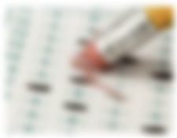

{{CSSRef}}

The **`filter`** [CSS](/en-US/docs/Web/CSS) property applies graphical effects like blur or color shift to an element. Filters are commonly used to adjust the rendering of images, backgrounds, and borders.

Included in the CSS standard are several functions that achieve predefined effects. You can also reference an SVG filter with a URL to an [SVG filter element](/en-US/docs/Web/SVG/Element/filter).

{{EmbedInteractiveExample("pages/css/filter.html")}}

## Syntax

```css
/* URL to SVG filter */
filter: url("filters.svg#filter-id");

/* <filter-function> values */
filter: blur(5px);
filter: brightness(0.4);
filter: contrast(200%);
filter: drop-shadow(16px 16px 20px blue);
filter: grayscale(50%);
filter: hue-rotate(90deg);
filter: invert(75%);
filter: opacity(25%);
filter: saturate(30%);
filter: sepia(60%);

/* Multiple filters */
filter: contrast(175%) brightness(3%);

/* Use no filter */
filter: none;

/* Global values */
filter: inherit;
filter: initial;
filter: revert;
filter: revert-layer;
filter: unset;
```

With a function, use the following:

```css
filter: <filter-function> [<filter-function>]* | none
```

For a reference to an SVG {{SVGElement("filter")}} element, use the following:

```css
filter: url(file.svg#filter-element-id)
```

### Interpolation

When animated, if both the beginning and end filters have a function list of the same length without {{cssxref("url","url()")}}, each of their filter functions is {{Glossary("interpolation", "interpolated")}} according to its specific rules. If they have different lengths, the missing equivalent filter functions from the longer list are added to the end of the shorter list using their initial values, then all filter functions are interpolated according to their specific rules. If one filter is `none`, it is replaced with the filter functions list of the other one using the filter function default values, then all filter functions are interpolated according to their specific rules. Otherwise, discrete interpolation is used.

## Functions

The `filter` property is specified as `none` or one or more of the functions listed below. If the parameter for any function is invalid, the function returns `none`. Except where noted, the functions that take a value expressed with a percent sign (as in `34%`) also accept the value expressed as decimal (as in `0.34`).

When a `filter` property has two or more functions, its results are different from the same functions applied separately using multiple `filter` properties.

### SVG filter

#### url()

Takes an URI pointing to an [SVG filter](/en-US/docs/Web/SVG/Element/filter), which may be embedded in an external XML file.

```css
filter: url(resources.svg#c1)
```

### Filter functions

#### blur()

The {{cssxref("filter-function/blur", "blur()")}} function applies a Gaussian blur to the input image. The value of `radius` defines the value of the standard deviation to the Gaussian function, or how many pixels on the screen blend into each other, so a larger value will create more blur. The initial value for interpolation is `0`. The parameter is specified as a CSS length, but does not accept percentage values.

```css
filter: blur(5px)
```

```html hidden
  <table class="standard-table">
  <thead>
    <tr>
      <th style="text-align: left;" scope="col">Original image</th>
      <th style="text-align: left;" scope="col">Live example</th>
      <th style="text-align: left;" scope="col">SVG Equivalent</th>
      <th style="text-align: left;" scope="col">Static example</th>
    </tr>
  </thead>
  <tbody>
    <tr>
      <td></td>
      <td></td>
      <td>
        <div class="svg-container">
          <svg id="img3" overflow="visible" viewBox="0 0 212 161" color-interpolation-filters="sRGB">
            <filter id="svgBlur" x="-5%" y="-5%" width="110%" height="110%">
              <feGaussianBlur in="SourceGraphic" stdDeviation="3.5"/>
            </filter>
            <image xlink:href="test_form_2.jpeg" filter="url(#svgBlur)" width="212px" height="161px"/>
          </svg>
        </div>
      </td>
      <td></td>
    </tr>
  </tbody>
</table>
```

```css hidden
html {
  height:100%;
}
body {
  font: 14px/1.286 "Lucida Grande", "Lucida Sans Unicode", "DejaVu Sans", Lucida, Arial, Helvetica, sans-serif;
  color: rgb(51, 51, 51);
  height:100%;
  overflow:hidden;
}
#img2 {
  width:100%;
  height:auto;
  filter:blur(5px); }
table.standard-table {
  border: 1px solid rgb(187, 187, 187);
  border-collapse: collapse;
  border-spacing: 0;
  margin: 0 0 1.286em;
  height: 100%;
  width: 85%;
}
table.standard-table th {
  border: 1px solid rgb(187, 187, 187);
  padding: 0px 5px;
  background: none repeat scroll 0% 0% rgb(238, 238, 238);
  text-align: left;
  font-weight: bold;
}
table.standard-table td {
  padding: 5px;
  border: 1px solid rgb(204, 204, 204);
  text-align: left;
  vertical-align: top;
  width:25%;
  height:auto;
}
#img3 {
  height:100%;
}
```

```svg
<svg style="position: absolute; top: -99999px" xmlns="http://www.w3.org/2000/svg">
  <filter id="svgBlur" x="-5%" y="-5%" width="110%" height="110%">
    <feGaussianBlur in="SourceGraphic" stdDeviation="5"/>
  </filter>
</svg>
```

{{EmbedLiveSample('blur','100%','236px','','', 'no-codepen')}}

#### brightness()

The {{cssxref("filter-function/brightness", "brightness()")}} function applies a linear multiplier to the input image, making it appear more or less bright. A value of `0%` will create an image that is completely black. A value of `100%` leaves the input unchanged. Other values are linear multipliers on the effect. Values of an amount over `100%` are allowed, providing brighter results. The initial value for interpolation is `1`.

```css
filter: brightness(2)
```

```svg
<svg style="position: absolute; top: -99999px" xmlns="http://www.w3.org/2000/svg">
  <filter id="brightness">
    <feComponentTransfer>
      <feFuncR type="linear" slope="[amount]"/>
      <feFuncG type="linear" slope="[amount]"/>
      <feFuncB type="linear" slope="[amount]"/>
    </feComponentTransfer>
  </filter>
</svg>
```

```html hidden
<table class="standard-table">
  <thead>
    <tr>
      <th style="text-align: left;" scope="col">Original image</th>
      <th style="text-align: left;" scope="col">Live example</th>
      <th style="text-align: left;" scope="col">SVG Equivalent</th>
      <th style="text-align: left;" scope="col">Static example</th>
    </tr>
  </thead>
  <tbody>
    <tr>
      <td></td>
      <td></td>
      <td><div class="svg-container"><svg xmlns="http://www.w3.org/2000/svg" id="img3" viewBox="0 0 286 217" color-interpolation-filters="sRGB">
 <filter id="brightness">
    <feComponentTransfer>
        <feFuncR type="linear" slope="2"/>
        <feFuncG type="linear" slope="2"/>
        <feFuncB type="linear" slope="2"/>
    </feComponentTransfer>
  </filter>
  <image xlink:href="test_form.jpg" filter="url(#brightness)" width="286px" height="217px" />
</svg><div></td>
      <td></td>
    </tr>
  </tbody>
</table>
```

```css hidden
html {
  height:100%;
}
body {
  font: 14px/1.286 "Lucida Grande","Lucida Sans Unicode","DejaVu Sans",Lucida,Arial,Helvetica,sans-serif;
  color: rgb(51, 51, 51);
  height:100%;
  overflow:hidden;
}
#img2 {
  width:100%;
  height:auto;
  filter:brightness(2); }
table.standard-table {
  border: 1px solid rgb(187, 187, 187);
  border-collapse: collapse;
  border-spacing: 0px;
  margin: 0px 0px 1.286em;
  height:100%;
  width: 85%;
}
table.standard-table th {
  border: 1px solid rgb(187, 187, 187);
  padding: 0px 5px;
  background: none repeat scroll 0% 0% rgb(238, 238, 238);
  text-align: left;
  font-weight: bold;
}
table.standard-table td {
  padding: 5px;
  border: 1px solid rgb(204, 204, 204);
  text-align: left;
  vertical-align: top;
  width:25%;
  height:auto;
}
#img3 {
  height:100%;
}
```

{{EmbedLiveSample('brightness','100%','231px','','', 'no-codepen')}}

#### contrast()

The {{cssxref("filter-function/contrast", "contrast()")}} function adjusts the contrast of the input image. A value of `0%` will create an image that is completely gray. A value of `100%` leaves the input unchanged. Values of an amount over `100%` are allowed, providing results with more contrast. The initial value for interpolation is `1`.

```css
filter: contrast(200%)
```

```svg
<svg style="position: absolute; top: -99999px" xmlns="http://www.w3.org/2000/svg">
  <filter id="contrast">
    <feComponentTransfer>
      <feFuncR type="linear" slope="[amount]" intercept="-(0.5 * [amount]) + 0.5"/>
      <feFuncG type="linear" slope="[amount]" intercept="-(0.5 * [amount]) + 0.5"/>
      <feFuncB type="linear" slope="[amount]" intercept="-(0.5 * [amount]) + 0.5"/>
    </feComponentTransfer>
  </filter>
</svg>
```

```html hidden
<table class="standard-table">
  <thead>
    <tr>
      <th style="text-align: left;" scope="col">Original image</th>
      <th style="text-align: left;" scope="col">Live example</th>
      <th style="text-align: left;" scope="col">SVG Equivalent</th>
      <th style="text-align: left;" scope="col">Static example</th>
    </tr>
  </thead>
  <tbody>
    <tr>
      <td></td>
      <td></td>
      <td><div class="svg-container"><svg xmlns="http://www.w3.org/2000/svg" id="img3" viewBox="0 0 240 151" color-interpolation-filters="sRGB">
 <filter id="contrast">
    <feComponentTransfer>
      <feFuncR type="linear" slope="2" intercept="-0.5"/>
      <feFuncG type="linear" slope="2" intercept="-0.5"/>
      <feFuncB type="linear" slope="2" intercept="-0.5"/>
    </feComponentTransfer>
  </filter>
  <image xlink:href="test_form_3.jpeg" filter="url(#contrast)" width="240px" height="151px" />
</svg><div></td>
      <td></td>
    </tr>
  </tbody>
</table>
```

```css hidden
html {
  height:100%;
}
body {
  font: 14px/1.286 "Lucida Grande","Lucida Sans Unicode","DejaVu Sans",Lucida,Arial,Helvetica,sans-serif;
  color: rgb(51, 51, 51);
  height:100%;
  overflow:hidden;
}
#img2 {
  width:100%;
  height:auto;
  filter:contrast(200%); }
table.standard-table {
  border: 1px solid rgb(187, 187, 187);
  border-collapse: collapse;
  border-spacing: 0px;
  margin: 0px 0px 1.286em;
  width: 85%;
  height: 100%;
}
table.standard-table th {
  border: 1px solid rgb(187, 187, 187);
  padding: 0px 5px;
  background: none repeat scroll 0% 0% rgb(238, 238, 238);
  text-align: left;
  font-weight: bold;
}
table.standard-table td {
  padding: 5px;
  border: 1px solid rgb(204, 204, 204);
  text-align: left;
  vertical-align: top;
  width:25%;
  height:auto;
}
#img3 {
  height:100%;
}
```

{{EmbedLiveSample('contrast','100%','203px','','', 'no-codepen')}}

#### drop-shadow()

The {{cssxref("filter-function/drop-shadow", "drop-shadow()")}} function applies a drop shadow effect to the input image. A drop shadow is effectively a blurred, offset version of the input image's alpha mask drawn in a particular color, composited below the image. The function accepts a parameter of type `<shadow>` (defined in [CSS Backgrounds and Borders Module Level 3](https://www.w3.org/TR/css-backgrounds-3/#typedef-shadow)), with the exception that the `inset` keyword and `spread` parameter are not allowed. This function is similar to the more established {{cssxref("box-shadow")}} property; the difference is that with filters, some browsers provide hardware acceleration for better performance. The parameters of the `<shadow>` parameter are as follows:

- `<offset-x>` `<offset-y>` (required)
  - : These are two {{cssxref("&lt;length&gt;")}} values to set the shadow offset. `<offset-x>` specifies the horizontal distance. Negative values place the shadow to the left of the element. `<offset-y>` specifies the vertical distance. Negative values place the shadow above the element. See {{cssxref("&lt;length&gt;")}} for possible units.
    If both values are `0`, the shadow is placed behind the element (and may generate a blur effect if `<blur-radius>` and/or `<spread-radius>` is set).
- `<blur-radius>` (optional)
  - : This is a third {{cssxref("&lt;length&gt;")}} value. The larger this value, the bigger the blur, so the shadow becomes bigger and lighter. Negative values are not allowed. If not specified, it will be `0` (the shadow's edge is sharp).
- `<color>` (optional)
  - : See {{cssxref("&lt;color&gt;")}} values for possible keywords and notations. If not specified, the color used depends on the browser - it is usually the value of the {{cssxref("&lt;color&gt;")}} property, but note that Safari currently paints a transparent shadow in this case.

```css
filter: drop-shadow(16px 16px 10px black)
```

```svg
<svg style="position: absolute; top: -999999px" xmlns="http://www.w3.org/2000/svg">
 <filter id="drop-shadow">
    <feGaussianBlur in="SourceAlpha" stdDeviation="[radius]"/>
    <feOffset dx="[offset-x]" dy="[offset-y]" result="offsetblur"/>
    <feFlood flood-color="[color]"/>
    <feComposite in2="offsetblur" operator="in"/>
    <feMerge>
      <feMergeNode/>
      <feMergeNode in="SourceGraphic"/>
    </feMerge>
  </filter>
</svg>
```

```html hidden
<table class="standard-table">
  <thead>
    <tr>
      <th style="text-align: left;" scope="col">Original image</th>
      <th style="text-align: left;" scope="col">Live example</th>
      <th style="text-align: left;" scope="col">SVG Equivalent</th>
      <th style="text-align: left;" scope="col">Static example</th>
    </tr>
  </thead>
  <tbody>
    <tr>
      <td></td>
      <td></td>
      <td>
        <div class="svg-container">
          <svg aria-labelledby="svg-drop-shadow-title svg-drop-shadow-desc" role="img" xmlns="http://www.w3.org/2000/svg" id="img3" overflow="visible" viewBox="0 0 213 161" color-interpolation-filters="sRGB">
            <title id="svg-drop-shadow-title">Rectangular OMR photo</title>
            <desc id="svg-drop-shadow-desc">The same image as the previous two examples, but embedded within an SVG element. A filter element with a gaussian blur and offset is applied. The offset and blur values (set with the stdDeviation attribute on the feGaussianBlur element) produce a shadow that has less spread and is more rectangular than the CSS example. The shadow is visible below and to the right of the image, but with a smaller spread. The result is a shadow that is closer to the rectangular shape of the original image.</desc>
            <defs>
              <image id="MyImage" xlink:href="test_form_4.jpeg" width="213px" height="161px"/>
            </defs>
            <filter id="drop-shadow" x="-50%" y="-50%" width="200%" height="200%">
              <feOffset dx="9" dy="9" in="SourceAlpha"/>
              <feGaussianBlur stdDeviation="5"/>
            </filter>
            <use xlink:href="#MyImage" filter="url(#drop-shadow)"/>
            <use xlink:href="#MyImage"/>
          </svg>
        </div>
      </td>
      <td></td>
    </tr>
    <tr>
      <td></td>
      <td></td>
      <td>
        <div class="svg-container">
          <svg aria-labelledby="svg-irregular-drop-shadow-title svg-irregular-drop-shadow-desc" role="img" xmlns="http://www.w3.org/2000/svg" id="img13" overflow="visible" viewBox="0 0 213 161" color-interpolation-filters="sRGB">
            <title id="svg-irregular-drop-shadow-title">OMR photo with irregular bottom edge</title>
            <desc  id="svg-irregular-drop-shadow-desc">The same image as the previous two examples, but embedded within an SVG element. A drop shadow has been added with a filter element using a feGaussianBlur and an feOffset element. The shadow follows the irregular shape of the image and is visible under the transparent gradient of the image.</desc>
            <defs>
              <image id="MyImage2" xlink:href="test_form_4_irregular-shape_opacity-gradient.png" width="213px" height="161px"/>
            </defs>
            <filter id="drop-shadow2" x="-50%" y="-50%" width="200%" height="200%">
              <feOffset dx="5" dy="5.5" in="SourceAlpha"/>
              <feGaussianBlur stdDeviation="2.5"/>
              <feComponentTransfer>
                <feFuncA type="table" tableValues="0 0.8"/>
              </feComponentTransfer>
            </filter>
            <use xlink:href="#MyImage2" filter="url(#drop-shadow2)"/>
            <use xlink:href="#MyImage2"/>
          </svg>
        </div>
      </td>
      <td></td>
    </tr>
  </tbody>
</table>
```

```css hidden
html {
  height:100%;
}
body {
  font: 14px/1.286 "Lucida Grande","Lucida Sans Unicode","DejaVu Sans",Lucida,Arial,Helvetica,sans-serif;
  color: rgb(51, 51, 51);
  height:100%;
  overflow:hidden;
}
#img2 {
  width:100%;
  height:auto;
  filter: drop-shadow(16px 16px 10px black);
}
#img12 {
  width:100%;
  height:auto;
  filter: drop-shadow(8px 9px 5px rgba(0,0,0,.8));
}
table.standard-table {
  border: 1px solid rgb(187, 187, 187);
  border-collapse: collapse;
  border-spacing: 0px;
  margin: 0px 0px 1.286em;
  width: 85%;
  height: 100%;
}
#irregular-shape {
  width: 64%;
}
table.standard-table th {
  border: 1px solid rgb(187, 187, 187);
  padding: 0px 5px;
  background: none repeat scroll 0% 0% rgb(238, 238, 238);
  text-align: left;
  font-weight: bold;
}
table.standard-table td {
  padding: 5px;
  border: 1px solid rgb(204, 204, 204);
  text-align: left;
  vertical-align: top;
  width:25%;
  height:auto;
}
#img3, #img13 {
  width:100%;
  height:auto;
}
```

{{EmbedLiveSample('drop-shadow','100%','400px','','', 'no-codepen')}}

#### grayscale()

The {{cssxref("filter-function/grayscale", "grayscale()")}} function converts the input image to grayscale. The value of `amount` defines the proportion of the conversion. A value of `100%` is completely grayscale. A value of `0%` leaves the input unchanged. Values between `0%` and `100%` are linear multipliers on the effect. The initial value for interpolation is `0`.

```css
filter: grayscale(100%)
```

```html hidden
<table class="standard-table">
  <thead>
    <tr>
      <th style="text-align: left;" scope="col">Original image</th>
      <th style="text-align: left;" scope="col">Live example</th>
      <th style="text-align: left;" scope="col">SVG Equivalent</th>
      <th style="text-align: left;" scope="col">Static example</th>
    </tr>
  </thead>
  <tbody>
    <tr>
      <td></td>
      <td></td>
      <td><div class="svg-container"><svg xmlns="http://www.w3.org/2000/svg" id="img3" viewBox="0 0 276 184" color-interpolation-filters="sRGB">
 <filter id="grayscale">
    <feColorMatrix type="matrix"
               values="0.2126 0.7152 0.0722 0 0
                       0.2126 0.7152 0.0722 0 0
                       0.2126 0.7152 0.0722 0 0
                       0 0 0 1 0"/>
  </filter>
  <image xlink:href="test_form_5.jpeg" filter="url(#grayscale)" width="276px" height="184px" />
</svg><div></td>
      <td></td>
    </tr>
  </tbody>
</table>
```

```css hidden
html {
  height:100%;
}
body {
  font: 14px/1.286 "Lucida Grande","Lucida Sans Unicode","DejaVu Sans",Lucida,Arial,Helvetica,sans-serif;
  color: rgb(51, 51, 51);
  height:100%;
  overflow:hidden;
}
#img2 {
  width:100%;
  height:auto;
  filter:grayscale(100%); }
table.standard-table {
  border: 1px solid rgb(187, 187, 187);
  border-collapse: collapse;
  border-spacing: 0px;
  margin: 0px 0px 1.286em;
  width: 85%;
  height: 100%;
}
table.standard-table th {
  border: 1px solid rgb(187, 187, 187);
  padding: 0px 5px;
  background: none repeat scroll 0% 0% rgb(238, 238, 238);
  text-align: left;
  font-weight: bold;
}
table.standard-table td {
  padding: 5px;
  border: 1px solid rgb(204, 204, 204);
  text-align: left;
  vertical-align: top;
  width:25%;
  height:auto;
}
#img3 {
  height:100%;
}
```

{{EmbedLiveSample('grayscale','100%','209px','','', 'no-codepen')}}

#### hue-rotate()

The {{cssxref("filter-function/hue-rotate", "hue-rotate()")}} function applies a hue rotation on the input image. The value of `angle` defines the number of degrees around the color circle the input samples will be adjusted. A value of `0deg` leaves the input unchanged. The initial value for interpolation is `0`. Though there is no maximum value; the effect of values above `360deg` wraps around.

```css
filter: hue-rotate(90deg)
```

```html hidden
<table class="standard-table">
  <thead>
    <tr>
      <th style="text-align: left;" scope="col">Original image</th>
      <th style="text-align: left;" scope="col">Live example</th>
      <th style="text-align: left;" scope="col">SVG Equivalent</th>
      <th style="text-align: left;" scope="col">Static example</th>
    </tr>
  </thead>
  <tbody>
    <tr>
      <td></td>
      <td></td>
      <td><div class="svg-container"><svg xmlns="http://www.w3.org/2000/svg" id="img3" viewBox="0 0 266 190" color-interpolation-filters="sRGB">
 <filter id="hue-rotate">
    <feColorMatrix type="hueRotate"
               values="90"/>
  </filter>
  <image xlink:href="test_form_6.jpeg" filter="url(#hue-rotate)" width="266px" height="190px" />
</svg><div></td>
      <td></td>
    </tr>
  </tbody>
</table>
```

```css hidden
html {
  height:100%;
}
body {
  font: 14px/1.286 "Lucida Grande","Lucida Sans Unicode","DejaVu Sans",Lucida,Arial,Helvetica,sans-serif;
  color: rgb(51, 51, 51);
  height:100%;
  overflow:hidden;
}
#img2 {
  width:100%;
  height:auto;
  filter:hue-rotate(90deg); }
table.standard-table {
  border: 1px solid rgb(187, 187, 187);
  border-collapse: collapse;
  border-spacing: 0px;
  margin: 0px 0px 1.286em;
  width: 85%;
  height: 100%;
}
table.standard-table th {
  border: 1px solid rgb(187, 187, 187);
  padding: 0px 5px;
  background: none repeat scroll 0% 0% rgb(238, 238, 238);
  text-align: left;
  font-weight: bold;
}
table.standard-table td {
  padding: 5px;
  border: 1px solid rgb(204, 204, 204);
  text-align: left;
  vertical-align: top;
  width:25%;
  height:auto;
}
#img3 {
  height:100%;
}
```

```html
<svg style="position: absolute; top: -999999px" xmlns="http://www.w3.org/2000/svg">
  <filter id="svgHueRotate">
    <feColorMatrix type="hueRotate" values="90"/>
  </filter>
</svg>
```

{{EmbedLiveSample('hue-rotate','100%','221px','','', 'no-codepen')}}

#### invert()

The {{cssxref("filter-function/invert", "invert()")}} function inverts the samples in the input image. The value of `amount` defines the proportion of the conversion. A value of `100%` is completely inverted. A value of `0%` leaves the input unchanged. Values between `0%` and `100%` are linear multipliers on the effect. The initial value for interpolation is `0`.

```css
filter: invert(100%)
```

```html hidden
<table class="standard-table">
  <thead>
    <tr>
      <th style="text-align: left;" scope="col">Original image</th>
      <th style="text-align: left;" scope="col">Live example</th>
      <th style="text-align: left;" scope="col">SVG Equivalent</th>
      <th style="text-align: left;" scope="col">Static example</th>
    </tr>
  </thead>
  <tbody>
    <tr>
      <td></td>
      <td></td>
      <td><div class="svg-container"><svg xmlns="http://www.w3.org/2000/svg" id="img3" viewBox="0 0 183 276" color-interpolation-filters="sRGB">
 <filter id="invert">
    <feComponentTransfer>
        <feFuncR type="table" tableValues="1 0"/>
        <feFuncG type="table" tableValues="1 0"/>
        <feFuncB type="table" tableValues="1 0"/>
    </feComponentTransfer>
 </filter>
 <image xlink:href="test_form_7.jpeg" filter="url(#invert)" width="183px" height="276px" />
</svg><div></td>
      <td></td>
    </tr>
  </tbody>
</table>
```

```css hidden
html {
  height:100%;
}
body {
  font: 14px/1.286 "Lucida Grande","Lucida Sans Unicode","DejaVu Sans",Lucida,Arial,Helvetica,sans-serif;
  color: rgb(51, 51, 51);
  height:100%;
  overflow:hidden;
}
#img2 {
  width:100%;
  height:auto;
  filter: invert(100%); }
table.standard-table {
  border: 1px solid rgb(187, 187, 187);
  border-collapse: collapse;
  border-spacing: 0px;
  margin: 0px 0px 1.286em;
  width: 85%;
  height: 100%;
}
table.standard-table th {
  border: 1px solid rgb(187, 187, 187);
  padding: 0px 5px;
  background: none repeat scroll 0% 0% rgb(238, 238, 238);
  text-align: left;
  font-weight: bold;
}
table.standard-table td {
  padding: 5px;
  border: 1px solid rgb(204, 204, 204);
  text-align: left;
  vertical-align: top;
  width:25%;
  height:auto;
}
#img3 {
  height:100%;
}
```

{{EmbedLiveSample('invert','100%','407px','','', 'no-codepen')}}

#### opacity()

The {{cssxref("filter-function/opacity", "opacity()")}} function applies transparency to the samples in the input image. The value of `amount` defines the proportion of the conversion. A value of `0%` is completely transparent. A value of `100%` leaves the input unchanged. Values between `0%` and `100%` are linear multipliers on the effect. This is equivalent to multiplying the input image samples by amount. The initial value for interpolation is `1`. This function is similar to the more established {{cssxref("opacity")}} property; the difference is that with filters, some browsers provide hardware acceleration for better performance.

```css
filter: opacity(50%)
```

```html hidden
<table class="standard-table">
  <thead>
    <tr>
      <th style="text-align: left;" scope="col">Original image</th>
      <th style="text-align: left;" scope="col">Live example</th>
      <th style="text-align: left;" scope="col">SVG Equivalent</th>
      <th style="text-align: left;" scope="col">Static example</th>
    </tr>
  </thead>
  <tbody>
    <tr>
      <td></td>
      <td></td>
      <td><div class="svg-container"><svg xmlns="http://www.w3.org/2000/svg" id="img3" viewBox="0 0 276 183" color-interpolation-filters="sRGB">
 <filter id="opacity">
    <feComponentTransfer>
        <feFuncA type="table" tableValues="0 0.5">
    </feComponentTransfer>
 </filter>
 <image xlink:href="test_form_14.jpeg" filter="url(#opacity)" width="276px" height="183px" />
</svg><div></td>
      <td></td>
    </tr>
  </tbody>
</table>
```

```css hidden
html {
  height:100%;
}
body {
  font: 14px/1.286 "Lucida Grande","Lucida Sans Unicode","DejaVu Sans",Lucida,Arial,Helvetica,sans-serif;
  color: rgb(51, 51, 51);
  height:100%;
  overflow:hidden;
}
#img2 {
  width:100%;
  height:auto;
  filter: opacity(50%); }
table.standard-table {
  border: 1px solid rgb(187, 187, 187);
  border-collapse: collapse;
  border-spacing: 0px;
  margin: 0px 0px 1.286em;
  width: 85%;
  height: 100%;
}
table.standard-table th {
  border: 1px solid rgb(187, 187, 187);
  padding: 0px 5px;
  background: none repeat scroll 0% 0% rgb(238, 238, 238);
  text-align: left;
  font-weight: bold;
}
table.standard-table td {
  padding: 5px;
  border: 1px solid rgb(204, 204, 204);
  text-align: left;
  vertical-align: top;
  width:25%;
  height:auto;
}
#img3 {
  height:100%;
}
```

{{EmbedLiveSample('opacity','100%','210px','','', 'no-codepen')}}

#### saturate()

The {{cssxref("filter-function/saturate", "saturate()")}} function saturates the input image. The value of `amount` defines the proportion of the conversion. A value of `0%` is completely un-saturated. A value of `100%` leaves the input unchanged. Other values are linear multipliers on the effect. Values of amount over `100%` are allowed, providing super-saturated results. The initial value for interpolation is `1`.

```css
filter: saturate(200%)
```

```html hidden
<table class="standard-table">
  <thead>
    <tr>
      <th style="text-align: left;" scope="col">Original image</th>
      <th style="text-align: left;" scope="col">Live example</th>
      <th style="text-align: left;" scope="col">SVG Equivalent</th>
      <th style="text-align: left;" scope="col">Static example</th>
    </tr>
  </thead>
  <tbody>
    <tr>
      <td></td>
      <td></td>
      <td><div class="svg-container"><svg xmlns="http://www.w3.org/2000/svg" id="img3" viewBox="0 0 201 239" color-interpolation-filters="sRGB">
 <filter id="saturate">
    <feColorMatrix type="saturate"
               values="2"/>
 </filter>
 <image xlink:href="test_form_9.jpeg" filter="url(#saturate)" width="201px" height="239px" />
</svg><div></td>
      <td></td>
    </tr>
  </tbody>
</table>
```

```css hidden
html {
  height:100%;
}
body {
  font: 14px/1.286 "Lucida Grande","Lucida Sans Unicode","DejaVu Sans",Lucida,Arial,Helvetica,sans-serif;
  color: rgb(51, 51, 51);
  height:100%;
  overflow:hidden;
}
#img2 {
  width:100%;
  height:auto;
  filter: saturate(200%); }
table.standard-table {
  border: 1px solid rgb(187, 187, 187);
  border-collapse: collapse;
  border-spacing: 0px;
  margin: 0px 0px 1.286em;
  width: 85%;
  height: 100%;
}
table.standard-table th {
  border: 1px solid rgb(187, 187, 187);
  padding: 0px 5px;
  background: none repeat scroll 0% 0% rgb(238, 238, 238);
  text-align: left;
  font-weight: bold;
}
table.standard-table td {
  padding: 5px;
  border: 1px solid rgb(204, 204, 204);
  text-align: left;
  vertical-align: top;
  width:25%;
  height:auto;
}
#img3 {
  height:100%;
}
```

{{EmbedLiveSample('saturate','100%','332px','','', 'no-codepen')}}

#### sepia()

The {{cssxref("filter-function/sepia", "sepia()")}} function converts the input image to sepia. The value of `amount` defines the proportion of the conversion. A value of `100%` is completely sepia. A value of `0%` leaves the input unchanged. Values between `0%` and `100%` are linear multipliers on the effect. The initial value for interpolation is `0`.

```css
filter: sepia(100%)
```

```html hidden
<table class="standard-table">
  <thead>
    <tr>
      <th style="text-align: left;" scope="col">Original image</th>
      <th style="text-align: left;" scope="col">Live example</th>
      <th style="text-align: left;" scope="col">SVG Equivalent</th>
      <th style="text-align: left;" scope="col">Static example</th>
    </tr>
  </thead>
  <tbody>
    <tr>
      <td></td>
      <td></td>
      <td><div class="svg-container"><svg xmlns="http://www.w3.org/2000/svg" id="img3" viewBox="0 0 259 194" color-interpolation-filters="sRGB">
 <filter id="sepia">
    <feColorMatrix type="matrix"
               values="0.393 0.769 0.189 0 0
                       0.349 0.686 0.168 0 0
                       0.272 0.534 0.131 0 0
                       0 0 0 1 0"/>
 </filter>
 <image xlink:href="test_form_12.jpeg" filter="url(#sepia)" width="259px" height="194px" />
</svg><div></td>
      <td></td>
    </tr>
  </tbody>
</table>
```

```css hidden
html {
  height:100%;
}
body {
  font: 14px/1.286 "Lucida Grande","Lucida Sans Unicode","DejaVu Sans",Lucida,Arial,Helvetica,sans-serif;
  color: rgb(51, 51, 51);
  height:100%;
  overflow:hidden;
}
#img2 {
  width:100%;
  height:auto;
  filter: sepia(100%); }
table.standard-table {
  border: 1px solid rgb(187, 187, 187);
  border-collapse: collapse;
  border-spacing: 0px;
  margin: 0px 0px 1.286em;
  width: 85%;
  height: 100%;
}
table.standard-table th {
  border: 1px solid rgb(187, 187, 187);
  padding: 0px 5px;
  background: none repeat scroll 0% 0% rgb(238, 238, 238);
  text-align: left;
  font-weight: bold;
}
table.standard-table td {
  padding: 5px;
  border: 1px solid rgb(204, 204, 204);
  text-align: left;
  vertical-align: top;
  width:25%;
  height:auto;
}
#img3 {
  height:100%;
}
```

{{EmbedLiveSample('sepia','100%','229px','','', 'no-codepen')}}

## Combining functions

You may combine any number of functions to manipulate the rendering. The following example enhances the contrast and brightness of the image:

```css
filter: contrast(175%) brightness(103%)
```

```html hidden
<table class="standard-table">
  <thead>
    <tr>
      <th style="text-align: left;" scope="col">Original image</th>
      <th style="text-align: left;" scope="col">Live example</th>
      <th style="text-align: left;" scope="col">Static example</th>
    </tr>
  </thead>
  <tbody>
    <tr>
      <td></td>
      <td></td>
      <td></td>
    </tr>
  </tbody>
</table>
```

```css hidden
html {
  height:100%;
}
body {
  font: 14px/1.286 "Lucida Grande","Lucida Sans Unicode","DejaVu Sans",Lucida,Arial,Helvetica,sans-serif;
  color: rgb(51, 51, 51);
  height:100%;
  overflow:hidden;
}
#img2 {
  width:100%;
  height:auto;
  filter: contrast(175%) brightness(103%);
}
table.standard-table {
  border: 1px solid rgb(187, 187, 187);
  border-collapse: collapse;
  border-spacing: 0px;
  margin: 0px 0px 1.286em;
  width: 85%;
  height: 100%;
}
table.standard-table th {
  border: 1px solid rgb(187, 187, 187);
  padding: 0px 5px;
  background: none repeat scroll 0% 0% rgb(238, 238, 238);
  text-align: left;
  font-weight: bold;
}
table.standard-table td {
  padding: 5px;
  border: 1px solid rgb(204, 204, 204);
  text-align: left;
  vertical-align: top;
  width:25%;
  height:auto;
}
#img3 {
  height:100%;
}
```

{{EmbedLiveSample('Combining_functions','100%','209px','','', 'no-codepen')}}

## Formal definition

{{cssinfo}}

## Formal syntax

{{csssyntax}}

## Examples

### Applying filter functions

Examples of using the predefined functions are shown below. See each function for a specific example.

```css
.mydiv {
  filter: grayscale(50%);
}

/* Gray all images by 50% and blur by 10px */
img {
  filter: grayscale(0.5) blur(10px);
}
```

### Applying SVG filters

Examples of using the URL function with an SVG resource are as follows:

```css
.target {
  filter: url(#c1);
}

.mydiv {
  filter: url(commonfilters.xml#large-blur);
}
```

## Specifications

{{Specifications}}

## Browser compatibility

{{Compat}}

## See also

- [Applying SVG effects to HTML content](/en-US/docs/Web/SVG/Applying_SVG_effects_to_HTML_content)
- The {{cssxref("mask")}} property
- [SVG](/en-US/docs/Web/SVG)
