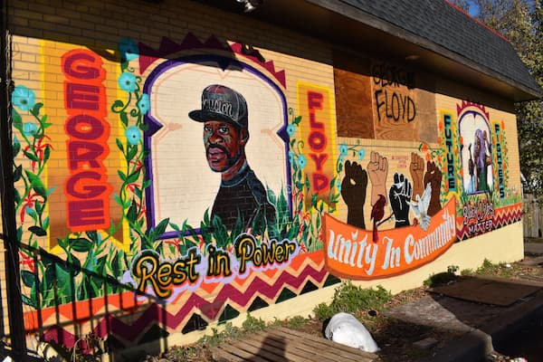

{{CSSRef}}

The **CSS filter effects** module defines a way of processing an element's rendering before it is displayed in the document.

### Filter effects in action

Play with the various sliders to apply filter effects to the image below:

```html hidden
<article>

  <form>
<fieldset>
  <legend>Select your filters</legend>
    <label><input type="range" name="blur" value="0" min="0" max="1" step="0.1">blur()</label>
    <label><input type="range" name="brightness" value="1" min="0" max="2" step="0.1">brightness()</label>
    <label><input type="range" name="contrast"  value="1" min="0" max="2" step="0.1">contrast()</label>
    <label><input type="range" name="dropShadow"  value="0" min="-1" max="1" step="0.1">drop-shadow()</label>
    <label><input type="range" name="grayscale"  value="0" min="0" max="1" step="0.1">grayscale()</label>
    <label><input type="range" name="hueRotate"  value="0" min="-1" max="1" step="0.1">hue-rotate()</label>
    <label><input type="range" name="invert"  value="0" min="0" max="1" step="0.1">invert()</label>
    <label><input type="range" name="opacity"  value="1" min="0" max="1" step="0.1">opacity()</label>
    <label><input type="range" name="saturate"  value="1" min="0" max="2" step="0.1">saturate()</label>
    <label><input type="range" name="sepia"  value="0" min="0" max=" 1" step="0.1">sepia()</label>
  <button type="reset">Reset</button>
</fieldset>
  </form><output></output>
</article>
<p>Image by <cite>DigitalNomad</cite></p>
```

```css hidden
article {display: flex; gap: 1rem;}
label {display: block; margin: 0.5em; font-family: sans-serif;}
input {vertical-align: middle; margin-right: 0.25em; max-width: 50%;}
img {
  margin: 1rem;
  width: 100%;
  flex: 50%;
}
```

```js hidden
const image = document.querySelector('img');
const controls = document.querySelectorAll('input');
let resetValues = new Array();

for(control of controls) {
  resetValues.push(control.value);
  control.addEventListener("change", () => { 
    changeCSS();
  }, false);
}
document.querySelector('button').addEventListener("click", () => { 
  setTimeout(function(){changeCSS()}, 50);
}, false);

function changeCSS () {
  image.setAttribute('style', 'filter: ' + blur() + brightness() + contrast() + dropShadow() +  grayscale() + hueRotate() + invert() + opacity() + saturate() + sepia())
}
/* blur()*/
function blur() {
  let blurValue = document.getElementsByName('blur')[0];
  return "blur(" + blurValue.value + "rem) "
}
/* brightness()*/
function brightness() {
  let brightnessValue = document.getElementsByName('brightness')[0];
  return "brightness(" + brightnessValue.value + ") "
}
/* contrast()*/
function contrast() {
  let contrastValue = document.getElementsByName('contrast')[0];
  return "contrast(" + contrastValue.value + ") "
}
/* drop-shadow()*/
function dropShadow() {
  let dropShadowValue = document.getElementsByName('dropShadow')[0];
  return "drop-shadow(" + dropShadowValue.value + "rem " + dropShadowValue.value + "rem " +  "0rem orange) "
}
/* grayscale()*/
function grayscale() {
  let grayscaleValue = document.getElementsByName('grayscale')[0];
  return "grayscale(" + grayscaleValue.value + ") "
}
/* hue-rotate()*/
function hueRotate() {
  let hueRotateValue = document.getElementsByName('hueRotate')[0];
  return "hue-rotate(" + hueRotateValue.value + "turn) "
}
/* invert()*/
function invert() {
  let invertValue = document.getElementsByName('invert')[0];
  return "invert(" + invertValue.value + ") "
}
/* opacity()*/
function opacity() {
  let opacityValue = document.getElementsByName('opacity')[0];
  return "opacity(" + opacityValue.value + ") "
}
/* saturate()*/
function saturate() {
  let saturateValue = document.getElementsByName('saturate')[0];
  return "saturate(" + saturateValue.value + ") "
}
/* sepia()*/
function sepia() {
  let sepiaValue = document.getElementsByName('sepia')[0];
  return "sepia(" + sepiaValue.value + ") "
}
```

{{ EmbedLiveSample('Filter_effects_in_action', "630", "400") }}

To see the code for this filter effects sample, [view the source on Github](https://github.com/mdn/content/blob/main/files/en-us/web/css/css_filter_effects/index.md).

### Properties

- {{cssxref("backdrop-filter")}}
- {{cssxref("filter")}}

### Functions

- {{cssxref("filter-function/blur", "blur()")}}
- {{cssxref("filter-function/brightness", "brightness()")}}
- {{cssxref("filter-function/contrast", "contrast()")}}
- {{cssxref("filter-function/drop-shadow", "drop-shadow()")}}
- {{cssxref("filter-function/grayscale", "grayscale()")}}
- {{cssxref("filter-function/hue-rotate", "hue-rotate()")}}
- {{cssxref("filter-function/invert", "invert()")}}
- {{cssxref("filter-function/opacity", "opacity()")}}
- {{cssxref("filter-function/saturate", "saturate()")}}
- {{cssxref("filter-function/sepia", "sepia()")}}

## Related concepts

- {{CSSxRef("&lt;image&gt;")}} data type
- {{cssxref("&lt;filter-function&gt;")}} data type

- {{cssxref("background-image")}} CSS property
- {{cssxref("background-blend-mode")}} CSS property
- {{cssxref("mix-blend-mode")}} CSS property

- {{glossary("interpolation")}} glossary term

- SVG {{cssxref("color-interpolation-filters")}} property

## Specifications

{{Specifications}}

## See also

- Properties in the CSS [compositing and blending](/en-US/docs/Web/CSS/Compositing_and_Blending) module enable blending an element's background layers together and blending an element with its container.
- The SVG {{SVGElem("filter")}} element and the SVG filter primitives, including {{SVGElement("feSpotLight")}}, {{SVGElement("feBlend")}}, {{SVGElement("feColorMatrix")}}, {{SVGElement("feComponentTransfer")}}, {{SVGElement("feComposite")}}, {{SVGElement("feConvolveMatrix")}}, {{SVGElement("feDiffuseLighting")}}, {{SVGElement("feDisplacementMap")}}, {{SVGElement("feDropShadow")}}, {{SVGElement("feFlood")}}, {{SVGElement("feGaussianBlur")}}, {{SVGElement("feImage")}}, {{SVGElement("feMerge")}}, {{SVGElement("feMorphology")}}, {{SVGElement("feOffset")}}, {{SVGElement("feSpecularLighting")}}, {{SVGElement("feTile")}}, and {{SVGElement("feTurbulence")}}.
