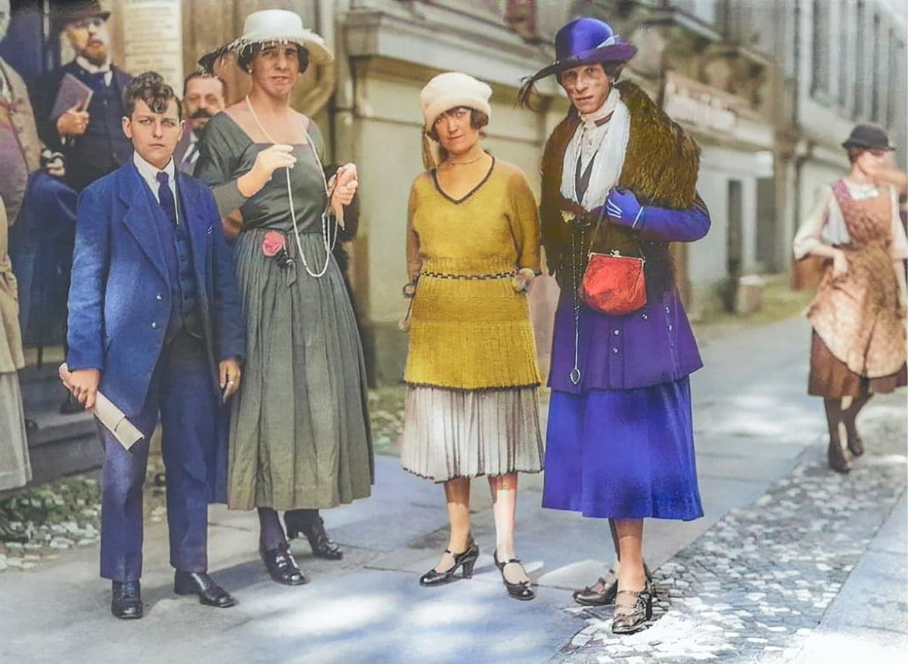

{{CSSRef}}

Have you ever hovered over a black-and-white or sepia image and the full-color image came into view instantly? Have you ever encountered a background image with a small blurred-out section that makes the text on top more legible? These manipulations used to require image editing software, time, and http requests. [CSS filter effects](/en-US/docs/Web/CSS/Filter_Effects) enable applying these visual effects live, without PhotoShop and without extra HTTP requests. The only software required is the user's browser. And, unlike with pre-set image effects, CSS filter effects are responsive and animateable.

The CSS filter effects module defines the {{cssxref("&lt;filter-function&gt;")}} data type which provides graphical effects, like blur or color shifting, that can alter the appearance of an element as well as the ability to reference an SVG filter with a filter of your own creation. The CSS {{cssxref("filter")}} and {{cssxref("backdrop-filter")}} properties are used to apply these filters, impacting the rendering of text, images, backgrounds, and borders, or any element on which these properties are applied.

## Properties and Values

There are two filter properties defined in the CSS filter effects module enable applying zero, one, or more graphical effects to an element.

### Filter effect properties

With the {{cssxref("filter")}} property, the effects are applied to the element on which the `filter` property is defined.

With the {{cssxref("backdrop-filter")}} property, the graphical effects are applied to the area behind the element, or the element's "backdrop". The `backdrop-filter` property is often used to make foreground content more legible when the larger area upon which it is located would otherwise not provide enough contrast.

### Filter functions

While the [CSS filter effects module](/en-US/docs/Web/CSS/Filter_Effects) provides for unlimited filter effects via SVG filter effects, the specification defines 10 named [`<filter-function>`](/en-US/docs/Web/CSS/filter#functions) functions and the parameter values of each.

The following table lists the 10 filter functions, the value type, the minimum valid value if applicable, the largest value that creates an effect, and the initial value for [interpolation](/en-US/docs/Glossary/Interpolation).

| Filter function                                             | parameter type                                                       | min allowed | max effect | interpo&shy;lation   | default (no effect)                   |
| ----------------------------------------------------------- | -------------------------------------------------------------------- | ----------- | ---------- | -------------------- | ------------------------------------- |
| {{cssxref("filter-function/blur", "blur()")}}               | {{cssxref("&lt;length&gt;")}}                                        | `0`         |            | `0`                  | `blur(0)`                             |
| {{cssxref("filter-function/brightness", "brightness()")}}   | {{cssxref("&lt;number&gt;")}} or {{cssxref("&lt;percentage&gt;")}}   | `0`         |            | `1`                  | `brightness(1)` or `brightness(100%)` |
| {{cssxref("filter-function/contrast", "contrast()")}}       | {{cssxref("&lt;length&gt;")}}                                        | `0`         |            | `1`                  | `contrast(1)` or `contrast(100%)`     |
| {{cssxref("filter-function/drop-shadow", "drop-shadow()")}} | `<shadow>`                                                           |             |            | `0 0 0 currentcolor` | `drop-shadow(0 0 0 currentcolor)`     |
| {{cssxref("filter-function/grayscale", "grayscale()")}}     | {{cssxref("&lt;number&gt;")}} or {{cssxref("&lt;percentage&gt;")}}   | `0`         | `100%`     | `0`                  | `grayscale(0)` or `grayscale(0%)`     |
| {{cssxref("filter-function/hue-rotate", "hue-rotate()")}}   | {{cssxref("&lt;angle&gt;")}}                                         |             |            | `0`                  | `hue-rotate(0deg)`                    |
| {{cssxref("filter-function/invert", "invert()")}}           | {{cssxref("&lt;number&gt;")}} or {{cssxref("&lt;percentage&gt;")}}   | `0`         | `100%`     | `0`                  | `invert(0)` or `invert(0%)`           |
| {{cssxref("filter-function/opacity", "opacity()")}}         | {{cssxref("&lt;number&gt;")}} or {{cssxref("&lt;percentage&gt;")}}   | `0`         | `100%`     | `1`                  | `opacity(1)` or `opacity(100%)`       |
| {{cssxref("filter-function/saturate", "saturate()")}}       | {{cssxref  ("&lt;number&gt;")}} or {{cssxref("&lt;percentage&gt;")}} | `0`         | `100%`     | `1`                  | `saturate(100%)`                      |
| {{cssxref("filter-function/sepia", "sepia()")}}             | {{cssxref("&lt;number&gt;")}} or {{cssxref("&lt;percentage&gt;")}}   | `0`         | `100%`     | `0`                  | `sepia(0%)`                           |

The minimum value allowed is included for filter functions that have a minimum value. Included a value less than the minimum value for any filter function with a defined min value invalidates the entire property declaration, not just the invalid function in the comma-separated list.

Maximum effect values can be exceeded. Including a value greater than the listed maximumum value is valid, but does not increase the effect over the maxiumum listed. In other words, it will look the same as if the maximum effect value had been set. For example, had we set `sepia(400%)` in the basic example, the effect would be the same: the image would appear as if `sepia(100%)`, the maximum value, were set.

The default value listed is the value that creates no effect. While they create no effect, they are the initial interpolation value, provide an example of how the value can be set, and provide a guague between the minimum allowed and maximum effect values.

## Applying filter effects

The `filter` and `backdrop-filter` properties take as their value a filter function list, containing one or more {{CSSXref("filter-function")}}s, the default keyword `none`, or an SVG filter using `url()` syntax.

### Basic example

If you haven't ever hovered over a black-and-white or sepia image and the full-color image came into view instantly, here's your chance!

```html

```

```css
img {
  filter: sepia(100%);
}
img:hover,
img:focus {
  filter: none;
}
```

The image is set to be sepia by default by including the [`sepia()`](/en-US/docs/Web/CSS/filter-function/sepia) filter function as the value of the `filter` property. The filter is removed on [`:hover`](/en-US/docs/Web/CSS/:hover) and [`:focus`]((/en-US/docs/Web/CSS/) by setting `filter: none;`. We included [`tabindex="0"`](/en-US/docs/Web/HTML/Global_attributes/tabindex) to enable focus without altering the tabbing order for keyboard users as {{HTMLElement("img")}} is not an interactive element.

```css hidden
img {
  max-width: 100%;
  height: 100%;
}
```

{{EmbedLiveSample("Basic_example", 600, 300)}}

### Applicable to all elements

While generally applied to images, the `filter` and `backdrop-filter` properties can be applied to any element or pseudo-element.

In this example, we add a glow effect using a [`drop-shadow()`](/en-US/docs/Web/CSS/filter-function/drop-shadow) filter with a `3px` blur and `0` offset:

```css
h1 {
  color: midnightblue;
  filter: drop-shadow(0 0 3px magenta);
}
```

```css hidden
h1 {
  font-family: sans-serif;
  font-size: 2rem;
}
```

```html hidden
<h1>Glow created with CSS filter.</h1>
```

{{EmbedLiveSample('Applicable_to_all_elements','100%','80')}}

### Applying multiple filters

While the basic example used only the a sepia filter, we are not limited to a single filter. The `filter` and `backdrop-filter` properties accept a space-separated list of filters which are applied in the order declared.

This example applies two filters -- a [`hue-rotate()`](/en-US/docs/Web/CSS/filter-function/hue-rotate) and a [`blur()`](/en-US/docs/Web/CSS/filter-function/blur) -- via the `backdrop-filter` CSS property the paragraph color shifting to the area behind the {{HTMLElement("p")}}.

```css
.container {
  background: url(image.jpg) no-repeat left / contain goldenrod;
}
p {
  backdrop-filter: hue-rotate(240deg) blur(5px);
  background-color: rgb(255 255 255 / 0.1);
  text-shadow: 2px 2px black;
}
```

```css hidden
.container {
  padding: 3rem;
  width: 30rem;
}
p {
  padding: 0.5rem;
  color: #ffffff;
  font-size: 2rem;
  font-family: sans-serif;
}
```

```html hidden
<div
  class="container"
  style="background-image: url(listen_to_black_women.jpg);">
  <p>
    Text on images can be illegible and inaccessible even with a drop shadow.
  </p>
</div>
```

{{EmbedLiveSample('Applying_multiple_filters','100%','280')}}

### Applying repeated filters

As filters are applied in sequential order, we are not limited to using a filter only once. In this example, we include the [`drop-shadow()`](/en-US/docs/Web/CSS/filter-function/drop-shadow) filter four times, each with a different `<shadow>` value.

```html


```

```css hidden
img {
  width: 49%;
}
```

```css no-lint
img {
  filter: drop-shadow(2px 2px 0 hsl(300deg 100% 50%)) drop-shadow(
      -2px -2px 0 hsl(210deg 100% 50%)
    )
    drop-shadow(2px 2px 0 hsl(120deg 100% 50%)) drop-shadow(
      -2px -2px 0 hsl(30deg 100% 50%)
    );
}
img + img {
  filter: none;
}
```

In the first Manadala example, four drop shadows are applied to a line-drawn SVG. The second example, the same SVG with the filter removed with `filter: none`, is included for comparison.

{{EmbedLiveSample("Applying_repeated_filters", 600, 400)}}

### Applying a filter to an element

Before focusing on the properties, we'll provide a quick overview of the filter functions.

While generally applied to images, the `filter` and `backdrop-filter` properties can be applied to any element.

To apply a filter effect to an element or pseudo-element, include a list of space-separated [filter functions](#defined_filter_functions). The effects are applied in the order in which they appear:

```css
h1 {
  color: midnightblue;
}
#hueFirst {
  filter: hue-rotate(180deg) drop-shadow(3px 3px magenta);
}
#shadowFirst {
  filter: drop-shadow(3px 3px magenta) hue-rotate(180deg);
}
```

```css hidden
h1 {
  font-family: sans-serif;
  font-size: 2rem;
}
```

```html hidden
<h1 id="hueFirst">Hue change happens before drop shadow.</h1>
<h1 id="shadowFirst">Drop shadow applied before hue change.</h1>
<h1>No filter effects applied.</h1>
```

{{EmbedLiveSample('Applying_a_filter_to_an_element','100%','280')}}

The same filters were applied to both lines of text, but in a different order. Magenta drop shadows were applied to both lines of text. In the first example, the hue of the text was altered before the shadow was applied; so the magenta shadow is magenta. In the second example, the drop shadow is added to the dark blue text, and then the hue of both the text and the shadow were changed.

No filter effect was applied to the third example to show the original effect as a comparison. The text in the third example has remained as `midnightblue` or `#191970`. The `hue-rotate(180deg)` filter changed text in the first two examples `#252500`

> **Note:** The rgb color `#191970` is equal to `hsl(240deg 63.5% 26.9%)` while `#252500` is `hsl(60deg 100% 7.3%)`. The [color rotation takes place in the sRGB color space](/en-US/docs/Web/CSS/color_value#interpolation), which is why the hue has been changed as expected while not maintaining the same values for saturation and lightness.

## Filter functions

The `filter` property is specified as `none` or one or more of the functions listed below. If the parameter for any function is invalid, the function returns `none`. Except where noted, the functions that take a value expressed with a percent sign (as in `34%`) also accept the value expressed as decimal (as in `0.34`).

When a `filter` property has two or more functions, its results are different from the same functions applied separately using multiple `filter` properties.

### SVG filter

#### url()

Takes an URI pointing to an [SVG filter](/en-US/docs/Web/SVG/Element/filter), which may be embedded in an external XML file.

```css
filter: url(resources.svg#c1);
```

### Filter functions

#### blur()

The {{cssxref("filter-function/blur", "blur()")}} function applies a Gaussian blur to the elements on which it is applied. The blur radius parameter value, defined as a CSS {{cssxref("&lt;length&gt;")}}, defines the value of the standard deviation to the Gaussian function, or how many pixels on the screen blend into each other, so a larger value will create more blur. The initial value for interpolation is `0`. Percentage values are invalid.

```css
.filter {
  filter: blur(3.5px);
}
```

```css hidden
svg:not([height]) {
  display: none;
}
```

The SVG {{SVGElement("feGaussianBlur")}} filter element can also be used to blur content. The filter's {{SVGAttr("stdDeviation")}} attribute accepts up to two values enabling creating more complex blur values. To create an equivalent blur, we include one value for `stdDeviation`:

```html
<svg role="img" aria-label="Flag">
  <filter id="blur">
    <feGaussianBlur stdDeviation="3.5" edgeMode="duplicate" />
  </filter>
  <image xlink:href="asset/flag.jpg" filter="url(#blur)" />
</svg>
```

```html hidden
<table cellpadding="5">
  <thead>
    <tr>
      <th>Live example</th>
      <th>SVG Equivalent</th>
      <th>Original image</th>
    </tr>
  </thead>
  <tbody>
    <tr>
      <td>
        
      </td>
      <td>
        <svg id="svg" height="220" width="220" style="overflow: visible">
          <filter id="svgBlur">
            <feGaussianBlur stdDeviation="3.5" />
          </filter>
          <image xlink:href="flag.jpg" filter="url(#svgBlur)" />
        </svg>
      </td>
      <td>
        
      </td>
    </tr>
  </tbody>
</table>
```

{{EmbedLiveSample('blur','100%','280')}}

## See also

- The [CSS filter effects](/en-US/docs/Web/CSS/Filter_Effects) module which defines these functions and the {{cssxref("filter")}} and {{cssxref("backdrop-filter")}} properties that takes these functions as their value.
- CSS [compositing and blending](/en-US/docs/Web/CSS/Compositing_and_Blending) module, including the CSS {{cssxref("background-blend-mode")}} and {{cssxref("mix-blend-mode")}} properties.
- The CSS {{cssxref("mask")}} property
- [SVG](/en-US/docs/Web/SVG), including the SVG {{SVGElement("filter")}} element and SVG {{SVGAttr("filter")}} attribute.
- [Applying SVG effects to HTML content](/en-US/docs/Web/SVG/Applying_SVG_effects_to_HTML_content)
