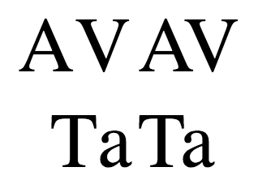

{{CSSRef}}

The **`font-kerning`** [CSS](/en-US/docs/Web/CSS) property sets the use of the kerning information stored in a font.

{{EmbedInteractiveExample("pages/css/font-kerning.html")}}

_Kerning_ affects how letters are spaced. In _well-kerned_ fonts, this feature makes character spacing more uniform and pleasant to read by reducing white space between certain character combinations.

In the image below, for instance, the examples on the left do not use kerning, while the ones on the right do:



## Syntax

```css
font-kerning: auto;
font-kerning: normal;
font-kerning: none;

/* Global values */
font-kerning: inherit;
font-kerning: initial;
font-kerning: revert;
font-kerning: revert-layer;
font-kerning: unset;
```

### Values

- `auto`
  - : The browser determines whether font kerning should be used or not. For example, some browsers will disable kerning on small fonts, since applying it could harm the readability of text.
- `normal`
  - : Font kerning information stored in the font must be applied.
- `none`
  - : Font kerning information stored in the font is disabled.

## Formal definition

{{cssinfo}}

## Formal syntax

{{csssyntax}}

## Examples

### Enabling and disabling kerning

#### HTML

```html
<div id="kern"></div>
<div id="no-kern"></div>
<textarea id="input">AV T. ij</textarea>
```

#### CSS

```css
div {
  font-size: 2rem;
  font-family: serif;
}

#no-kern {
  font-kerning: none;
}

#kern {
  font-kerning: normal;
}
```

#### JavaScript

```js
const input = document.getElementById("input");
const kern = document.getElementById("kern");
const noKern = document.getElementById("no-kern");

input.addEventListener("keyup", () => {
  kern.textContent = input.value; /* Update content */
  noKern.textContent = input.value;
});

kern.textContent = input.value; /* Initialize content */
noKern.textContent = input.value;
```

{{ EmbedLiveSample('Enabling_and_disabling_kerning') }}

## Specifications

{{Specifications}}

## Browser compatibility

{{Compat}}

## See also

- {{cssxref("font-variant")}}, {{cssxref("font-variant-position")}}, {{cssxref("font-variant-east-asian")}}, {{cssxref("font-variant-caps")}}, {{cssxref("font-variant-ligatures")}}, {{cssxref("font-variant-numeric")}}, {{cssxref("font-variant-alternates")}}, {{cssxref("font-synthesis")}}, {{cssxref("letter-spacing")}}
