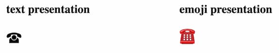

{{CSSRef}}

The **`font-variant-emoji`** allows web authors to set a default presentation style for displaying emojis.

Traditionally this was done by appending a _Variation Selector_, either `U+FE0E` for text or `U+FE0F` for emoji, to the emoji codepoint.

Only emojis listed as contributing to a [Unicode emoji presentation sequence](http://www.unicode.org/emoji/charts/emoji-variants.html) are affected by this property.

## Syntax

```css
/* Keyword Values */
font-variant-emoji: normal;
font-variant-emoji: text;
font-variant-emoji: emoji;
font-variant-emoji: unicode;

/* Global values */
font-variant-emoji: inherit;
font-variant-emoji: initial;
font-variant-emoji: revert;
font-variant-emoji: revert-layer;
font-variant-emoji: unset;
```

The `font-variant-emoji` property is specified using a single keyword value from the list below.

### Values

- `normal`
  - : This keyword allows the User Agent (browser) to choose how to display the emoji, this often follows the operating system setting.
- `text`
  - : This keyword renders the emoji as if it were using the unicode text variation selector (`U+FE0E`).
- `emoji`
  - : This keyword renders the emoji as if it were using the unicode emoji variation selector (`U+FE0F`).
- `unicode`
  - : This keyword renders the emoji in accordance with the [Emoji_Presentation properties](https://www.unicode.org/reports/tr51/tr51-23.html#Emoji_Presentation). If the `U+FE0E` or `U+FE0F` variation selector is present then this will override this setting.

## Formal definition

{{CSSInfo}}

## Formal syntax

{{CSSSyntax}}

## Examples

### Changing the way an emoji is displayed

In this example show how you can render an emoji in its `text` or `emoji` presentation.

#### HTML

```html hidden
<p class="nosupport">Your Browser does not support <code>font-variant-emoji</code>. This image shows how it is rendered with support.</p>

```

```html
<section class="emojis">
  <div class="emoji">
    <h2>text presentation</h2>
    <div class="text-presentation">☎</div>
  </div>
  <div class="emoji">
    <h2>emoji presentation</h2>
    <div class="emoji-presentation">☎</div>
  </div>
</section>
```

#### CSS

```css hidden
@supports (font-variant-emoji:emoji) {
  .nosupport {
    display: none;
  }
  .emojis {
    display: flex;
    flex-direction: row;
    justify-content: space-around;
  }
  .emoji > div {
    font-size: 2rem;
  }
}

@supports not (font-variant-emoji:emoji) {
  .emojis {
    display: none;
  }
}


```

```css
.text-presentation {
  font-variant-emoji: text;
}

.emoji-presentation {
  font-variant-emoji: emoji;
}
```

#### Result

{{ EmbedLiveSample('Changing the way an emoji is displayed') }}

## Specifications

{{Specifications}}

## Browser compatibility

{{Compat}}

## See Also

- [font-variant](/en-US/docs/Web/CSS/font-variant)
- [font-variant-alternates](/en-US/docs/Web/CSS/font-variant-alternates)
- [font-variant-caps](/en-US/docs/Web/CSS/font-variant-caps)
- [font-variant-east-asian](/en-US/docs/Web/CSS/font-variant-east-asian)
- [font-variant-ligatures](/en-US/docs/Web/CSS/font-variant-ligatures)
- [font-variant-numeric](/en-US/docs/Web/CSS/font-variant-numeric)
