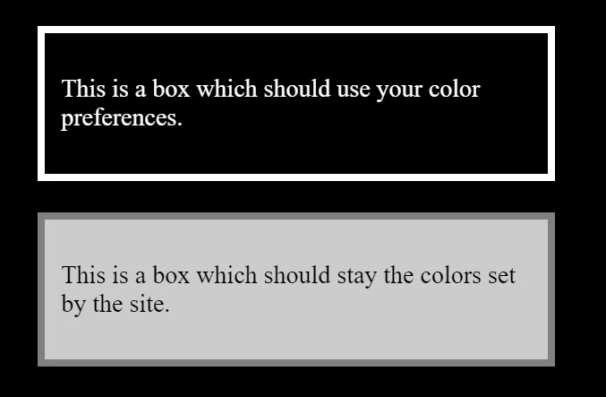

{{CSSRef}}

The **`forced-color-adjust`** [CSS](/en-US/docs/Web/CSS) property allows authors to opt certain elements out of forced colors mode. This then restores the control of those values to CSS.

## Syntax

```css
forced-color-adjust: auto;
forced-color-adjust: none;
forced-color-adjust: preserve-parent-color;

/* Global values */
forced-color-adjust: inherit;
forced-color-adjust: initial;
forced-color-adjust: revert;
forced-color-adjust: revert-layer;
forced-color-adjust: unset;
```

The `forced-color-adjust` property's value must be one of the following keywords.

### Values

- `auto`
  - : The element's colors are adjusted by the {{Glossary("user agent")}} in forced colors mode. This is the default.
- `none`
  - : The element's colors are not automatically adjusted by the {{Glossary("user agent")}} in forced colors mode.
- `preserve-parent-color`
  - : In forced colors mode, if the {{cssxref("color")}} property inherits from its parent (i.e. there is no [cascaded value](/en-US/docs/Web/CSS/CSS_cascade/Cascade) or the cascaded value is `currentcolor`, {{cssxref("inherit")}}, or another keyword that inherits from the parent), then it computes to the [used color](/en-US/docs/Web/CSS/CSS_cascade/used_value) of its parent's `color` property. In all other cases, it behaves the same as `none`.

## Usage notes

This property should only be used to makes changes that will support a user's color and contrast requirements. For example, if you become aware that the color optimizations made by the {{Glossary("user agent")}} result in a poor experience when in a high contrast or dark mode. Using this property would enable tweaking of the result in that mode to provide a better experience. **It should not be used to prevent user choices being respected**.

## Formal definition

{{cssinfo}}

## Formal syntax

{{csssyntax}}

## Examples

### Preserving colors

In the example below the first box will use the color scheme that the user has set. For example in Windows High Contrast mode black scheme it will have a black background and white text. The second box will preserve the site colors set on the `.box` class.

By using the {{cssxref("@media/forced-colors", "forced-colors")}} media feature, you could add any other optimizations for forced color mode alongside the `forced-color-adjust` property.

#### CSS

```css
.box {
  border: 5px solid grey;
  background-color: #ccc;
  width: 300px;
  margin: 20px;
  padding: 10px;
}

@media (forced-colors: active) {
  .forced {
    forced-color-adjust: none;
  }
}
```

#### HTML

```html
<div class="box">
  <p>This is a box which should use your color preferences.</p>
</div>

<div class="box forced">
  <p>This is a box which should stay the colors set by the site.</p>
</div>
```

#### Result

{{EmbedLiveSample("Preserving_colors", 640, 300)}}

The following screenshot shows the image above in Windows High Contrast Mode:



## Specifications

{{Specifications}}

## Browser compatibility

{{Compat}}

## See also

- [Styling for Windows high contrast with standards for forced colors.](https://blogs.windows.com/msedgedev/2020/09/17/styling-for-windows-high-contrast-with-new-standards-for-forced-colors/)
- {{cssxref("print-color-adjust")}}
