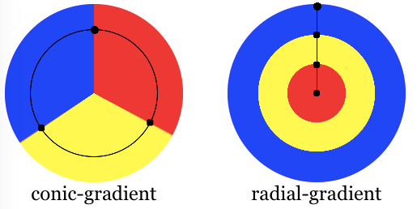

{{CSSRef}}

The **`conic-gradient()`** [CSS](/en-US/docs/Web/CSS) [function](/en-US/docs/Web/CSS/CSS_Functions) creates an image consisting of a gradient with color transitions rotated around a center point (rather than radiating from the center). Example conic gradients include pie charts and {{glossary("color wheel", "color wheels")}}. The result of the `conic-gradient()` function is an object of the {{CSSxRef("&lt;gradient&gt;")}} data type, which is a special kind of {{CSSxRef("&lt;image&gt;")}}.

{{EmbedInteractiveExample("pages/css/function-conic-gradient.html")}}

## Syntax

```css
/* A conic gradient rotated 45 degrees,
   starting blue and finishing red */
conic-gradient(from 45deg, blue, red)

/* A bluish purple box: the gradient goes from blue to red,
   but only the bottom right quadrant is visible, as the
   center of the conic gradient is at the top left corner */
conic-gradient(from 90deg at 0 0, blue, red)

/* Interpolation in polar color space
  with longer hue interpolation method */
conic-gradient(in hsl longer hue, red, blue, green, red)

/* Color wheel */
conic-gradient(
  hsl(360 100% 50%),
  hsl(315 100% 50%),
  hsl(270 100% 50%),
  hsl(225 100% 50%),
  hsl(180 100% 50%),
  hsl(135 100% 50%),
  hsl(90 100% 50%),
  hsl(45 100% 50%),
  hsl(0 100% 50%)
)
```

### Values

- {{CSSxRef("&lt;angle&gt;")}}
  - : Preceded by the `from` keyterm, and taking an angle as its value, defines the gradient rotation in clockwise direction.
- `<position>`
  - : Using the same length, order, and keyterm values as the [`background-position`](/en-US/docs/Web/CSS/background-position) property, the `position` value defines center of the gradient. If not specified, the value used for `position` by default is `center`, meaning the gradient will be centered.
- `<angular-color-stop>`
  - : A color-stop's {{CSSxRef("&lt;color&gt;")}} value, followed by one or two optional stop positions, (an {{CSSxRef("&lt;angle&gt;")}} along the gradient's circumference axis).
- `<color-hint>`
  - : An {{Glossary("interpolation")}} hint defining how the gradient progresses between adjacent color stops. The length defines at which point between two color stops the gradient color should reach the midpoint of the color transition. If omitted, the midpoint of the color transition is the midpoint between two color stops.

> [!NOTE]
> Rendering of color stops in conic gradients follows the same rules as [color stops in linear gradients](/en-US/docs/Web/CSS/gradient/linear-gradient#composition_of_a_linear_gradient).

## Description

As with any gradient, a conic gradient has [no intrinsic dimensions](/en-US/docs/Web/CSS/image#description); i.e., it has no natural or preferred size, nor a preferred ratio. Its concrete size will match the size of the element it applies to, or the size of the `<image>` if it is set to something other than the element size.

To create a conic gradient that repeats so as to fill a 360 degree rotation, use the {{CSSxRef("gradient/repeating-conic-gradient", "repeating-conic-gradient()")}} function instead.

Because `<gradient>`s belong to the `<image>` data type, they can only be used where `<image>`s can be used. For this reason, `conic-gradient()` won't work on {{CSSxRef("background-color")}} and other properties that use the {{CSSxRef("&lt;color&gt;")}} data type.

> [!NOTE]
> Why is it called a "conic" gradient? If the color stops are much lighter on one side than the other, it can look like a cone from above.

### Composition of a conic gradient

The conic-gradient syntax is similar to the radial-gradient syntax, but the color-stops are placed around a gradient arc, the circumference of a circle, rather than on the gradient line emerging from the center of the gradient. With conic gradients, the colors transition as if spun around the center of a circle, starting at the top and going clockwise. In a radial gradient, the colors transition from the center of an ellipse, outward, in all directions.



A conic gradient is specified by indicating a rotation angle, the center of the gradient, and then specifying a list of color-stops. Unlike linear and radial gradients, whose color-stops are placed by specifying a {{cssxref("length")}}, the color-stops of a conic gradient are specified with an [angle](/en-US/docs/Web/CSS/angle). Units include `deg` for degrees, `grad` for gradients, `rad` for radians, and `turn` for turns. There are 360 degrees, 400 gradians, 2π radians, and 1 turn in a circle. Browsers supporting conic gradients also accept percent values, with 100% equaling 360 degrees, but this is not in the specification.

Similar to radial gradients, the conic gradient syntax provides for positioning the center of the gradient anywhere within, or even outside, the image. The values for the position are similar to the syntax for 2-value background-position.

The gradient arc is the circumference of the gradient. The _starting point_ of the gradient or arc is north, or 12:00pm. The gradient is then rotated by the _from_ angle. The colors of the gradient are determined by the angled color stops, their starting points, ending points, and, in between, and optional angled color-stop points. The transitions between colors can be altered with color hints between adjacent colors' color stops.

#### Customizing gradients

By adding more angled color-stop points on the gradient arc, you can create a highly customized transition between multiple colors. A color-stop's position can be explicitly defined by using an {{CSSxRef("&lt;angle&gt;")}}. If you don't specify the location of a color stop, it is placed halfway between the one that precedes it and the one that follows it. If you don't specify an angle for the first or last color stop, their values are 0deg and 360deg respectively. The following two gradients are equivalent:

```css
conic-gradient(red, orange, yellow, green, blue);
conic-gradient(red 0deg, orange 90deg, yellow 180deg, green 270deg, blue 360deg);
```

By default, colors transition smoothly from the color at one color stop to the color at the subsequent color stop, with the midpoint between the colors being the half way point between the color transition. You can move this color transition midpoint to any point between two color stops by adding a color hint, indicating where the middle of the color transition should be. The following is solid red from the start to the 10% mark, transitions from red to blue over 80% of the turn, with the final 10% being solid blue. The midpoint of the red to blue gradient change, however, is at the 20% mark rather than the 50% mark as would have happened without the 80grad, or 20%, color hint.

```css
conic-gradient(red 40grad, 80grad, blue 360grad);
```

If two or more color stops are at the same location, the transition will be a hard line between the first and last colors declared at that location. To use conic gradients to create pie charts — which is NOT the correct way to create pie charts as background images are not accessible — use hard color stops, where the color stop angles for two adjacent color stops are the same. The easiest way to do this is to use multiple position colors stops. The following two declarations are equivalent:

```css
conic-gradient(#fff 0.09turn, #bbb 0.09turn, #bbb 0.27turn, #666 0.27turn, #666 0.54turn, #000 0.54turn);
conic-gradient(#fff 0turn 0.09turn, #bbb 0.09turn 0.27turn, #666 0.27turn 0.54turn, #000 0.54turn 1turn);
```

Color stops should be listed in ascending order. Subsequent color stops of lower value will override the value of the previous color stop creating a hard transition. The following changes from red to yellow at the 30% mark, and then transitions from yellow to blue over 35% of the gradient:

```css
conic-gradient(red .8rad, yellow .6rad, blue 1.3rad);
```

There are other effects you can create with conic gradients. Oddly, a checkerboard is one of them. By creating quadrants with an upper left and lower right white quadrant and lower left and upper right black quadrants, then repeating the gradient 16 times (four times across and four times down) you can make a checkerboard.

```css
conic-gradient(#fff 90deg, #000 0.25turn 0.5turn, #fff 1rad 1.5rad, #000 300grad);
background-size: 25% 25%;
```

And, yes, you can mix and match different angle units, but don't. The above is hard to read.

## Formal syntax

{{csssyntax}}

## Accessibility

Browsers do not provide any special information on background images to assistive technology. This is important primarily for screen readers, as a screen reader will not announce its presence and therefore convey nothing to its users. While it is possible to create pie charts, checkerboards, and other effects with conic gradients, CSS images provide no native way to assign alternative text, and therefore the image represented by the conic gradient will not be accessible to screen reader users. If the image contains information critical to understanding the page's overall purpose, it is better to describe it semantically in the document.

- [MDN Understanding WCAG, Guideline 1.1 explanations](/en-US/docs/Web/Accessibility/Understanding_WCAG/Perceivable#guideline_1.1_—_providing_text_alternatives_for_non-text_content)
- [Understanding Success Criterion 1.1.1 | W3C Understanding WCAG 2.0](https://www.w3.org/TR/UNDERSTANDING-WCAG20/text-equiv-all.html)

## Examples

### Gradient at 40-degrees

```css hidden
div {
  width: 100px;
  height: 100px;
}
```

```html hidden
<div></div>
```

```css
div {
  background-image: conic-gradient(from 40deg, #fff, #000);
}
```

{{EmbedLiveSample("Gradient_at_40-degrees", 120, 120)}}

### Off-centered gradient

```css hidden
div {
  width: 100px;
  height: 100px;
}
```

```html hidden
<div></div>
```

```css
div {
  background: conic-gradient(from 0deg at 0% 25%, blue, green, yellow 180deg);
}
```

{{EmbedLiveSample("Off-centered_gradient", 120, 120)}}

### Gradient pie-chart

This example uses multi-position color stops, with adjacent colors having the same color stop value, creating a striped effect.

```css hidden
div {
  width: 100px;
  height: 100px;
}
```

```html hidden
<div></div>
```

```css
div {
  background: conic-gradient(red 36deg, orange 36deg 170deg, yellow 170deg);
  border-radius: 50%;
}
```

{{EmbedLiveSample("Gradient_pie-chart", 120, 120)}}

### Checkerboard

```css hidden
div {
  width: 100px;
  height: 100px;
}
```

```html hidden
<div></div>
```

```css
div {
  background: conic-gradient(
      #fff 0.25turn,
      #000 0.25turn 0.5turn,
      #fff 0.5turn 0.75turn,
      #000 0.75turn
    )
    top left / 25% 25% repeat;
  border: 1px solid;
}
```

{{EmbedLiveSample("Checkerboard", 120, 120)}}

### Interpolating with hue

```html hidden
<div class="shorter"></div>
<div class="longer"></div>
```

```css hidden
div {
  display: inline-block;
  margin-top: 1rem;
  width: 45vw;
  height: 80vh;
}

.shorter::before {
  content: "shorter hue";
  display: block;
  margin-top: -1rem;
}

.longer::before {
  content: "longer hue";
  display: block;
  margin-top: -1rem;
}
```

In this example for interpolation [hsl](/en-US/docs/Web/CSS/color_value/hsl) color system is being used and [hue](/en-US/docs/Web/CSS/hue) is being interpolated.

```css
.shorter {
  background-image: conic-gradient(in hsl shorter hue, red, blue);
}

.longer {
  background-image: conic-gradient(in hsl longer hue, red, blue);
}
```

The box on the left uses [shorter interpolation](/en-US/docs/Web/CSS/hue-interpolation-method#shorter), meaning color goes straight from red to blue using the shorter arc on the [color wheel](/en-US/docs/Glossary/Color_wheel). The box on the right uses [longer interpolation](/en-US/docs/Web/CSS/hue-interpolation-method#longer), meaning the color goes from red to blue using the longer arc, traversing through greens, yellows, and oranges.

{{EmbedLiveSample("Interpolating with hue", 240, 200)}}

### More conic-gradient examples

Please see [Using CSS gradients](/en-US/docs/Web/CSS/CSS_images/Using_CSS_gradients) for more examples.

## Specifications

{{Specifications}}

## Browser compatibility

{{Compat}}

## See also

- [Using CSS gradients](/en-US/docs/Web/CSS/CSS_images/Using_CSS_gradients)
- Other gradient functions: {{cssxref("gradient/repeating-conic-gradient", "repeating-conic-gradient()")}}, {{cssxref("gradient/linear-gradient", "linear-gradient()")}}, {{cssxref("gradient/repeating-linear-gradient", "repeating-linear-gradient()")}}, {{cssxref("gradient/radial-gradient", "radial-gradient()")}}, {{cssxref("gradient/repeating-radial-gradient", "repeating-radial-gradient()")}}
- [`<hue-interpolation-method>`](/en-US/docs/Web/CSS/hue-interpolation-method)
- [`<color-interpolation-method>`](/en-US/docs/Web/CSS/color-interpolation-method)
- {{cssxref("&lt;image&gt;")}}
- {{cssxref("image/image","image()")}}
- {{cssxref("element", "element()")}}
- {{cssxref("image/image-set","image-set()")}}
- {{cssxref("cross-fade", "cross-fade()")}}
