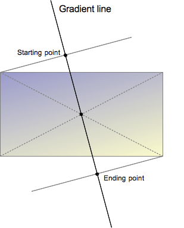

{{CSSRef}}

The **`linear-gradient()`** [CSS](/en-US/docs/Web/CSS) [function](/en-US/docs/Web/CSS/CSS_Functions) creates an image consisting of a progressive transition between two or more colors along a straight line. Its result is an object of the {{CSSxRef("&lt;gradient&gt;")}} data type, which is a special kind of {{CSSxRef("&lt;image&gt;")}}.

{{EmbedInteractiveExample("pages/css/function-linear-gradient.html")}}

## Syntax

```css
/* A gradient tilted 45 degrees,
   starting blue and finishing red */
linear-gradient(45deg, blue, red);

/* A gradient going from the bottom right to the top left corner,
   starting blue and finishing red */
linear-gradient(to left top, blue, red);

/* Color stop: A gradient going from the bottom to top,
   starting blue, turning green at 40% of its length,
   and finishing red */
linear-gradient(0deg, blue, green 40%, red);

/* Color hint: A gradient going from the left to right,
   starting red, getting to the midpoint color
   10% of the way across the length of the gradient,
   taking the rest of the 90% of the length to change to blue */
linear-gradient(.25turn, red 10%, blue);

/* Multi-position color stop: A gradient tilted 45 degrees,
   with a red bottom-left half and a blue top-right half,
   with a hard line where the gradient changes from red to blue */
linear-gradient(45deg, red 0 50%, blue 50% 100%);
```

### Values

- `<side-or-corner>`

  - : The position of the gradient line's starting point. If specified, it consists of the word `to` and up to two keywords: one indicates the horizontal side (`left` or `right`), and the other the vertical side (`top` or `bottom`). The order of the side keywords does not matter. If unspecified, it defaults to `to bottom`.

    The values `to top`, `to bottom`, `to left`, and `to right` are equivalent to the angles `0deg`, `180deg`, `270deg`, and `90deg`, respectively. The other values are translated into an angle.

- {{CSSxRef("&lt;angle&gt;")}}
  - : The gradient line's angle of direction. A value of `0deg` is equivalent to `to top`; increasing values rotate clockwise from there.
- `<linear-color-stop>`
  - : A color-stop's {{CSSxRef("&lt;color&gt;")}} value, followed by one or two optional stop positions, (each being either a {{CSSxRef("&lt;percentage&gt;")}} or a {{CSSxRef("&lt;length&gt;")}} along the gradient's axis).
- `<color-hint>`
  - : An interpolation hint defining how the gradient progresses between adjacent color stops. The length defines at which point between two color stops the gradient color should reach the midpoint of the color transition. If omitted, the midpoint of the color transition is the midpoint between two color stops.

> **Note:** Rendering of [color stops in CSS gradients](#composition_of_a_linear_gradient) follows the same rules as color stops in [SVG gradients](/en-US/docs/Web/SVG/Tutorial/Gradients).
>
> Note also that the first example above does not exactly render as depicted in Mozilla Firefox (particularly version 80.0b3). You'll have to set the html height property to 100% or 100vh to render as depicted.

## Description

As with any gradient, a linear gradient has [no intrinsic dimensions](/en-US/docs/Web/CSS/image#description); i.e., it has no natural or preferred size, nor a preferred ratio. Its concrete size will match the size of the element it applies to.

To create a linear gradient that repeats so as to fill its container, use the {{cssxref("gradient/repeating-linear-gradient", "repeating-linear-gradient()")}} function instead.

Because `<gradient>`s belong to the `<image>` data type, they can only be used where `<image>`s can be used. For this reason, `linear-gradient()` won't work on {{CSSxRef("background-color")}} and other properties that use the {{CSSxRef("&lt;color&gt;")}} data type.

### Composition of a linear gradient

A linear gradient is defined by an axis—the _gradient line_—and two or more _color-stop points_. Each point on the axis is a distinct color; to create a smooth gradient, the `linear-gradient()` function draws a series of colored lines perpendicular to the gradient line, each one matching the color of the point where it intersects the gradient line.



The gradient line is defined by the center of the box containing the gradient image and by an angle. The colors of the gradient are determined by two or more points: the starting point, the ending point, and, in between, optional color-stop points.

The _starting point_ is the location on the gradient line where the first color begins. The _ending point_ is the point where the last color ends. Each of these two points is defined by the intersection of the gradient line with a perpendicular line passing from the box corner which is in the same quadrant. The ending point can be understood as the symmetrical point of the starting point. These somewhat complex definitions lead to an interesting effect sometimes called _magic corners_: the corners nearest to the starting and ending points have the same color as their respective starting or ending points.

#### Customizing Gradients

By adding more color-stop points on the gradient line, you can create a highly customized transition between multiple colors. A color-stop's position can be explicitly defined by using a {{CSSxRef("&lt;length&gt;")}} or a {{CSSxRef("&lt;percentage&gt;")}}. If you don't specify the location of a color, it is placed halfway between the one that precedes it and the one that follows it. The following two gradients are equivalent.

```css
linear-gradient(red, orange, yellow, green, blue);
linear-gradient(red 0%, orange 25%, yellow 50%, green 75%, blue 100%);
```

By default, colors transition smoothly from the color at one color stop to the color at the subsequent color stop, with the midpoint between the colors being the half way point between the color transition. You can move this midpoint to any position between two color stops by adding an unlabelled % color hint between the two colors to indicate where the middle of the color transition should be. The following example is solid red from the start to the 10% mark and solid blue from 90% to the end. Between 10% and 90% the color transitions from red to blue, however the midpoint of the transition is at the 30% mark rather than 50% as would have happened without the 30% color hint.

```css
linear-gradient(red 10%, 30%, blue 90%);
```

If two or more color stops are at the same location, the transition will be a hard line between the first and last colors declared at that location.

Color stops should be listed in ascending order. Subsequent color stops of lower value will override the value of the previous color stop creating a hard transition. The following changes from red to yellow at the 40% mark, and then transitions from yellow to blue over 25% of the gradient

```css
linear-gradient(red 40%, yellow 30%, blue 65%);
```

Multi-position color stop are allowed. A color can be declared as two adjacent color stops by including both positions in the CSS declaration. The following three gradients are equivalent:

```css
linear-gradient(red 0%, orange 10%, orange 30%, yellow 50%, yellow 70%, green 90%, green 100%);
linear-gradient(red, orange 10% 30%, yellow 50% 70%, green 90%);
linear-gradient(red 0%, orange 10% 30%, yellow 50% 70%, green 90% 100%);
```

By default, if there is no color with a 0% stop, the first color declared will be at that point. Similarly, the last color will continue to the 100% mark, or be at the 100% mark if no length has been declared on that last stop.

## Formal syntax

{{csssyntax}}

## Examples

### Gradient at a 45-degree angle

```css hidden
body {
  width: 100vw;
  height: 100vh;
}
```

```css
body {
  background: linear-gradient(45deg, red, blue);
}
```

{{EmbedLiveSample("Gradient_at_a_45-degree_angle", 120, 120)}}

### Gradient that starts at 60% of the gradient line

```css hidden
body {
  width: 100vw;
  height: 100vh;
}
```

```css
body {
  background: linear-gradient(135deg, orange 60%, cyan);
}
```

{{EmbedLiveSample("Gradient_that_starts_at_60_of_the_gradient_line", 120, 120)}}

### Gradient with multi-position color stops

This example uses multi-position color stops, with adjacent colors having the same color stop value, creating a striped effect.

```css hidden
body {
  width: 100vw;
  height: 100vh;
}
```

```css
body {
  background: linear-gradient(to right,
     red 20%, orange 20% 40%, yellow 40% 60%, green 60% 80%, blue 80%);
}
```

{{EmbedLiveSample("Gradient_with_multi-position_color_stops", 120, 120)}}

### More linear-gradient examples

Please see [Using CSS gradients](/en-US/docs/Web/CSS/CSS_Images/Using_CSS_gradients) for more examples.

## Specifications

{{Specifications}}

## Browser compatibility

{{Compat}}

## See also

- [Using CSS gradients](/en-US/docs/Web/CSS/CSS_Images/Using_CSS_gradients)
- Other gradient functions: {{cssxref("gradient/repeating-linear-gradient", "repeating-linear-gradient()")}}, {{cssxref("gradient/radial-gradient", "radial-gradient()")}}, {{cssxref("gradient/repeating-radial-gradient", "repeating-radial-gradient()")}}, {{cssxref("gradient/conic-gradient", "conic-gradient()")}}, {{cssxref("gradient/repeating-conic-gradient", "repeating-conic-gradient()")}}
- {{CSSxRef("&lt;image&gt;")}}
- {{cssxref("element", "element()")}}
- {{cssxref("image/image","image()")}}
- {{cssxref("image/image-set","image-set()")}}
- {{cssxref("cross-fade", "cross-fade()")}}
