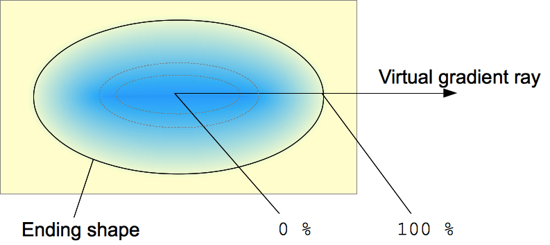

{{CSSRef}}

The **`radial-gradient()`** [CSS](/en-US/docs/Web/CSS) [function](/en-US/docs/Web/CSS/CSS_Functions) creates an image consisting of a progressive transition between two or more colors that radiate from an origin. Its shape may be a circle or an ellipse. The function's result is an object of the {{cssxref("&lt;gradient&gt;")}} data type, which is a special kind of {{cssxref("&lt;image&gt;")}}.

{{EmbedInteractiveExample("pages/css/function-radial-gradient.html")}}

## Syntax

```css
/* A gradient at the center of its container,
   starting red, changing to blue, and finishing green */
radial-gradient(circle at center, red 0, blue, green 100%)

/* hsl color space with longer hue interpolation */
radial-gradient(circle at center in hsl longer hue, red 0, blue, green 100%)
```

A radial gradient is specified by indicating the center of the gradient (where the 0% ellipse will be) and the size and shape of the _ending shape_ (the 100% ellipse).

### Values

- {{cssxref("&lt;position&gt;")}}
  - : The position of the gradient, interpreted in the same way as {{cssxref("background-position")}} or {{cssxref("transform-origin")}}. If unspecified, it defaults to `center`.
- `<ending-shape>`
  - : The gradient's ending-shape. The value can be `circle` (meaning that the gradient's shape is a circle with a constant radius) or `ellipse` (meaning that the shape is an axis-aligned ellipse). If unspecified, it defaults to `ellipse`.
- `<size>`

  - : Determines the size of the gradient's ending shape. If omitted it defaults to farthest-corner. It can be given explicitly or by keyword. For the purpose of the keyword definitions, consider the gradient box edges as extending infinitely in both directions, rather than being finite line segments.

    Both circle and ellipse gradients accept the following keywords for their `<size>`:

    | Keyword           | Description                                                                                                                                                                     |
    | ----------------- | ------------------------------------------------------------------------------------------------------------------------------------------------------------------------------- |
    | `closest-side`    | The gradient's ending shape meets the side of the box closest to its center (for circles) or meets both the vertical and horizontal sides closest to the center (for ellipses). |
    | `closest-corner`  | The gradient's ending shape is sized so that it exactly meets the closest corner of the box from its center.                                                                    |
    | `farthest-side`   | Similar to `closest-side`, except the ending shape is sized to meet the side of the box farthest from its center (or vertical and horizontal sides).                            |
    | `farthest-corner` | The default value, the gradient's ending shape is sized so that it exactly meets the farthest corner of the box from its center.                                                |

    If `<ending-shape>` is specified as `circle`, the size may be given explicitly as a {{cssxref("length")}}, which provides an explicit circle radius. Negative values are invalid.

    If `<ending-shape>` is specified as `ellipse`, the size may be given as a {{cssxref("length-percentage")}} with two values to provide an explicit ellipse size. The first value represents the horizontal radius and the second is the vertical radius. Percentage values are relative to the corresponding dimension of the gradient box. Negative values are invalid.

    When the `<ending-shape>` keyword is omitted, the gradient shape is determined by the size given. One `<length>` value provides a circle, while two values in `<length-percentage>` units provide an ellipse. A single `<percentage>` value is not valid.

- `<linear-color-stop>`
  - : A color-stop's {{cssxref("&lt;color&gt;")}} value, followed by one or two optional stop positions (either a {{cssxref("&lt;percentage&gt;")}} or a {{cssxref("&lt;length&gt;")}} along the gradient's axis). A percentage of `0%`, or a length of `0`, represents the center of the gradient; the value `100%` represents the intersection of the ending shape with the virtual gradient ray. Percentage values in between are linearly positioned on the gradient ray. Including two stop positions is equivalent to declaring two color stops with the same color at the two positions.
- `<color-hint>`
  - : The color-hint is an interpolation hint defining how the gradient progresses between adjacent color stops. The length defines at which point between two color stops the gradient color should reach the midpoint of the color transition. If omitted, the midpoint of the color transition is the midpoint between two color stops.

## Description

As with any gradient, a radial gradient has [no intrinsic dimensions](/en-US/docs/Web/CSS/image#description); i.e., it has no natural or preferred size, nor a preferred ratio. Its concrete size will match the size of the element it applies to.

To create a radial gradient that repeats so as to fill its container, use the {{cssxref("gradient/repeating-radial-gradient", "repeating-radial-gradient()")}} function instead.

Because `<gradient>`s belong to the `<image>` data type, they can only be used where `<image>`s can be used. For this reason, `radial-gradient()` won't work on {{Cssxref("background-color")}} and other properties that use the {{cssxref("&lt;color&gt;")}} data type.

### Composition of a radial gradient



A radial gradient is defined by a _center point_, an _ending shape_, and two or more _color-stop points_.

To create a smooth gradient, the `radial-gradient()` function draws a series of concentric shapes radiating out from the center to the _ending shape_ (and potentially beyond). The ending shape may be either a circle or an ellipse.

Color-stop points are positioned on a _virtual gradient ray_ that extends horizontally from the center towards the right. Percentage-based color-stop positions are relative to the intersection between the ending shape and this gradient ray, which represents `100%`. Each shape is a single color determined by the color on the gradient ray it intersects.

## Formal syntax

{{csssyntax}}

## Examples

### Simple gradient

```html hidden
<div class="radial-gradient"></div>
```

```css hidden
.radial-gradient {
  width: 240px;
  height: 120px;
}
```

```css
.radial-gradient {
  background-image: radial-gradient(cyan 0%, transparent 20%, salmon 40%);
}
```

{{EmbedLiveSample('Simple_gradient', 120, 120)}}

### Non-centered gradient

```html hidden
<div class="radial-gradient"></div>
```

```css hidden
.radial-gradient {
  width: 240px;
  height: 120px;
}
```

```css
.radial-gradient {
  background-image: radial-gradient(
    farthest-corner at 40px 40px,
    #f35 0%,
    #43e 100%
  );
}
```

{{EmbedLiveSample('Non-centered_gradient', 240, 120)}}

### Interpolating with hue

```html hidden
<div class="shorter"></div>
<div class="longer"></div>
```

```css hidden
div {
  display: inline-block;
  margin-top: 1rem;
  width: 45vw;
  height: 80vh;
}

.shorter::before {
  content: "shorter hue";
  display: block;
  margin-top: -1rem;
}

.longer::before {
  content: "longer hue";
  display: block;
  margin-top: -1rem;
}
```

In this example for interpolation, [hsl](/en-US/docs/Web/CSS/color_value/hsl) color system is being used and [hue](/en-US/docs/Web/CSS/hue) is being interpolated.

```css
.shorter {
  background-image: radial-gradient(
    circle at center in hsl shorter hue,
    red,
    blue
  );
}

.longer {
  background-image: radial-gradient(
    circle at center in hsl longer hue,
    red,
    blue
  );
}
```

The box on the left uses [shorter interpolation](/en-US/docs/Web/CSS/hue-interpolation-method#shorter), meaning the color goes straight from red to blue using the shorter arc on [color wheel](/en-US/docs/Glossary/Color_wheel). The box on the right uses [longer interpolation](/en-US/docs/Web/CSS/hue-interpolation-method#longer), meaning the color goes from red to blue using the longer arc, traversing through greens, yellows, and oranges.

{{EmbedLiveSample("Interpolating with hue", 240, 200)}}

### More radial-gradient examples

Please see [Using CSS gradients](/en-US/docs/Web/CSS/CSS_images/Using_CSS_gradients) for more examples.

## Specifications

{{Specifications}}

## Browser compatibility

{{Compat}}

## See also

- [Using CSS gradients](/en-US/docs/Web/CSS/CSS_images/Using_CSS_gradients)
- Other gradient functions: {{cssxref("gradient/repeating-radial-gradient", "repeating-radial-gradient()")}}, {{cssxref("gradient/linear-gradient", "linear-gradient()")}}, {{cssxref("gradient/repeating-linear-gradient", "repeating-linear-gradient()")}}, {{cssxref("gradient/conic-gradient", "conic-gradient()")}}, {{cssxref("gradient/repeating-conic-gradient", "repeating-conic-gradient()")}}
- [`<hue-interpolation-method>`](/en-US/docs/Web/CSS/hue-interpolation-method)
- [`<color-interpolation-method>`](/en-US/docs/Web/CSS/color-interpolation-method)
- {{cssxref("&lt;image&gt;")}}
- {{cssxref("image/image","image()")}}
- {{cssxref("element", "element()")}}
- {{cssxref("image/image-set","image-set()")}}
- {{cssxref("cross-fade", "cross-fade()")}}
