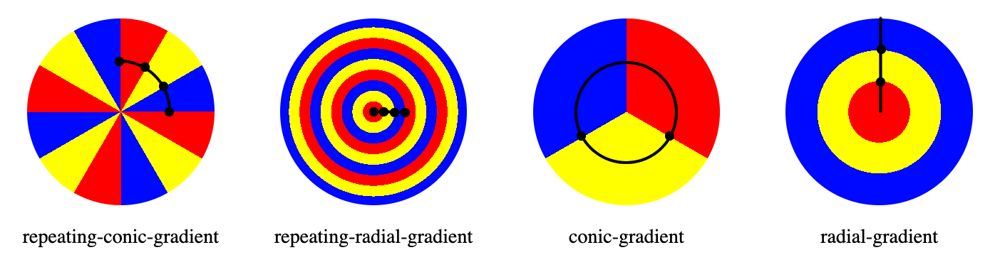

{{CSSRef}}

The **`repeating-conic-gradient()`** [CSS](/en-US/docs/Web/CSS) [function](/en-US/docs/Web/CSS/CSS_Functions) creates an image consisting of a repeating gradient (rather than a {{cssxref("gradient/conic-gradient","single gradient")}}) with color transitions rotated around a center point (rather than {{cssxref("gradient/repeating-radial-gradient","radiating from the center")}}).

{{EmbedInteractiveExample("pages/css/function-repeating-conic-gradient.html")}}

## Syntax

```css
/* Starburst: a blue on blue starburst: the gradient
   is a starburst of lighter and darker blue,
   centered in the upper left quadrant,
   offset by 3degrees so there is no up/down straight line */
background: repeating-conic-gradient(
  from 3deg at 25% 25%,
  hsl(200, 100%, 50%) 0deg 15deg,
  hsl(200, 100%, 60%) 10deg 30deg
);
```

### Values

- {{CSSxRef("&lt;angle&gt;")}}
  - : Preceded by the `from` keyterm, and taking an angle as its value, defines the gradient rotation in clockwise direction.
- `<position>`
  - : Using the same length, order and keyterm values as the [background-position](/en-US/docs/Web/CSS/background-position) property, the position defines center of the gradient. If omitted, the default value is `center`, meaning the gradient will be centered, .
- `<angular-color-stop>`
  - : A color-stop's {{CSSxRef("&lt;color&gt;")}} value, followed by one or two optional stop positions, (an {{CSSxRef("&lt;angle&gt;")}} along the gradient's circumference axis). The last color stop minus the first color-stop angle defines the size of the repeating gradient.
- `<color-hint>`
  - : An {{Glossary("interpolation")}} hint defining how the gradient progresses between adjacent color stops. The length defines at which point between two color stops the gradient color should reach the midpoint of the color transition. If omitted, the midpoint of the color transition is the midpoint between two color stops.

> **Note:** Rendering of [color stops in CSS gradients](#gradient_with_multiple_color_stops) follows the same rules as color stops in [SVG gradients](/en-US/docs/Web/SVG/Tutorial/Gradients).

## Description

Example repeating conic gradients include starbursts. The result of the `repeating-conic-gradient()` function is an object of the {{CSSxRef("&lt;gradient&gt;")}} data type, which is a special kind of {{CSSxRef("&lt;image&gt;")}}.

If neither the first nor the last color stops include a color stop angle greater than 0deg or less than 360 degrees respectively, the conic-gradient will not repeat.

As with any gradient, a repeating-conic gradient has [no intrinsic dimensions](/en-US/docs/Web/CSS/image#description); i.e., it has no natural or preferred size, nor a preferred ratio. Its concrete size will match the size of the element it applies to, or the size the `<image>` is set to if it's set to something other than the element's size.

Because `<gradient>`s belong to the `<image>` data type, they can only be used where `<image>`s can be used. For this reason, `repeating-conic-gradient()` won't work on {{CSSxRef("background-color")}} and other properties that use the {{CSSxRef("&lt;color&gt;")}} data type.

> **Note:** To create a conic gradient that does not repeat, make the gradient a full 360 degree rotation, or use the {{cssxref("gradient/conic-gradient", "conic-gradient()")}} function instead.

### Understanding repeating conic gradients

The repeating-conic-gradient syntax is similar to the {{cssxref("gradient/conic-gradient", "conic-gradient()")}} and {{cssxref("gradient/repeating-radial-gradient", "repeating-radial-gradient()")}} syntax. Like the non-repeating conic-gradient, the color-stops are placed around a gradient arc. Like the repeating radial gradient, the size of the repeating section is the first color stop subtracted from the angle of the last color stop.



The above gradients are defined as being one third blue, one third red, and one third yellow.

```css
repeating-conic-gradient(from 0deg, red 0deg 30deg, yellow 30deg 60deg, blue 60deg 90deg);

repeating-radial-gradient(red 0 8%, yellow 8% 16%, blue 16% 24%);

conic-gradient(red 120deg, yellow 120deg 240deg, blue 240deg);

radial-gradient(red 33%, yellow 33% 66%, blue 66%);
```

For a repeating gradient to repeat we define the first and last color stops. Like in non-repeating gradients, the first and last color stops are assumed to be 0 and either 100% or 360deg if not explicitly declared. When defaulting to these values, the repeating arc is 360 degrees, and therefore doesn't repeat.

Like the non-repeating conic gradient, the color-stops are placed around a gradient arc — the circumference of a circle, rather than on the gradient line emerging from the center of the gradient. The colors transition as if spun around the center of a circle, starting at the top if no `from <angle>` is declared, and going clockwise for the size of the angle that is the different between the largest and smallest color angle, then repeating.

A repeating conic gradient is specified by indicating a rotation angle, the center of the gradient, and then specifying a list of color-stops. Like non-repeating conic gradients, the color-stops of a repeating conic gradient are specified with an {{cssxref('angle')}}. Units include `deg` for degrees, `grad` for gradients, `rad` for radians, and `turn` for turns. There are 360 degrees, 400 gradians, 2π radians, and 1 turn in a circle. Browsers supporting repeating conic gradients also accept percent values, with 100% equaling 360 degrees, but this is not in the specification.

Radial and conic gradient syntax provides for positioning the center of the gradient anywhere within, or even outside, the image. The values for the position are similar to the syntax for 2-value {{cssxref('background-position')}}.

The gradient arc is part of the circumference of the gradient. 0 degrees is north, or 12:00pm. The colors of the gradient are determined by the angled color stops, their starting points, ending points, and, in between, and optional angled color-stop points. The transitions between colors can be altered with color hints between adjacent colors' color stops.

#### Customizing gradients

By adding more angled color-stop points on the gradient arc, you can create a highly customized transition between multiple colors. A color-stop's position can be explicitly defined by using an {{CSSxRef("&lt;angle&gt;")}}. If you don't specify the location of a color stop, it is placed halfway between the one that precedes it and the one that follows it. Like the non-repeating gradient counterpart, If you don't specify an angle for the first or last color stop, the values are will be 0deg and 360deg. If you don't declare an angle for either, you'll get a non-repeating conic gradient. If you declare a non 0 or 360degree for the first or last respectively, the gradient will repeat based on that value. For example, if you don't declare an angle for the first color, and declare 10% on the last color stop, the arc will repeat 10 times. Rather, the starting point is the first color stop declared, and the last color stop is the last color stop angle declared. The following two gradients are equivalent:

```css
repeating-conic-gradient(red, orange, yellow, green, blue 50%);
repeating-conic-gradient(from -45deg, red 45deg, orange, yellow, green, blue 225deg)
```

By default, colors transition smoothly from the color at one color stop to the color at the subsequent color stop, with the midpoint between the colors being the half way point between the color transition. You can move this color transition midpoint to any point between two color stops by adding a color hint, indicating where the middle of the color transition should be.

If two or more color stops are at the same location, the transition will be a hard line between the first and last colors declared at that location.

While you can mix and match different angle units, don't. It makes CSS hard to read.

### Formal syntax

{{csssyntax}}

## Accessibility concerns

Browsers do not provide any special information on background images to assistive technology. This is important primarily for screen readers, as a screen reader will not announce its presence and therefore convey nothing to its users. While it is possible to create pie charts, checkerboards, and other effects with conic gradients, CSS images provide no native way to assign alternative text, and therefore the image represented by the conic gradient will not be accessible to screen reader users. If the image contains information critical to understanding the page's overall purpose, it is better to describe it semantically in the document.

- [MDN Understanding WCAG, Guideline 1.1 explanations](/en-US/docs/Web/Accessibility/Understanding_WCAG/Perceivable#guideline_1.1_—_providing_text_alternatives_for_non-text_content)
- [Understanding Success Criterion 1.1.1 | W3C Understanding WCAG 2.0](https://www.w3.org/TR/2016/NOTE-UNDERSTANDING-WCAG20-20161007/text-equiv-all.html)

## Examples

### Black and white starburst

```css hidden
div {
  width: 200px;
  height: 200px;
}
```

```html hidden
<div></div>
```

```css
div {
  background-image: repeating-conic-gradient(#fff 0 9deg, #000 9deg 18deg);
}
```

{{EmbedLiveSample("Black_and_white_starburst", 220, 220)}}

### Off-centered gradient

This gradient repeats 18 times, but since we only see the right half, we only see 9 repeats.

```css hidden
div {
  width: 200px;
  height: 200px;
}
```

```html hidden
<div></div>
```

```css
div {
  background: repeating-conic-gradient(
    from 3deg at 25% 25%,
    green,
    blue 2deg 5deg,
    green,
    yellow 15deg 18deg,
    green 20deg
  );
}
```

{{EmbedLiveSample("Off-centered_gradient", 220, 220)}}

### More repeating-conic-gradient examples

Please see [Using CSS gradients](/en-US/docs/Web/CSS/CSS_images/Using_CSS_gradients) for more examples.

## Specifications

{{Specifications}}

## Browser compatibility

{{Compat}}

## See also

- [Using CSS gradients](/en-US/docs/Web/CSS/CSS_images/Using_CSS_gradients)
- Other gradient functions: {{cssxref("gradient/conic-gradient", "conic-gradient()")}}, {{cssxref("gradient/linear-gradient", "linear-gradient()")}}, {{cssxref("gradient/repeating-linear-gradient", "repeating-linear-gradient()")}}, {{cssxref("gradient/radial-gradient", "radial-gradient()")}}, {{cssxref("gradient/repeating-radial-gradient", "repeating-radial-gradient()")}}
- {{cssxref("&lt;image&gt;")}}
- {{cssxref("image/image","image()")}}
- {{cssxref("element", "element()")}}
- {{cssxref("image/image-set","image-set()")}}
- {{cssxref("cross-fade", "cross-fade()")}}
