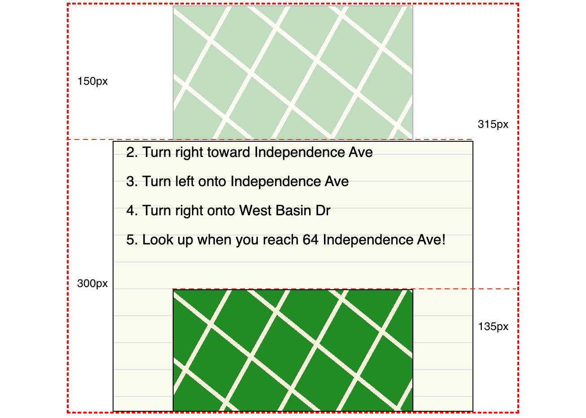

By default, [view progress timelines](/en-US/docs/Web/CSS/Guides/Scroll-driven_animations/Timelines#view_progress_timelines) track elements across the entire viewport, from when the element's starting edge's first pixel crosses the viewport's ending edge to when the element's end edge crosses the viewport's starting edge. Often, you only want an animation to run during a specific section—for example, only while an element is entering the viewport or only within the first third of a scroll container viewport.

In this guide, we look at three ways of animating through partial sections of the viewport:

1. [Insetting with `@keyframes` selectors](#controlling_insets_with_keyframe_selectors)
2. [Timeline insets via `view()` function parameters](#view_timeline_insets)
3. [Controlling insets with animation-range properties and values](#controlling_insets_with_animation-range).

While the most robust and best way to inset scroll driven animations is via the [animation range properties](#controlling_insets_with_animation-range), it is a topic that may be difficult to grok. We discuss insetting animations via updating `@keyframes` selectors and via the `view()` inset parameters to help you better understand why animation-range properties are useful and how they work.

## CSS animations and scroll driven timelines primer

[CSS animations](/en-US/docs/Web/CSS/Guides/Animations) are created by attaching {{cssxref("@keyframes")}} animations to an element using the {{cssxref("animation-name")}} property (or {{cssxref("animation")}} shorthand). The [keyframes]() define what happens to that element during the animation. When and how the element moves through the animation is based on the {{cssxref("animation-timeline")}}.

By default, the timeline is the [DocumentTimeline](/en-US/docs/Web/API/DocumentTimeline), with each {{cssxref("animation-iteration-count", "animation iteration", "", "nocode")}} taking as long as the time defined by the {{cssxref("animation-duration")}} property. With [CSS scroll-driven animations](/en-US/docs/Web/CSS/Guides/Scroll-driven_animations/Timelines), the animation's progress is based on user scroll and element visibility rather than elapsing time.

With [scroll-progress timelines](/en-US/docs/Web/CSS/Guides/Scroll-driven_animations/Timelines#scroll_progress_timelines), the timeline progresses or reverses based on the scrolling of the scrollable element. With [view-progress timelines](/en-US/docs/Web/CSS/Guides/Scroll-driven_animations/Timelines#view_progress_timelines), the progression of an animation's keyframes is based on the visibility of the subject inside the scroller: as the view progress element comes into or moves out of view, the timeline progresses or reverses, respectively. In both cases, the moment scrolling stops, the animation pauses.

## Basic view progress timeline

A view progress timeline animation only occurs when the element is visible within its scrollport. By default (when the {{cssxref("animation-iteration-count")}} defaults to `1`, the {{cssxref("animation-direction")}} defaults to normal, and no ranges are set on the timeline), the view timeline progress starts when the tracked subject's start edge starts to intersect the scrollport at the block or inline end edge and ends when its end edge exits the scrollport at the block or inline start edge. Let's demonstrate!

### View progress timeline default progression

In this example, we have directions to and from two monuments, with two fake `yellow` maps between them. We want to animate one as we scroll it into view; the comparison element we animate using the default time-based document timeline.

#### The @keyframes animation

To create an animation, the first step is defining a keyframe animation. Here we define the `originalChangeEffect` animation that progresses from having a brown {{cssxref("background-color")}}, being fully transparent, and scaled down to zero width to being fully opaque, `forestgreen`, and full-size as it the animation ends:

```css
@keyframes originalChangeEffect {
  0% {
    opacity: 0;
    scale: 0 1;
    background-color: brown;
  }
  100% {
    opacity: 1;
    scale: 1 1;
    background-color: forestgreen;
  }
}
```

#### Anonymous view progress timeline, without insets

We apply the `originalChangeEffect` animation to both elements using the {{cssxref("animation-name")}} property. We create a `linear` animation progression by setting the {{cssxref("animation-name")}} property. We include a `1ms` {{cssxref("animation-duration")}} and the {{cssxref("animation-fill-mode")}} property to ensure both animations occur and retains the styles defined in the `to` keyframe. This also ensure both animations occur even in browsers that don't support scroll driven animations.

We then set the {{cssxref("animation-timeline")}} of the demonstration `animatedElement` to an [anonymous view progress timeline](/en-US/docs/Web/CSS/Guides/Scroll-driven_animations/Timelines#anonymous_view_progress_timeline_the_view_function). While the comparison element will animate to the `100%` keyframe and maintain the property values of that keyframe after the conclusion of the animation, the demonstration element will animate as the user scrolls it into view:

```css live-sample___default live-sample___selector30 live-sample___reverse live-sample___view-inset
.animatedElement,
.comparisonElement {
  animation-name: originalChangeEffect;
  animation-duration: 1ms;
  animation-timing-function: linear;
  animation-fill-mode: forwards;
}
.animatedElement {
  animation-timeline: view();
}
```

We could have included all these properties in a single {{cssxref("animation")}} shorthand declaration. But, if we do so, remember to declare the `animation-timeline` after the shorthand so it doesn't get reset to the default `auto`.

```css
.animatedElement {
  animation: originalChangeEffect 1ms linear forwards;

  animation-timeline: view();
}
```

```html hidden live-sample___default live-sample___selector30 live-sample___reverse live-sample___range live-sample___range_both live-sample___view-inset live-sample___contain_cover live-sample___contain_cover_tall live-sample___entry_exit live-sample___entry_exit_tall
<main class="scroller">
  <div class="container">
    <h1>Directions</h1>
    <h2>Lincoln Memorial to Martin Luther King, Jr. Memorial</h2>
    <ol>
      <li>Head south on Lincoln Memorial Circle</li>
      <li>Turn right toward Independence Ave</li>
      <li>Turn left onto Independence Ave</li>
      <li>Turn right onto West Basin Dr</li>
      <li>Look up when you reach 64 Independence Ave!</li>
    </ol>
    <section>
      <div class="animatedElement"></div>
      <div class="comparisonElement"></div>
      <div class="thirdElement"></div>
    </section>
    <h2>Martin Luther King, Jr. Memorial to Lincoln Memorial</h2>
    <ol>
      <li>Head north toward Independence Ave SW</li>
      <li>Turn left onto Independence Ave</li>
      <li>Turn right toward the Korean War Veterans Memorial</li>
      <li>Take a photo of the memorial as you walk past it.</li>
      <li>Head north on Lincoln Memorial Circle</li>
      <li>Look up. You can't miss it!</li>
    </ol>
  </div>
</main>
```

We added stripes and a semi-opaque box to denote the map's default (non-animated) location and size. The CSS for the stripes, the box, and other styles have been hidden for brevity.

{{EmbedLiveSample("default", "100%", "350")}}

Scroll down from the first set of directions to the second set, and you'll notice the demonstration element appearing as you scroll. The comparison element finished animating after 1ms, when it was out of view.

Note how the DEMO map finishes animating only as it exited the top of the viewport, when it's bottom edge crosses the top edge of the scroll container. An animate-in effect that doesn't conclude until it is out of the viewport is generally not the user experience you want.

For a better user experience, we want to inset the animation range so the map finishes animating part way through the viewport, and displays as defined by the 100% keyframe as the user scrolls. We can do this a few ways, including by [editing the `@keyframes` definition](#controlling_insets_with_keyframe_selectors), by [defining view timeline inset parameters with the `view()` animation-timeline function](#view_timeline_insets), and by [defining ranges for the timeline with the `animation_range` properties](#controlling_insets_with_animation_range).

## Controlling insets with @keyframe selectors

As seen in the previous example, by default, with [basic view progress timeline](#basic_view_progress_timeline), the `100%` keyframe is reached when the element leaves the viewport. One way to make our final effect visible earlier is to set the ending values of our animation in an earlier [keyframe selector](/en-US/docs/Web/CSS/Reference/Selectors/Keyframe_selectors) block. We can set the values to reach their final values, and stay that way, by setting the completed effect earlier, such as `30%` through the animation. We create the `endsAtThirty` keyframe animation by duplicating the `originalChangeEffect`, changing the name, and adding the `30%` keyframe to the `100%` selector list, which will apply our final styles from the 30% through to the end of the animation:

```css live-sample___selector30 live-sample___reverse live-sample___view-inset
@keyframes endsAtThirty {
  0% {
    opacity: 0;
    scale: 0 1;
    background-color: brown;
  }
  30%,
  100% {
    opacity: 1;
    scale: 1 1;
    background-color: forestgreen;
  }
}
```

We contrast the two keyframe animations:

```css hidden live-sample___selector30 live-sample___reverse
.animatedElement {
  animation-name: endsAtThirty;
  animation-timeline: view();
}

.comparisonElement {
  animation-name: originalChangeEffect;
  animation-timeline: view();
}
```

{{EmbedLiveSample("selector30", "100%", "350")}}

When both map element comes into view as you scroll, the map-like elements animate in. With the updated keyframes, the DEMO map reaches it's full size 30% of the way through the viewport. By putting our final effects in an earlier keyframe block, and not limiting ourselves to the `to` or `100%` keyframe, like in the COMPARISON map, the element finishes animating while still in view.

The animation effect ends when the top edge is 30% of the way through the [timeline attachment range](#controlling-insets-with-animation-range). You may have notices the updated animation ended earlier than before, but it did not end when the the top edge was `30%` of the way through the viewport. By default, the timeline attachment range includes 100% of the scroll container in the axis dimension _plus_ the size of the subject in that same dimension, which is `450px` tall in this case.



The `0%` occurs when the top edge of the map crosses the bottom edge of the viewport. The `100%` is when the bottom edge of the map exits the top of the element's viewport. In our case, the element is `150px` tall and the scrollport is `300px` tall, making the timeline attachment range `450px` tall. This is why the `30%` endpoint animation keyframe occurred when the top of the map was `135px` from the bottom edge of the scroll container, which is `45%` of the way through the scrollport.

Also note that even though the animation effect ends `30%` of the way through the viewport, the {{domxref("Element/animationend_event", "animationend")}} event only happens when the `100%` keyframe is reached, which still occurs when the bottom edge of the subject reaches the top edge of the scroll container, as the element scrolls out of view.

### Reversing the animation effect

If we want to alter the animation, such as reversing the effect on exit, we can add an animation iteration that occurs in the reverse direction.

In this example, the animated element fades in as it enters the viewport and fades out as the user scrolls the element out of view. To do this, we set the {{cssxref("animation-iteration-count")}} property to make the animation occurs twice. We set the second iteration to go in the reverse direction, from `100%` to `0%`, by setting the {{cssxref("animation-direction")}} property to `alternate`.

```css live-sample___reverse
.animatedElement,
.comparisonElement {
  animation-iteration-count: 2;
  animation-direction: alternate;
}
```

{{EmbedLiveSample("reverse", "100%", "350")}}

When the elements comes into view as you scroll, the map-like elements animate in, with the DEMO map reaching it's full size `15%` of the way through the animation timeline range, when it is 22.5% of the way through the viewport, and only starts fading out when it reaches `85%` of the attachment range, when it is already half way out of the viewport. The fade in (and out) effect is now twice as fast. It fades in later than we want, it doesn't start fading out until it is partially out of view, and it doesn't completely fade out until it exits the viewport. This is not a great effect.

That said, the DEMO animation is arguably better than the COMPARISON animation: the comparison begins fading out as soon as it has finally faded in.

To make the animation with an intro and outro match the `30%` of the `endsAtThirty` effect matching the intro of the previous example, we would have to redefine another keyframe animation. For this effect, we could create a third animation that reaches the desired look at the `60%` keyframe:

```css
@keyframes yetAnotherAnimation {
  0% {
    opacity: 0;
    scale: 0 1;
    background-color: brown;
  }
  60%,
  100% {
    opacity: 1;
    scale: 1 1;
    background-color: forestgreen;
  }
}
```

While we could create several named animations, we could use a single keyframe animation and pass timeline insets via the `view()` function.

## View timeline insets

The {{cssxref("view()")}} functions accepts two optional parameters: a {{cssxref("&lt;axis>"}} and a `<view-timeline-inset>`. The `<view-timeline-inset>` is the keyword `auto`, or one or two `<length-percentage>` values that specify the inset area that defines when an element is considered "in view". The default value is `auto`. This parameter is used to adjust the view progress visibility range.

With this inset, we can virtually move the edges of the edges of the animation's timeline attachment range, with positive values creating an inward adjustment and negative values an outward adjustment. Percentages are relative to the scrollport size, `300px` in this case, not the size of the default timeline attachment range, which is `450px` tall.

For example:

```css
.map {
  animation: originalChangeEffect 1ms linear forwards;
  animation-timeline: view(block 70% 0%);
}
```

This `animation-timeline` value of `view(block 70% 0%)` states "the timeline is a view progress timeline in the block direction. The animation range ends 70% of the block size of the scroll view port from the start edge of the default animation timeline attachment range (not the start edge of the scroll view port) and starts 0% from the bottom of the range."

In the `30%` keyframe example, the map animated fully in `135px` when the top edge of the map was `135px` from the bottom edge of the scroll viewport's end edge and animation timeline attachment range, which is `315px` from the top of the default timeline attachment range. As the animation timeline attachment range is `450px` tall and the scroll viewport is `300px` tall, to create the `30%` keyframe effect, we would need to declare the top inset to be `315px`, which is `105%` of the scroll viewport's height. We set the COMPARISON element to the `endsAtThirty` animation for comparison.

```css live-sample___view-inset
.animatedElement {
  animation-name: originalChangeEffect;
  animation-timeline: view(block 105% 0%);
}
.comparisonElement {
  animation-name: endsAtThirty;
  animation-timeline: view();
}
```

{{EmbedLiveSample("view-inset", "100%", "350")}}

This method worked, but it is brittle. If we change the size of the animating element or the container, we would have to update parameter. We we could use [CSS custom properties](/en-US/docs/Web/CSS/Guides/Cascading_variables/Using_custom_properties) for the height of the subject element, the height of scroll viewport container, and then calculate the parameters with the CSS {{cssxref("calc()")}} function.

`topOffset = (percentFromTopOfScroller * (subjectHeight + scrollerHeight)) / scrollerHeight`

The equation to get to `105%` is the percent from the top of the scroller top edge multiplied by the full height of the attachment range, divided by the height of the scroller. Imagine your future self trying to decipher your CSS:

```css
.animatedElement {
  animation-name: originalChangeEffect;
  --topOffset: calc((1 - var(--bottomOffset)) * (var(--subjectHeight) + var(--scrollerHeight)) / var(--scrollerHeight);
  animation-timeline: view(block var(--topOffset) 0%);
}
```

### Using math to handle extended animation attachment ranges

While we realize we are focusing on the technology and not the (lack of) design, the `105%` inset parameter brings up an important issue we skipped over in the `@keyframes` examples: addressing the default animation attachment range can cause major math headaches.

In the alternating keyframe animation example, the animated element was "`15%` of the way through the animation timeline range, when it is 22.5%". Similar to the inset parameter issue, using `@keyframes` to control the animation range is even more complicated than we described. That method requires defining a separate `@keyframe` animations for every scenario, with each scenario requiring logic and math!

What we skipped over is that to make the element fade in between the `0`, the start edge, and the `90px` mark and fade out between the `210px` mark and `300px` end edge (from the block edge to 30% of the way from the edge), we would have had create new keyframe animations for every subject and scrollport size combination which would require us to do a lot of math.

```css
@keyframes actuallyDoesWhatWeWant {
  0%,
  66.67%,
  100% {
    opacity: 0;
    scale: 0 1;
    background-color: brown;
  }
  20%,
  46.67% {
    opacity: 1;
    scale: 1 1;
    background-color: forestgreen;
  }
}

.animatedElement {
  animation-name: actuallyDoesWhatWeWant;
  animation-iteration-count: 1;
}
```

Fortunately, there are other solutions.

## Controlling insets with animation-range

In the previous examples, the animation attachment range was the sum of the height of the scroll container and the height of the subject element. While our scroll container was `300px` tall, we had to base our [keyframe selectors](/en-US/docs/Web/CSS/Reference/Selectors/Keyframe_selectors) and `view()` function parameters on a `450px` tall range. We shouldn't need to know the exact dimensions of our scroll containers and the dimensions of our subjects. And we shouldn't have to do math! The [CSS scroll driven animations module](/en-US/docs/Web/CSS/Guides/Scroll-driven_animations) module provides us with robust properties and values that allow us to define insets, such as `30%` or `100px`, while also defining the edges of the attachment range.

The {{cssxref("animation-range")}} properties can be used to limit the application of the animation to a defined range while also setting the basis of the animation attachment range's starting and end edges. The {{cssxref("animation-range-start")}} and {{cssxref("animation-range-end")}} properties, the two components of the `animation-range` shorthand, define an animation's attachment range, restricting any attached animation keyframes active interval to that range of a timeline. These properties accept the keyword `normal`, a {{cssxref("timeline-range-name")}}, a {{cssxref("length-percentage")}}, or both a `<timeline-range-name>` and a `<length-percentage>`.

Before insetting the range with a length-percentage, let's learn how to control where the `0%` and `100%` points of the range are located with timeline names.

### Understanding timeline range names

The `<timeline-range-name>` value type are six keywords, `cover`, `contain`, `entry`, `exit`, `entry-crossing`, and `exit-crossing`, each representing a predefined named timeline ranges. A _named timeline range_ is a named segment of an animation timeline. The start of the segment is represented as `0%` progress through the range; the end of the segment is represented as `100%` progress through the range.

#### Cover and contain

To keep the `100%` as the point where the end edge of the subject crosses the start edge of the scroll container that we've seen in all the previous examples, we use the keyword `cover`. To fully _contain_ the animation within the scrollport, making it so the range starts when the subject is fully visible, with the `0%` being when the end edge subject aligns with the end edge of the scroll container, and ending while the element is still visible, with the `100%` end of the range mark of our attachment range being when the start edge of our subject reaches the start edge of the scroll container, we use the `contain` value.

The `cover` value represents the full range of a view progress timeline, from the point where the subject element's start border edge first enters the scrollport's view progress visibility range (`0%` progress) to the point where the end border edge has completely left it (`100%` progress).

The `contain` value represents the range of a view progress timeline where the subject element is fully contained by, or fully contains, the view progress visibility range within the scrollport. When the subject is smaller than the scroll container, the `contain` value ranges from the point where the subject element is first completely contained by the scroll port (`0%`), to the point where it is no longer completely contained by the scroll port (`100%`).

In this example, we give three elements (we added a map) the same animation and timeline. The only different between the three is the `animation-range`.

```css live-sample___contain_cover live-sample___contain_cover_tall
.animatedElement,
.comparisonElement,
.thirdElement {
  animation: originalChangeEffect 1ms linear forwards;
  animation-timeline: view();
}
.animatedElement {
  animation-range: contain;
}
.comparisonElement {
  animation-range: cover;
}
.thirdElement {
  animation-range: normal;
}
```

```css hidden live-sample___contain_cover live-sample___contain_cover_tall
.animatedElement::before {
  content: "CONTAIN";
}
.comparisonElement::before {
  content: "COVER";
}
.thirdElement::before {
  content: "NORMAL";
}
```

```css hidden live-sample___contain_cover live-sample___contain_cover_tall
section div {
  width: calc(33% - 7px);
}
```

{{EmbedLiveSample("contain_cover", "100%", "350")}}

With `contain`, the animation only began once the subject was fully visible and ended just before it began the first pixel scrolled out of view. If any portion of the subject was out of view, the animation was not happening.
With `cover`, the animation began just as the subject's first pixel came into view, and didn't end until the last pixel exited the scrollport, meaning it was still animating when only partially in view, and didn't stop until it was out of the viewport.
The third subject, which was set to `normal`, behaved as `cover`.

#### The `contain` value when not containable

In the previous example, the subject was half the size of the viewport, and therefore could be completely contained within it. What happens if the subject can't be contained within the scroll-container's viewport?

With `contain`, if the subject element is larger than the scrollport, the animation range is from the point where the subject element first completely covers the scroll port, with the `0%` occurring when the start edge reaches the start edge of the container, to the point where it no longer completely covers the scrollport, with the `100%` occurring when the end edge crosses the containers end edge.

What if they're the same size? If the subject is the same size as the scroll container, the animation still occurs, but over `0px`, so is not perceivable to the user.

In this demonstration, all the maps are set to `animation-range: contain`. Only the subjects' heights differ: the container is `300px` tall, while the subjects are `500px`, `300px`, and `150px` tall.

```css hidden live-sample___contain_cover_tall
section {
  height: 300px;
  margin-bottom: calc(200px + 1rem);
}
.animatedElement,
.comparisonElement,
.thirdElement {
  animation-range: contain;
  box-sizing: border-box;
}
.animatedElement {
  height: 500px;
}
.comparisonElement {
  height: 300px;
}
.thirdElement {
  height: 150px;
}
.animatedElement::before {
  content: "500";
}
.comparisonElement::before {
  content: "300";
}
.thirdElement::before {
  content: "150";
}
:has(:checked) div {
  animation-fill-mode: none;
}
```

```html live-sample___contain_cover_tall live-sample___entry_exit live-sample___entry_exit_tall
<p>
  <label
    ><input name="fill-mode" type="checkbox" /> Toggle the
    <code>animation-fill-mode</code> property between <code>forwards</code> and
    <code>none</code>.</label
  >
</p>
```

{{EmbedLiveSample("contain_cover_tall", "100%", "355")}}

We've included a checkbox to toggle the {{cssxref("animation-fill-mode")}} value between `forwards` and `none`. By default, this example is set to `forwards`, meaning the property values remain as defined in the `100%` keyframe after the animation concludes. When set to `none`, when the animation ends the property values defined in the @keyframes cease being applied. This is the default. Checking the box and scrolling may help you better note when the animation ends, and how, the middle `300` subject, being the same height as the scroll container, will appear to no longer animate. As the 0% and 100% occur at the same time, the animation is instantaneous. It does occur, as you will be able to see when the checkbox is checked and the `100%` keyframe state is maintained after the animation ends.

#### Entry and exit

To make the entire animation happen only the subject enters or exits the viewport, use the `entry` or `exit` values respectively.
t l
With `entry`, the `0%` progress occurs when the subject's start edge crosses the viewport's end edge, and the `100%` occurs when the subject's end edge crosses the the end edge. In other words, with `entry`, the entire animation occurs as the subject comes into view, completing when it becomes completely visible.

With `exit`, the `0%` progress occurs when the subject's start edge crosses the viewport's start edge, and the `100%` occurs when the subject's end edge crosses the start edge. In other words, with `exit`, the entire animation occurs as the subject exits the viewport, only completing when it is completely out of the viewport.

```css live-sample___entry_exit live-sample___entry_exit_tall
.animatedElement,
.comparisonElement {
  animation: originalChangeEffect 1ms linear;
  animation-timeline: view();
}
.animatedElement {
  animation-range: entry;
}
.comparisonElement {
  animation-range: exit;
}
```

```css hidden live-sample___entry_exit live-sample___entry_exit_tall
.animatedElement::before {
  content: "ENTRY";
}
.comparisonElement::before {
  content: "EXIT";
}
.thirdElement::before {
  content: "NORMAL";
}
:has(:checked) div {
  animation-fill-mode: forwards;
}
```

Scroll the viewbox to see the range of the `entry` and `exit` values. The animations default to `animation-fill-mode: none`, but you can check the checkbox to change the values to `forwards`.

{{EmbedLiveSample("entry_exit", "100%", "355")}}

In this example, the subjects were small enough to be fully contained within the viewport. What happens if the subject is taller than the viewport?

````css hidden live-sample___entry_exit_tall
section,
.animatedElement,
.comparisonElement {
  height: 500px;
The `animation-range` defines where the animation begins and ends along the timeline. Because we haven't explicity defined an `animation-range`, the default values are used. The default range is `0%` to `100%`, with the `0%` being the moment the subject enter the viewport and the `100%` being the moment the subject completely exits the viewport.

To make it easier for my users to actually see these images, I want the animation to stop when they’re about halfway through the viewport. At that point, I want the image to find its place and just stay there. To do that, I’m going to change my range to 0% and 50%, like this:

As we saw earlier, the default keyframe animation attachment range is the same as the entirety of the timeline defined by the {{cssxref("animation-timeline")}}. The default range is `0%`, when the target element starts to enter our viewport, to `100%`, when the target element completely exits the viewport.

This range can be restricted, or inset.''

The position in the scroll range is converted into a percentage of the scroll progress of the scroller. By default, the `0%` is the start and `100%` is the end. The animation range properties control this by setting the start and end of an animation's attachment range along its timeline, i.e., where along the timeline an animation will start and end.

Prior examples let the `animation-range` default to `normal`, meaning as soon as the first pixel of the element entered the viewport, the animation began and it didn't end until the last pixel exited the viewport.

To make the animation stop when we are 30% of the way through the viewport, and remain at that keyframe, we set the start of the range at `0%`, which is where it has always been, and end at `30%`:

```css live-sample___range live-sample___range_both
.animatedElement {
  animation: originalChangeEffect 1ms linear;
  animation-timeline: view();

  animation-range: 0% 30%;
}
````

In the previous example, we intentionally omitted the {{cssxref("animation-fill-mode")}} property, which is used to CSS animation applies styles to an element before and after the animation execution, so you can better see when the animation is applied. Generally, you will include the `animation-fill-mode` property when using `animation-range` to prevent this jumping effect:

```css live-sample___range_both
.animatedElement {
  animation-fill-mode: both;
}
```

{{EmbedLiveSample("range_both", "100%", "350")}}
Scroll the scroll port and notice how it no longer "jumps". With `both`, the `0%` keyframe is applied until the animation range start, which is not visible, here. Importantly in this case, the `100%` keyframe gets applied once were reach the animation range end, 30% in this case, and continues to be applied after we scroll past that mark.

```css
.animatedElement {
  animation: originalChangeEffect 1ms linear;
  animation-timeline: view();

  animation-range-start: entry 20%;
  animation-range-end: exit 80%;
}
```

The declaration `animation-range-start: entry 20%` represents the point in a view progress timeline from `20%` of the way through the scroll port from the point where the subject element's top edge first starts to enter the scroll port.

Initially, from `0%` to `20%`, the element is at it's full size.It disappears at the 20% mark, then grows to 90% of it's original size as it fades it. At the `80%` mark it jumps back to it's original size, as the the animation-timeline has reached the end of its range.

## View progress timelines

You can also progress an animation based on the change in visibility of an element inside a scroller — this is done via _view progress timelines_. Instead of tracking the scroll offset of a scroll container, view progress timelines track the relative position of an element, called the _subject_, within a scrollport. The progression of an animation's keyframes is based on the _visibility_ of the subject inside the scroller. Unlike scroll progress timelines, with view progress timelines, you can't specify the scroller — the subject's visibility is always tracked within its nearest ancestor scroller.

A view progress timeline animation only occurs when the element is visible within its scrollport. Timeline progress starts at `0%` when the tracked subject starts intersecting the scrollport at the block or inline end edge. The `100%` occurs when the subject exits the scrollport at the block or inline start edge.

Because the `100%` is generally reached when the element leaves the viewport, you likely want to set the final effect of your animation in a keyframe block that occurs well before the end of the animation. You can set your completed effect within the `20%`, `50%`, or `80%` keyframe block rather than using the `to` or `100%` keyframe to ensure the element finishes animating while still in view.

With view progress timelines, you can adjust the view progress visibility range.
Use {{cssxref("view-timeline-inset")}}, part of the {{cssxref("view-timeline")}} shorthand, to adjust when the subject is considered to be in view. The default value is `auto`. The effect of any non-`auto` inset value is as if you moved the edges of the scroll port: a positive inset value creates an inward adjustment, and a negative value creates an outward adjustment.

```css hidden live-sample___default live-sample___selector30 live-sample___reverse live-sample___range live-sample___range_both live-sample___view-inset live-sample___contain_cover live-sample___contain_cover_tall live-sample___entry_exit live-sample___entry_exit_tall
@keyframes originalChangeEffect {
  0% {
    opacity: 0;
    background-color: brown;t l
  }
  100% {
    opacity: 1;
    scale: 1 1;
    background-color: forestgreen;
  }
}

@layer basicStyles {
  main {
    width: 400px;
    padding: 0;
    height: 300px;
    overflow: scroll;
    border: 1px solid;
    background-color: hsl(from beige h s l / 0.5);
    font-family: sans-serif;
  }

  ol,
  h1,
  h2 {
    padding: 0 0 1rem 1rem;
  }

  li {
    margin-bottom: 0.75lh;
    margin-left: 1rem;
  }

  section {
    height: 150px;
    margin: auto;
    border: 1px solid #dedede;
    background-color: #ededed99;
    display: flex;
    gap: 10px;
  }
  section div {
    color: white;
    text-shadow:
      1px 1px black,
      -1px -1px black,
      -1px 1px black,
      1px -1px black;
    line-height: 3em;
    font-family: sans-serif;
    font-size: 1.5rem;
    text-align: center;
    height: calc(100% - 2px);
    background-color: yellow;
    border: 1px solid;
    background-image:
      repeating-linear-gradient(39deg, transparent 0 52px, beige 52px 57px),
      repeating-linear-gradient(119deg, transparent 0 52px, beige 52px 57px);
  }
  .container {
    background-image: repeating-linear-gradient(
      to bottom,
      transparent 0 29px,
      #dedede 29px 30px
    );
  }
}

@layer no-support {
  @supports not (animation-timeline: view()) {
    body {
    }
    body::before {
      content: "Your browser doesn't support scroll-driven animations.";
      background-color: crimson;
      color: white;
      font-family: sans-serif;
      display: block;
      text-align: center;
      padding: 1em;
      margin-bottom: 1rem;
    }
  }
}
```

```css hidden live-sample___default live-sample___selector30 live-sample___reverse live-sample___range live-sample___range_both live-sample___view-inset live-sample___entry_exit
@layer hideThirdElement {
  .animatedElement::before {
    content: "DEMO";
  }
  .comparisonElement::before {
    content: "COMPARISON";
  }
  .thirdElement {
    display: none;
  }
  section div {
    width: calc(50% - 7px);
  }
}
```

## See also

- [CSS animations](/en-US/docs/Web/CSS/Guides/Animations)
- [Web Animations API](/en-US/docs/Web/API/Web_Animations_API)
