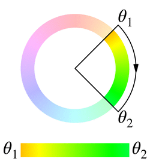
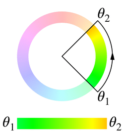
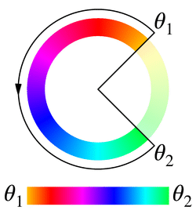
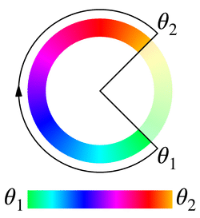

{{CSSRef}}

The **`<hue-interpolation-method>`** [CSS](/en-US/docs/Web/CSS) [data type](/en-US/docs/Web/CSS/CSS_Values_and_Units/CSS_data_types) represents the algorithm used for interpolation between {{CSSXref("&lt;hue&gt;")}} values.
The interpolation method specifies how to find a midpoint between two hue values based on a color wheel.
It is used as a component of the {{CSSXref("&lt;color-interpolation-method&gt;")}} data type.

When interpolating `<hue>` values, the hue interpolation algorithm defaults to [`shorter`](#shorter).

## Syntax

A `<hue-interpolation-method>` value consists of the name of a hue interpolation algorithm followed by a literal token `hue`:

```plain
shorter hue
longer hue
increasing hue
decreasing hue
```

### Values

Any pair of hue angles correspond to two radii on the {{Glossary("color wheel")}}, which cut the circumference into two possible arcs for interpolation. Both arcs start at the first radius and end at the second radius, but one goes clockwise and the other goes counterclockwise.

> [!NOTE]
> The following descriptions and illustrations are based on color wheels in which hue angles increase in a clockwise direction. Be aware that there are color wheels where an increase in angles will be a counterclockwise operation.

For a pair of hue angles `θ1` and `θ2` normalized to the range `[0deg, 360deg)`, there are four algorithms to determine which arc is used when interpolating from `θ1` to `θ2`:

- `shorter`

  - : Use the shorter arc. When the two radii coincide, the arc degenerates to a single point. When both arcs have the same lengths:

    - If `θ1 < θ2`, use the clockwise arc;
    - If `θ1 > θ2`, use the counterclockwise arc.

    | `θ1 = 45deg`, `θ2 = 135deg`                                        | `θ1 = 135deg`, `θ2 = 45deg`                                        |
    | ------------------------------------------------------------------ | ------------------------------------------------------------------ |
    |  |  |

- `longer`

  - : Use the longer arc. When the two radii coincide:

    - If `θ1 ≤ θ2`, the arc becomes the full circumference with a clockwise orientation.
    - If `θ1 > θ2`, the arc becomes the full circumference with a counterclockwise orientation.

    When both arcs have the same lengths:

    - If `θ1 < θ2`, use the clockwise arc;
    - If `θ1 > θ2`, use the counterclockwise arc.

    | `θ1 = 45deg`, `θ2 = 135deg`                                      | `θ1 = 135deg`, `θ2 = 45deg`                                      |
    | ---------------------------------------------------------------- | ---------------------------------------------------------------- |
    |  |  |

- `increasing`

  - : Use the clockwise arc. When the two radii coincide, the arc degenerates to a single point.

    | `θ1 = 45deg`, `θ2 = 135deg`                                           | `θ1 = 135deg`, `θ2 = 45deg`                                          |
    | --------------------------------------------------------------------- | -------------------------------------------------------------------- |
    |  |  |

- `decreasing`

  - : Use the counterclockwise arc. When the two radii coincide, the arc degenerates to a single point.

    | `θ1 = 45deg`, `θ2 = 135deg`                                          | `θ1 = 135deg`, `θ2 = 45deg`                                           |
    | -------------------------------------------------------------------- | --------------------------------------------------------------------- |
    |  |  |

As there are only two arcs to choose from, these algorithms are pairwise equivalent under certain circumstances. Specifically:

- If `0deg < θ2 - θ1 < 180deg` or `θ2 - θ1 < -180deg`, `shorter` and `increasing` are equivalent, whereas `longer` and `decreasing` are equivalent.
- If `-180deg < θ2 - θ1 < 0deg` or `θ2 - θ1 > 180deg`, `shorter` and `decreasing` are equivalent, whereas `longer` and `increasing` are equivalent.

A notable feature of `increasing` and `decreasing` is that when the hue angle difference passes through `180deg` during transition or animation, the arc will not flip to the other side like `shorter` and `longer` do.

## Formal syntax

{{CSSSyntax}}

## Examples

### Comparing hue interpolation algorithms

The following example shows the effect of using different hue interpolation algorithms in a {{CSSXref("gradient/linear-gradient", "linear-gradient()")}}.

#### HTML

```html
<div class="hsl">
  <p>HSL</p>
</div>
<div class="hsl-increasing">
  <p>HSL increasing</p>
</div>
<div class="hsl-decreasing">
  <p>HSL decreasing</p>
</div>
<div class="hsl-shorter">
  <p>HSL shorter</p>
</div>
<div class="hsl-longer">
  <p>HSL longer</p>
</div>
<div class="hsl-named">
  <p>HSL named</p>
</div>
<div class="hsl-named-longer">
  <p>HSL named (longer)</p>
</div>
```

#### CSS

```css hidden
div {
  border: 1px solid black;
  height: 50px;
  margin: 10px;
  width: 90%;
}
p {
  color: white;
  margin: 6px;
}

/* Fallback styles */
.hsl,
.hsl-shorter,
.hsl-named {
  background: linear-gradient(
    to right,
    hsl(39 100% 50%),
    hsl(46 100% 50%),
    hsl(53 100% 50%),
    hsl(60 100% 50%)
  );
}
.hsl-increasing {
  background: linear-gradient(
    to right,
    hsl(190 100% 50%),
    hsl(225 100% 50%),
    hsl(260 100% 50%),
    hsl(295 100% 50%),
    hsl(330 100% 50%),
    hsl(365 100% 50%),
    hsl(400 100% 50%),
    hsl(435 100% 50%),
    hsl(470 100% 50%),
    hsl(505 100% 50%),
    hsl(540 100% 50%)
  );
}
.hsl-decreasing,
.hsl-longer,
.hsl-named-longer {
  background: linear-gradient(
    to right,
    hsl(399 100% 50%),
    hsl(368 100% 50%),
    hsl(337 100% 50%),
    hsl(307 100% 50%),
    hsl(276 100% 50%),
    hsl(245 100% 50%),
    hsl(214 100% 50%),
    hsl(183 100% 50%),
    hsl(152 100% 50%),
    hsl(122 100% 50%),
    hsl(91 100% 50%),
    hsl(60 100% 50%)
  );
}
```

```css
.hsl {
  background: linear-gradient(
    to right in hsl,
    hsl(39deg 100% 50%),
    hsl(60deg 100% 50%)
  );
}
.hsl-increasing {
  background: linear-gradient(
    to right in hsl increasing hue,
    hsl(190deg 100% 50%),
    hsl(180deg 100% 50%)
  );
}
.hsl-decreasing {
  background: linear-gradient(
    to right in hsl decreasing hue,
    hsl(39deg 100% 50%),
    hsl(60deg 100% 50%)
  );
}
.hsl-shorter {
  background: linear-gradient(
    to right in hsl shorter hue,
    hsl(39deg 100% 50%),
    hsl(60deg 100% 50%)
  );
}
.hsl-longer {
  background: linear-gradient(
    to right in hsl longer hue,
    hsl(39deg 100% 50%),
    hsl(60deg 100% 50%)
  );
}
.hsl-named {
  background: linear-gradient(to right in hsl, orange, yellow);
}
.hsl-named-longer {
  background: linear-gradient(to right in hsl longer hue, orange, yellow);
}
```

#### Result

{{EmbedLiveSample("comparing_hue_interpolation_methods", "100%", 500)}}

## Specifications

{{Specifications}}

## Browser compatibility

{{Compat}}

## See also

- {{CSSXref("&lt;color-interpolation-method&gt;")}}
- {{CSSXref("&lt;hue&gt;")}} data type
