{{CSSRef}}

The **`<hue>`** [CSS](/en-US/docs/Web/CSS) [data type](/en-US/docs/Web/CSS/CSS_Values_and_Units/CSS_data_types) represents the hue angle of a color.
It is used in the color functions that accept hue expressed as a single value, specifically [`hsl()`](/en-US/docs/Web/CSS/color_value/hsl), [`hwb()`](/en-US/docs/Web/CSS/color_value/hwb), [`lch()`](/en-US/docs/Web/CSS/color_value/lch), and [`oklch()`](/en-US/docs/Web/CSS/color_value/oklch) functional notations.

## Syntax

A `<hue>` can be either an `<angle>` or a `<number>`.

### Values

- {{CSSXref("&lt;angle&gt;")}}
  - : An angle expressed in degrees, gradians, radians, or turns using the `deg`, `grad`, `rad`, or `turn`, respectively.
- `<number>`
  - : A real number, representing degrees of the hue angle.

As an `<angle>` is periodic, `<hue>` is normalized to the range `[0deg, 360deg)`. It implicitly wraps around such that `480deg` is the same as `120deg`, `-120deg` is the same as `240deg`, `-1turn` is the same as `1turn`, and so on.

## Description



The color wheel above shows hues at all angles in the [sRGB](https://en.wikipedia.org/wiki/SRGB) {{glossary("color space")}}. In particular, _red_ is at `0deg`, _yellow_ is at `60deg`, _lime_ is at `120deg`, _cyan_ is at `180deg`, _blue_ is at `240deg`, and _magenta_ is at `300deg`.

The angles corresponding to particular hues differ depending on the color space. For example, the hue angle of sRGB green is `120deg` in the sRGB color space, but `134.39deg` in the CIELAB color space.

The following table lists typical colors at various angles in the sRGB (used by {{CSSXref("color_value/hsl", "hsl()")}} and {{CSSXref("color_value/hwb", "hwb()")}}), CIELAB (used by {{CSSXref("color_value/lch", "lch()")}}), and Oklab (used by {{CSSXref("color_value/oklch", "oklch()")}}) color spaces:

<table>
  <colgroup>
    <col />
    <col span="6" width="15%" />
  </colgroup>
  <thead>
    <tr>
      <th></th>
      <th scope="col">0°</th>
      <th scope="col">60°</th>
      <th scope="col">120°</th>
      <th scope="col">180°</th>
      <th scope="col">240°</th>
      <th scope="col">300°</th>
    </tr>
  </thead>
  <tbody>
    <tr>
      <th scope="row">sRGB</th>
      <td
        style="background: hsl(0 100% 50%);"
        title="hsl(0 100% 50%)"></td>
      <td
        style="background: hsl(60 100% 50%);"
        title="hsl(60 100% 50%)"></td>
      <td
        style="background: hsl(120 100% 50%);"
        title="hsl(120 100% 50%)"></td>
      <td
        style="background: hsl(180 100% 50%);"
        title="hsl(180 100% 50%)"></td>
      <td
        style="background: hsl(240 100% 50%);"
        title="hsl(240 100% 50%)"></td>
      <td
        style="background: hsl(300 100% 50%);"
        title="hsl(300 100% 50%)"></td>
    </tr>
    <tr>
      <th scope="row">CIELAB</th>
      <td
        style="background: lch(50% 50% 0);"
        title="lch(50% 50% 0)"></td>
      <td
        style="background: lch(65% 55% 60);"
        title="lch(65% 55% 60)"></td>
      <td
        style="background: lch(90% 65% 120);"
        title="lch(90% 65% 120)"></td>
      <td
        style="background: lch(90% 35% 180);"
        title="lch(90% 35% 180)"></td>
      <td
        style="background: lch(75% 25% 240);"
        title="lch(75% 25% 240)"></td>
      <td
        style="background: lch(40% 70% 300);"
        title="lch(40% 70% 300)"></td>
    </tr>
    <tr>
      <th scope="row">Oklab</th>
      <td
        style="background: oklch(65% 65% 0);"
        title="oklch(65% 65% 0)"></td>
      <td
        style="background: oklch(75% 40% 60);"
        title="oklch(75% 40% 60)"></td>
      <td
        style="background: oklch(90% 50% 120);"
        title="oklch(90% 50% 120)"></td>
      <td
        style="background: oklch(90% 35% 180);"
        title="oklch(90% 35% 180)"></td>
      <td
        style="background: oklch(70% 40% 240);"
        title="oklch(70% 40% 240)"></td>
      <td
        style="background: oklch(55% 70% 300);"
        title="oklch(55% 70% 300)"></td>
    </tr>
  </tbody>
</table>

## Interpolation of `<hue>` values

`<hue>` values are interpolated as {{CSSXref("&lt;angle&gt;")}} values, and the default interpolation algorithm is [`shorter`](/en-US/docs/Web/CSS/hue-interpolation-method#values). In some color-related CSS functions, this can be overridden by the {{CSSXref("&lt;hue-interpolation-method&gt;")}} component.

## Formal syntax

{{csssyntax}}

## Examples

### Changing the hue of a color using a slider

The following example shows the effect of changing the `hue` value of the [`hsl()`](/en-US/docs/Web/CSS/color_value/hsl) functional notation on a color.

#### HTML

```html
<input type="range" min="0" max="360" value="0" id="hue-slider" />
<p>Hue: <span id="hue-value">0deg</span></p>
<div id="box"></div>
```

#### CSS

```css hidden
div {
  width: 100px;
  height: 100px;
  margin: 10px;
  border: 1px solid black;
}
p {
  font-family: sans-serif;
}
span {
  font-family: monospace;
  background: rgb(0 0 0 / 10%);
  padding: 3px;
}
#hue-slider {
  width: 90%;
}
```

```css
#box {
  background-color: hsl(0 100% 50%);
}
```

#### JavaScript

```js
const hue = document.querySelector("#hue-slider");
const box = document.querySelector("#box");
hue.addEventListener("input", () => {
  box.style.backgroundColor = `hsl(${hue.value} 100% 50%)`;
  document.querySelector("#hue-value").textContent = `${hue.value}deg`;
});
```

#### Result

{{EmbedLiveSample("changing_the_hue_of_a_color_using_a_slider", "100%", "200")}}

### Approximating red hues in different color spaces

The following example shows a similar red color in different color spaces.
The values in the `lch()` and `oklch()` functions are rounded for readability.

#### HTML

```html
<div data-color="hsl-red">hsl()</div>
<div data-color="hwb-red">hwb()</div>
<div data-color="lch-red">lch()</div>
<div data-color="oklch-red">oklch()</div>
```

#### CSS

```css
[data-color="hsl-red"] {
  /* hsl(<hue> <saturation> <lightness>) */
  background-color: hsl(0 100% 50%);
}
[data-color="hwb-red"] {
  /* hwb(<hue> <whiteness> <blackness>) */
  background-color: hwb(0 0% 0%);
}
[data-color="lch-red"] {
  /* lch(<lightness> <chroma> <hue>) */
  background-color: lch(50 150 40);
}
[data-color="oklch-red"] {
  /* oklch(<lightness> <chroma> <hue>) */
  background-color: oklch(0.6 0.4 20);
}
```

```css hidden
div {
  font-family: monospace;
  width: 100px;
  height: 100px;
  margin: 10px;
  border: 1px solid black;
  display: inline-block;
}
```

#### Result

{{EmbedLiveSample("approximating_red_hues_in_different_color_spaces", "100%", "150")}}

## Specifications

{{Specifications}}

## Browser compatibility

{{Compat}}

## See also

- [`<color>`](/en-US/docs/Web/CSS/color_value)
- {{CSSXref("&lt;hue-interpolation-method&gt;")}}
