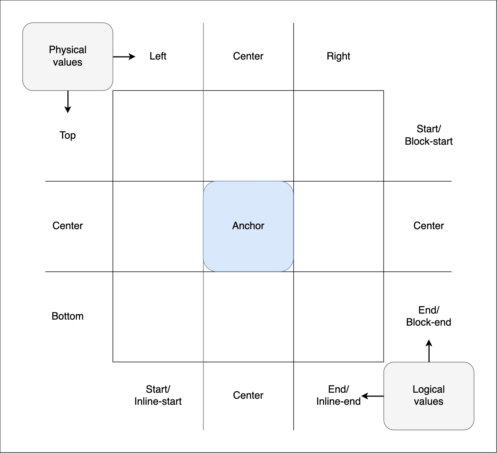

{{CSSRef}}{{seecompattable}}

The **`inset-area`** [CSS](/en-US/docs/Web/CSS) property enables an anchor-positioned element to be positioned relative to the edges of its associated anchor element by placing the positioned element on one or more tiles of an implicit 3x3 grid, where the anchoring element is the center cell.

`inset-area` provides a convenient alternative to tethering and positioning an element relative to its anchor via {{glossary("inset properties")}} and the {{cssxref("anchor()")}} function. The grid-based concept solves the common use-case of positioning the edges of the positioned element's containing block relative to the edges of its default anchor element.

If an element does not have a default anchor element, or is not an absolutely-positioned element, this property has no effect.

## Syntax

```css
/* Default value */
inset-area: none;

/* Two <inset-area> keywords defining a single specific tile */
inset-area: top left;
inset-area: start end;
inset-area: block-start center;
inset-area: inline-start block-end;
inset-area: x-start y-end;
inset-area: center y-self-end;

/* Two <inset-area> keywords spanning two tiles */
inset-area: top span-left;
inset-area: center span-start;
inset-area: inline-start span-block-end;
inset-area: y-start span-x-end;

/* Two <inset-area> keywords spanning three tiles */
inset-area: top span-all;
inset-area: block-end span-all;
inset-area: x-self-start span-all;

/* One <inset-area> keyword with an implicit second <inset-area> keyword  */
inset-area: top; /* equiv: top span-all */
inset-area: inline-start; /* equiv: inline-start span-all */
inset-area: center; /* equiv: center center */
inset-area: span-all; /* equiv: center center */
inset-area: end; /* equiv: end end */

/* Global values */
inset-area: inherit;
inset-area: initial;
inset-area: revert;
inset-area: revert-layer;
inset-area: unset;
```

### Values

The property value is two `<inset-area>` keyterms, or the keyword `none`. If only one `<inset-area>` keyterm is provided, the second keyterm is implied.

- [`<inset-area>`](/en-US/docs/Web/CSS/inset-area_value)

  - : Specifies the area of the inset area grid on which to place selected positioned elements.

- `none`

  - : No inset area is set.

## Description

The `inset-area` property provides an alternative to the `anchor()` function for positioning elements relative to anchors. `inset-area` works on the concept of a 3x3 grid of tiles, called the **inset-area grid**, with the anchor element being the center tile:



The grid tiles are broken up into rows and columns:

- The three rows are represented by the [physical values](/en-US/docs/Web/CSS/inset-area_value#physical_grid_keywords) `top`, `center`, and `bottom`. They also have [logical equivalents](/en-US/docs/Web/CSS/inset-area_value#logical_grid_keywords) such as `block-start`, `center`, and `block-end`, and [coordinate equivalents](/en-US/docs/Web/CSS/inset-area_value#coordinate_grid_keywords) — `y-start`, `center`, and `y-end`.
- The three columns are represented by the physical values `left`, `center`, and `right`. They also have logical equivalents such as `inline-start`, `center`, and `inline-end`, and coordinate equivalents — `x-start`, `center`, and `x-end`.

The dimensions of the center tile are defined by the [containing block](/en-US/docs/Web/CSS/Containing_block) of the anchor element, while the dimensions of the grid's outer edge are defined by the positioned element's containing block.

The [`<inset-area>`](/en-US/docs/Web/CSS/inset-area_value) value is composed of one or two keywords, which define the region of the grid the positioned element should be placed inside. To be exact, the containing block of the positioned element is set to the grid area.

For example:

- You can specify a row value and a column value to place the positioned element in a single, specific grid square — for example, `top left` (logical equivalent `start start`) or `bottom center` (logical equivalent `end center`) will place the positioned element in the top-right or bottom-center square.
- You can specify a row or column value plus a `span-*` value to span two or three cells. The first value specifies the row or column to place the positioned element in, placing it initially in the center, and the other one specifies the other tiles of that row or column to span. For example:
  - `top span-left` causes the positioned element to be placed in the center of the top row, and span across the center and left tiles of that row.
  - `block-end span-inline-end` causes the positioned element to be placed in the center of the block end row, and span across the center and inline end tiles of that row.
  - `bottom span-all` and `y-end span-all` cause the positioned element to be placed in the center of the bottom row, and span across three cells, in this case the left, center, and right tiles of the bottom row.

For detailed information on anchor features, usage, and the `inset-area` property, see the [CSS anchor positioning](/en-US/docs/Web/CSS/CSS_anchor_positioning) module landing page and the [Using CSS anchor positioning](/en-US/docs/Web/CSS/CSS_anchor_positioning/Using) guide, specifically the section on [setting an `inset-area`](/en-US/docs/Web/CSS/CSS_anchor_positioning/Using#setting_an_inset-area).

### Adjusted default behavior

When an [`<inset-area>`](/en-US/docs/Web/CSS/inset-area_value) value is set on a positioned element, some of its properties will have their default behavior adjusted to provide a good default alignment.

#### Self-alignment property `normal` value

The `normal` value of the self-alignment properties, including {{cssxref("align-items")}}, {{cssxref("align-self")}}, {{cssxref("justify-items")}}, and {{cssxref("justify-self")}}, behaves as either `start`, `end`, or [`anchor-center`](/en-US/docs/Web/CSS/CSS_anchor_positioning/Using#centering_on_the_anchor_using_anchor-center). Which value the self-alignment property defaults to depends on the positioning of the element:

- If the `inset-area` value specifies the center region in an axis, the default alignment in that axis is `anchor-center`.
- Otherwise, the behavior is the opposite of the region specified by the `inset-area` property. For example, if the `inset-area` value specifies the start region of its axis, the default alignment in that axis is `end`.

For example, if the `writing-mode` is set to `horizontal-tb`, `inset-area: top span-x-start` causes the positioned element to be placed in the center of the top row, and span across the center and start tiles of that row. In this case, the self-alignment properties will default to `align-self: end` and `justify-self: anchor-center`.

#### inset properties and values

When an anchor-positioned element is positioned using the `inset-area` property, any {{glossary("inset properties")}} set, such as {{cssxref("top")}} or {{cssxref("inset-inline-end")}}, specify offsets from the inset-area. Some other property values, like [`max-block-size: 100%`](/en-US/docs/Web/CSS/max-block-size), will also be relative to the inset-area. Any inset properties set or defaulting to `auto` will behave as if their value was set to `0`.

### An aside on positioned element width

If the positioned element does not have a specific size set on it, its size will default to its [intrinsic size](/en-US/docs/Glossary/Intrinsic_Size), but it will also be affected by the size of the inset-area grid.

If the positioned element is placed in a single top-center, bottom-center, or center-center cell, its block size will be the same as the anchor's containing block size, growing up, down, or in both directions, respectively, as needed. The positioned element will align with the specified grid square but adopt the same width as the anchor element. However, it won't allow its content to overflow — its minimum `width` will be its `min-content` (as defined by the width of its longest word).

If the positioned element is placed in any other single grid square (say with `inset-area: top left`) or is set to span two or more grid squares (for example using `inset-area: bottom span-all`), it will align with the specified grid area but behave as if it has a {{cssxref("width")}} of `max-content` set on it. It is being sized according to its containing block size, which is the size imposed on it when it was set to `position: fixed`. It will stretch as wide as the text content, although it may also be constrained by the edge of the `<body>`.

## Formal definition

{{cssinfo}}

## Formal syntax

{{csssyntax}}

## Examples

### Basic example

In this example, a positioned element is tethered and positioned relative to its associated anchor using the `inset-area` property.

#### HTML

The HTML includes a {{htmlelement("div")}} and a {{htmlelement("p")}}. The `<p>` will be positioned relative to the `<div>` with CSS. We also include a style block that will be made visible. All elements are set to be directly editable via the [`contenteditable`](/en-US/docs/Web/HTML/Global_attributes/contenteditable) attribute.

```html-nolint
<div class="anchor" contenteditable="true">⚓︎</div>

<p class="positionedElement" contenteditable="true">This can be edited.</p>

<style contenteditable="true">.positionedElement {
    inset-area: CHANGEME;
  }
</style>
```

#### CSS

We convert the `<div>` to an anchor element with the {{cssxref("anchor-name")}} property. We then associate the absolutely-positioned `<p>` with it by setting its {{cssxref("position-anchor")}} value to the same anchor name.

We set the initial `inset-area` value to `top center`. This value is set on a `p` selector, so the value has less [specificity](/en-US/docs/Web/CSS/Specificity) than any value added to the `<style>` block's `.positionedElement` [class selector](/en-US/docs/Web/CSS/Class_selectors). As a result, you can override the initial `inset-area` value by setting an `inset-area` value inside the style block.

```css
.anchor {
  anchor-name: --infobox;
  background: palegoldenrod;
  font-size: 3em;
  width: fit-content;
  border: 1px solid goldenrod;
  margin: 100px auto;
}

p {
  position: absolute;
  position-anchor: --infobox;
  inset-area: top center;
  margin: 0;
  background-color: darkkhaki;
  border: 1px solid darkolivegreen;
}

style {
  display: block;
  white-space: pre;
  font-family: monospace;
  background-color: #ededed;
  -webkit-user-modify: read-write-plaintext-only;
  line-height: 1.5;
  padding: 10px;
}
```

#### Results

{{ EmbedLiveSample("Basic example", "100%", "360") }}

Try changing the amount of text in the anchor-positioned element to see how it grows. Also, try changing the invalid "CHANGEME" value of the `inset-area` property to a valid value.

### `inset-area` value comparison

Let's show some `inset-area` values in action. This demo creates an anchor and tethers a positioned element to it. It also provides a drop-down menu allowing you to choose various `inset-area` values to apply to the positioned element, to see their effect. One of the options causes a text field to appear that enables you to enter a custom value. Finally, a checkbox is provided to turn `writing-mode: vertical-lr` on and off, allowing you to observe how `inset-area` value effects differ across different writing modes.

#### HTML

In the HTML, we specify two {{htmlelement("div")}} elements, one with a class of `anchor` and one with a class of `infobox`. These are intended to be the anchor element and the positioned element we will associate with it, respectively. We've included the `contenteditable` attribute on both, making them directly editable.

We've also included two forms that contain the {{htmlelement("select")}} and [`<input type="text">`](/en-US/docs/Web/HTML/Element/input/text) elements for setting different `inset-area` values, and the [`<input type="checkbox">`](/en-US/docs/Web/HTML/Element/input/checkbox) element for toggling the vertical {{cssxref("writing-mode")}} on and off. The code for these, along with the JavaScript, has been hidden for the sake of brevity.

```html
<div class="anchor" contenteditable>⚓︎</div>

<div class="infobox">
  <p contenteditable>You can edit this text.</p>
</div>
```

```html hidden
<form id="inset-area-form">
  <div>
    <label for="inset-area-select">Choose an inset-area:</label>
    <select id="inset-area-select" name="inset-area-select">
      <optgroup label="Enter custom value">
        <option>Custom</option>
      </optgroup>
      <optgroup label="Physical, single tile">
        <option selected>top left</option>
        <option>bottom right</option>
      </optgroup>
      <optgroup label="Physical, span two">
        <option>bottom span-right</option>
        <option>left span-top</option>
      </optgroup>
      <optgroup label="Physical, span all">
        <option>top</option>
        <option>left</option>
      </optgroup>
      <optgroup label="Logical, single tile">
        <option>start center</option>
        <option>inline-start block-end</option>
      </optgroup>
      <optgroup label="Logical, span two">
        <option>start span-end</option>
        <option>center span-start</option>
        <option>inline-start span-block-end</option>
        <option>span-block-start center</option>
      </optgroup>
      <optgroup label="Logical, span all">
        <option>start span-all</option>
        <option>block-end</option>
      </optgroup>
      <optgroup label="Coordinates, single tile">
        <option>x-start center</option>
        <option>x-end y-end</option>
      </optgroup>
      <optgroup label="Coordinates, span two">
        <option>center span-y-start</option>
        <option>y-start span-x-end</option>
      </optgroup>
      <optgroup label="Coordinates, span all">
        <option>x-start span-all</option>
        <option>y-end</option>
      </optgroup>
    </select>
  </div>
  <div id="inset-area-custom-container">
    <label for="inset-area-custom">Enter a custom inset-area:</label><br />
    <input type="text" id="inset-area-custom" name="inset-area-custom" />
  </div>
</form>

<form id="writing-mode-form">
  <label for="writing-mode-checkbox">writing-mode: vertical-lr</label><br />
  <input
    type="checkbox"
    id="writing-mode-checkbox"
    name="writing-mode-checkbox" />
</form>
```

#### CSS

In the CSS, we first declare the `anchor` `<div>` as an anchor element by setting an anchor name on it via the {{cssxref("anchor-name")}} property.

The positioned element is associated with the anchor element by setting its anchor name as the value of the positioned element's {{cssxref("position-anchor")}} property. We also give it an initial position with `inset-area: top left`; this will be overridden when new values are selected from the `<select>` menu. Finally, we set its {{cssxref("opacity")}} to `0.8`, so that when the positioned element is given an `inset-area` value that places it over the top of the anchor, you can still see the elements' position relative to one another.

```css hidden
.anchor {
  font-size: 1.8rem;
  text-align: center;
  color: white;
  text-shadow: 1px 1px 1px black;
  background-color: hsl(240 100% 75%);
  min-width: 50px;
  min-height: 50px;
  line-height: 50px;
  border-radius: 10px;
  border: 1px solid black;
  padding: 3px;
}

html {
  height: 100%;
}

body {
  margin: 0;
  width: 100vw;
  height: 100vh;
  display: flex;
  justify-content: center;
  align-items: center;
}

form {
  background: white;
  border: 1px solid black;
  padding: 5px;
  position: fixed;
}

#inset-area-form {
  top: 0;
  right: 2px;
}

#inset-area-form div:last-child {
  margin-top: 10px;
}

#inset-area-form div :last-child {
  margin-top: 5px;
}

#writing-mode-form {
  bottom: 0;
  left: 2px;
  writing-mode: horizontal-tb;
}

#inset-area-custom-container {
  display: none;
}

.infobox {
  color: darkblue;
  background-color: azure;
  border: 1px solid #ddd;
  padding: 5px 2px;
  border-radius: 5px;
  font-size: 1rem;
  box-sizing: border-box;
}
```

```css
.anchor {
  anchor-name: --myAnchor;
}

.infobox {
  position-anchor: --myAnchor;
  position: fixed;
  opacity: 0.8;
  inset-area: top left;
}
```

```js hidden
const anchorContainer = document.querySelector("body");
const infobox = document.querySelector(".infobox");

const insetAreaForm = document.querySelector("#inset-area-form");
const selectElem = document.querySelector("select");
const inputElemContainer = document.querySelector(
  "#inset-area-custom-container",
);
const inputElem = document.querySelector("#inset-area-custom");
const checkboxElem = document.querySelector("#writing-mode-checkbox");

// Stop form from submitting when enter is pressed on it
insetAreaForm.addEventListener("submit", (e) => {
  e.preventDefault();
});

// Update positioned element inset-area to value selected in drop-down
selectElem.addEventListener("change", () => {
  const area = selectElem.value;

  if (area === "Custom") {
    // Show the custom value input field
    inputElemContainer.style.display = "block";
  } else {
    // Hide the custom value input field
    inputElemContainer.style.display = "none";
    // Set the inset-area to the value chosen in the select box
    infobox.style.insetArea = area;
  }
});

// Update positioned element inset-area to entered custom value
inputElem.addEventListener("change", () => {
  const customArea = inputElem.value;

  // Set the inset-area to the value in the input box
  infobox.style.insetArea = customArea;
});

// Change writing-mode to match checkbox setting
checkboxElem.addEventListener("change", () => {
  if (checkboxElem.checked) {
    anchorContainer.style.writingMode = "vertical-lr";
  } else {
    anchorContainer.style.writingMode = "horizontal-tb";
  }
});
```

#### Result

The result is as follows:

{{ EmbedLiveSample("`inset-area` value comparison", "100%", "360") }}

Try selecting new `inset-area` values from the `<select>` menu to see the effect they have on the position of the infobox. Select the "Custom" value and try entering some custom `inset-area` values into the text input to see their effect. Add text to the anchor and the anchor positioned elements to see how the anchor positioned element grows based on the `inset-area` value. Finally, check the checkbox and then experiment with different `inset-area` values to see which ones give the same result across different writing modes, and which ones give different results.

## Specifications

{{Specifications}}

## Browser compatibility

{{Compat}}

## See also

- {{cssxref("anchor-name")}}
- {{cssxref("position-anchor")}}
- {{cssxref("position-try-fallbacks")}}
- The [`anchor()`](/en-US/docs/Web/CSS/anchor) function
- The [`<inset-area>`](/en-US/docs/Web/CSS/inset-area_value) value
- [Using CSS anchor positioning](/en-US/docs/Web/CSS/CSS_anchor_positioning/Using) guide
- [Handling overflow: try fallbacks and conditional hiding](/en-US/docs/Web/CSS/CSS_anchor_positioning/Try_options_hiding) guide
- [CSS anchor positioning](/en-US/docs/Web/CSS/CSS_anchor_positioning) module
