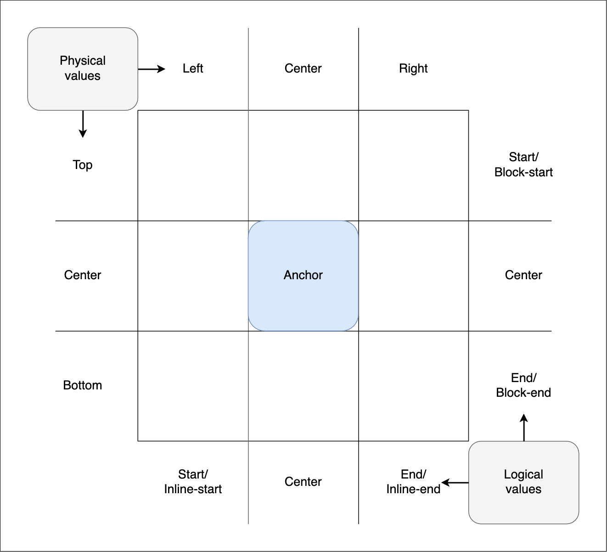

{{CSSRef}}

The **`<inset-area>`** [CSS](/en-US/docs/Web/CSS) [data type](/en-US/docs/Web/CSS/CSS_Types) specifies an area of the implicit 3x3 grid known as the **inset-area grid**. It can be set as the value of the {{cssxref("inset-area")}} property to place an **anchor-positioned element** in a specific location relative to its associated **anchor element**.

For detailed information on anchor features and usage, see the [CSS anchor positioning](/en-US/docs/Web/CSS/CSS_anchor_positioning) module landing page and the [Using CSS anchor positioning](/en-US/docs/Web/CSS/CSS_anchor_positioning/Using) guide.

## Syntax

```css
/* Examples: Two keywords to place the element in a single specific tile */
inset-area: top left;
inset-area: bottom right;
inset-area: start end;
inset-area: center end;
inset-area: block-start center;
inset-area: inline-start block-end;
inset-area: x-start y-end;
inset-area: center y-self-end;

/* Examples: Two keywords to span the element across two tiles */
inset-area: top span-left;
inset-area: span-bottom right;
inset-area: center span-start;
inset-area: inline-start span-block-end;
inset-area: y-start span-x-end;

/* Examples: Two keywords to span the element across three tiles */
inset-area: top span-all;
inset-area: block-end span-all;
inset-area: x-self-start span-all;

/* Examples: One keyword with an implicit second keyword  */
inset-area: top; /* equiv: top span-all */
inset-area: inline-start; /* equiv: inline-start span-all */
inset-area: center; /* equiv: center center */
inset-area: span-all; /* equiv: center center */
inset-area: start; /* equiv: start start */
inset-area: end; /* equiv: end end */

/* Global values */
inset-area: inherit;
inset-area: initial;
inset-area: revert;
inset-area: revert-layer;
inset-area: unset;
```

## The inset-area grid

`inset-area` works on the concept of a 3x3 grid of tiles, with the anchor element inside the center tile:



The grid tiles are broken up into rows and columns:

- The three rows are represented by the physical values `top`, `center`, and `bottom`. They also have logical equivalents such as `block-start`, `center`, and `block-end`, and coordinate equivalents — `y-start`, `center`, and `y-end`.
- The three columns are represented by the physical values `left`, `center`, and `right`. They also have logical equivalents such as `inline-start`, `center`, and `inline-end`, and coordinate equivalents — `x-start`, `center`, and `x-end`.

The dimensions of the center tile are defined by the [containing block](/en-US/docs/Web/CSS/Containing_block) of the anchor element, while the dimensions of the grid's outer edge are defined by the positioned element's containing block.

`<inset-area>` values are composed of one or two keywords, which define the region of the grid the positioned element should be placed inside. To be exact, the containing block of the positioned element is set to the grid area. The following sections explain in detail the different types of keywords that can be used.

> **Note:** Generally, you can't mix different types in one value, e.g. physical and logical. To do so results in invalid values. For example, `inset-area: bottom inline-end` is not a valid value because it mixes physical and logical keywords.

## Physical grid keywords

These keywords specify the position of the element on the `inset-area` grid using physical values, i.e. its position/direction will be unaffected by {{cssxref("writing-mode")}} or {{cssxref("direction")}} settings.

- Physical row and column keywords

  - : You can specify one keyword from each of the two lists below to position the element in a single specific grid tile:

    - `top`, `center`, or `bottom`: Position the element in the top, center, or bottom row of the grid.
    - `left`, `center`, or `right`: Position the element in the left-hand, center, or right-hand column of the grid.

      For example, `top left` places the element in the top left tile, while `center right` places it in the center row and right-hand column.

- Physical spanning keywords

  - : You can specify one physical row or column keyword, and an appropriate physical spanning keyword. The element is initially placed in the center of the specified row or column, and it then spans in the direction specified in the spanning keyword, spanning two grid tiles:

    - `span-left`: Cause the element to span the center column and the left-hand column of the grid.
    - `span-right`: Cause the element to span the center column and the right-hand column of the grid.
    - `span-top`: Cause the element to span the center row and the top row of the grid.
    - `span-bottom`: Cause the element to span the center row and the bottom row of the grid.

      For example, `top span-left` causes the element to be spanned over the top center and top left of the anchor.

      > **Note:** Trying to pair a row or column keyword with an inappropriate spanning keyword will result in an invalid property value. For example, `right span-right` is invalid — you can't place the element in the right-hand column and then try to span further to the right.

If only a single physical keyword is specified in the `inset-area` value, the other value is implied as follows:

- `left`, `right`, `top`, or `bottom`
  - : The other value defaults to [`span-all`](#span-all), causing the element to span all three tiles of the grid or row it was initially placed in. For example, `left` is equivalent to `left span-all`.
- `span-left`, `span-right`, `span-top`, or `span-bottom`
  - : The other value defaults to `center`. For example, `span-left` is equivalent to `center span-left`.

## Logical grid keywords

These keywords specify the position of the element on the `inset-area` grid using logical values, i.e. its position/direction will be relative to {{cssxref("writing-mode")}} and/or {{cssxref("direction")}} settings on either the element itself (the `self` keywords) or the element's [containing block](/en-US/docs/Web/CSS/Containing_block) (the non-`self` keywords).

- "Plain" logical row and column keywords

  - : These keywords refer generally to a grid row or column position. Which keyword sets each is implied by their position in the value — the first value is interpreted as the row/block value, and the second is interpreted as the column/inline value. In each case, you can specify one keyword from each of the two lists to position the element in a single specific grid tile:

    - Keywords with position/direction calculated from the containing block's writing mode:
      - `start`, `center`, or `end`: Position the element in the start, center, or end row in the grid's block direction.
      - `start`, `center`, or `end`: Position the element in the start, center, or end column in the grid's inline direction.
    - Keywords with position/direction calculated from the element's own writing mode:

      - `self-start`, `center`, or `self-end`: Position the element in the start, center, or end row in the grid's block direction.
      - `self-start`, `center`, or `self-end`: Position the element in the start, center, or end column in the grid's inline direction.

      For example, `start end` and `self-start self-end` both place the element at the start of the block direction and the end of the inline direction. With `writing-mode: horizontal-tb` set, this would place the element at the top right of the anchor, whereas with `writing-mode: vertical-rl` set it would place the element at the bottom right.

- "Plain" logical spanning keywords

  - : You can specify one plain logical row or column keyword, and an appropriate plain logical spanning keyword. The element is initially placed in the center of the specified row or column, and it then spans in the direction specified in the spanning keyword, spanning two grid tiles:

    - Keywords with position/direction calculated from the containing block's writing mode:
      - `span-start`: Cause the element to span the center tile and the start tile of the grid row/column.
      - `span-end`: Cause the element to span the center tile and the end tile of the grid row/column.
    - Keywords with position/direction calculated from the element's own writing mode:

      - `span-self-start`: Cause the element to span the center tile and the start tile of the grid row/column.
      - `span-self-end`: Cause the element to span the center tile and the end tile of the grid row/column.

      For example, `start span-end` and `self-start span-self-end` both cause the element to be placed in the center of the start block row, and then spanned across the tiles in that row that are also in the inline center and end columns. With `writing-mode: horizontal-tb` set, this would span the element over the top center and top right of the anchor, whereas with `writing-mode: vertical-rl` set it would span the element over the right center and bottom right.

- "Explicit" logical row and column keywords

  - : These keywords refer explicitly to a block (row) or inline (column) position. In each case, you can specify one keyword from each of the two lists to position the element in a single specific grid tile:

    - Keywords with position/direction calculated from the containing block's writing mode:

      - `block-start`, `center`, or `block-end`: Position the element in the start, center, or end row in the grid's block direction.
      - `inline-start`, `center`, or `inline-end`: Position the element in the start, center, or end column in the grid's inline direction.

      For example, `block-start inline-end` places the element at the start of the block direction and the end of the inline direction. With `writing-mode: horizontal-tb` set, this would place the element at the top right of the anchor, whereas with `writing-mode: vertical-rl` set it would place the element at the bottom right.

      > **Note:** The specification defines `self` equivalents of these keywords — `block-self-start`, `block-self-end`, `inline-self-start`, and `inline-self-end`. However, these are not currently supported in any browser.

- "Explicit" logical spanning keywords

  - : You can specify one explicit logical row or column keyword, and an appropriate explicit logical spanning keyword. The element is initially placed in the center of the specified row or column, and it then spans in the direction specified in the spanning keyword, spanning two grid tiles:

    - Keywords with position/direction calculated from the containing block's writing mode:

      - `span-block-start`: Cause the element to span the center tile and the block start tile of the specified inline column.
      - `span-block-end`: Cause the element to span the center tile and the block end tile of the specified inline column.
      - `span-inline-start`: Cause the element to span the center tile and the inline start tile of the specified block row.
      - `span-inline-end`: Cause the element to span the center tile and the inline end tile of the specified block row.

      For example, `block-end span-inline-start` will cause the element to be placed in the center of the end block row, and then spanned across the tiles in that row that are also in the inline center and start columns. With `writing-mode: horizontal-tb` set, this would span the element over the bottom center and bottom left of the anchor, whereas with `writing-mode: vertical-rl` set it would span the element over the right center and top right.

      > **Note:** The specification defines `self` equivalents of these keywords, for example — `span-self-block-start`, `span-self-block-end`, `span-self-inline-start`, and `span-self-inline-end`. However, these are not currently supported in any browser.

      > **Note:** Trying to pair a row or column keyword with an inappropriate spanning keyword will result in an invalid property value. For example, `block-end span-block-end` is invalid — you can't place the element in the block-end row and then try to span one tile further past the block end.

If only a single logical keyword is specified in the `inset-area` value, the other value is implied as follows:

- `start`, `end`, `self-start`, or `self-end`
  - : The other value defaults to the same as the first value, causing the element to sit in the start row and column, or the end row and column.
- `span-start`/`span-self-start` and `span-end`/`span-self-end`
  - : The other value defaults to `center`. For example, `span-start` is equivalent to `span-start center`.
- `block-start`, `block-end`, `inline-start`, `inline-end`
  - : The other value defaults to [`span-all`](#span-all), causing the element to span all three tiles of the column or row it was initially placed in. For example, `block-start` is equivalent to `block-start span-all`.
- `span-block-start`, `span-block-end`, `span-inline-start`, `span-inline-end`
  - : The other value defaults to `center`. For example, `span-inline-start` is equivalent to `span-inline-start center`.

## Coordinate grid keywords

These keywords specify the position of the element on the `inset-area` grid using x- and y-coordinate values. Its position/direction will be affected by {{cssxref("writing-mode")}} and/or {{cssxref("direction")}} settings on either the element itself (the `self` keywords) or the element's [containing block](/en-US/docs/Web/CSS/Containing_block) (the non-`self` keywords).

However, it is placed according to the physical axes rather than the block/inline directions:

- For `writing-mode: horizontal-tb` and `vertical-lr`, the x-axis runs left-to-right and the y-axis runs top-to-bottom.
- For `writing-mode: horizontal-tb; direction: rtl` and `writing-mode: vertical-rl`, the x-axis runs right-to-left and the y-axis runs top-to-bottom.

The keywords are as follows:

- Coordinate row and column keywords

  - : In each case, you can specify one keyword from each of the two lists to position the element in a single specific grid tile:

    - Keywords with position/direction calculated from the containing block's writing mode:
      - `x-start`, `center`, or `x-end`: Position the element in the start, center, or end tile along the grid's x-axis.
      - `y-start`, `center`, or `y-end`: Position the element in the start, center, or end tile along the grid's y-axis.
    - Keywords with position/direction calculated from the element's own writing mode:

      - `x-self-start`, `center`, or `x-self-end`: Position the element in the start, center, or end tile along the grid's x-axis.
      - `y-self-start`, `center`, or `y-self-end`: Position the element in the start, center, or end tile along the grid's y-axis.

      For example, `x-end y-start` and `x-self-end y-self-start` both place the element at the end of the x-axis and the start of the y-axis. With `writing-mode: horizontal-tb` set, this would place the element at the top right of the anchor, whereas with `writing-mode: vertical-rl` set it would place the element at the top left.

- Coordinate spanning keywords

  - : You can specify one coordinate row or column keyword, and an appropriate coordinate spanning keyword. The element is initially placed in the center of the specified row or column, and it then spans in the direction specified in the spanning keyword, spanning two grid tiles:

    - `span-x-start`: Cause the element to span the center tile and the x-start tile of the specified y-axis row.
    - `span-x-end`: Cause the element to span the center tile and the x-end tile of the specified y-axis row.
    - `span-y-start`: Cause the element to span the center tile and the y-start tile of the specified x-axis column.
    - `span-y-end`: Cause the element to span the center tile and the y-end tile of the specified x-axis column.

      For example, `y-end span-x-end` causes the element to be placed in the center of the end y-row, and then spanned across the tiles in that row that are also in the x-center and x-end columns. With `writing-mode: horizontal-tb` set, this would span the element over the bottom center and bottom right of the anchor, whereas with `writing-mode: vertical-rl` set it would span the element over the bottom center and bottom left.

      > **Note:** The specification doesn't define separate coordinate `self` spanning keywords, but these are not needed — the spanning keywords can be used with both types of coordinate row and column keywords.

If only a single logical keyword is specified in the `inset-area` value, the other value is implied as follows:

- `x-start`/`x-self-start`, `x-end`/`x-self-end`, `y-start`/`y-self-start`, or `y-end`/`y-self-end`
  - : The other value defaults to [`span-all`](#span-all), causing the element to span all three tiles of the column or row it was initially placed in. For example, `x-start` is equivalent to `x-start span-all`.
- `span-x-start`, `span-x-end`, `span-y-start`, or `span-y-end`
  - : The other value defaults to `center`. For example, `span-start` is equivalent to `span-start center`.

## `span-all`

`span-all` is a special keyword usable with all of the row and column keywords listed in the sections above. When you specify two values — a row/column keyword and `span-all`, the element is placed in the specified row or column, and it then spans all of the tiles in that row or column.

## Examples

See the {{cssxref("inset-area")}} property page.

## Specifications

{{Specifications}}

## Browser compatibility

{{Compat}}

## See also

- The {{cssxref("inset-area")}} value
- [CSS anchor positioning](/en-US/docs/Web/CSS/CSS_anchor_positioning)
- [Using CSS anchor positioning](/en-US/docs/Web/CSS/CSS_anchor_positioning/Using)
