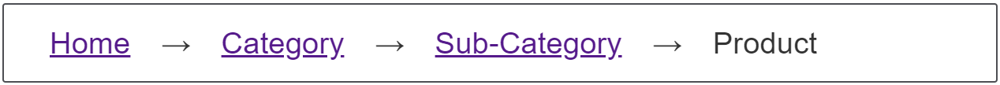

{{CSSRef}}

Breadcrumb navigation helps the user to understand their location in the website by providing a {{glossary("breadcrumb")}} trail back to the start page. The items typically display inline, with a separator between each item, indicating the hierarchy between individual pages.



## Requirements

Display the hierarchy of the site by displaying inline links, with a separator between the items, indicating the hierarchy between individual pages, with the current page appearing last.

## Recipe

{{EmbedGHLiveSample("css-examples/css-cookbook/breadcrumb-navigation.html", '100%', 530)}}

> **Callout:**
>
> [Download this example](https://github.com/mdn/css-examples/blob/main/css-cookbook/breadcrumb-navigation--download.html)

> **Note:** The example above uses a complex selector to insert content before every `li` except the last one. This could also be achieved using a complex selector targeting all `li` elements except the first:
>
> ```css
> .breadcrumb li:not(:first-child)::before {
>   content: "→";
> }
> ```
>
> Feel free to choose the solution that you prefer.

## Choices made

To display list items inline, we use [flexbox layout](/en-US/docs/Learn/CSS/CSS_layout/Flexbox), thus demonstrating how a line of CSS can give us our navigation. The separators are added using [CSS generated content](/en-US/docs/Web/CSS/CSS_generated_content). You could change these to any separator that you like.

## Accessibility concerns

We used the [`aria-label`](/en-US/docs/Web/Accessibility/ARIA/Attributes/aria-label) and [`aria-current`](/en-US/docs/Web/Accessibility/ARIA/Attributes/aria-current) attributes to help assistive technology users understand what this navigation is and where the current page is in the structure. See the related links for more information.

Be aware that the separator arrows `→` added via the {{cssxref("content")}} CSS property in the example above are exposed to assistive technologies (AT), including screen readers and braille displays. For a quieter solution, use a decorative {{HTMLElement("img")}} in your HTML with an empty `alt` attribute. An ARIA [`role`](/en-US/docs/Web/Accessibility/ARIA/Roles) set to [`none`](/en-US/docs/Web/Accessibility/ARIA/Roles/none_role) or [`presentation`](/en-US/docs/Web/Accessibility/ARIA/Roles/presentation_role) will also prevent the image from being exposed to AT.

Alternatively, silence the [CSS generated content](/en-US/docs/Web/CSS/CSS_generated_content) by including an empty string as alternative text, preceded by a slash (`/`); for example, `content: url("arrow.png") / "";`.

If including generated separators that will be exposed to AT, opt for creating the generated content using the {{cssxref("::after")}} pseudo-element selector instead of {{cssxref("::before")}}, so the separator content is announced after the HTML content instead of before it.

## See also

- [CSS flexible box layout](/en-US/docs/Web/CSS/CSS_flexible_box_layout)
- [Providing a breadcrumb trail](https://www.w3.org/TR/WCAG20-TECHS/G65.html)
- [Using the `aria-current` attribute](https://tink.uk/using-the-aria-current-attribute/)
